# Bluegreen Devops workflows

## About current Bluegreen implementation

This implementation is based on the openshift bluegreen advanced deploy
strategy. As a resume from the documentation:

    “Blue-green deployments involve running two versions of an application at the same time and moving traffic from the in-production version (the green version) to the newer version (the blue version). You can use a rolling strategy or switch services in a route.”

This means that we'll have a blue and a green versions of an application in the same environment. To get more
information about this strategy we can visit the openshfit
documentation [here](https://docs.openshift.com/container-platform/3.11/dev_guide/deployments/advanced_deployment_strategies.html)

### Requirements

To make use of the bluegreen strategy we'll need:

* A deployable microservice (front or back).
* A kubernetes namespace ready to use bluegreen. This means that the deploymentconfig must be migrated to deployments and the namespace must have the following resources:
  * secrets:
    * secret-{APP_NAME}-b
    * secret-{APP_NAME}-b-test
    * secret-{APP_NAME}-g
    * secret-{APP_NAME}-g-test
  * configmaps:
    * cm-{APP_NAME}-b
    * cm-{APP_NAME}-b-test
    * cm-{APP_NAME}-g
    * cm-{APP_NAME}-g-test
* Define a strategy for all regions of an environment.
* Chart values adapted to use bluegreen placeholder.
* Bluegreen switch workflow (bluegreen-switch-workflow.yml) added to the repository.

### Bluegreen deployment

The bluegreen is an advanced deployment strategy implying two different phases.

* First we deploy the new software in a hidden slot making use of a test configuration resources.
* Afterwards, a switch process that will update the referenced configuration to make use of the production one and switch the helper services selectors.

#### Helper services

To detect this `hidden` and `real` slots, the strategy relies on two helper services, that will be created automatically by the deploy action.

* **`b-g-`APP_NAME**.- where `APP_NAME` will be replaced by the application being deployed, taken from the application field of the deployment yaml file. This helper service will identify the `real` version of the software using it's selector
* **`g-b-`APP_NAME**.- where `APP_NAME` will be replaced with the application being deployed. This helper service identifies the hidden version of the software using the selector.

As we can see in the following image this helper services will be labeled to make it easier to identify which one is the real and the hidden one.

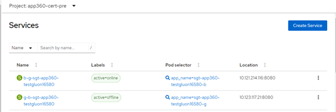

#### Configuration in deployment.yaml

To configure a region to deploy making use of the bluegreen strategy we only need to add a `deployStrategy` cluster property to the deployment config. This option is available in both old and new deployment.yaml formats.

```yaml
environments:
  - name: cert
    regions:
      - name: cert1
        properties:
          application:  myapplicationname
          cluster:
            apiServer: myApiServerUrl
            namespace: myClusterNamespace
            crednetialsId: MyGHSecretWithSVCAccountToken
            deployStrategy: bluegreen
            registry: myClusterRegistry
          helm:
            host: helmChartRegistryHost
            project: helmChartProject
            version: helmChartVersion
            chart: helmChartToUse
            ... # Rest of the file from here
```

```yaml
environments:
  - name: cert
    regions:
      - name: cert1
        properties:
          application:  myapplicationname
          apiServer: myApiServerUrl
          namespace: myClusterNamespace
          crednetialsId: MyGHSecretWithSVCAccountToken
          deployStrategy: bluegreen
          repo: myClusterRegistry
          project: helmChartProject
          version: helmChartVersion
          chart: helmChartToUse
          ... # Rest of the file old format from here
```

#### Further configuration in chart values

The deploy action allows the use of a placeholder `BLUEGREEN_SUFFIX` inside our values files. This placeholder was added to provide a way to adapt helm chart values to a bluegreen deployment. This suffix is also compatible with normal deployment strategy

* When `none` strategy is used then the suffix will be an empty string.
* When `bluegreen` strategy is used then the suffix will be replaced by the detected hidden slot suffix (`-b` or `-g`) followed by a `-test`.

To view it we'll use an example based on a darwin microservice configuration using available charts.

The darwin chart provides four possible options to set the microservice configuration provider, and in each one, the changes to be made in the values will differ (it will also require to cover some requisites in the cluster namespace before being
able to deploy using bluegreen strategy).

* **config-server**.- This config type is being deprecated, it's set when the microservice calls a `configuration service` core component to retrieve the microservice configuration.
* **cm**.- This config type will be used when we make use of a `ConfigMap` (kubernetes resource) to provide the configuration to the microservice
* **secret**.- This config type will be used when we make use of a Secret (kubernetes resource) to provide the configuration needed by the microservice.
* **cm-secret**.- this config type is used when we use a `ConfigMap` to provide not sensible data to the microservice and a `Secret` to provide sensible configuration data to the microservice (for example credentials to connect to a database)

So depending in what our microservice requires we'll need to adjust our values files.

When using `config-server` wel'l need to set the placeholder `${BLUEGREEN_SUFFIX}` as the value of the `darwin.suffix` value, and ensure we include that `${darwin.suffix}` in the configuration-server url. We can infer from here that this has
implications in our namespace.

* Need of a `configuration-server-b-test` instance
* Need of a `configuration-server-g-test` instance pointing to the same repo as the other test one.
* Need of a `configuration-server-b` to provide real configuration
* Need of a `configuration-server-g` to provide real configuration

Both `-test` instances will use a common repo to load configurations, and the ones without the suffix will use other repo (or the same but looking in other path).

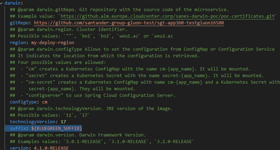

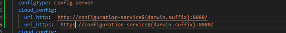

The use of the configuration-sever is being deprecated so we enforce users to apply one of the other options.

If we configure our chart to provide configuration making use of a `ConfigMap` and `bluegreen` strategy then we must configure a `extraEnvVarCM` value inside our values providing the reference to the `ConfigMap` to use. For this we'll make use of the
placeholder

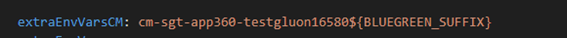

This reference must start with `cm-` followed by the application name with the `${BLUEGREEN_SUFFIX}` at the end. The chart itself will validate this naming convention, so it's important to take the prefix into account.

The use of the suffix applies to any `extraEnvVars` that takes value from a `ConfigMap` reference that will be exposed to the service (will see an example later).

When the config type is set to `Secret` the changes to apply are pretty similar to the `ConfigMap` type, just change cm- for secret- and we have it done. In this case the value to inform is `extraEnvVarSecret`

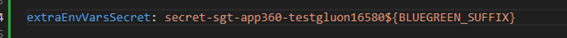

When using `cm-secret` we must prove both `extraEnvVarsCM` and `extraEnvVarsSecret` in our values files.

In case we provide `extraEnvVars` we only need to add the suffix placeholder to the entries taking value from a kubernetes configuration resource, like in the following image

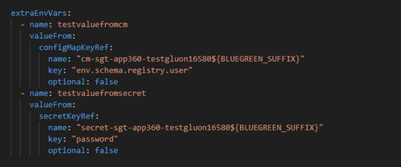

From here we can deploy using bluegreen into the hidden slot and make use of the `Bluegreen Switch Workflow` to perform the switch from hidden to online with component scope (only affecting the micro associated with the repository from where
we are triggering the switch).

#### What is different to a normal deployment

When using Bluegreen strategy the value of the placeholder `${APPLICATION_NAME}` that takes the value from the region `application` property will add a suffix `-b` or `-g` depending on the slot detected as hidden, and this will be changing when
a switch is done.

Translating this to helm releases concept, we will have two helm releases in the same namespace, with a common part of the name taken from the region application property and an added suffix. If we use the sample yamls exposed before we'll have the
following releases:

* myapplicationanme-b
* myapplicationanme-g

We can know which one is the hidden and which one is the real one by looking the `b-g-` and `g-b-` helper services selector, once we know which release is connected to the online helper service, we also know which one is connected to the hidden
helper service.

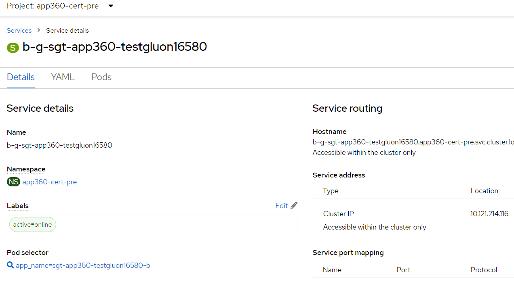

### Bluegreen Switch

The switch process is also divided into two phases.

* **PreSwitch**.- Here the workflow will take an snapshot of the current region's cluster status and trigger checks to validate the configuration and requirements are met, not allowing switch and informing the user about the situation to fix any
detected issue.
* **Switch**.- In this phase the workflow will perform all the `PreSwitch` validations, and if passed successfully, will perform the switch.

This switch will update all deployment references to `Secrets` and `ConfigMaps` removing the `-test` suffix, wait a couple of minutes to ensure the new replica is up and perform the switch in the helper services.

To trigger this switch we'll navigate to actions in our repository and manually trigger the workflow.

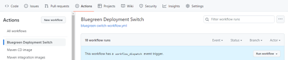

Once we press the Run workflow button on the top right of the actions content zone, a form will appear, where we must say which `deployment.yaml` file to use and the target environment.

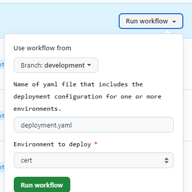

Once triggered well see an execution like this one

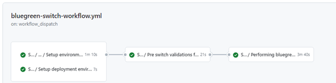

If the checks are not passed the user will see them listed in the executions logs in a resume helping user to identify and fix them.

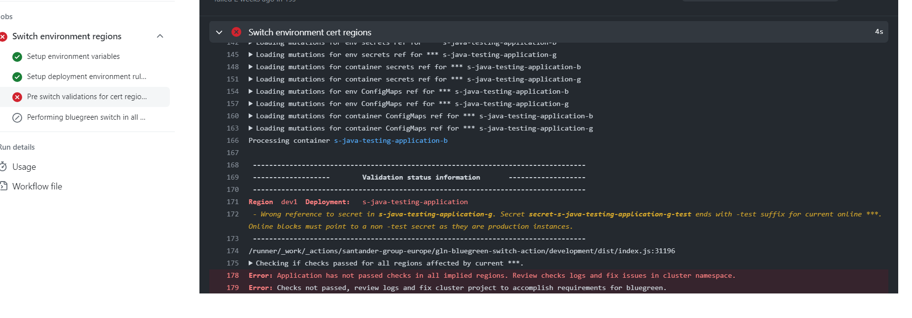

If checks are passed, and switch is allowed, workflow will ask for approvers to perform switch if the associated github environment requires approvals in same way the deploy workflow does. If the approval takes too long and the cluster status
change, breaking the requirements, then the switch logic will fail validating conditions and will not allow the switch till the issues are fixed.

#### Who can run the switch workflow?

Everyone who has workflow launch permissions in the repository will be able to launch the workflow for the blue-green change. However, in Pre and Pro environments,
approvers must be configured and only with their approval will it be possible for the workflow to modify pre-production and pre-production environments.

#### Shuttle

There is a corporative tool called `Shuttle` that is compatible with this deployment strategy and implementation. In case we require to perform switch in blocks of components then we can make use of this tool.

[Here](https://sanes.atlassian.net/wiki/spaces/SHUTTLE/overview?homepageId=2021922920) we can view the user documentation of the tool.

### If my project is already in production, how can I add the blue-green deployment?

If the project is in Pro, it must be taken into account that in helm deployments with blue green, deployment is used and not deploymentconfig. And it is necessary to create the secrets and configmaps with the necessary subfixes
for the operation of blue green. You would have to adapt both the repo configuration and the cluster objects.
