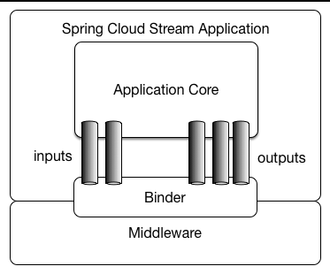

# Message Driven Architecture

## Introduction

### What is an event?

An event is any occurrence or significant change of state in a system's software
or hardware. An event notification is a message sent by the system to notify
another part of the same system that something has occurred. It is not the event
itself.

The source of an event can be internal or external. Events can be generated by a
user who, for example, clicks a mouse button or presses a key on the keyboard,
by an external source, such as a sensor output, or by an internal system
component, such as a program loading.

### How does message driven architecture work?

Message-driven architecture is made up of event producers and consumers. A
producer detects or senses an event and represents it as a message. It does not
know the consumer or the outcome of the event.

After an event is detected, it is passed from the producer to the consumer
through channels, where a platform processes events asynchronously. The consumer
needs to be informed when an event occurs. It can process or just be affected by
the event.

The event processing platform executes the correct response for a given event
and sends the activity downstream to the right consumers. It is in this
downstream activity that the outcome of the event is seen.

[Apache
Kafka](https://www.redhat.com/pt-br/topics/integration/what-is-apache-kafka) is
a widely used distributed streaming platform for event processing. It is capable
of publishing, subscribing, storing and processing event streams in real time.
Apache Kafka supports many use cases where high throughput and scalability are
critical. Furthermore, by minimizing the need for point-to-point (P2P)
integrations for sharing data in certain applications, this platform helps
reduce latency to milliseconds.

There are other middleware event handlers available that can serve as an event
processing platform.

### Message-driven architecture models

Message-driven architecture can be based on either a publish/subscribe (pub/sub)
or event streaming model.

#### Pub/Sub Model

It is a messaging infrastructure based on subscriptions to an event stream. In
this model, after an event occurs or is published, it is sent to subscribers who
need to be informed.

#### Event Streaming Model

In the broadcast model, events are written to a log. Consumers are not required
to subscribe to an event stream. In fact, they can read from any part of the
stream and join it at any time.

There are a few types of event streaming:

* ***Event Stream Processing:*** Uses a streaming platform such as Apache Kafka
  to ingest and process events or transform your stream. This method can be used
  to detect meaningful patterns in streams of events.
* ***Simple Event Processing:*** This is when an event immediately triggers an
  action on the consumer.
* ***Complex event processing:*** Requires a consumer to process a series of
  events to detect patterns.

### Benefits of message-driven architecture

By adopting an message-driven architecture, organizations gain a flexible system
capable of adapting to changes and making decisions in real time. Being able to
recognize situations in real time means that business decision-making, whether
manual or automated, is done using all available data that reflects the current
state of the systems.

As they occur, events are captured from sources such as networks, applications,
and [Internet of Things
(IoT)](https://www.redhat.com/pt-br/topics/internet-of-things/what-is-iot)
devices. This allows event producers and consumers to share status and response
information in real time.

Organizations can add message-driven architecture to their systems and
applications to improve scalability and responsiveness, as well as access the
data and context needed for more efficient business decision-making.

## Arsenal Message Driven

With the evolution of microservices, we are increasingly faced with the need for
interaction between them. In some scenarios, communication between microservices
is carried out using blocking HTTP calls, where the requesting service needs to
know and know if the requested service is available, thus enabling the exchange
of information. The key point of this scenario is that the requesting service
cares a lot about the response. Given this scenario, event-based software
architecture ***promotes production, detection, consumption and reaction to
events***. ***Arsenal Message Driven*** proposes the "starting point" for us to
work with the publication and consumption of messages intermediated by a Broker
Message.

### Why should I use Arsenal Message Driven?

In addition to delivering Logging, Error Handling, Authentication/Authorization,
Health Check, Unit Tests, API Documentation (Swagger/Open API) all through the
***Arsenal Core library***, we offer an example of using ***Spring Cloud
Stream*** for consumption and production of messages from ***RabbitMQ and
Kafka***. We are evolving to have demonstrations on how to connect to other
Brokers such as ***Event Hub***, just by changing settings.

The Message Broker is an extremely important piece within this architecture as
it allows for greater scalability in the communication between microservices. It
is important that the particularities and differences between ***vendors*** are
analyzed in view of the needs of each proposed solution. See other possibilities
on how to use [Spring Cloud
Stream](https://spring.io/projects/spring-cloud-stream) with other Brokers.

### Spring Cloud Stream overview

Spring Cloud Stream is a framework for creating message-driven microservices.
Spring Cloud Stream builds on Spring Boot to build standalone, production-grade
Spring applications and uses Spring Integration to provide connectivity to
message brokers. It provides multi-vendor middleware configuration, introducing
the concepts of persistent publish-subscribe semantics, consumer groups, and
partitions.

