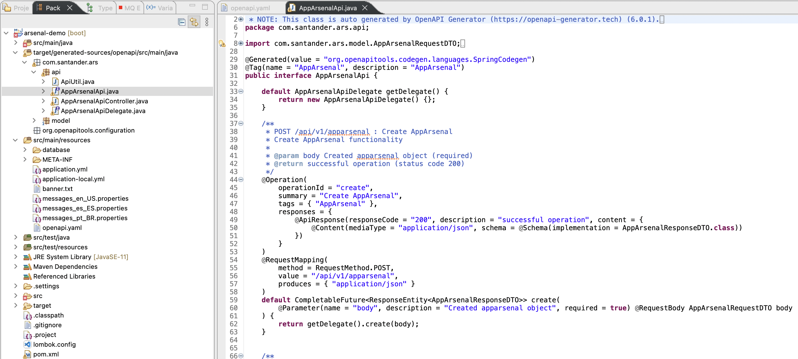

# Using Open API Contract First

## OpenAPI

Arsenal applications now have the ability to generate code following the
contract first pattern. In a more modern scenario, we use the formal description
of an API contract based on the REST model, adopting the OpenAPI convention
(described in JSON format, which can be represented as JSON or YAML), which
promises ease of definition and sharing with consumers and developers. We
reserve the name openapi.yaml to house the contents of this file.

``` { .yaml .copy}
openapi: 3.0.1
info:
  title: Santander F1rst Contract
  description: 'This is a sample Santander AppArsenal server.'
  termsOfService: http://swagger.io/terms/
  contact:
    email:
    name:
  license:
    name: Santander F1rst
  version: 1.0.0
tags:
  - name: AppArsenal
    description: AppArsenal
paths:
  /api/v1/apparsenal:
    get:
      tags:
        - AppArsenal
      summary: Get list of records by Page
      description: Get AppArsenal by Page
      operationId: getPageable
      parameters:
        - name: page
          in: query
          description: Page
          required: false
          schema:
            type: integer
            format: int32
            default: 0
        - name: size
          in: query
          description: Page Size
          required: false
          schema:
            type: integer
            format: int32
            default: 10
      responses:
        200:
          description: successful operation
          content:
            application/json:
              schema:
                type: array
                items:
                  $ref: '#/components/schemas/AppArsenalResponseDTO'
      x-spring-paginated: true
    post:
      tags:
        - AppArsenal
      summary: Create AppArsenal
      description: Create AppArsenal functionality
```

Likewise, with the support of a specific plugin (Maven or Gradle), we can
generate code without any additional effort, respecting the imposed interface:

``` { .xml .copy }
<plugin>
  <groupId>org.openapitools</groupId>
  <artifactId>openapi-generator-maven-plugin</artifactId>
  <executions>
    <execution>
      <goals>
        <goal>generate</goal>
      </goals>
      <configuration>
        <inputSpec>${project.basedir}/src/main/resources/openapi.yaml</inputSpec>
        <generatorName>spring</generatorName>
        <apiPackage>com.santander.ars.api</apiPackage>
        <modelPackage>com.santander.ars.model</modelPackage>
        <supportingFilesToGenerate>ApiUtil.java</supportingFilesToGenerate>
        <configOptions>
          <delegatePattern>true</delegatePattern>
          <openApiNullable>false</openApiNullable>
          <dateLibrary>java8</dateLibrary>
          <generateBuilders>true</generateBuilders>
          <booleanGetterPrefix>is</booleanGetterPrefix>
          <hideGenerationTimestamp>true</hideGenerationTimestamp>
          <useBeanValidation>false</useBeanValidation>
          <useTags>true</useTags>
          <useSwaggerAnnotations>false</useSwaggerAnnotations>
          <async>true</async>
          <returnResponse>true</returnResponse>
          <useSpringBoot3>false</useSpringBoot3>
          <additionalModelTypeAnnotations>@SuppressWarnings({"hiding",
            "static-method", "unused"})</additionalModelTypeAnnotations>
        </configOptions>
      </configuration>
    </execution>
  </executions>
</plugin>
```

* inputSpec: informs the plugin the path of the openapi.yaml file, which will be
  the contract followed;
* apiPackage: tells the plugin where the API classes should be generated;
* modelPackage: tells the plugin where the model classes should be generated;

> :information_source: Consult the official technical literature of the plugin
for more details about its operation and configuration:
<https://github.com/OpenAPITools/openapi-generator/tree/master/modules/openapi-generator-maven-plugin>

Executing the ***mvn generate-sources*** command in the terminal or through a
running mode in your IDE, we get the following result inside the ***/target***
directory:



Example of generated Controller that implements an API and has a Delegate as an
attribute.

``` { .java }
@Generated(value = "org.openapitools.codegen.languages.SpringCodegen")
@Controller
@RequestMapping("${openapi.santanderF1rstContract.base-path:}")
public class AppArsenalApiController implements AppArsenalApi {

    private final AppArsenalApiDelegate delegate;

    public AppArsenalApiController(@Autowired(required = false) AppArsenalApiDelegate delegate) {
        this.delegate = Optional.ofNullable(delegate).orElse(new AppArsenalApiDelegate() {});
    }

    @Override
    public AppArsenalApiDelegate getDelegate() {
        return delegate;
    }

}
```

Example of generated Delegate

``` { .java}
@Generated(value = "org.openapitools.codegen.languages.SpringCodegen")
public interface AppArsenalApiDelegate {

    default Optional<NativeWebRequest> getRequest() {
        return Optional.empty();
    }

    /**
     * POST /api/v1/apparsenal : Create AppArsenal
     * Create AppArsenal functionality
     *
     * @param body Created apparsenal object (required)
     * @return successful operation (status code 200)
     * @see AppArsenalApi#create
     */
    default CompletableFuture<ResponseEntity<AppArsenalResponseDTO>> create(AppArsenalRequestDTO body) {
        return CompletableFuture.supplyAsync(()-> {
            getRequest().ifPresent(request -> {
                for (MediaType mediaType: MediaType.parseMediaTypes(request.getHeader("Accept"))) {
                    if (mediaType.isCompatibleWith(MediaType.valueOf("application/json"))) {
                        final String exampleString = "{ \"otherInfo\" : \"otherInfo\", \"id\" : 0 }";
                        ApiUtil.setExampleResponse(request, "application/json", exampleString);
                        break;
                    }
                }
            });
            return new ResponseEntity<>(HttpStatus.NOT_IMPLEMENTED);
        }, Runnable::run);

    }

    /**
     * DELETE /api/v1/apparsenal/{id} : Delete AppArsenal
     * This can only be done by the logged in AppArsenal.
     *
     * @param id The name that needs to be deleted (required)
     * @return operation successful (status code 201)
     *         or Invalid AppArsenalname supplied (status code 400)
     *         or AppArsenal not found (status code 404)
     * @see AppArsenalApi#delete
     */
    default CompletableFuture<ResponseEntity<Void>> delete(Long id) {
        return CompletableFuture.completedFuture(new ResponseEntity<>(HttpStatus.NOT_IMPLEMENTED));

    }

    /**
     * GET /api/v1/apparsenal/{id} : Get AppArsenal by AppArsenal id
     *
     * @param id The name that needs to be fetched. Use apparsenal1 for testing.  (required)
     * @return successful operation (status code 200)
     *         or AppArsenal not found (status code 404)
     * @see AppArsenalApi#getById
     */
    default CompletableFuture<ResponseEntity<AppArsenalResponseDTO>> getById(Long id) {
        return CompletableFuture.supplyAsync(()-> {
            getRequest().ifPresent(request -> {
                for (MediaType mediaType: MediaType.parseMediaTypes(request.getHeader("Accept"))) {
                    if (mediaType.isCompatibleWith(MediaType.valueOf("application/json"))) {
                        final String exampleString = "{ \"otherInfo\" : \"otherInfo\", \"id\" : 0 }";
                        ApiUtil.setExampleResponse(request, "application/json", exampleString);
                        break;
                    }
                }
            });
            return new ResponseEntity<>(HttpStatus.NOT_IMPLEMENTED);
        }, Runnable::run);

    }

    /**
     * GET /api/v1/apparsenal : Get list of records by Page
     * Get AppArsenal by Page
     *
     * @param page Page (optional, default to 0)
     * @param size Page Size (optional, default to 10)
     * @return successful operation (status code 200)
     * @see AppArsenalApi#getPageable
     */
    default CompletableFuture<ResponseEntity<List<AppArsenalResponseDTO>>> getPageable(Integer page,
        Integer size, final Pageable pageable) {
        return CompletableFuture.supplyAsync(()-> {
            getRequest().ifPresent(request -> {
                for (MediaType mediaType: MediaType.parseMediaTypes(request.getHeader("Accept"))) {
                    if (mediaType.isCompatibleWith(MediaType.valueOf("application/json"))) {
                        final String exampleString = "[ { \"otherInfo\" : \"otherInfo\", \"id\" : 0 }, { \"otherInfo\" : \"otherInfo\", \"id\" : 0 } ]";
                        ApiUtil.setExampleResponse(request, "application/json", exampleString);
                        break;
                    }
                }
            });
            return new ResponseEntity<>(HttpStatus.NOT_IMPLEMENTED);
        }, Runnable::run);

    }

    /**
     * PUT /api/v1/apparsenal/{id} : Updated AppArsenal
     * This can only be done by the logged in AppArsenal.
     *
     * @param id name that need to be updated (required)
     * @param body Updated AppArsenal object (required)
     * @return successful operation (status code 200)
     *         or Invalid apparsenal supplied (status code 400)
     *         or AppArsenal not found (status code 404)
     * @see AppArsenalApi#update
     */
    default CompletableFuture<ResponseEntity<AppArsenalResponseDTO>> update(Long id,
        AppArsenalRequestDTO body) {
        return CompletableFuture.supplyAsync(()-> {
            getRequest().ifPresent(request -> {
                for (MediaType mediaType: MediaType.parseMediaTypes(request.getHeader("Accept"))) {
                    if (mediaType.isCompatibleWith(MediaType.valueOf("application/json"))) {
                        final String exampleString = "{ \"otherInfo\" : \"otherInfo\", \"id\" : 0 }";
                        ApiUtil.setExampleResponse(request, "application/json", exampleString);
                        break;
                    }
                }
            });
            return new ResponseEntity<>(HttpStatus.NOT_IMPLEMENTED);
        }, Runnable::run);

    }

}
```

Example of generated API

``` { .java }
@Generated(value = "org.openapitools.codegen.languages.SpringCodegen")
@Tag(name = "AppArsenal", description = "AppArsenal")
public interface AppArsenalApi {

    default AppArsenalApiDelegate getDelegate() {
        return new AppArsenalApiDelegate() {};
    }

    /**
     * POST /api/v1/apparsenal : Create AppArsenal
     * Create AppArsenal functionality
     *
     * @param body Created apparsenal object (required)
     * @return successful operation (status code 200)
     */
    @Operation(
        operationId = "create",
        summary = "Create AppArsenal",
        description = "Create AppArsenal functionality",
        tags = { "AppArsenal" },
        responses = {
            @ApiResponse(responseCode = "200", description = "successful operation", content = {
                @Content(mediaType = "application/json", schema = @Schema(implementation = AppArsenalResponseDTO.class))
            })
        }
    )
    @RequestMapping(
        method = RequestMethod.POST,
        value = "/api/v1/apparsenal",
        produces = { "application/json" }
    )
    default CompletableFuture<ResponseEntity<AppArsenalResponseDTO>> create(
        @Parameter(name = "body", description = "Created apparsenal object", required = true) @RequestBody AppArsenalRequestDTO body
    ) {
        return getDelegate().create(body);
    }


    /**
     * DELETE /api/v1/apparsenal/{id} : Delete AppArsenal
     * This can only be done by the logged in AppArsenal.
     *
     * @param id The name that needs to be deleted (required)
     * @return operation successful (status code 201)
     *         or Invalid AppArsenalname supplied (status code 400)
     *         or AppArsenal not found (status code 404)
     */
    @Operation(
        operationId = "delete",
        summary = "Delete AppArsenal",
        description = "This can only be done by the logged in AppArsenal.",
        tags = { "AppArsenal" },
        responses = {
            @ApiResponse(responseCode = "201", description = "operation successful"),
            @ApiResponse(responseCode = "400", description = "Invalid AppArsenalname supplied"),
            @ApiResponse(responseCode = "404", description = "AppArsenal not found")
        }
    )
    @RequestMapping(
        method = RequestMethod.DELETE,
        value = "/api/v1/apparsenal/{id}"
    )
    default CompletableFuture<ResponseEntity<Void>> delete(
        @Parameter(name = "id", description = "The name that needs to be deleted", required = true, in = ParameterIn.PATH) @PathVariable("id") Long id
    ) {
        return getDelegate().delete(id);
    }


    /**
     * GET /api/v1/apparsenal/{id} : Get AppArsenal by AppArsenal id
     *
     * @param id The name that needs to be fetched. Use apparsenal1 for testing.  (required)
     * @return successful operation (status code 200)
     *         or AppArsenal not found (status code 404)
     */
    @Operation(
        operationId = "getById",
        summary = "Get AppArsenal by AppArsenal id",
        tags = { "AppArsenal" },
        responses = {
            @ApiResponse(responseCode = "200", description = "successful operation", content = {
                @Content(mediaType = "application/json", schema = @Schema(implementation = AppArsenalResponseDTO.class))
            }),
            @ApiResponse(responseCode = "404", description = "AppArsenal not found")
        }
    )
    @RequestMapping(
        method = RequestMethod.GET,
        value = "/api/v1/apparsenal/{id}",
        produces = { "application/json" }
    )
    default CompletableFuture<ResponseEntity<AppArsenalResponseDTO>> getById(
        @Parameter(name = "id", description = "The name that needs to be fetched. Use apparsenal1 for testing. ", required = true, in = ParameterIn.PATH) @PathVariable("id") Long id
    ) {
        return getDelegate().getById(id);
    }


    /**
     * GET /api/v1/apparsenal : Get list of records by Page
     * Get AppArsenal by Page
     *
     * @param page Page (optional, default to 0)
     * @param size Page Size (optional, default to 10)
     * @return successful operation (status code 200)
     */
    @Operation(
        operationId = "getPageable",
        summary = "Get list of records by Page",
        description = "Get AppArsenal by Page",
        tags = { "AppArsenal" },
        responses = {
            @ApiResponse(responseCode = "200", description = "successful operation", content = {
                @Content(mediaType = "application/json", array = @ArraySchema(schema = @Schema(implementation = AppArsenalResponseDTO.class)))
            })
        }
    )
    @RequestMapping(
        method = RequestMethod.GET,
        value = "/api/v1/apparsenal",
        produces = { "application/json" }
    )
    default CompletableFuture<ResponseEntity<List<AppArsenalResponseDTO>>> getPageable(
        @Parameter(name = "page", description = "Page", in = ParameterIn.QUERY) @RequestParam(value = "page", required = false, defaultValue = "0") Integer page,
        @Parameter(name = "size", description = "Page Size", in = ParameterIn.QUERY) @RequestParam(value = "size", required = false, defaultValue = "10") Integer size,
        @ParameterObject final Pageable pageable
    ) {
        return getDelegate().getPageable(page, size, pageable);
    }


    /**
     * PUT /api/v1/apparsenal/{id} : Updated AppArsenal
     * This can only be done by the logged in AppArsenal.
     *
     * @param id name that need to be updated (required)
     * @param body Updated AppArsenal object (required)
     * @return successful operation (status code 200)
     *         or Invalid apparsenal supplied (status code 400)
     *         or AppArsenal not found (status code 404)
     */
    @Operation(
        operationId = "update",
        summary = "Updated AppArsenal",
        description = "This can only be done by the logged in AppArsenal.",
        tags = { "AppArsenal" },
        responses = {
            @ApiResponse(responseCode = "200", description = "successful operation", content = {
                @Content(mediaType = "application/json", schema = @Schema(implementation = AppArsenalResponseDTO.class))
            }),
            @ApiResponse(responseCode = "400", description = "Invalid apparsenal supplied"),
            @ApiResponse(responseCode = "404", description = "AppArsenal not found")
        }
    )
    @RequestMapping(
        method = RequestMethod.PUT,
        value = "/api/v1/apparsenal/{id}",
        produces = { "application/json" }
    )
    default CompletableFuture<ResponseEntity<AppArsenalResponseDTO>> update(
        @Parameter(name = "id", description = "name that need to be updated", required = true, in = ParameterIn.PATH) @PathVariable("id") Long id,
        @Parameter(name = "body", description = "Updated AppArsenal object", required = true) @RequestBody AppArsenalRequestDTO body
    ) {
        return getDelegate().update(id, body);
    }

}
```

In the end, to use these generated resources, you must build your own Controller
class (Resource) and this will implement the Delegate generated by OpenAPI.

``` { .java}
/** Resource responsible for handling AppArsenal operations. */
@Log4j2
@Component
public class AppArsenalResource implements AppArsenalApiDelegate {

  /** Service. */
  @Autowired private AppArsenalService appArsenalService;

  /**
   * Method responsible for retrieving all AppArsenal available.
   *
   * @param page index.
   * @param size of the page to be returned.
   * @return ResponseEntity containing a Page of AppArsenalResponseDTO objects.
   */
  public CompletableFuture<ResponseEntity<List<AppArsenalResponseDTO>>> getPageable(
      Integer pagina, Integer size, final Pageable page) {
    Page<AppArsenalResponseDTO> pg1 = appArsenalService.getPageable(page);
    return CompletableFuture.supplyAsync(() -> ResponseEntity.ok().body(pg1.toList()));
  }
  /**
   * Method responsible for retriving a AppArsenal by ID.
   *
   * @param id that is to be found.
   * @return ResponseEntity containing the equivalent AppArsenalResponseDTO object.
   */
  public CompletableFuture<ResponseEntity<AppArsenalResponseDTO>> getById(Long id) {
    log.info("Searching for AppArsenal with ID {}", id);
    return CompletableFuture.supplyAsync(
        () -> ResponseEntity.ok().body(appArsenalService.getById(id)));
  }

  /**
   * Method responsible for creating a AppArsenal.
   *
   * @param body information that is to be creadted.
   * @return RespondeEntity containing the URI and equivalent AppArsenalResponseDTO object.
   */
  public CompletableFuture<ResponseEntity<AppArsenalResponseDTO>> create(
      AppArsenalRequestDTO body) {
    AppArsenalResponseDTO saveAppArsenal = appArsenalService.create(body);
    URI locationResource =
        ServletUriComponentsBuilder.fromCurrentRequest()
            .path("/{id}")
            .buildAndExpand(saveAppArsenal.getId())
            .toUri();
    log.info("Successfully created AppArsenal with ID {}", saveAppArsenal.getId());
    return CompletableFuture.supplyAsync(
        () -> ResponseEntity.created(locationResource).body(saveAppArsenal));
  }

  /**
   * Method responsible for deleting a AppArsenal.
   *
   * @param id that is to be deleted.
   * @return ResponseEntity with no content.
   */
  public CompletableFuture<ResponseEntity<Void>> delete(Long id) {
    appArsenalService.delete(id);
    log.info("Successfully deleted AppArsenal with ID {}", id);
    return CompletableFuture.supplyAsync(() -> ResponseEntity.noContent().build());
  }

  /**
   * Method responsible for updating a AppArsenal.
   *
   * @param id that is to be updated.
   * @param body information that is to be updated.
   * @return ResponseEntity containing the updated AppArsenalResponseDTO object.
   */
  public CompletableFuture<ResponseEntity<AppArsenalResponseDTO>> update(
      Long id, AppArsenalRequestDTO body) {
    AppArsenalResponseDTO appArsenalUpdate = appArsenalService.update(id, body);
    log.info("Successfully updated AppArsenal with ID {}", id);
    return CompletableFuture.supplyAsync(() -> ResponseEntity.ok(appArsenalUpdate));
  }
}
```

### Changes to the contract

Some adaptations are often necessary, inclusion of DTOs or some change in a type
of variable, for example, within a contract. To regenerate the ***/target***
folder with the necessary corrections, we must first change the defined yaml
contract.

Let's assume as an example the change of the input parameter of the getPageable
method, where the "size" is defined as an integer and we need to change it to
Long

This way, we must go to the yaml contract, and change it to look like this:

``` { .yaml }
  /api/v1/apparsenal:
    get:
      tags:
        - AppArsenal
      summary: Get list of records by Page
      description: Get AppArsenal by Page
      operationId: getPageable
      parameters:
        - name: page
          in: query
          description: Page
          required: false
          schema:
            type: integer
            format: int32
            default: 0
        - name: size
          in: query
          description: Page Size
          required: false
          schema:
            type: integer
            format: int64
            default: 10
```

After changing the contract, simply run the command again:

``` { .bash .copy }
mvn generate-sources
```

It is possible to verify that in the Resource class, where we are using this
getPageable method of this API interface from where we are using this contract,
the method is no longer working, as we changed the input parameter from int to
long. So to work, the method will look like this:

``` { .java .copy }

  /**
   * Method responsible for retrieving all AppArsenal available.
   *
   * @param page index.
   * @param size of the page to be returned.
   * @return ResponseEntity containing a Page of AppArsenalResponseDTO objects.
   */
  public CompletableFuture<ResponseEntity<List<AppArsenalResponseDTO>>> getPageable(
      Integer pagina, Long size, final Pageable page) {
    Page<AppArsenalResponseDTO> pg1 = appArsenalService.getPageable(page);
    return CompletableFuture.supplyAsync(() -> ResponseEntity.ok().body(pg1.toList()));
  }
```
