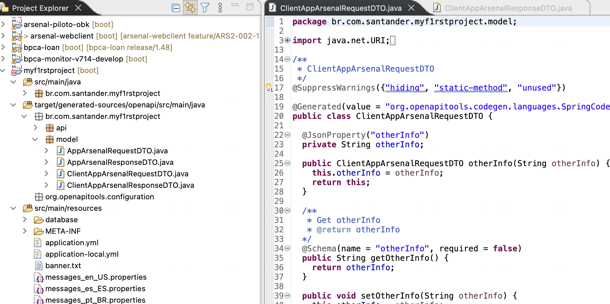

# WebClient

WebClient is the latest web client implementation in the Spring stack,
succeeding RestTemplate. It is available since Spring version 5, as an
asynchronous and event-driven solution, being a non-blocking option (different
from RestTemplate).

The WebClient class is contained in the [Spring
WebFlux](https://docs.spring.io/spring-framework/docs/current/reference/html/web-reactive.html)
library, which focuses on providing support for reactive programming in web
applications.

## When to use WebClient?

Opposite to RestTemplate, the WebClient is asynchronous and non-blocking in
nature. It follows event-driven architecture from the reactive framework of
Spring WebFlux. Using WebClient, the client need not wait till the response
comes back. Instead, it will be notified using a callback method when there is a
response from the server.

When we invoke an API through WebClient that returns a Mono or a Flux, it will
return immediately. The results of the call will be delivered to us through the
mono or flux callbacks when they become available.

While WebClient is the preferred way for future uses, RestTemplate seems to stay
here for long though without any major feature addition.

While considering WebClient for our next application, we must remember that to
build a truly non-blocking application, we must aim to create/use all of its
components as non-blocking i.e. client, controller, middle services, and even
the database. If one of them is blocking the requests, our purpose will be
defeated.

## Automatically generating resources with contract-first

We can create our DTOs for the client using the contract first approach.

1. Just fill the openapi.yml file with the following structure if it doesn't
have it:

    ``` { .yaml .copy }
    components:
        schemas:
        ClientAppArsenalRequestDTO:
            type: object
            properties:
            otherInfo:
                type: string
        ClientAppArsenalResponseDTO:
            type: object
            properties:
            id:
                type: integer
                format: int64
            otherInfo:
                type: string
    ```

2. Configure the openapi-generator-maven-plugin to generate only model class

    ``` { .yaml .copy}
    <plugin>
        <groupId>org.openapitools</groupId>
        <artifactId>openapi-generator-maven-plugin</artifactId>
        <version>${openapi-generator-maven-plugin.version}</version>
        <executions>
            <execution>
                <goals>
                    <goal>generate</goal>
                </goals>
                <configuration>
                    <inputSpec>${openapi-contract-path}</inputSpec>
                    <generatorName>spring</generatorName>
                    <modelPackage>${groupId}.model.dto</modelPackage>
                    <generateModels>true</generateModels>
                    <generateSupportingFiles>false</generateSupportingFiles>
                    <generateSupportingFiles>false</generateSupportingFiles>
                    <generateModelTests>false</generateModelTests>
                    <generateModelDocumentation>false</generateModelDocumentation>
                    <generateApis>false</generateApis>
                    <generateApiTests>false</generateApiTests>
                    <generateApiDocumentation>false</generateApiDocumentation>
                    <configOptions>
                        <dateLibrary>java8</dateLibrary>
                        <useBeanValidation>false</useBeanValidation>
                        <openApiNullable>false</openApiNullable>
                        <useJakartaEe>true</useJakartaEe>
                    </configOptions>
                </configuration>
            </execution>
        </executions>
    </plugin>
    ```

3. Now, we need to invoke the Maven plugin to generate the OpenAPI
implementation: Executing the ***mvn generate-sources*** command in the terminal
or through a running mode in your IDE, we get the following result inside the
/target directory:



## Examples with WebClient

To use WebClient, we need to create a class containing the configuration of
WebClient for all types of requests. Full Example:

``` { .yaml .copy }
url:
  from:
    properties: http://localhost:8080
```

``` { .java .copy }

@Configuration
public class WebClientConfig {

  @Autowired ObservationRegistry observationRegistry;

  @Value("${url.from.properties}")
  private String baseUrl;
  
  @Bean
  public WebClient webClient(WebClient.Builder builder) {
    return builder
        .observationRegistry(observationRegistry)
        .filter(new ArsenalObservationExchangeFilterFunction(observationRegistry))
        .baseUrl(baseUrl)
        .defaultHeader(HttpHeaders.CONTENT_TYPE, MediaType.APPLICATION_JSON_VALUE)
        .build();
  }
}

@Service
public class AppArsenalClient {

    @Autowired
    private WebClient webClient

    public ResponseEntity<AppArsenalResponseDTO> getById(Long id) {
        ResponseEntity<AppArsenalResponseDTO> response =
                client
                        .get()
                        .uri("/api/v1/apparsenal/{id}", id)
                        .accept(MediaType.APPLICATION_JSON)
                        .retrieve()
                        .toEntity(AppArsenalResponseDTO.class)
                        .block();
        return response;
    }

    public ResponseEntity<AppArsenalResponseDTO> create(AppArsenalRequestDTO body){
        ResponseEntity<AppArsenalResponseDTO> response =
                client
                        .post()
                        .uri("/api/v1/apparsenal")
                        .accept(MediaType.APPLICATION_JSON)
                        .contentType(MediaType.APPLICATION_JSON)
                        .body(BodyInserters.fromValue(body))
                        .retrieve()
                        .toEntity(AppArsenalResponseDTO.class)
                        .block();
        return response;
    }

    public ResponseEntity<Void> delete(Long id) {
        ResponseEntity<Void> response =
                client
                        .delete()
                        .uri("/api/v1/apparsenal/{id}", id)
                        .accept(MediaType.APPLICATION_JSON)
                        .retrieve()
                        .toEntity(Void.class)
                        .block();
        return response;
    }

    public ResponseEntity<AppArsenalResponseDTO> update(
            Long id, AppArsenalRequestDTO body) {
        ResponseEntity<AppArsenalResponseDTO> response =
                client
                        .put()
                        .uri("/api/v1/apparsenal/{id}", id)
                        .accept(MediaType.APPLICATION_JSON)
                        .contentType(MediaType.APPLICATION_JSON)
                        .body(BodyInserters.fromValue(body))
                        .retrieve()
                        .toEntity(AppArsenalResponseDTO.class)
                        .block();
        return response;
    }
}
```

In the above example, this part configures WebClient and the timeout for all
requests:

``` { .java .copy }

@Configuration
public class WebClientConfig {

  @Autowired ObservationRegistry observationRegistry;

  @Value("${url.from.properties}")
  private String baseUrl;
  
  @Bean
  public WebClient webClient(WebClient.Builder builder) {
  
    HttpClient client = HttpClient.create().responseTimeout(Duration.ofSeconds(1));

    return builder
        .observationRegistry(observationRegistry)
        .filter(new ArsenalObservationExchangeFilterFunction(observationRegistry))
        .baseUrl(baseUrl)
        .clientConnector(new ReactorClientHttpConnector(client))
        .defaultHeader(HttpHeaders.CONTENT_TYPE, MediaType.APPLICATION_JSON_VALUE)
        .build();
  }
}
```

And these are the configurations for the respective methods:

### GET

``` { .java .copy }
public ResponseEntity<ClientAppArsenalResponseDTO> getById(Long id) {
    ResponseEntity<ClientAppArsenalResponseDTO> response =
        client
            .get()
            .uri("/api/v1/apparsenal/{id}", id)
            .accept(MediaType.APPLICATION_JSON)
            .retrieve()
            .toEntity(ClientAppArsenalResponseDTO.class)
            .block();
    return response;
  }
```

### PUT

``` { .java .copy }
public ResponseEntity<ClientAppArsenalResponseDTO>
        update(Long id, ClientAppArsenalRequestDTO body) {
    ResponseEntity<ClientAppArsenalResponseDTO> response =
        client
            .put()
            .uri("/api/v1/apparsenal/{id}", id)
            .accept(MediaType.APPLICATION_JSON)
            .contentType(MediaType.APPLICATION_JSON)
            .body(BodyInserters.fromValue(body))
            .retrieve()
            .toEntity(ClientAppArsenalResponseDTO.class)
            .block();
    return response;
  }
```

### DELETE

``` { .java .copy }
public ResponseEntity<Void> delete(Long id) {
    ResponseEntity<Void> response =
        client
            .delete()
            .uri("/api/v1/apparsenal/{id}", id)
            .accept(MediaType.APPLICATION_JSON)
            .retrieve()
            .toEntity(Void.class)
            .block();
    return response;
  }
```

### POST

``` { .java .copy }
public ResponseEntity<ClientAppArsenalResponseDTO>
        create(ClientAppArsenalRequestDTO body) {
    ResponseEntity<ClientAppArsenalResponseDTO> response =
        client
            .post()
            .uri("/api/v1/apparsenal")
            .accept(MediaType.APPLICATION_JSON)
            .contentType(MediaType.APPLICATION_JSON)
            .body(BodyInserters.fromValue(body))
            .retrieve()
            .toEntity(ClientAppArsenalResponseDTO.class)
            .block();
    return response;
  }
```

## Tests with WebClient

[SpringWebFlux](https://docs.spring.io/spring-framework/docs/current/reference/html/web-reactive.html)
 provides an ***org.springframework.test.web.reactive.server.WebTestClient***
 interface capable of testing any HTTP server using WebClient through simulated
 request objects. It also provides a fluent API to check the responses, and it
 doesn't use the application's exposure port (randomly).

Your test class must have these annotations and values:

``` { .java .copy }
import org.junit.jupiter.api.extension.ExtendWith;
import org.springframework.test.context.junit.jupiter.SpringExtension;
import org.springframework.boot.test.context.SpringBootTest;

...

@ExtendWith(SpringExtension.class)
@SpringBootTest(webEnvironment = SpringBootTest.WebEnvironment.RANDOM_PORT)
public class AppArsenalWebClientTest {...}
```

There must be a specific React api bean to simulate the requests as a web
client:

``` { .java .copy }
import org.springframework.test.web.reactive.server.WebTestClient;

...

@Autowired
private WebTestClient webTestClient;
```

Each operation can be performed according to the assertion in expectation, from
the .exchange() method that returns a
[WebTestClient.ResponseSpec](https://docs.spring.io/spring-framework/docs/current/javadoc-api/org/springframework/test/web/reactive/server/WebTestClient.ResponseSpec.html),
for example:

### GET Test

``` { .java .copy }
@Test
public void testGetById() {
    webTestClient.get().uri("/api/v1/apparsenal/{id}", 2l).accept(MediaType.APPLICATION_JSON).exchange()
            .expectStatus().isOk().expectBody(ClientAppArsenalResponseDTO.class)
            .value(arsenal -> {
                assertThat(arsenal.getOtherInfo()).isEqualTo("other info2");
            });
}
```

### PUT Test

``` { .java .copy }
@Test
public void testUpdate() {
    ClientAppArsenalRequestDTO body = new ClientAppArsenalRequestDTO();
    body.setOtherInfo("Arsenal modificado");

    webTestClient.put().uri("/api/v1/apparsenal/{id}", 2l).accept(MediaType.APPLICATION_JSON)
            .contentType(MediaType.APPLICATION_JSON).body(BodyInserters.fromValue(body)).exchange().expectStatus()
            .isOk().expectBody(ClientAppArsenalResponseDTO.class)
            .value(arsenal -> {
                assertThat(arsenal.getOtherInfo()).isEqualTo("Arsenal modificado");
            });

}
```

### DELETE Test

``` { .java .copy }
@Test
public void testDelete() {
    webTestClient.delete().uri("/api/v1/apparsenal/{id}", 3l).accept(MediaType.APPLICATION_JSON).exchange()
            .expectStatus().isNoContent().expectBody(Void.class);
}
```

### POST Test

``` { .java .copy }
@Test
public void testPost() {
    ClientAppArsenalRequestDTO body = new ClientAppArsenalRequestDTO();
    body.setOtherInfo("Arsenal");

    webTestClient.post().uri("/api/v1/apparsenal").accept(MediaType.APPLICATION_JSON)
            .contentType(MediaType.APPLICATION_JSON).body(BodyInserters.fromValue(body)).exchange().expectStatus()
            .isCreated().expectBody(ClientAppArsenalResponseDTO.class)
            .value(arsenal -> {
                assertThat(arsenal.getOtherInfo()).isEqualTo("Arsenal");
            });
}
```
