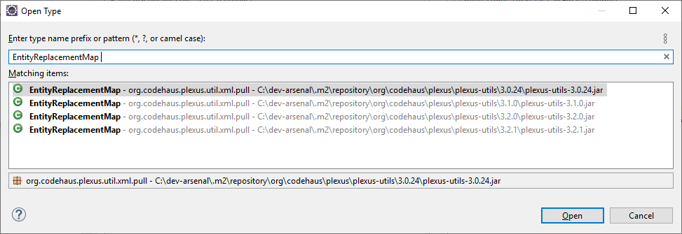
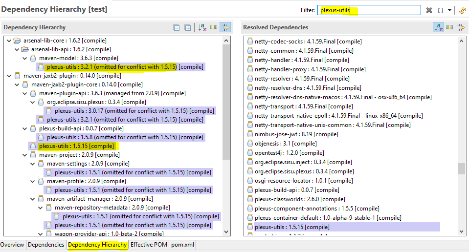
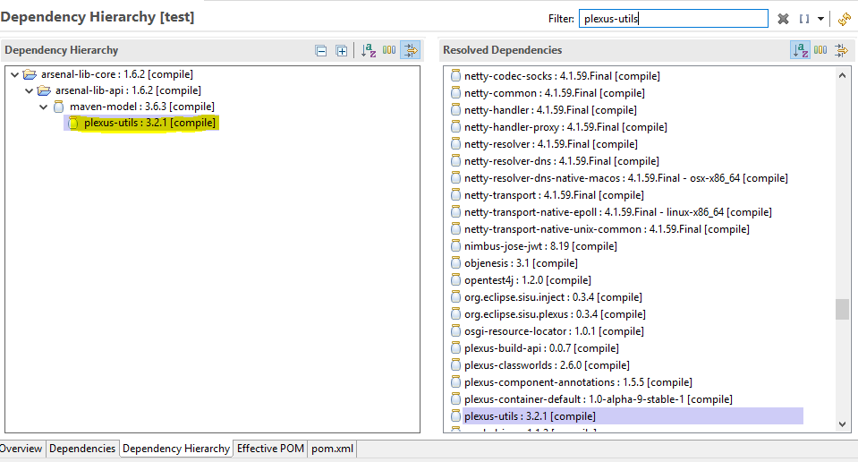

# General Troubleshooting

!!! info "important"

    It's always important to use the latest version of Arsenal to minimize problems

## Procedure

These steps will help the developers to identify the real cause of the problems:

1. **Check the latest complete log file**

    All the application operations are stored in the log file, so it helps to identify
    how the application got to the critical point of error;

2. **Identify when the failure occurred and what precedes it**

     Check if the application broke for at least one of these points:

     1. *Business Error*: if a custom exception was thrown;
     2. *Logic Error*: if there are some unexpected behaviors;
     3. *Technical Error*: usually related to application configurations, not found files,
     connection failures, lack of permissions, etc;

3. **Understanding the resources that the application needs to be fully working**

    It's essential to know which resources the application uses and what's their
    impact in the application (to save time from unnecessary analysis);

4. **Minimize conflicting dependencies**

    Understanding the used resources helps to remove unnecessary or duplicated dependencies
    from the application. There are a lot of problems caused by dependencies manually
    added that overwrite other dependencies versions and resulting in unexpected
    errors.

## Example

We'll show an troubleshooting example of Arsenal microservice using the procedure
written above. This example is only for illustrating the debugging process thus
the components or component versions may not be up-to-date.

First, we noticed that the error was thrown during the execution of ArchUnit
tests and extracted the most important part of the log (^^step 1^^)

``` { .java .copy }
java.lang.NoClassDefFoundError: org/codehaus/plexus/util/xml/pull/EntityReplacementMap
    at org.apache.maven.model.io.xpp3.MavenXpp3Reader.read(MavenXpp3Reader.java:590)
    at org.apache.maven.model.io.xpp3.MavenXpp3Reader.read(MavenXpp3Reader.java:609)
    at com.santander.ars.arsenal_archunit.engine.utils.ArchRulesUtils.getMavenModel(ArchRulesUtils.java:59)
    at com.santander.ars.arsenal_archunit.engine.utils.ArchRulesUtils.isArsenalApplication(ArchRulesUtils.java:36)
    at com.santander.ars.arsenal_archunit.fw.FrameworkArchCoreTest$1.check(FrameworkArchCoreTest.java:59)
    at com.santander.ars.arsenal_archunit.fw.FrameworkArchCoreTest$1.check(FrameworkArchCoreTest.java:1)
    at com.tngtech.archunit.lang.ArchRule$Factory$SimpleArchRule.evaluate(ArchRule.java:212)
    ... 55 more
Caused by: java.lang.ClassNotFoundException: org.codehaus.plexus.util.xml.pull.EntityReplacementMap
    at java.base/jdk.internal.loader.BuiltinClassLoader.loadClass(BuiltinClassLoader.java:583)
    at java.base/jdk.internal.loader.ClassLoaders$AppClassLoader.loadClass(ClassLoaders.java:178)
    at java.base/java.lang.ClassLoader.loadClass(ClassLoader.java:521)
    ... 76 more
```

We can see that a *NoClassDefFoundError* was thrown after a *ClassNotFoundException*,
so the *EntityReplacementMap* wasn't found at execution time. By searching the class
name, we noticed that it belongs to the dependency *plexus-utils*. (^^step 2^^)



As the exception was thrown during the ArchUnit tests and not during the application
build, it is possible that the error (class *EntityReplacementMap* not found) was
caused by some configuration errors or application code that interrupted the class
obtaining process. (^^step 3^^)

So the next step is to analyze the dependency tree.



Here we noticed that the version of *plexus-utils* (3.2.1) used by Arsenal Framework
was omitted because *maven-jaxb2-plugin* is using another version (1.5.15) of the
same library, and the *EntityReplacementMap* didn't exist in version 1.5.15, that's
why the error was thrown. (^^step 4^^)

So a simple solution for this problem is to remove the *plexus-utils* dependency
from *maven-jaxb2-plugn*:

``` { .xml .copy }
<dependency>
    <groupId>org.jvnet.jaxb2.maven2</groupId>
    <artifactId>maven-jaxb2-plugin</artifactId>
    <version>0.14.0</version>
    <exclusions>
        <exclusion>
            <groupId>org.codehaus.plexus</groupId>
            <artifactId>plexus-utils</artifactId>
        </exclusion>
    </exclusions>
</dependency>
```

By checking the dependency tree again, we noticed now that *plexus-utils* version
was updated.



Now the application was built without error.

!!! tip "dependency tree"

    To list the dependency tree using Maven:

    ```
    mvn dependency:tree
    ```
