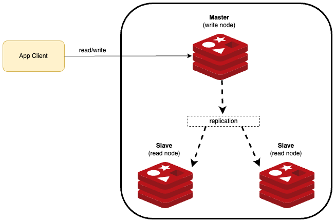

# Custom health check for Redis

This tutorial demonstrates how to create a custom indicator for scenarios in which it is necessary to write to a master
instance of Redis.

When writing capacity is not necessary (the most simple usage), and the client application can perform queries on slave
instances, the default Spring Boot indicator for Redis is enough.



## Usage steps

1. Create a Redis configuration class according to the usage (StandAlone or Sentinel):

    The Standalone configuration is for simple scenarios that do not require SSL authentication.
    The Sentinel configuration is for more complex scenarios, in which some type of authentication is required (via PEM
    certificate, for example) and also when there is a need to inform the name of the master node. We will create a
    configuration class that supports both cases to illustrate.

    ``` { .java .copy }
    package br.com.santander.ars.config;

    import io.lettuce.core.ClientOptions;
    import io.lettuce.core.ReadFrom;
    import io.lettuce.core.SslOptions;
    import java.io.IOException;
    import java.time.Duration;
    import org.springframework.beans.factory.annotation.Autowired;
    import org.springframework.context.annotation.Bean;
    import org.springframework.context.annotation.Configuration;
    import org.springframework.core.io.ResourceLoader;
    import org.springframework.data.redis.connection.RedisConnectionFactory;
    import org.springframework.data.redis.connection.RedisSentinelConfiguration;
    import org.springframework.data.redis.connection.RedisStandaloneConfiguration;
    import org.springframework.data.redis.connection.lettuce.LettuceClientConfiguration;
    import org.springframework.data.redis.connection.lettuce.LettuceConnectionFactory;
    import org.springframework.data.redis.core.RedisTemplate;
    import org.springframework.data.redis.repository.configuration.EnableRedisRepositories;

    @Configuration
    @EnableRedisRepositories
    public class RedisConfig {

        private static final String URL_REDIS_SERVER = "localhost";
        private static final int REDIS_PORT = 26379;

        // Used only when master node name should be passed
        private static final String MASTER_NODE_NAME = "mymaster";

        // Used only when need to use PEM for SSL authentication
        private static final String PEM_PATH = "classpath:br/com/santander/ars/config/fake-cert.pem";

        @Autowired private ResourceLoader resourceLoader;

        @Bean(name = "redisArsTemplate")
        public RedisTemplate<String, String> redisArsTemplate(RedisConnectionFactory connectionFactory)
            throws IOException {
            RedisTemplate<String, String> template = new RedisTemplate<>();
            template.setConnectionFactory(redisConnectionFactory());
            return template;
        }

        @Bean
        public LettuceConnectionFactory redisConnectionFactory() throws IOException {
            LettuceClientConfiguration clientConfig =
                LettuceClientConfiguration.builder()
                    .clientOptions(
                        ClientOptions.builder()

                            // Uncomment if SSL is used
                            /*.socketOptions(
                                SocketOptions.builder().connectTimeout(Duration.ofMillis(10000)).build())
                                .sslOptions(buildSslOptions()
                            )*/

                            .build())
                    .commandTimeout(Duration.ofSeconds(10000))
                    .readFrom(ReadFrom.MASTER_PREFERRED)
                    .build();

            /*
            * LettuceConnectionFactory accepts two types of configuration:
            * RedisStandaloneConfiguration and RedisSentinelConfiguration.
            * Use redisStandaloneConfig() instead of redisSentinelConfiguration() if SSL isn't needed
            */
            return new LettuceConnectionFactory(redisStandaloneConfig(), clientConfig);
        }

        /*
        * Configure SslOptions for SSL connections with Redis server.
        * For example, to use PEM for authentication.
        */
        private SslOptions buildSslOptions() throws IOException {
            SslOptions sslOptions =
                SslOptions.builder().trustManager(resourceLoader.getResource(PEM_PATH).getFile()).build();
            return sslOptions;
        }

        /*
        * Used for simple connections with Redis with or without Sentinel.
        */
        private RedisStandaloneConfiguration redisStandaloneConfig() {
            return new RedisStandaloneConfiguration(URL_REDIS_SERVER, REDIS_PORT);
        }

        /*
        * Used for Redis Sentinel connections with SSL (PEM certifcates)
        * and passing the master node name
        */
        private RedisSentinelConfiguration redisSentinelConfiguration() {
            return new RedisSentinelConfiguration()
                .master(MASTER_NODE_NAME)
                .sentinel(URL_REDIS_SERVER, REDIS_PORT);
        }
    }
    ```

2. create a custom health check:

    ``` { .java .copy }
    package br.com.santander.ars.health;

    import br.com.santander.ars.config.RedisConfig;
    import com.nimbusds.jose.shaded.gson.Gson;
    import java.io.Serializable;
    import java.text.SimpleDateFormat;
    import java.util.Calendar;
    import java.util.Locale;
    import java.util.concurrent.TimeUnit;
    import lombok.extern.slf4j.Slf4j;
    import org.apache.commons.lang3.StringUtils;
    import org.springframework.beans.factory.annotation.Autowired;
    import org.springframework.beans.factory.annotation.Qualifier;
    import org.springframework.boot.actuate.health.Health;
    import org.springframework.boot.actuate.health.HealthIndicator;
    import org.springframework.data.redis.core.RedisTemplate;
    import org.springframework.stereotype.Component;

    @Slf4j
    @Component("redisArsenal")
    public class CustomHealthIndicator implements HealthIndicator {

        private static final String HEALTH_TEST = "health-test-ars-3";
        private static final String ERROR = "error";
        public static final String PT = "pt";
        public static final String BR = "BR";
        public static final Locale LOCALE_BR = new Locale(PT, BR);

        @Autowired private RedisConfig redisConfig;

        @Autowired
        @Qualifier("redisArsTemplate")
        private RedisTemplate<String, String> lettuce;

        /*
        * Inserts a key into the Redis master node and then immediately
        * searches for the same key. The success of this process indicates that there was
        * recording and reading on the master node.
        */
        @Override
        public Health health() {
            try {
                addSync(
                    HEALTH_TEST,
                    1,
                    new SimpleDateFormat("yyyyMMddhhmmss", LOCALE_BR)
                        .format(Calendar.getInstance(LOCALE_BR).getTime()));

                if (StringUtils.isEmpty(get(HEALTH_TEST, String.class))) {
                    return Health.down().withDetail(ERROR, "redis connection fail").build();
                }
            } catch (Exception e) {
                log.error("Health/Check - Redis Error: {}", e.getMessage(), e);
                return Health.down().withDetail(ERROR, "redis connection fail").build();
            }

            return Health.up().withDetail("redis_connection", "success").build();
        }

        public <T extends Serializable> void addSync(String key, int seconds, T value) {
            try {
                if (StringUtils.isNotBlank(key) && value != null) {
                    lettuce = redisConfig.redisArsTemplate(redisConfig.redisConnectionFactory());
                    lettuce.opsForValue().set(key, new Gson().toJson(value), seconds, TimeUnit.SECONDS);
                }
            } catch (Exception e) {
                log.warn(
                    String.format("Redis add key %s value %s seconds ttl %s error", key, value, seconds), e);
            }
        }

        public <T extends Serializable> T get(String key, Class<T> type) {
            try {
                if (contains(key)) {
                    return new Gson().fromJson((String) lettuce.opsForValue().get(key), type);
                }
            } catch (Exception e) {
                log.warn(String.format("Redis get key %s type %s error", key, type), e);
            }
            return null;
        }

        public boolean contains(String key) {
            try {
                return lettuce.hasKey(key);
            } catch (Exception e) {
                log.warn(String.format("Redis contains %s error", key), e);
                return false;
            }
        }

        public int check() {
            // Here is our custom logic to run the health check
            return 0;
        }
    }
    ```

3. In application.yml:

    Disable standard Redis indicator and enable custom indicator. Note that the name of the indicator is the same as the component name of the indicator's @Component("redisArsenal") annotation.

    ``` { .yaml .copy }
    management:
    health:
        redis:
        enabled: false
        show-details: always
        probes:
        enabled: true
        group:
        readiness:
            include:
            - readinessState
            - redisArsenal
    ```
