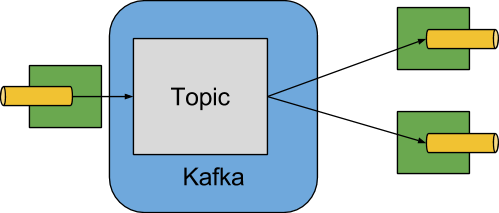

# Using Kafka

## Binder

For message exchange between different applications, we can use Apache Kafka as Broker.
 Spring Cloud Stream provides Binder implementation for Kafka.
The following image illustrates how the Kafka binder works.



The Apache Kafka Binder implementation maps each destination to a topic.
For more details, access the Apache Kafka Binder documentation.

## Use case

For your convenience, Arsenal Message Driven delivers through its Archetype a demo
ready to be used with Apache Kafka. Assuming you have Kafka properly installed as
below settings are sufficient for the Binder process.

``` { .yaml .copy }
spring.cloud:
  stream:
    function:
      definition: consumer
    bindings:
      consumer:
        destination: processor-in-0
  source: processor
  defaultBinder: kafka1
  binders:
    kafka1:
      type: kafka
      environment:
        spring:
          kafka:
            bootstrap-servers: localhost:9092
  instanceCount: 1
  instanceIndex: 0
  bindingRetryInterval: 0

  kafka:
    binder:
      brokers: localhost
      defaultBrokerPort: 9092
      autoCreateTopics: true
    streams:
      binder:
        applicationId: "@project.name@"
        configuration:
          commit.interval.ms: 100
```

Now that we know a little about the started provided by Arsenal Message Driven using Kafka, let's create a sample application accessing our [Quick Start](../../tutorials/quickstart-message-driven.md).

## Apache Kafka Security with Kerberos

### Introduction to Kerberos

Kerberos is an authentication protocol developed to provide security through authentication in user/server applications, where it works as the third party in this process,
offering user authentication using symmetric key cryptography with the [Data Encryption Standard (DES)](https://www.gta.ufrj.br/grad/99_2/marcos/des.htm).

Kerberos is used when a user on a network tries to make use of a particular network service and the service wants to ensure that the user is really authentic. For this, the user presents a ticket, provided by the Kerberos authenticator server (AS).
The service then examines the ticket to verify the user's identity. If everything is ok the user is accepted.

### Configuring the Kerberos Server

For testing on your local machine, you need to configure the Kerberos server to generate tickets and use network services, follow this tutorial until the end of Step 3 - Configure KDC Kerberos Server:
[How to Setup Kerberos Server and Client on Ubuntu 18.04 LTS](https://www.howtoforge.com/how-to-setup-kerberos-server-and-client-on-ubuntu-1804-lts/).

### Keytab

It is necessary to create the file that contains the Kerberos Principal (unique identity) and encrypted keys that are derived from the Kerberos password.
You can use a keytab file to authenticate to multiple remote systems using Kerberos without entering a password. However, when changing your Kerberos password you will need to recreate all your keytabs.

The commands below are for adding a Kerberos Principal (user) and encryption
type to the keytab file:

``` { .bash .copy }
/usr/sbin/kadmin.local -q 'addprinc -randkey kafka/<YOUR_PRINCIPAL>@<YOUR_DOMAIN.COM.BR>'
/usr/sbin/kadmin.local -q "ktadd -k /etc/security/keytabs/kafka_server.keytab kafka/<YOUR_PRINCIPAL>@<YOUR_DOMAIN.COM.BR>"

```

!!! tip "Tip"
    You will need to create a .keytab file with the name of your preference,
    in the example above kafka_server.keytab was used.

### Kafka with Kerberos

Apache Kafka is an internal middle layer that allows backend systems to share real-time data through topics. Kafka's default configuration allows any user or application to write messages to any topic, as well as read data.
As your company moves towards a model where multiple teams and applications use the same Kafka Cluster, some critical and confidential information takes center stage. You need to implement security.
***SASL/GSSAPI*** is a great choice as it allows companies to manage security from their Kerberos server.

For Kafka configuration follow the steps below:

1. Add a JAAS file(<KAFKA_HOME>/config/kafka_server_jaas.conf) pointing to the created keytab:

    ``` { .bash .copy }
    KafkaServer {
        com.sun.security.auth.module.Krb5LoginModule required
        useTicketCache=true
        serviceName=kafka
        useKeyTab=true
        storeKey=true
        keyTab="/etc/security/keytabs/kafka_server.keytab"
        principal="kafka/YOUR_PRINCIPAL@YOUR_DOMAIN.COM.BR";
    };
    KafkaClient {
        com.sun.security.auth.module.Krb5LoginModule required
        useTicketCache=true
        serviceName=kafka
        useKeyTab=true
        storeKey=true
        keyTab="/etc/security/keytabs/kafka_server.keytab"
        principal="kafka/YOUR_PRINCIPAL@YOUR_DOMAIN.COM.BR";
    };
    ```

2. Pass the following parameters to the JVM underlying the Kafka broker:

    ``` { .bash .copy }
    export KAFKA_OPTS="-Djava.security.krb5.conf=/etc/krb5.conf -Djava.security.auth.login.config=/home/<YOUR_USER>/kafka_2.12-2.8.0/config/kafka_server_jaas.conf"
    ```

3. Configuring SASL in <KAFKA_HOME>/config/server.properties:

    ``` { .bash .copy }
    listeners=SASL_PLAINTEXT://your_domain.com.br:9092
    security.inter.broker.protocol=SASL_PLAINTEXT
    sasl.kerberos.service.name=kafka
    sasl.mechanism.inter.broker.protocol=GSSAPI
    sasl.enabled.mechanism=GSS
    ```

### Spring Cloud Stream Apps

They consist of a neutral core of middleware. The Application communicates with the outside world through input and output channels injected by Spring Cloud Stream. These channels are connected to external brokers through Binder implementations.


#### Secure connections (SASL_SSL) between client and brokers

``` { .yaml .copy }
spring.cloud:
  stream:
    function:
      definition: consumer
    bindings:
      consumer:
        destination: processor-in-0
  source: processor
  defaultBinder: kafka1
  binders:
    kafka1:
      type: kafka
      environment:
        spring:
          kafka:
            bootstrap-servers: localhost:9092
            jaas:
              enabled: true
              options:
                useKeyTab: true
                keyTab: /etc/security/keytabs/kafka_server.keytab
                storeKey: true
                useTicketCache: false
                serviceName: kafka
                principal: kafka/YOUR_PRINCIPAL@YOUR_DOMAIN.COM.BR
              control-flag: required
            properties:
              security:
                protocol: SASL_PLAINTEXT
              sasl:
                mechanism: GSSAPI
                kerberos:
                  service:
                    name: kafka
  instanceCount: 1
  instanceIndex: 0
  bindingRetryInterval: 0

  kafka:
    binder:
      brokers: localhost
      defaultBrokerPort: 9092
      autoCreateTopics: true
    streams:
      binder:
        applicationId: "@project.name@"
        configuration:
          commit.interval.ms: 100
```

``` { .bash .copy }
  .   ____          _            __ _ _
 /\\ / ___'_ __ _ _(_)_ __  __ _ \ \ \ \
( ( )\___ | '_ | '_| | '_ \/ _` | \ \ \ \
 \\/  ___)| |_)| | | | | || (_| |  ) ) ) )
  '  |____| .__|_| |_|_| |_\__, | / / / /
 =========|_|==============|___/=/_/_/_/
 :: Spring Boot ::        (v2.3.6.RELEASE)

2021-08-17 20:34:04.029  INFO 17185 --- [  restartedMain] com.rian.demo.DemoApplication            : Starting DemoApplication on krb5.ahmad.io with PID 17185 (/home/rian/demo-binder-kafka-with-kerberos/target/classes started by rian in /home/rian/demo-binder-kafka-with-kerberos)
2021-08-17 20:34:04.034  INFO 17185 --- [  restartedMain] com.rian.demo.DemoApplication            : No active profile set, falling back to default profiles: default
2021-08-17 20:34:04.169  INFO 17185 --- [  restartedMain] .e.DevToolsPropertyDefaultsPostProcessor : Devtools property defaults active! Set 'spring.devtools.add-properties' to 'false' to disable
2021-08-17 20:34:04.170  INFO 17185 --- [  restartedMain] .e.DevToolsPropertyDefaultsPostProcessor : For additional web related logging consider setting the 'logging.level.web' property to 'DEBUG'
2021-08-17 20:34:06.789  INFO 17185 --- [  restartedMain] faultConfiguringBeanFactoryPostProcessor : No bean named 'errorChannel' has been explicitly defined. Therefore, a default PublishSubscribeChannel will be created.
2021-08-17 20:34:06.797  INFO 17185 --- [  restartedMain] faultConfiguringBeanFactoryPostProcessor : No bean named 'taskScheduler' has been explicitly defined. Therefore, a default ThreadPoolTaskScheduler will be created.
2021-08-17 20:34:06.803  INFO 17185 --- [  restartedMain] faultConfiguringBeanFactoryPostProcessor : No bean named 'integrationHeaderChannelRegistry' has been explicitly defined. Therefore, a default DefaultHeaderChannelRegistry will be created.
2021-08-17 20:34:06.910  INFO 17185 --- [  restartedMain] trationDelegate$BeanPostProcessorChecker : Bean 'integrationChannelResolver' of type [org.springframework.integration.support.channel.BeanFactoryChannelResolver] is not eligible for getting processed by all BeanPostProcessors (for example: not eligible for auto-proxying)
2021-08-17 20:34:06.918  INFO 17185 --- [  restartedMain] trationDelegate$BeanPostProcessorChecker : Bean 'integrationDisposableAutoCreatedBeans' of type [org.springframework.integration.config.annotation.Disposables] is not eligible for getting processed by all BeanPostProcessors (for example: not eligible for auto-proxying)
2021-08-17 20:34:06.951  INFO 17185 --- [  restartedMain] trationDelegate$BeanPostProcessorChecker : Bean 'org.springframework.integration.config.IntegrationManagementConfiguration' of type [org.springframework.integration.config.IntegrationManagementConfiguration] is not eligible for getting processed by all BeanPostProcessors (for example: not eligible for auto-proxying)
2021-08-17 20:34:07.629  INFO 17185 --- [  restartedMain] o.s.b.w.embedded.tomcat.TomcatWebServer  : Tomcat initialized with port(s): 8080 (http)
2021-08-17 20:34:07.650  INFO 17185 --- [  restartedMain] o.apache.catalina.core.StandardService   : Starting service [Tomcat]
2021-08-17 20:34:07.652  INFO 17185 --- [  restartedMain] org.apache.catalina.core.StandardEngine  : Starting Servlet engine: [Apache Tomcat/9.0.39]
2021-08-17 20:34:07.848  INFO 17185 --- [  restartedMain] o.a.c.c.C.[Tomcat].[localhost].[/]       : Initializing Spring embedded WebApplicationContext
2021-08-17 20:34:07.849  INFO 17185 --- [  restartedMain] w.s.c.ServletWebServerApplicationContext : Root WebApplicationContext: initialization completed in 3678 ms
2021-08-17 20:34:10.267  INFO 17185 --- [  restartedMain] o.s.s.concurrent.ThreadPoolTaskExecutor  : Initializing ExecutorService 'applicationTaskExecutor'
2021-08-17 20:34:10.717  INFO 17185 --- [  restartedMain] o.s.s.c.ThreadPoolTaskScheduler          : Initializing ExecutorService 'taskScheduler'
2021-08-17 20:34:10.744  INFO 17185 --- [  restartedMain] onConfiguration$FunctionBindingRegistrar : Functional binding is disabled due to the presense of @EnableBinding annotation in your configuration
2021-08-17 20:34:11.100  INFO 17185 --- [  restartedMain] o.s.b.d.a.OptionalLiveReloadServer       : LiveReload server is running on port 35729
2021-08-17 20:34:11.138  INFO 17185 --- [  restartedMain] o.s.b.a.e.web.EndpointLinksResolver      : Exposing 2 endpoint(s) beneath base path '/actuator'
2021-08-17 20:34:11.395  INFO 17185 --- [  restartedMain] o.s.c.s.m.DirectWithAttributesChannel    : Channel 'application.masterInput' has 1 subscriber(s).
2021-08-17 20:34:11.406  INFO 17185 --- [  restartedMain] o.s.i.endpoint.EventDrivenConsumer       : Adding {logging-channel-adapter:_org.springframework.integration.errorLogger} as a subscriber to the 'errorChannel' channel
2021-08-17 20:34:11.408  INFO 17185 --- [  restartedMain] o.s.i.channel.PublishSubscribeChannel    : Channel 'application.errorChannel' has 1 subscriber(s).
2021-08-17 20:34:11.409  INFO 17185 --- [  restartedMain] o.s.i.endpoint.EventDrivenConsumer       : started bean '_org.springframework.integration.errorLogger'
2021-08-17 20:34:11.411  INFO 17185 --- [  restartedMain] o.s.c.s.binder.DefaultBinderFactory      : Creating binder: kafka1
2021-08-17 20:34:11.488  INFO 17185 --- [  restartedMain] .e.DevToolsPropertyDefaultsPostProcessor : Devtools property defaults active! Set 'spring.devtools.add-properties' to 'false' to disable
2021-08-17 20:34:11.553  INFO 17185 --- [  restartedMain] .e.DevToolsPropertyDefaultsPostProcessor : Devtools property defaults active! Set 'spring.devtools.add-properties' to 'false' to disable
2021-08-17 20:34:12.090  INFO 17185 --- [  restartedMain] o.s.c.s.binder.DefaultBinderFactory      : Caching the binder: kafka1
2021-08-17 20:34:12.091  INFO 17185 --- [  restartedMain] o.s.c.s.binder.DefaultBinderFactory      : Retrieving cached binder: kafka1
2021-08-17 20:34:12.345  INFO 17185 --- [  restartedMain] o.s.c.s.b.k.p.KafkaTopicProvisioner      : Using kafka topic for outbound: masterOutput
2021-08-17 20:34:12.355  INFO 17185 --- [  restartedMain] o.a.k.clients.admin.AdminClientConfig    : AdminClientConfig values:
bootstrap.servers = [krb5.ahmad.io:9092]
client.dns.lookup = default
client.id =
connections.max.idle.ms = 300000
default.api.timeout.ms = 60000
metadata.max.age.ms = 300000
metric.reporters = []
metrics.num.samples = 2
metrics.recording.level = INFO
metrics.sample.window.ms = 30000
receive.buffer.bytes = 65536
reconnect.backoff.max.ms = 1000
reconnect.backoff.ms = 50
request.timeout.ms = 30000
retries = 2147483647
retry.backoff.ms = 100
sasl.client.callback.handler.class = null
sasl.jaas.config = null
sasl.kerberos.kinit.cmd = /usr/bin/kinit
sasl.kerberos.min.time.before.relogin = 60000
sasl.kerberos.service.name = kafka
sasl.kerberos.ticket.renew.jitter = 0.05
sasl.kerberos.ticket.renew.window.factor = 0.8
sasl.login.callback.handler.class = null
sasl.login.class = null
sasl.login.refresh.buffer.seconds = 300
sasl.login.refresh.min.period.seconds = 60
sasl.login.refresh.window.factor = 0.8
sasl.login.refresh.window.jitter = 0.05
sasl.mechanism = GSSAPI
security.protocol = SASL_PLAINTEXT
security.providers = null
send.buffer.bytes = 131072
ssl.cipher.suites = null
ssl.enabled.protocols = [TLSv1.2]
ssl.endpoint.identification.algorithm = https
ssl.key.password = null
ssl.keymanager.algorithm = SunX509
ssl.keystore.location = null
ssl.keystore.password = null
ssl.keystore.type = JKS
ssl.protocol = TLSv1.2
ssl.provider = null
ssl.secure.random.implementation = null
ssl.trustmanager.algorithm = PKIX
ssl.truststore.location = null
ssl.truststore.password = null
ssl.truststore.type = JKS

2021-08-17 20:34:12.632  INFO 17185 --- [  restartedMain] o.a.k.c.s.authenticator.AbstractLogin    : Successfully logged in.
2021-08-17 20:34:12.644  INFO 17185 --- [mad.io@AHMAD.IO] o.a.k.c.security.kerberos.KerberosLogin  : [Principal=kafka/krb5.ahmad.io@AHMAD.IO]: TGT refresh thread started.
2021-08-17 20:34:12.664  INFO 17185 --- [mad.io@AHMAD.IO] o.a.k.c.security.kerberos.KerberosLogin  : [Principal=kafka/krb5.ahmad.io@AHMAD.IO]: TGT valid starting at: Tue Aug 17 20:34:12 UTC 2021
2021-08-17 20:34:12.665  INFO 17185 --- [mad.io@AHMAD.IO] o.a.k.c.security.kerberos.KerberosLogin  : [Principal=kafka/krb5.ahmad.io@AHMAD.IO]: TGT expires: Wed Aug 18 06:34:12 UTC 2021
2021-08-17 20:34:12.667  INFO 17185 --- [mad.io@AHMAD.IO] o.a.k.c.security.kerberos.KerberosLogin  : [Principal=kafka/krb5.ahmad.io@AHMAD.IO]: TGT refresh sleeping until: Wed Aug 18 05:04:04 UTC 2021
2021-08-17 20:34:12.755  WARN 17185 --- [  restartedMain] o.a.k.clients.admin.AdminClientConfig    : The configuration 'sasl.kerberos.service.name' was supplied but isn't a known config.
2021-08-17 20:34:12.760  INFO 17185 --- [  restartedMain] o.a.kafka.common.utils.AppInfoParser     : Kafka version: 2.5.1
2021-08-17 20:34:12.760  INFO 17185 --- [  restartedMain] o.a.kafka.common.utils.AppInfoParser     : Kafka commitId: 0efa8fb0f4c73d92
2021-08-17 20:34:12.762  INFO 17185 --- [  restartedMain] o.a.kafka.common.utils.AppInfoParser     : Kafka startTimeMs: 1629232452758
2021-08-17 20:34:13.643  WARN 17185 --- [mad.io@AHMAD.IO] o.a.k.c.security.kerberos.KerberosLogin  : [Principal=kafka/krb5.ahmad.io@AHMAD.IO]: TGT renewal thread has been interrupted and will exit.
2021-08-17 20:34:13.652  INFO 17185 --- [  restartedMain] o.a.k.clients.producer.ProducerConfig    : ProducerConfig values:
```
