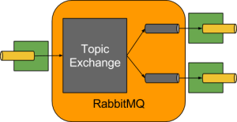

# Using RabbitMQ

## Binder

For exchanging messages between different applications, we can use RabbitMQ
as a Broker. ***Spring Cloud Stream*** provides Binder implementation for Rabbit.
The following image illustrates how the RabbitMQ binder works.



By default, the RabbitMQ Binder implementation maps each destination to a
TopicExchange. For each group of consumers, a queue is linked to that
TopicExchange and thus a corresponding RabbitMQ consumer instance for its
group's queue. For partitioned producers and consumers, the queues are suffixed
with the partition index and use the partition index as the routing key.
For anonymous consumers (those without group ownership), an auto-delete queue
(with a unique random name) is used. To learn more about RabbitMQ we recommend
reading by clicking
[here](https://github.com/spring-cloud/spring-cloud-stream-binder-rabbit).
This will help you choose configurations that are consistent with your solution needs.

## Use case

For your convenience, Arsenal Message Driven delivers a demo ready to be used with
RabbitMQ through your Archetype. Assuming you have RabbitMQ properly installed
the settings below are sufficient for the Binder process.

``` { .yaml .copy }
spring.cloud:
  stream:
    function:
      definition: processor;consumer
    bindings:
      consumer-in-0:
        destination: queue.log.messages
        binder: rabbit
        group: arsenalConsumers
      processor-out-0:
        destination: queue.log.messages
        binder: rabbit
        group: arsenalConsumers
    binders:
      rabbit:
        type: rabbit
        environment:
          spring:
            rabbitmq:
              host: localhost
              port: 5672
              username: guest
              password: guest
```

***Archetype Arsenal Message Driven*** will build an example where it will only be
necessary to change the above variables to the default RabbitMQ user/password values
of ***guest/guest***. Now that we know a little about the started provided by
***Arsenal Message Driven***, let's create a sample application accessing our.
[Quick Start](../../tutorials/quickstart-message-driven.md).
