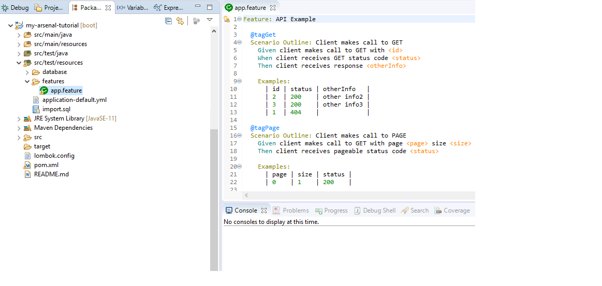

# BDD Testing

[Cucumber](https://cucumber.io/) is an important tool that supports Behavior Driven Development (BDD), well known for being able to validate scenarios in the universe of software testing.

Its library has been incorporated into the Arsenal Framework, as one of the capabilities that most generated delivery value to the community.

## BDD Testing using Cucumber

The Cucumber library provides the ability to run and validate scenarios through the [Gherkin](https://cucumber.io/docs/gherkin/) language. This is really useful as it prioritizes efforts to really understand the expected behavior of a resource.

__How to write a scenario in the Gherkin language?__

Simple, the syntax is quite descriptive and does not require programming knowledge to write, as in the example below:

``` {.gherkin .feature }
Feature: API Example

  @tagGet
  Scenario Outline: Client makes call to GET
    Given client makes call to GET with <id>
    When client receives GET status code <status>
    Then client receives response <id>

    Examples:
      | id | status |
      | 1  | 200    |
```

The scenarios are stored in a file called __app.feature__, located in __src/test/resources/features/__

.

Below is an example of a complete __app.feature__ file:

``` {.gherkin .feature .copy }
Feature: API Example

  @tagGet
  Scenario Outline: Client makes call to GET
    Given client makes call to GET with <id>
    When client receives GET status code <status>
    Then client receives response <id>

    Examples:
      | id | status |
      | 1  | 200    |

  @tagPost
  Scenario Outline: Client makes call to POST
    Given client makes call to POST with "<someInfo>"
    When client receives POST status code <status>
    Then client receives POST response "<someInfo>"

    Examples:
      | someinfo | status |
      | info1    | 201    |

  @tagPut
  Scenario Outline: Client makes call to PUT
    Given client calls PUT with <id> and "<someInfo>"
    When client receives PUT status code <status>
    Then client receives PUT code <id> and "<someInfo>"

    Examples:
      | id | status | someInfo |
      | 1  | 200    | info2    |

  @tagDelete
  Scenario Outline: Client makes call to DELETE
    Given client makes call to DELETE with code <id>
    Then client receives status code <status>

    Examples:
      | id | status |
      | 1  | 204    |
```

## Working with the features file

In Arsenal applications, the __app.feature__ file is consumed in the `CucumberFeatures.java` class, available in the source-folder `src/test/java`. This class basically depends on two others for its perfect functioning: CucumberClient.java
(interface responsible for representing the REST APIs contract) and its ${XXX}ResponseDTO.java (class responsible for mapping the payload of response formats).

!!! tip "Attention!"
    To exemplify, imagine an application whose model was created as "Person", then we will have DTOs called PersonDTO and the mapping of their respective payload called PersonResponseDTO.

The `CucumberFeatures.java` class applies the __app.features__ file scenarios with their inputs in the payload formats in the API interface, as follows:

``` { .java .copy }
package com.santander.ars.arsenal_tutorial_base.api;

import static org.hamcrest.CoreMatchers.is;
import static org.hamcrest.MatcherAssert.assertThat;
import static org.junit.jupiter.api.Assertions.assertEquals;
import org.springframework.beans.factory.annotation.Autowired;

import com.santander.ars.arsenal_tutorial_base.dto.PersonRequestDTO;
import com.santander.ars.arsenal_tutorial_base.dto.PersonResponseDTO;

import com.santander.ars.arsenal_tutorial_base.api.client.CucumberClient;

import io.cucumber.java.en.Given;
import io.cucumber.java.en.Then;
import io.cucumber.java.en.When;
import org.springframework.http.ResponseEntity;

import java.util.Objects;

public class CucumberFeatures {

    @Autowired
    private CucumberClient cucumberClient;

    private ResponseEntity<PersonResponseDTO> response;

    @Given("^client makes call to GET with (\\d+)")
    public void sendRequestWithId(long id) {
        response = cucumberClient.getById(id);
    }

    @When("^client receives GET status code (\\d+)")
    public void receiveStatusCode(Integer status) {
        assertThat(response.getStatusCode().value(), is(status));
    }

    @Then("^client receives response ([^\"]*)")
    public void verifyGetByIdResponse(long id) {
        assertEquals(Objects.requireNonNull(response.getBody()).getId(), id, "Should be equals");
    }

    @Given("^client makes call to POST with \"([^\"]*)\"")
    public void sendPostRequest(String someInfo) {
        response = cucumberClient.create(PersonRequestDTO.builder().otherInfo(someInfo).build());
    }

    @When("^client receives POST status code (\\d+)")
    public void receivePostStatusResponse(Integer status) {
        assertThat(response.getStatusCode().value(), is(status));
    }

    @Then("^client receives POST response \"([^\"]*)\"")
    public void verifyPostResponse(String someInfo) {
        someInfo = someInfo.isEmpty() ? null : someInfo;
        assertThat(Objects.requireNonNull(response.getBody()).getOtherInfo(), is(someInfo));
    }

    @Given("^client calls PUT with (\\d+) and \"([^\"]*)\"")
    public void sendPutRequest(Long id, String someInfo) {
        response = cucumberClient.update(id, PersonRequestDTO.builder().otherInfo(someInfo).build());
    }

    @When("^client receives PUT status code (\\d+)")
    public void receivePutStatusResponse(Integer status) {
        assertThat(response.getStatusCode().value(), is(status));
    }

    @Then("^client receives PUT code (\\d+) and \"([^\"]*)\"")
    public void verifyPutResponse(Long id, String someInfo) {
        someInfo = someInfo.isEmpty() ? null : someInfo;

        assertThat(Objects.requireNonNull(response.getBody()).getId(), is(id));
        assertThat(Objects.requireNonNull(response.getBody()).getOtherInfo(), is(someInfo));
    }

    @Given("^client makes call to DELETE with code (\\d+)")
    public void sendDeleteRequest(Long id) {
        response = cucumberClient.delete(id);
    }

    @Then("^client receives status code (\\d+)")
    public void receiveDeleteStatusResponse(Integer status) {
        assertThat(response.getStatusCode().value(), is(status));
    }
}
```

The used methods should be defined in a client:

``` { .java .copy }
package com.santander.ars.arsenal_tutorial_base.api.client;

import com.santander.ars.arsenal_tutorial_base.dto.PersonRequestDTO;
import com.santander.ars.arsenal_tutorial_base.dto.PersonResponseDTO;
import org.springframework.cloud.openfeign.FeignClient;
import org.springframework.http.ResponseEntity;
import org.springframework.web.bind.annotation.*;

import javax.validation.Valid;

@FeignClient(name = "cucumber", url = "${server.host}" + ":${server.port}" + "/api/v1/person")
public interface CucumberClient {

    @DeleteMapping("/{id}")
    ResponseEntity<PersonResponseDTO> delete(@PathVariable("id") long id);

    @GetMapping("/{id}")
    ResponseEntity<PersonResponseDTO> getById(@PathVariable("id") long id);

    @PostMapping
    ResponseEntity<PersonResponseDTO> create(@RequestBody @Valid PersonRequestDTO person);

    @PutMapping("/{id}")
    ResponseEntity<PersonResponseDTO> update(@PathVariable("id") long id, @RequestBody PersonRequestDTO person);
}
```

And below is the dto example used in this guide:

``` { .java .copy }
package com.santander.ars.arsenal_tutorial_base.dto;

import java.io.Serializable;

import lombok.Builder;
import lombok.Setter;
import lombok.Getter;
import lombok.NoArgsConstructor;
import lombok.AllArgsConstructor;

/** Data Transfer Object (DTO) representing Person responses. */
@Getter
@Setter
@Builder
@NoArgsConstructor
@AllArgsConstructor
public class PersonResponseDTO implements Serializable {

    private static final long serialVersionUID = 1L;

    /** The Person identifier. */
    private long id;

    /** Other info about the Person. */
    private String otherInfo;
}
```
