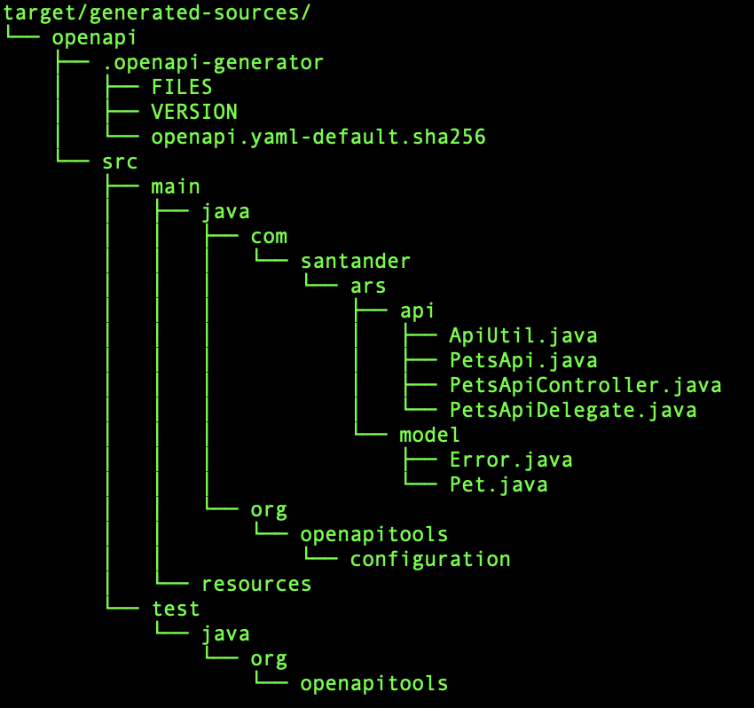

# QuickStart Arsenal {!include-markdown '../../snippets/versions.md' start='<!tag:back-version-schema>' end='<!end:back-version-schema>'!}

{!include-markdown '../../snippets/versions.md' start='<!tag:back-current>' end='<!end:back-current>'!}

This white paper demonstrates how to use archetype to create a new Arsenal
application based on Java 17 and Spring Boot 3.

## How To Get Arsenal?

!!! warning "Archetype Usage"

    New applications should be created using Gluon Portal. Projects generated
    by only the archetype lacks essential SDLC files and configurations and
    should be used only for tests

* Open your command terminal (PowerShell, Terminal or Shell)

* Run the command below:

    Windows (PowerShell):

    ``` { .powershell .copy }
    mvn archetype:generate `
    "-DarchetypeGroupId=com.santander.ars" `
    "-DarchetypeArtifactId=gln-back-arsenal-backend-archetype" `
    "-DarchetypeVersion={!include-markdown '../../snippets/versions.md' start='<!tag:back-version>' end='<!end:back-version>'!}" `
    "-DgroupId=com.santander.ars" `
    "-DartifactId=arsenal-demo" `
    "-Dversion=0.1.0-SNAPSHOT" ``
    "-DEntity=AppArsenal" `
    "-DDatabase=h2" `
    "-DApiYaml=NoApiYaml" `
    "-DisGluon=false"
    ```

    Linux or MacOS:

    ``` { .bash .copy }
    mvn archetype:generate \
    -DarchetypeGroupId=com.santander.ars \
    -DarchetypeArtifactId=gln-back-arsenal-backend-archetype \
    -DarchetypeVersion={!include-markdown '../../snippets/versions.md' start='<!tag:back-version>' end='<!end:back-version>'!} \
    -DgroupId=com.santander.ars \
    -DartifactId=arsenal-demo \
    -Dversion=0.1.0-SNAPSHOT \
    -DEntity=AppArsenal \
    -DDatabase=h2 \
    -DApiYaml=NoApiYaml \
    -DisGluon=false
    ```

!!! tip "RELEASE keyword"

    Use RELEASE keyword to always get the latest released version of the archetype

!!! tip "Variables that you need to change"

    * __-DgroupId:__ identifier of your application's domain group
    * __-DartifactId:__ application artifact identifier
    * __-Dversion:__ artifact version
    * __-DEntity:__ name to model generation (default: AppArsenal)
    * __-DDatabase:__ platform [postgres|oracle|h2] (default: h2)
    * __-DApiYaml:__ file path or a URL to a Open API Specification file. (default: NoApiYaml). In later section his use will be exemplified.
    * __-DisGluon:__ when true enables a gluon error format and requires some properties filled to start up the application (default: false)

    Do not change **DarchetypeGroupId**, **DarchetypeArtifactId** and **DarchetypeVersion** fields

* Access the root of the created project (in this case, arsenal-demo):

    ``` { .bash .copy }
    cd arsenal-demo/
    ```

## How to build and run application?

* Use maven (3.9 or above) to automatically generate resources (see section __Contract First__
and __OAS3__). This will use the OpenAPI Generator to generate the needed files.

    ``` { .bash .copy }
    mvn generate-sources
    ```

* Note that the *target/generated-sources/openapi/* folder has been created and
the source code is in *src/main/java*:

    .

* Let's generate the application build, to make a .jar file of the artifact:

    ``` { .bash .copy }
    mvn clean package
    ```

* Again the /target folder will be populated with more resources:

    .

* With the .jar artifact generated, we will now run our application:

    ``` { .bash .copy }
    mvn spring-boot:run
    ```

!!! tip "profiles"

    Project generated by the archetype contains two profiles: the default one
    **application.yml** and a local one **application-local.yml**

    To use the local profile, run with:

    mvn spring-boot:run -Dspring-boot.run.profiles=local

* We will observe our application available at the following address:

``` { .bash }
http://localhost:[port]/[context]/swagger-ui/index.html#/
```

* When you're done exploring Swagger, stop the terminal from unlock the port in
  use.

## Using yaml as a Parameter to Generate the Contract Application

To generate an Arsenal application, if the contract for the DTOs and API of the
application is not sent as a parameter, the default contract will be used.
However, if you send your contract as a parameter (URL of yaml contract), you
will need to make some adjustments.

First, let's generate the application with the following command:

  ``` { .bash .copy }
    mvn archetype:generate \
    -DarchetypeGroupId=com.santander.ars \
    -DarchetypeArtifactId=gln-back-arsenal-backend-archetype \
    -DarchetypeVersion=RELEASE \
    -DgroupId=com.santander \
    -DartifactId=arsenal-demo \
    -Dversion=0.1.0-SNAPSHOT  \
    -DApiYaml=http://your.contract.yaml.host/your_contract.yaml
  ```

!!! tip "URL Encode"

    If the URL address contains the character `&` replace then to `&amp;` to not cause syntax errors at pom.xml

You can see that your plugin at pom.xml will be as follows:

  ``` { .xml .copy }
  <plugin>
      <groupId>org.openapitools</groupId>
      <artifactId>openapi-generator-maven-plugin</artifactId>
      <executions>
          <execution>
              <goals>
                  <goal>generate</goal>
              </goals>
              <configuration>
                  <skipValidateSpec>true</skipValidateSpec>
                  <inputSpec>http://your.contract.yaml.host/your_contract.yaml</inputSpec>
                  <generatorName>spring</generatorName>
                  <apiPackage>org.example.api</apiPackage>
                  <modelPackage>org.example.model</modelPackage>
                  <supportingFilesToGenerate>ApiUtil.java</supportingFilesToGenerate>
                  <templateDirectory>${project.basedir}/src/main/resources</templateDirectory>
                  <configOptions>
                      <useSpringBoot3>true</useSpringBoot3>
                      <delegatePattern>true</delegatePattern>
                      <openApiNullable>false</openApiNullable>
                      <dateLibrary>java8</dateLibrary>
                      <generateBuilders>true</generateBuilders>
                      <booleanGetterPrefix>is</booleanGetterPrefix>
                      <hideGenerationTimestamp>true</hideGenerationTimestamp>
                      <useBeanValidation>false</useBeanValidation>
                      <useTags>true</useTags>
                      <useSwaggerAnnotations>false</useSwaggerAnnotations>
                      <async>true</async>
                      <returnResponse>true</returnResponse>
                      <additionalModelTypeAnnotations>@SuppressWarnings({"hiding", "static-method", "unused"})</additionalModelTypeAnnotations>
                  </configOptions>
              </configuration>
          </execution>
      </executions>
  </plugin>
  ```

Where *__inputSpec__* is the URL that you send as a parameter to generate the
application.

### Example of Use

Let's assume, as an example, that you have the following contract defined and
that you pass it as a parameter when generating the application:

``` { .yaml .copy }
openapi: 3.0.2
info:
  version: 1.0.0
  title: Swagger Petstore
  license:
    name: MIT
servers:
  - url: http://petstore.swagger.io/v1
paths:
  /pets:
    get:
      summary: List all pets
      operationId: listPets
      tags:
        - pets
      parameters:
        - name: limit
          in: query
          description: How many items to return at one time (max 100)
          required: false
          schema:
            type: integer
            maximum: 100
            format: int32
      responses:
        '200':
          description: A paged array of pets
          headers:
            x-next:
              description: A link to the next page of responses
              schema:
                type: string
          content:
            application/json:
              schema:
                $ref: "#/components/schemas/Pets"
        default:
          description: unexpected error
          content:
            application/json:
              schema:
                $ref: "#/components/schemas/Error"
    post:
      summary: Create a pet
      operationId: createPets
      tags:
        - pets
      responses:
        '201':
          description: Null response
        default:
          description: unexpected error
          content:
            application/json:
              schema:
                $ref: "#/components/schemas/Error"
  /pets/{petId}:
    get:
      summary: Info for a specific pet
      operationId: showPetById
      tags:
        - pets
      parameters:
        - name: petId
          in: path
          required: true
          description: The id of the pet to retrieve
          schema:
            type: string
      responses:
        '200':
          description: Expected response to a valid request
          content:
            application/json:
              schema:
                $ref: "#/components/schemas/Pet"
        default:
          description: unexpected error
          content:
            application/json:
              schema:
                $ref: "#/components/schemas/Error"
components:
  schemas:
    Pet:
      type: object
      required:
        - id
        - name
      properties:
        id:
          type: integer
          format: int64
        name:
          type: string
        tag:
          type: string
    Pets:
      type: array
      maxItems: 100
      items:
        $ref: "#/components/schemas/Pet"
    Error:
      type: object
      required:
        - code
        - message
      properties:
        code:
          type: integer
          format: int32
        message:
          type: string
```

### Maven generate

When running the *__mvn generate-sources__* command you will see that the
structure generated in the target folder will be as follows:



If you go to your Resource class, you'll see that your code is broken. All the
default implementations won't work, and then, you'll need to adjust according to
your contract.

For the example shown in the contract above, your Resources class would look
something like this:

``` { .java .copy }
import lombok.extern.log4j.Log4j2;
import org.example.api.PetsApiDelegate;
import org.example.model.Pet;
import org.springframework.http.ResponseEntity;
import org.springframework.stereotype.Component;

import java.util.List;
import java.util.concurrent.CompletableFuture;

/** Resource responsible for handling AppArsenal operations. */
@Log4j2
@Component
public class AppArsenalResource implements PetsApiDelegate {

  public CompletableFuture<ResponseEntity<Void>> createPets() {
        // Your Implementation
  }

  public CompletableFuture<ResponseEntity<List<Pet>>> listPets(Integer limit)  {
      // Your Implementation
  }

  public CompletableFuture<ResponseEntity<Pet>> showPetById(String petId) {
      // Your Implementation
  }
}
```

#### Summary of code adjustments when parameter ApiYaml is set

The __[groupId]__ correspond to the value set in parameter __-DgroupId=__.
Example: com.santander.ars

The steps are separated by package.

1. __[groupId].app.resource__
     1. Modify the class name from `AppArsenalResource`
     to some context related to your microservice.
     2. Access the class and change the `implements AppArsenalApiDelegate`
     to the `implements ...Delegate` class generated at `target/[groupId]/api`
     after executing `mvn generate-sources`.
     Example: DefaultMethodsApiDelegate
     3. Implement the methods declared in `...Delegate`
2. __[groupId].service__
      Create the service interface needed to attend the resources operations.
3. __[groupId].service.impl__
      Implement the methods declared at interface from the previous step.
4. __[groupId].domain.usecase__
      Implement the methods as needed.
5. __[groupId].domain.Provider__
      Create the Provider interface needed to attend the UseCase operations.
6. __[groupId].infra.dataprovider__
      Implement the methods declared at Provider from the previous step.
7. __[groupId].domain.entity__
      Create the entity to transfer the data between the infra and domain layer.
8. __[groupId].domain.mapper__
     Implement the binding between the different models of the project.
9. __Tests__
     Implement the tests related to resources of the application.
