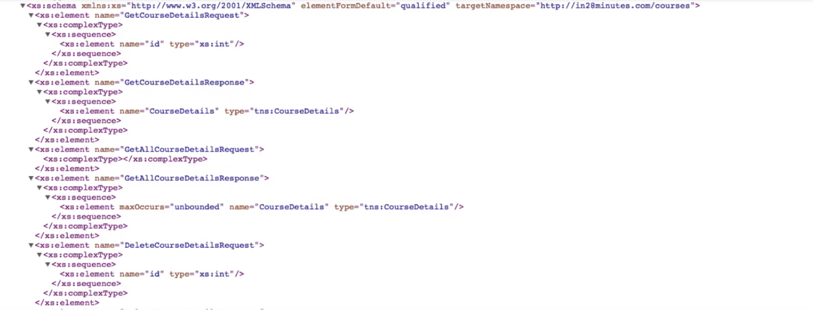
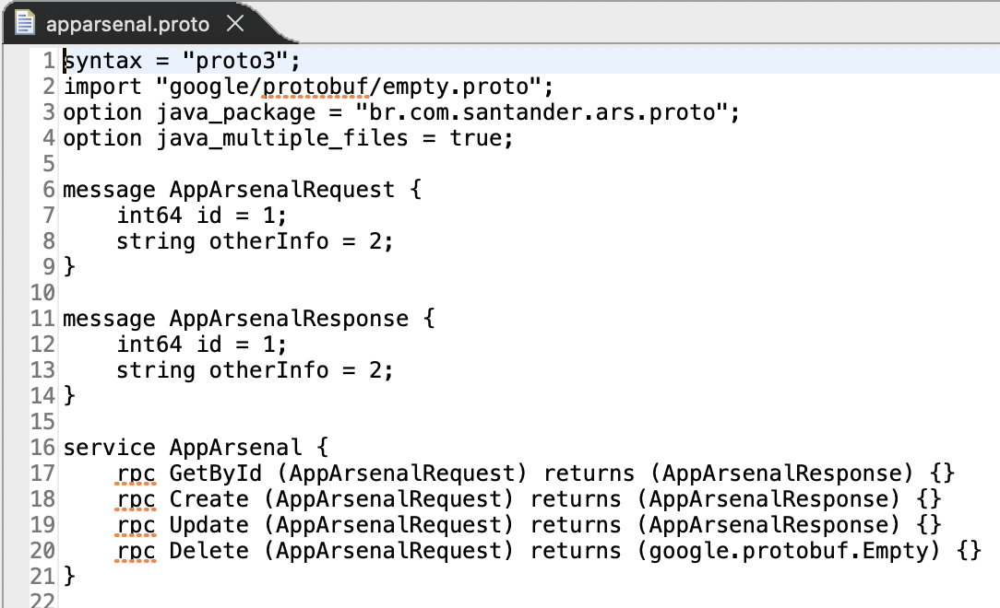
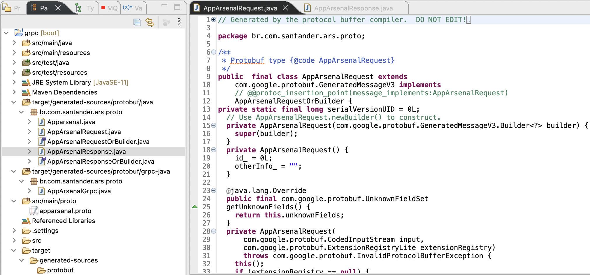

# Contract First

Also known as API First, the Contract First approach supports designing
contract-based Web APIs prior to their actual implementation. Through a contract
or interface, a consumer is able to know details of the service provided, such
as inputs and outputs, which URL the service is/will be available, how to work
with authorization, among others.

Going a little further, the APIs gain more priority, aiming to meet the
construction of consistent and reusable solutions, which guarantee ease of
integration, ease of alignment and ease of versioning.

Basically, this is possible using API definition languages. Naturally,
establishing a contract entails spending a little more time thinking about the
design of an API, perhaps even a little additional planning and collaboration
with stakeholders to gather feeds on the adopted API design. But the gains are
also proportional:

* ***Enables parallel work between different development teams:*** Teams can
  simulate APIs and test their dependencies based on the established API
  definition;
* ***Reduces solution development cost:*** APIs and code can be reused in many
  different projects;
* ***Increases speed to market:*** Automation significantly accelerates API and
  application development (see tools like SwaggerHub);
* ***Ensures good developer experiences:*** Well-designed, well-documented, and
  consistent APIs provide positive developer experiences;
* ***Reduces risk of failures:*** the approach ensures that the APIs are
  reliable, consistent and easy to use for developers;

*Déjà Vu...*

## WSDL

This strategy is not necessarily new, as we are already used to working with the
WSDL (Web Service Definition Language) format in SOAP/XML services. This pattern
already adopted a model for describing WebServices long before REST. Following
the JAX-WS framework, the classes needed to consume a service were created
automatically, following the WSDL document.

## gRPC

The same can be said about the interface definition language used in
[gRPC](https://grpc.io/), the famous Protocol Buffer (or
[protobuf](https://developers.google.com/protocol-buffers/docs/overview)).

With the support of a plugin according to your chosen build tool (Maven or
Gradle), the client code is generated automatically, respecting the contract.

