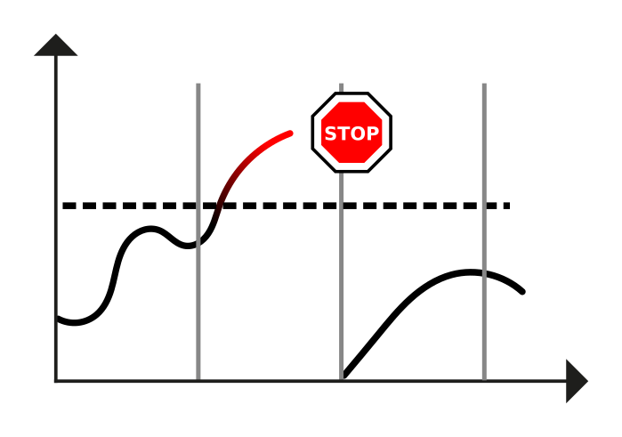
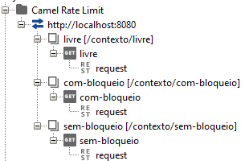

# Rate Limit

## Problem

A system can be overloaded by customer requests, causing lack of performance or
outages. Badly designed or malicious clients can issue excessive requests using
available resources and affecting the availability of other clients.

## Solution

Use rate limiting to promise and enforce a request limit over time for each
customer. Communicate the client limit, remaining allocation, and time before
reset via standard means such as HTTP headers.

Rate Limit is a pattern that monitors the number of requests in a time window.
If the requests exceed the number agreed between the consumer and the supplier,
the rate limiter will block (delaying or throwing an exception) all excess
calls.



Allows you to ensure that the service is not overloaded or that the SLA (Service
Level Agreements) for consumption of a service is not exceeded, protecting
against excessive load caused by malicious or misconfigured actors; it paves the
way for good actors to cooperate with the system, sharing resources equally
among customers.

## Implementation

Apache Camel natively provides the [Throttle
EIP](https://camel.apache.org/components/3.14.x/eips/throttle-eip.html)
(Enterprise Integration Pattern) to enable the implementation of Rate Limit.

In the following implementation examples, the 3 parameters recommended by our
Architecture team were used:

* **throttle**: Number of maximum requests allowed, in a given period
  (time-period-millis);
* **time-period-millis**: Period of time (milliseconds) containing the maximum
  number (throttle) of requests;
* **rejectExecution (true)**: Rejects the request when it reaches the limit of
  requests in the period.

## Dependencies and Settings

Dependency for using Rate Limit in Apache Camel:

You must use the parent of the integration architecture.

``` { .xml .copy }
<dependency>
    <groupId>br.com.santander.bhs</groupId>
    <artifactId>integration-starter-web</artifactId>
</dependency>
```

## Integration Reference Ratelimit

``` { .yaml .copy }
integration:
    application:
        rate-limit:
            throttle: 20
            time-period-millis: 1000
```

Parameters of Rate Limit policies with interest in changing during runtime, must
be created in the YAML file.

!!! warning
    The above values (20 requests in 1000 millis, or 20 TPS) were
    defined together with the PaaS team

``` { .java .copy }
## REST Implementation Example

import org.apache.camel.Exchange;
import org.apache.camel.builder.RouteBuilder;
import org.apache.camel.model.rest.RestBindingMode;
import org.apache.camel.processor.ThrottlerRejectedExecutionException;
import org.springframework.beans.factory.annotation.Value;
import org.springframework.http.HttpStatus;
import org.springframework.stereotype.Component;

@Component
public class RateLimitRouteBuilder extends RouteBuilder {

    public  static final String  ID_LIVRE = "rotaSemBloqueio";
    public  static final String  ID_COM_BLOQUEIO = "orderThrottlerComBloqueio";
    public  static final String  ID_SEM_BLOQUEIO = "orderThrottlerSemBloqueio";

    @Value("${integration.application.rate-limit.throttle:10}")
    private Integer REQUEST_NUMBER;

    @Value("${integration.application.rate-limit.time-period-millis:1000}")
    private Integer REQUEST_PERIOD;

    @Override
    public void configure() throws Exception {

    restConfiguration()
        .contextPath("/integration-reference-ratelimit")
                ...
        .bindingMode(RestBindingMode.auto);

    rest("/contexto")
        .get("/livre").to("direct:livre")
        .get("/com-bloqueio").to("direct:com-bloqueio")
        .get("/sem-bloqueio").to("direct:sem-bloqueio");

        from("direct:livre").routeId(ID_LIVRE)
            .transform().constant("Sem politica de ratelimit.");

        from("direct:com-bloqueio").routeId(ID_COM_BLOQUEIO)
            .doTry()
                .throttle(REQUEST_NUMBER).timePeriodMillis(REQUEST_PERIOD).rejectExecution(true)
                .transform().constant("Caso seja realizado mais requisicao que o esperado, novas requisicoes serao rejeitadas temporariamente.")
                .setHeader(Exchange.CONTENT_TYPE, constant("text/html"))
            .endDoTry()
            .doCatch(ThrottlerRejectedExecutionException.class)
                .setHeader(Exchange.HTTP_RESPONSE_CODE, constant(HttpStatus.TOO_MANY_REQUESTS.value()))
                .setBody(constant(""))
            .end();

        from("direct:sem-bloqueio").routeId(ID_SEM_BLOQUEIO)
            .throttle(REQUEST_NUMBER).timePeriodMillis(REQUEST_PERIOD)
            .transform().constant("Caso seja realizado mais requisicao que o esperado, a proxima transacao sofrera delay temporariamente.")
            .setHeader(Exchange.CONTENT_TYPE, constant("text/html"));
    }
}
```

Implementations may vary, depending on your service needs.

**NOTE**: Note that the throttle() definition must come after the doTry() for
the exception to be caught.

**NOTE 2.**: Note that the doCatch() block above must come after a doTry()
block.

!!! tip
    We recommend that the Throttle EIP be as close to the exposure route as possible.

## REST implementation exception handling

For handling exceptions
(org.apache.camel.processor.ThrottlerRejectedExecutionException) related to
throttle/rate limit behavior, we recommend a return with http response status
code 429 Too Many Requests and not 500 Internal Server Error, which is the
default behavior of Camel. As noted in this snippet taken from the sample REST
implementation:

``` { .java .copy }
.doCatch(ThrottlerRejectedExecutionException.class)
    .setHeader(Exchange.HTTP_RESPONSE_CODE, constant(HttpStatus.TOO_MANY_REQUESTS.value()))
    .setBody(constant(""))
.end();
```

## Example project with REST implementation

A scenario was developed simulating API calls and evidencing the Rate Limit
performance.

The project is divided into two parts.

* integration-reference-ratelimit - Spring Boot/Camel project providing API with
  GET methods, responsible for simulating business contexts and implementing
  Rate Limit policies.
* SoapUI Camel Rate Limit - SoapUI project implementing API consumption made
  possible in the integration-reference-ratelimit project.

In order to demonstrate the Rate Limit performance, just create a consumer for
the API implemented in the previous step. In this case, consumption was
represented through a SoapUI project.



During the execution of the calls, 3 behaviors will be observed:

* Free: The fact that there is no policy applied, return will occur as long as
  the machine supports it.
* With Blocking: Exertion will occur when the parameterized policy is reached,
  in this scenario, 3 requests every 3 seconds (3 thousand milliseconds).
* No Blocking: A delay will occur when reaching the parameterized policy.

## References

1. [Throttle :: Apache
   Camel](https://camel.apache.org/components/latest/eips/throttle-eip.html)
