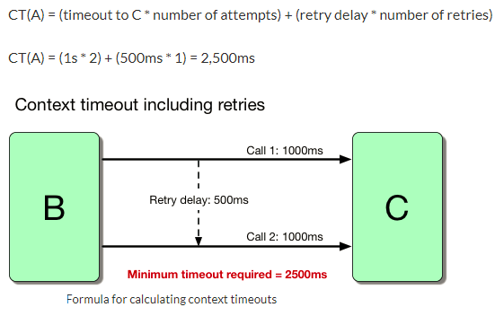
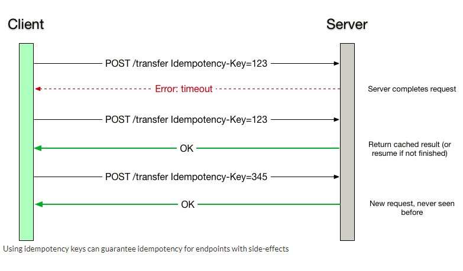

# Retry

## Problem

It is inevitable that systems/services experience network outages and temporary
downtime (reboot or crash, no more than a few seconds).

When clients need real-time data and the service is momentarily unresponsive, it
can affect consumers, so we should create a retry mechanism. There are many
solution options available, we will tackle the synchronous solution via Apache
Camel.

For transient failures, we don't want the request to be terminated immediately,
we prefer to try again a few times, hoping that the next attempt will be
successful, focusing as much as possible on efficiency and taking advantage of
the current transaction.

Once the use of the pattern is adopted, some questions arise:

* Could it generate duplicate information?
* Is it safe to try again?
* Should I try synchronously or asynchronously?
* In trying synchronously, will I denigrate the expectation (timeout) of the
  consumer?
* Choosing the asynchronous way, what do I tell the consumer about the success
  of the operation?
* Should I try one at a time or via batch?
* How many times should I retry?
* How should I postpone attempts?
* Should I use exponential backoff (1s, 3s, 20s) or limit by maximum wait time?
* If the remote server is experiencing performance issues due to overload, will
  retrying make the situation even worse?.

## Solution

In the distributed system, retry can trigger several more requests or retries,
starting a cascading effect. To minimize the impact of retries, a good practice
is to *limit* the number of retries and use an *exponentially incrementing*
algorithm to continually increase the delay between retries until the *maximum
limit* is reached.

Retrying can cause resource *congestion* and make things worse by preventing the
application from recovering; therefore, the number of attempts must be limited.
You should try to start with a minimum count like 2 and not go over 5 or more.
The exponential increment artifice must be applied, aiming to continuously
increase the delay between retries until reaching the maximum limit.



Retry should only be performed if you feel it can meet your requirements. You
shouldn't use it every use case. It's something you build off of what you've
observed during development, testing, or eligible outage scenarios. For example,
during testing, you may find that when consuming a resource, it works once, but
the next time it throws a timeout error, and it works fine when triggered again.
If the root cause or solution is not found, it is advisable to create the Retry
pattern, however, solving the root cause should always be the first option.

We shouldn't implement Retry for every exception. It should only be coded for a
specific type of exception. For example, instead of handling Exception.class,
implement for SQLException.class; eventually, the first connection opening, when
the connection pool has been finalized, may take longer than expected.

Since a retry is initiated by the client (browser, other microservices, etc.)
and the client does not know that the operation failed, before or after handling
the request, you must prepare your application to handle idempotency . For
example, when you retry a purchase operation, you shouldn't charge the customer
twice. Using a unique idempotency key for each of your transactions can help
handle retries.



## Implementation

Apache Camel natively provides methods to enable the implementation of Retry
with various customizations.

## Dependencies and settings

Dependency for using Retry in Apache Camel:

pom.xml

**You must use the parent of the integration architecture.**

``` { .xml .copy }
<dependency>
    <groupId>br.com.santander.bhs</groupId>
    <artifactId>integration-starter-web</artifactId>
</dependency>
```

## Applying Retry on the Camel route

A scenario was developed simulating an exception
(ThrottlerRejectedExecutionException) in API calls, when reaching the defined
Rate Limit, evidencing Retry performance.

The project is divided into two parts.

* integration-reference-retry - Spring Boot/Camel project providing API with GET
  method, responsible for simulating business contexts and implementing Retry
  and Rate Limit policies.
* SoapUI Camel Retry - SoapUI project implementing API consumption made possible
  in the integration-reference-retry project.

### **Integration Reference Retry**

``` { .yaml .copy }
integration:
   application:
      rate-limit:
        throttle: 2
        time-period-millis: 2000
      retry:
        maximum-redeliveries: 5
        redelivery-delay: 1000
        back-off-multiplier: 2
```

Parameters of the Retry policies with interest in changing during runtime, must
be created in the YAML file.

In this scenario, three were contemplated:

*maximum-redeliveries*: Maximum number of retries (retry).

*redelivery-delay*: Time to wait (milliseconds) until the next attempt.

*back-off-multiplier*: Exponential increment of waiting time for retries.

``` { .java .copy }
rest("/contexto")
            .get("/retry").to("direct:retry");
```

Code responsible for creating API and methods, directed to routes (.to). In this
case they were implemented via direct.

 *retry*: Throws an exception if parameterized Rate Limit policy is reached.

``` { .java .copy }
onException(ThrottlerRejectedExecutionException.class)
    .maximumRedeliveries(MAXIMUM_REDELIVEIES)
    .redeliveryDelay(REDELIVERY_DELAY)
    .backOffMultiplier(BACK_OFF_MULTIPLIER)
    .onRedelivery(exchange -> System.out.println("ThrottlerRejectedExecutionException: Retring ..."));

from("direct:retry").throttle(REQUEST_NUMBER).timePeriodMillis(REQUEST_PERIOD).rejectExecution(true)
    .transform().constant("If more requests are made than expected, new requests will be temporarily rejected.");
```

Code responsible for implementing the Rate Limit and Retry policy, returning the
API calls via Retry (when the policy is infringed).

 *maximumRedeliveries* - Method containing the parameter with the maximum number
 of attempts.

 *redeliveryDelay*- Method containing the parameter with time in milliseconds of
 the delay until the next attempt.

 *backOffMultiplier* - Method containing the delay multiplicity parameter for
 the next attempt.

 *onRedelivery* - Method to log in when Retry occurs.

### **SoapUI Camel Retry**

In order to demonstrate the performance of the Retry, just access the swagger
from the address <http://localhost:8080/swagger-ui>

During the execution of the calls, 2 behaviors will be observed:

* With Retry: When there are more calls than parameterized in the Rate Limit
  policy, the exception will be thrown, caught and the Retry triggered.
* No Retry: As long as the calls are within the Rate Limit policy, no exception
  is thrown and the Retry will not be triggered.

``` { .bash .copy }
2019-09-12 16:11:22.839  INFO 28916 --- [estlet-92575452] org.restlet.Component.LogService         : 2019-09-12 16:11:22    127.0.0.1   -   localhost   8080    GET /contexto/retry -   200 103 0   1   http://localhost:8080   Apache-HttpClient/4.1.1 (java 1.5)  -
2019-09-12 16:11:23.009  INFO 28916 --- [estlet-92575452] org.restlet.Component.LogService         : 2019-09-12 16:11:23    127.0.0.1   -   localhost   8080    GET /contexto/retry -   200 103 0   2   http://localhost:8080   Apache-HttpClient/4.1.1 (java 1.5)  -
ThrottlerRejectedExecutionException: Retring ...
ThrottlerRejectedExecutionException: Retring ...
2019-09-12 16:11:26.192  INFO 28916 --- [estlet-92575452] org.restlet.Component.LogService         : 2019-09-12 16:11:26    127.0.0.1   -   localhost   8080    GET /contexto/retry -   200 103 0   3006    http://localhost:8080   Apache-HttpClient/4.1.1 (java 1.5)  -
```

Example of log being retried after throwing ThrottlerRejectedExecutionException.
