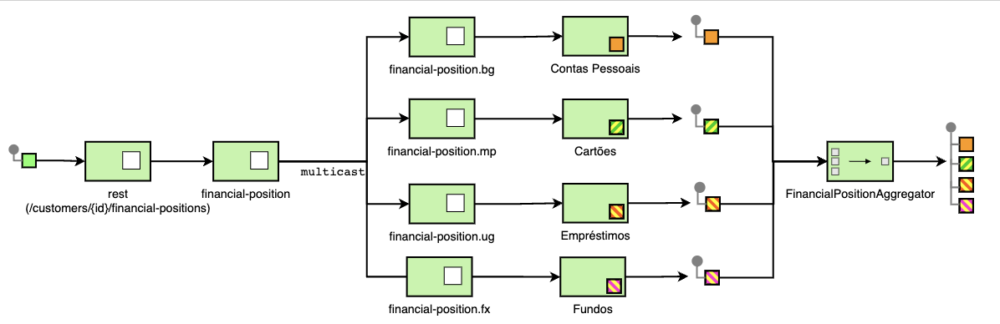

# Aggregation

## Need

A *split* is useful for splitting a single message into a sequence of
sub-messages that can be processed individually. Likewise, a *recipient list* or
a *publish/subscribe* channel is useful for forwarding a request message to
several recipients in parallel, receiving at the end several messages to choose
one of them or even group them together. In most of these scenarios, the
destination service can rely on an aggregator to process the submessages to
combine them into a single new message.

How do we combine the results of individual but related messages so they can be
processed or returned as a single message?

## Solution

[EIP
aggregate](https://camel.apache.org/components/latest/eips/aggregate-eip.html)
allows combining a number of messages into a single message. Being able to use
or not a correlation expression to determine the messages that must be
aggregated according to the explored scenario. is used to combine all messages
based on a single correlation key into a single message. It is a special filter
that takes a message stream and identifies correlated messages. After a complete
set of messages is received, the aggregator collects information from each
correlated message and posts a single aggregated message to the output channel
for further processing or response to a source client or service.

## Implementation

[How to implements EIP Aggregate](../../how-to-guides/integration/aggregation.md)
