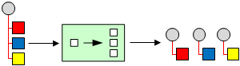
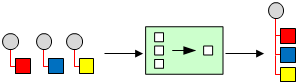

# Parallel message processing

Many messages that pass through an integration solution consist of multiple
elements. For example, an order placed by a customer consists of more than just
one item, which may need to be handled by an inventory system in parallel. Thus,
we need to find an approach to process a complete order, but treat each order
item contained in the order individually.

How can we process a message if it contains multiple elements, each of which
might have to be processed in a different way?

Use a Splitter to split the composite message into a series of individual
messages, each containing data related to an item.

Use a Splitter that consumes a message containing a list of repeating elements,
each of which can be processed individually. Splitter publishes a message for
each individual element (or a subset of elements) of the original message.

Once messages are processed, how do we combine the results of individual but
related messages so that they can be processed as a whole?

Use a stateful filter, an Aggregator, to collect and store individual messages
until a complete set of related messages is received. The Aggregator then
publishes a single message distilled from the individual messages.

The Aggregator is a special filter that takes a message stream and identifies
correlated messages. Once a complete set of messages is received (more on
deciding when a set is 'complete' below), the Aggregator collects information
from each correlated message and posts a single aggregated message to the output
channel for further processing.

## Implementation

[How to implements EIP Parallel MessageProcessing](../../how-to-guides/integration/parallel-processing.md)
