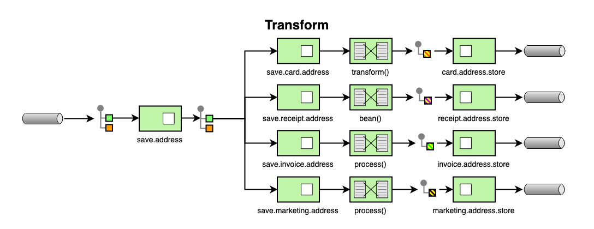

# Transformation

## Need

When carrying out integrations with legacy systems, it is often necessary to
translate or transform our entities and messages into some format in order to
maintain compatibility with other existing applications in our ecosystem, it is
common that the destination service requires more data than the source service
can provide, or even the target service requires a specific format of data than
the source service does not originally provide. These scenarios abound! When we
talk about integration with the various parts that make up the organization, the
scenarios are even more abundant.

How do we communicate with another service if the originator of the message
doesn't have the data in the required format?

## Solution

Camel supports transform EIP, using a processor in the route itself, using a
bean to perform the transform, or using transform() in the DSL. We can also use
a data format to pack and unpack messages in different encodings such as
messages sent to and from the mainframe. For example: we can have services that
store address data where street, neighborhood, number and other address data are
stored each in a specific attribute, and in other services the same data can be
stored all concatenated as a string representing the delivery address for
example.

## Implementation

[How to implements EIP Transformation](../../how-to-guides/integration/transformation.md)
