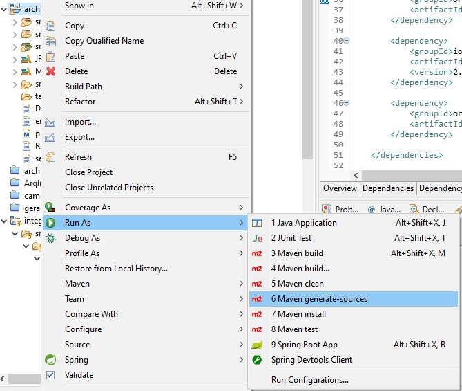
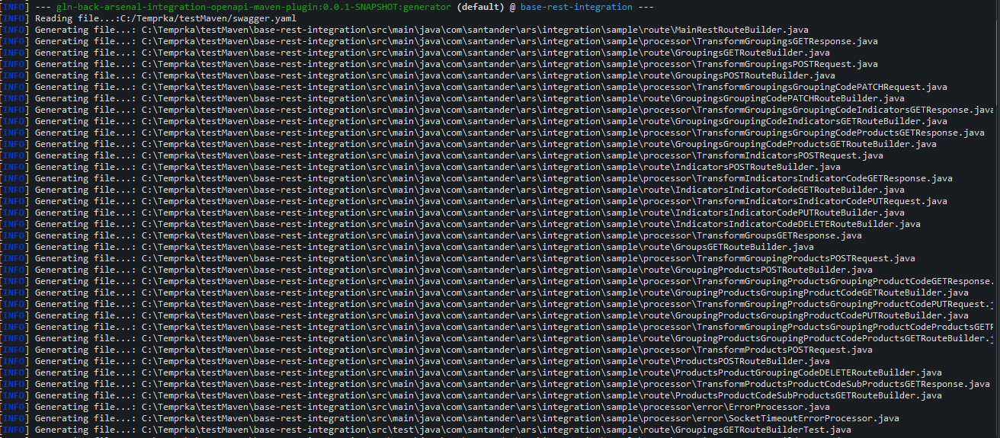
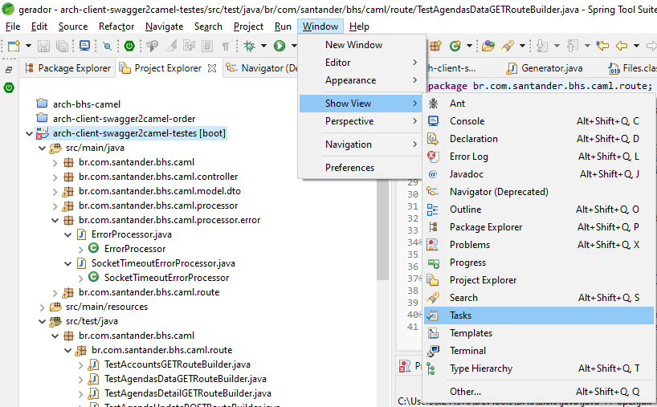
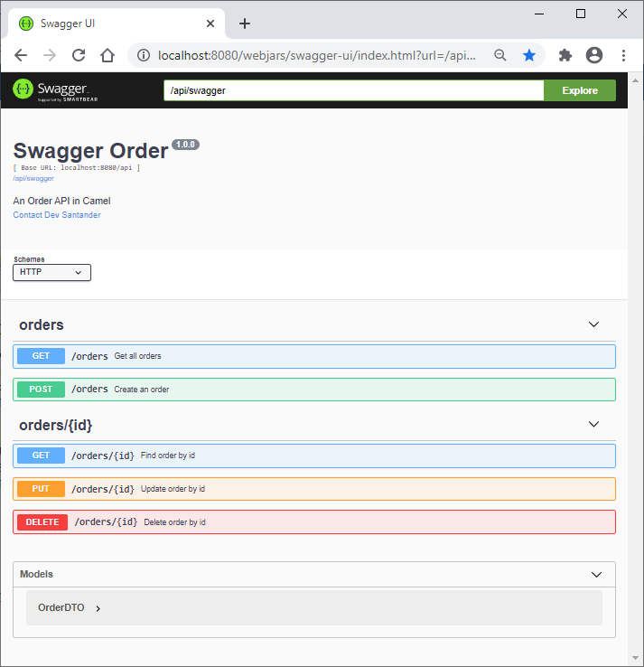

# Using Open API Contract First

## Need

To speed up the development of new integration applications

## Solution

A maven plugin was developed that reads a yaml or json file containing OpenAPI
3.0 Specification and generates the necessary classes for a Camel project with
REST exposure from the resources identified in the file.

## Implementation

### Step 1: Checkout project

If you already have a base arsenal-integration project created with the
archetype: gln-back-integration-rest-archetype, at your git repository please
*checkout*.

*Only for test purpose* execute the following command to create a new one.

??? note "bash"

    ``` { .bash .copy }
    mvn archetype:generate \
        -DarchetypeVersion=RELEASE \
        -DarchetypeGroupId=com.santander.ars \
        -DarchetypeArtifactId=gln-back-integration-rest-archetype \
        -DgroupId=com.santander.integration.sample \
        -DartifactId=base-rest \
        -Dversion=0.0.1-SNAPSHOT \
        -DisGluon=true|false \
        -DApiYaml=[yaml or json file of API contract with OpenAPI Specification ]
    ```

### Step 2: pom.xml - validate openapi file path and other parameters

This step is to validate the parameters provided at execution of archetype
generate. If they are correct it's not necessary to change anything.

#### Step 2.1 - <properties\>

- [x] **openapi-contract-path**: Absolute file path or URL that contains a Open
  API Specification of the API contract.

#### Step 2.2 - <plugin\> <configuration\>

##### gln-back-arsenal-integration-openapi-maven-plugin

- [x] **fileSwaggerYamlJsonLocation**: filled by default with de variable
  ${openapi-contract-path} whose value was defined at properties section.
- [x] **rootPackageClass**: this field is filled with the value set in execution
  of archetype generate. It's the base package that generated class will be
  created at.
- [x] **outputGeneratedClasses**: base project source folder. Filled by default
  with maven property ${project.build.sourceDirectory}
- [x] **outputGeneratedTestClasses**: base project test source folder. Filled by
  default with maven property ${project.build.sourceDirectory}
- [x] **skip**: if set *true*, at the maven generate-sources the plugin is
  called but doesn't execute the generate process.
- [x] **skipOverwrite**: If a class already exists in the project with the same
  name and path to be generated, it won't be overwritten even when executing mvn
  install or mvn generate:generator. If you want to generate again just one
  class delete the specific class from the project.

##### openapi-generator-maven-plugin

- [x] **modelPackage**: package that components from the API contract will be
  saved.

### Step 3: Execute maven phase generate-sources



At console it's possible to follow the plugin execution:


### Step 4: Code adjustments

Opening the the menu Window/Show View/Tasks at eclipse/STS will list all the
changes needed to make the project functional.



They are related to the backend URL information (server.url parameter contained
in the application.yml), the to/from of the sending and returning objects in the
backend call and the project's execution class for the unit tests. Below is the
list of changes by category.

1. **application.yml**

    1. TODO: define URL call. It is configured to obtain the value from a
        parameter.

2. **Request/response backend**

    1. **Route:** 1. TODO: Change to response object of the called backend
    2. **Processor:** 1. TODO: from/to fields 2. TODO: define the return object of
        the called backend. 3. TODO: Uncomment after defining the return object of the
        called backend.

3. **Tests**
    1. TODO: mock endpoint of http endpoint
    2. TODO: expected object
    3. TODO: message return class and sending object in the body of the message.

### Step 5: Start project and open swagger-ui

After the end of configurations, now it's possible to run the application. It's
already configured the swagger-ui with the resources declare at the contract. The
standard URL is *<http://localhost:8080/change-this-content-with-property-spring.mvc.servlet.path-value/swagger-ui/index.html>*


