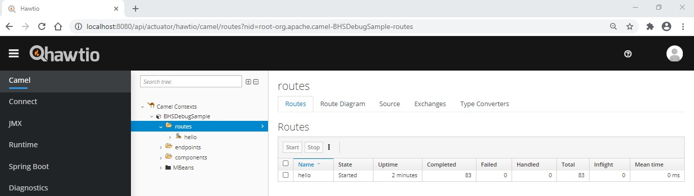
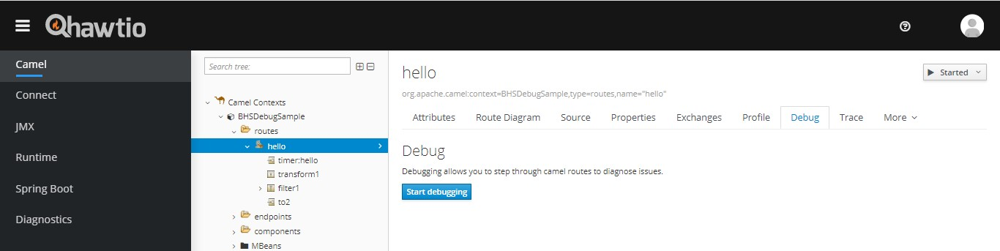
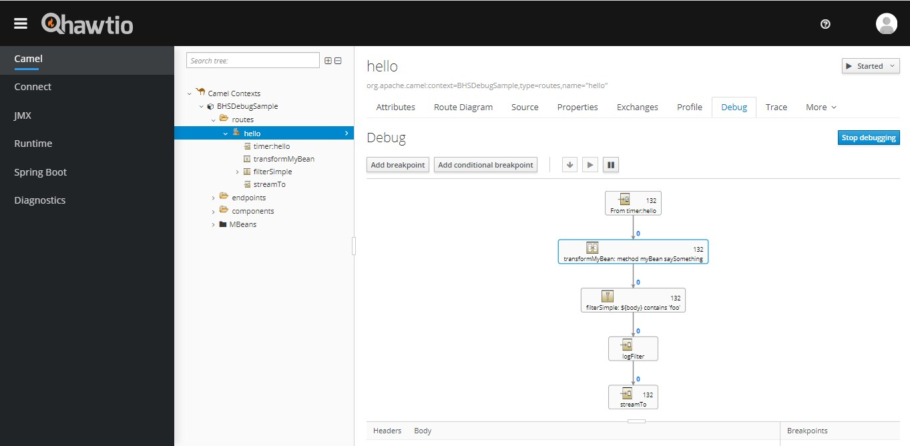
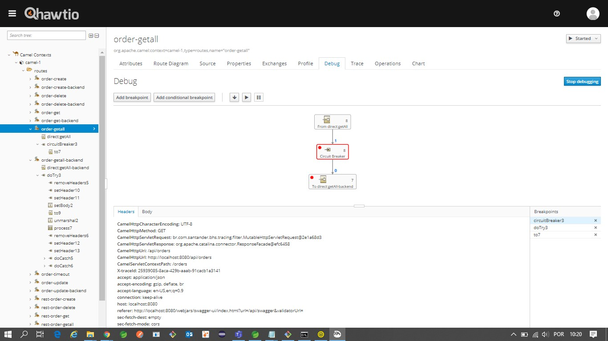

# How to debug Camel routes visually

In this guide will be use a modular webconsole called Hawtio. It offer a lot of
built-in plugins like JMX, JVM, Apache ActiveMQ, Spring Boot and Apache Camel.

## Implementation

### Phase 1 -  Preparation

1 - Add dependencies to project **pom.xml**

1. **camel-management**

    ``` { .xml .copy }
    <dependency>
        <groupId>org.apache.camel</groupId>
        <artifactId>camel-management</artifactId>
        <version>${apache-camel.version}</version>
    </dependency>
    ```

2. **hawtio-springboot**

    ``` { .xml .copy }
    <dependency>
        <groupId>io.hawt</groupId>
        <artifactId>hawtio-springboot</artifactId>
        <version>2.10.1</version>
    </dependency>
    ```

2 - Configure Camel Context to enable **debug** mode(line 20) and **trace**(line
21) that is disabled by default.

!!! note This class must be in the same package or in a subpackage of Spring
    Boot initialisation class.

``` { .java .copy linenums="1" title="HawtioCamelConfiguration.java" hl_lines="20 21" }

package br.com.santander.bhs.caml.camel_integration_debug_sample.configuration;

import org.apache.camel.CamelContext;
import org.apache.camel.spring.boot.CamelContextConfiguration;
import org.springframework.context.annotation.Bean;
import org.springframework.context.annotation.Configuration;
import org.springframework.context.annotation.Profile;

@Configuration
@Profile("local")
public class HawtioCamelConfiguration{

    @Bean
    public CamelContextConfiguration contextConfiguration() {

        return new CamelContextConfiguration() {

            @Override
            public void beforeApplicationStart(CamelContext camelContext) {
                camelContext.setDebugging(Boolean.TRUE);
                camelContext.setBacklogTracing(Boolean.TRUE);
            }

            @Override
            public void afterApplicationStart(CamelContext camelContext) {}
        };
    }
}
```

3 - WebServer configuration to deactivate the need for a user and password when
opening the Hawtio application. Done programmatically to not change application
startup parameters in the dev environment.

!!! warning This class must be in the same package or below the spring boot
    class. In case you are using the **scanBasePackages** attribute of the
    **@SpringBootApplication** annotation, the configuration classes must be
    contained in the declared packages or add the package of these classes to
    the attribute.

``` { .java .copy linenums="1" title="WebServer - Tomcat" }
package br.com.santander.bhs.caml.camel_integration_debug_sample.configuration;

import org.springframework.boot.web.embedded.tomcat.TomcatServletWebServerFactory;
import org.springframework.boot.web.server.WebServerFactoryCustomizer;
import org.springframework.context.annotation.Configuration;
import org.springframework.context.annotation.Profile;

@Configuration
@Profile("local")
public class HawtioTomcatConfiguration
        implements WebServerFactoryCustomizer<TomcatServletWebServerFactory> {

    @Override
    public void customize(TomcatServletWebServerFactory factory) {
        System.setProperty("hawtio.authenticationEnabled", "false");
    }
}
```

```{ .java .copy linenums="1" title="WebServer - Jetty"}
package br.com.santander.bhs.caml.camel_integration_debug_sample.configuration;

import org.springframework.boot.web.embedded.jetty.JettyServletWebServerFactory;
import org.springframework.boot.web.server.WebServerFactoryCustomizer;
import org.springframework.context.annotation.Configuration;
import org.springframework.context.annotation.Profile;

@Configuration
@Profile("local")
public class HawtioJettyConfiguration
        implements WebServerFactoryCustomizer<JettyServletWebServerFactory> {

    @Override
    public void customize(JettyServletWebServerFactory factory) {
        System.setProperty("hawtio.authenticationEnabled", "false");
    }
}
```

4 - Creation of resource in yaml format with the profile suffix
local(application-local.yml) for parameterization of hawtio management (web
application for debug) and jolokia(java agent for remote connection of jmx using
json over http) adding to the management parameter
.endpoints.web.exposure.include=hawtio,jolokia;

!!! Info The local suffix corresponds to the information inserted in the
    "@Profile" annotation of the class above.

``` { .yaml .copy title="application-local.yml"}
management:
  endpoints:
    web:
      exposure:
        include: info,health,hawtio,jolokia
```

5 - Add a parameter at application startup with the local spring profile.

``` { .shell .copy }
-Dspring.profiles.active=local
```

### Phase 2 - Operation

1. After these configurations, start the project as a Spring Boot Application
   and access the /actuator/hawtio of the application (Ex.:
   <http://localhost:8080/actuator/hawtio>). In the first access, the opening is
   not instantaneous, but in the application's log, it can be seen its loading.

    

2. To debug, expand the camel context name, select a route, access the Debug tab
    and click on Start debugging.
    

3. Select some node and click Add breakpoint.
    

!!! tip "Tip"
    **Tip 1**: it is recommended to put an ID in each step of the Camel
    route programming. It facilitates the follow-up of the executions.
    **Tip 2**: it is also possible to add a condition for the breakpoint to stop using
    Simple language or XPath by clicking on Add Additional Breakpoint.
    **Tip 3**: use the mouse wheel to zoom in/out the diagram.
    **Tip 4**: when there is a redirection to another route, it is necessary to place the breakpoint
    in that second route because the debug does not change to the other screen
    with that route.

At the bottom, two tabs are available with information about the header and body
    of the message. 
