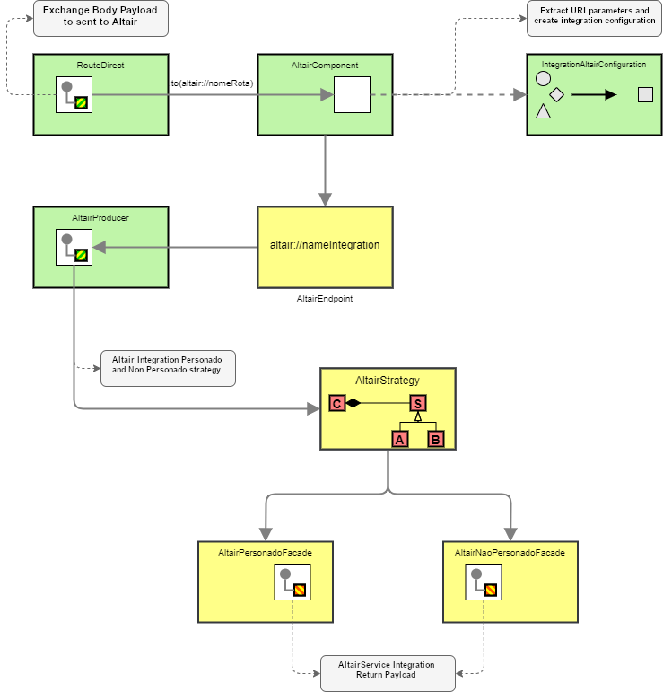

# Altair - Communicating with Mainframe using Message Queue

To communicate from microservice to mainframe was develop a Apache Camel Component named *altair* that escapsulates the routines of communication with Altair using the IBM MQ and do the data binding between a text message from queue to a java model object.

## Architecture



## Component URI Format

To use the component use the syntax below inside a .to() DSL.

``` { .java .copy }
altair://integrationName[?options]
```

!!! note

    **integrationName** can be any name that represents the integration that is being doing.

## Component / Endpoint Options

Possible parameters for integration with Altair are divided into 4 types:

1. Configuration
2. Security
3. HeaderPS7
4. HeaderPS8
5. HeaderPZI

Parameters are describe below:

### 1. Configuration

|Name|Description|DefaultValue|Type|
|----|----|----|----|
|altairUser|Altair user to execute the transactio at mainframe||String|
|personado|If true use personated user that transct in mainframe|false|Boolean|
|psFormatEnum|Execution format at Mainframe. Supports 3 types that can be declared in short or long format: 1. PsFormatEnum.PS7 or PS7 2. PsFormatEnum.PS8 or PS8 3. PsFormatEnum.PZI or PZI| PS7 | String |
|transactionName|Transaction name at Mainframe||String|
|useHeaderPs|If true parameters of type 3.HeaderPS7 or 4.HeaderPS8 must be set||Boolean|
|requestQueueName|Request queue name at MQ Instance||String|
|responseQueueName|Request queue name at MQ Instance||String|

### 2. Security

|Name |Description|Default value|Type|
|----------------------------|----------------------------|----------------------------|----------------------------|
|userPersonado|Personated user to access mainframe||String|
|sessionTokenPersonado|Personated token session to access mainframe||String|
|ipClient|Personated user's Client IP to access mainframe||String|
|newPassword|New password for the personated user to access the mainframe||String|
|password|Personated user password to access the mainframe||String|
|siglaSis|Acronym for SIS personated user to access the mainframe||String|
|terminal|Personated user terminal to access mainframe||String|

### 3. HeaderPS7

|Name |Description|Default value|Type|
|----------------------------|----------------------------|----------------------------|----------------------------|
|ps7CampoDesUso00|Field of Use 00 for PS7 controller||String|
|ps7CampoDesUso01|Field of Use 01 for PS7 controller||String|
|ps7ControleAltair|Altair controller for PS7 controller||String|
|ps7IndicadorImpressao|Print Indicator for PS7 Controller||String|
|ps7Sequencia|Sequence for PS7 controller||String|
|ps7TeclaFuncao|Function key for PS7 controller||String|
|ps7TerminalLogico|Logical Terminal for PS7 controller||String|
|ps7TipoCabecalho|Type Header for PS7 controller||String|

### 4. HeaderPS8

|Name |Description|Default value|Type|
|----------------------------|----------------------------|----------------------------|----------------------------|
|ps8CamposDeUso00|Field of Use 00 for PS8 controller||String|
|ps8CodigoAplicativoCanal|Channel Application Code for PS8 controller||String|
|ps8CodigoCanal|Channel code for PS8 controller||String|
|ps8CodigoTransacaoNegocio|Business Transaction Code for PS8 controller||String|
|ps8ControleAltair|Altair controller for PS8 controller||String|
|ps8DadosAplicativo|Data App for PS8 controller||String|
|ps8IdCliente|Client Id for PS8 Controller||String|
|ps8IndicadorImpressao|Print Indicator for PS8 Controller||String|
|ps8IndicadorPreFormato|Pre Format indicator for PS8 controller||String|
|ps8Ip|IP for PS8 controller||String|
|ps8NumeroUnicoTransacaoCanal|Unique Channel Transaction Number for PS8 controller||String|
|ps8Sequencia|Sequence for PS8 controller||String|
|ps8TeclaFuncao|Function key for PS8 controller||String|
|ps8TerminalLogico|Logical Terminal for PS8 controller||String|
|ps8TipoAutenticacao|Type Authentication for PS8 controller||String|
|ps8TipoCabecalho|Type Header for PS8 controller||String|
|ps8TipoFirma|Type Firm for PS8 controller||String|
|ps8TipoIdCliente|Type Client Id for PS8 controller||String|
|ps8UsoInfra|Use Infra for PS8 controller||String|
|ps8VersaoMensagem|Message version for PS8 controller||String|

### 5. Header PZI

|Name |Description|Default value|Type|
|----------------------------|----------------------------|----------------------------|----------------------------|
|pziPRM_NIVEL_LOG|||Integer|
|pziPRM_PROGRAMA_LEG|||String|
|pziPRM_LEN_DATOS|||Integer|
|pziPRM_REPLYTOQ_CLTE|||String|
|pziPRM_TIP_MENSAJE|||String|
|pziPRM_TIP_PROCESO|||Integer|
|pziPRM_ID_CANAL|||String|
|pziPRM_ID_TX|||String|
|pziPRM_USUARIO_ALTAIR|||String|
|pziPRM_USUARIO_CICS|||String|
|pziPRM_FORMATO_MSG|||String|
|pziENTIDAD1|||String|
|pziCENTRO|Control center||String|
|pziTRANSAC|Transaction||String|
|pziTPOPER|Operation type||String|
|pziFECHACO|||String|
|pziCANAL|Channel Code||String|
|pziREFEROP|REFER-OPER||String|
|pziMEIPAG|Payment method code||String|
|pziCHVTRX|Transaction key||String|
|pziREFERES|REFER-OPER of reversal||String|
|pziDTORIG|Origin date||String|
|pziHRORIG|Origin time||String|
|pziCODCLI|Code Type Client||String|
|pziINDAGEN|Scheduling Indicator||String|
|pziNUMAUTE|Authentication number||Integer|
|pziTPMODUL|Module type||String|
|pziTPTERMI|Terminal Type||Integer|
|pziNUMPAB|PAB number||Integer|
|pziVERSAO|Channel version||Integer|
|pziNUMTERM|Terminal Number||String|
|pziSIGLAUS|User Acronym||String|
|pziNUMOPER|Operator number||Integer|
|pziMTROPER|Operator registration||Integer|
|pziNUMSUPE|Supervisor number||Integer|
|pziMTRSUP|Supervisor registration||Integer|
|pziMACMSG|MAC of the message||String|
|pziPAN1|Encrypted PAN||String|
|pziPANCONT|Encrypted PAN (Continued)||String|
|pziENTCONT|Account Entity||String|
|pziCENTCTA|Account Center||String|
|pziNUMCTA|Account Number||String|
|pziTIPOCTA|Account Type||String|
|pziDADOSCA|||String|

## Steps to configure

1. Import dependency

    ``` { .xml .copy }
    <dependency>
      <groupId>com.santander.ars</groupId>
      <artifactId>gln-back-arsenal-integration-altair-connector</artifactId>
    </dependency>
    ```

2. Add properties

   ``` { .yaml .copy }
   integration:
     altair:
       format-classpath: ${ALTAIR_MQ_FORMAT_CLASSPATH}
       message-format: ${ALTAIR_MQ_MESSAGE_FORMAT}
       message-expired-timeout: ${ALTAIR_MQ_MESSAGE_EXPIRED_TIMEOUT}
       receive-timeout: ${ALTAIR_MQ_RECEIVE_TIMEOUT}
       server:
         hostname: ${ALTAIR_MQ_HOSTNAME}
         port: ${ALTAIR_MQ_PORT}
         channel: ${ALTAIR_MQ_CHANNEL}
         username: username
         pwd: password
   ```

3. Set environment variables

    ``` { .properties .copy }
    ALTAIR_MQ_FORMAT_CLASSPATH=br.com.santander.bhs.integraionaltair.{name}
    ALTAIR_MQ_MESSAGE_FORMAT=PS7
    ALTAIR_MQ_CHANNEL=CHANNEL1
    ALTAIR_MQ_MESSAGE_EXPIRED_TIMEOUT=3000
    ALTAIR_MQ_RECEIVE_TIMEOUT=3000
    ALTAIR_MQ_HOSTNAME=mq-paas-xxxxx.ibm-mq.svc.cluster.local
    ALTAIR_MQ_PORT=1414
    ```

## How to use

1. Create a model java class with the payload expect by the called transaction from Altair. This class must have all the attributes and annotations describing it.

    ``` { .java .copy title="QGMMTCE"}
    import com.altec.bsbr.fw.ps.annotations.PsFieldString;
    import com.altec.bsbr.fw.ps.annotations.PsFormat;

    @PsFormat(name = "QGMMTCE")
    public class QGMMTCE {

      @PsFieldString(length = 4, name = "CODTRAN")
      private String CODTRAN;

      @PsFieldString(length = 4, name = "CANAL")
      private String CANAL;

      @PsFieldString(length = 12, name = "CODTRRE")
      private String CODTRRE;

      public String getCODTRAN() {
        return CODTRAN;
      }

      public void setCODTRAN(String cODTRAN) {
        CODTRAN = cODTRAN;
      }

      public String getCANAL() {
        return CANAL;
      }

      public void setCANAL(String cANAL) {
        CANAL = cANAL;
      }

      public String getCODTRRE() {
        return CODTRRE;
      }

      public void setCODTRRE(String cODTRRE) {
        CODTRRE = cODTRRE;
      }
    }
    ```

    !!! Attention
        The package from this model class must be the same define at property ```integration.altair.format-classpath``` in application.yml.

    ??? Tip "Using the robot to create transaction DTOs"

        One way to speed up this step is to use the DTO creation robot for mainframe transactions. With it, it is possible to generate all the necessary classes to call a transaction with just the transaction name.

        [Click here](https://gitlab.santanderbr.corp/arquitetura-de-integracao/altair-dto-generator) to download the automatic DTO generator to use the Altair component more conveniently.
        After downloading, we must prepare the environment for robot use as follows:

        1. Create a directory called dev in the system root (C:)
        2. Create a directory called formats in (C:/dev)
        3. Put the lib directory should be in C:/dev/formatos/
        4. Place the _script.bat, cpappend.bat and create-format-0.0.1-SNAPSHOT.jar file in C:/dev/formatos/
        5. Edit the script.bat and in the JAVA variable="Indicate the location where java is installed"
        6. Run the script.bat
        7. Enter one or more transactions separated by commas. Example: PE46 or PE47, PE39

2. Define a route with .to()

``` { .java .copy title="AltairSampleRouter" }
from("direct://sampleAltair")
    // fill the model class with the required fields from transaction and set at message body from exchange.
    .process(exchange -> {
        QGMMTCE data = new QGMMTCE();

        data.setCODTRAN("PE47");

        exchange.getMessage().setBody(data);
    })
   , set
    .to("altair://integracaoaltair" // Set the component altair and  give a name to this integration
            + "?personado=false" // set false to consultative operations and true to transactional operations that requires authentication
            + "&transactionName=PE47" // set the transaction name
            + "&useHeaderPs=false" // parameter that enables the use of parameters 3. HeaderPS7 or 4. headerPS8
            + "&psFormatEnum=PsFormatEnum.PS7") // message long format
    .process(exchange -> {
        ResponseDto responseDto = (ResponseDto)exchange.getIn().getBody();
    });
```

### Scenario using a dynamic user and request/response queue

The ``gln-back-arsenal-integration-altair-connector`` library provides a dynamic mechanism to change the Altair user, the request and response queue to communicate with mainframe using the header X-appname.

This header can be provider to application in two ways:

1. Http header request (X-appname);
2. JSON Web Token (JWT) with the claim `channel_tp`.

#### 1. Http Header ``X-appname``

1. Set environment variable ALTAIR_MQ_PATH

    Fill this variable with the file path that contains the user and request/response queue to access the transactions.

2. In a request must be set the header ``X-appname`` with the key to the configuration file entries. This header must be in the message of the exchange sent to altair component.

    ``` { .yaml .copy title="Example altair.yml"}
    M3:
        altairUser: MQ...
        requestQueue: AEA.QR.REQUEST.....
        responseQueue: AEA.QL.ANSWER.....
    IBF:
        altairUser: MQ...
        requestQueue: AEA.QR.REQUEST.....
        responseQueue: AEA.QL.ANSWER.....
    ```

    For Kubernetes projects, create a volume with the altair.yml file, and add the settings below.

    ``` { .yaml .copy }
    volumes:
      - name: altair-yml
        configMap:
          name: altair.yml

    volumeMounts:
      - name: altair-yml
        readOnly: true
        mountPath: /app/config
    ```

#### 2. JSON Web Token (JWT) with the claim `channel_tp`

When the channel name that consumes the service is sent inside a JWT claim access the document [Retrieving the channel name inside a JWT](../security/web-security-channel-holder.md) to confirm if the prerequisites are met and the application is configured.

!!! note
    The channel_tp claim value must be found in the yaml configuration file. It contains the values of the user and request/response queue related with the channel to communicate with mainframe.

   ``` { .json title="JWT decoded example" linenums="1" hl_lines="17"}
     ...
     "exp": 1706723328,
     "iat": 1706723028,
     "jti": "76baa35a-b823-4ce0-9eef-510f603aaa67",
     "iss": "https://localhost:8443/realms/quarkus",
     "sub": "eb4123a3-b722-4798-9af5-8957f823657a",
     "typ": "Bearer",
     "azp": "backend-service",
     "session_state": "cd40f500-a72d-402c-bdfe-9fc17e2023bc",
     "realm_access": {
       "roles": [
         "user"
       ]
     },
     "scope": "email altair profile",
     "sid": "cd40f500-a72d-402c-bdfe-9fc17e2023bc",
     "channel_tp": "AEAM3",
     "email_verified": false,
     "preferred_username": "alice"
     ...
   ```

   ``` { .yaml title="altair.yaml example" linenums="1" hl_lines="1"}
     AEAM3:
       altairUser: AEAM3D
       requestQueue: AEAM3.QR.REQUEST
       responseQueue: AEAM3.QL.ANSWER
   ```

### Scenario consuming a personated transaction (PS8)

#### Prerequisites

To consume a personated transaction (PS8), it is necessary to authenticate in the API SSO Personado (Authentication Collaborator Agency), from the DLB team.
This API generates a personated token, also known as a mainframe token, by injecting the required userPersonado and sessionTokenPersonado data into the zup session and the apigee jwt token.

#### Set the component options

``` { .java .copy }
.toD("altair://integracaoaltairPS8"
                + "?personado=true"
                + "&userPersonado=${header.userPersonado}"
                + "&sessionTokenPersonado=RAW(${header.sessionTokenPersonado})"
                + "&transactionName=PEC9"
                + "&useHeaderPs=true"
                + "&ps8CodigoCanal=1"
                + "&ps8CodigoCanal=52"
                + "&ps8IndicadorImpressao=T"
                + "&ps8TipoAutenticacao=02"
                + "&ps8DadosAplicativo=RAW(${header.sessionTokenPersonado})"
                + "&ps8TipoIdCliente=AG"
                + "&ps8IdCliente=0001"
                + "&psFormatEnum=PsFormatEnum.PS8")
```

!!! Tip
    If the information sent via the URI contains any special characters, it is recommended to use the ``RAW(parameter)`` method within the URI

## Custom Health Check

As in the most updated version of the gln-back-arsenal-integration-altair-connector we
do not explicitly specify the Queue Manager, Spring tries to process its JMS health
indicator when invoking the host [http://yourhost:port/actuator/health]
And this call will inevitably result in an error similar to the one below:

!!! warning

    WARN   o.s.boot.actuate.jms.JmsHealthIndicator 82f5269b890c6e1f
    82f5269b890c6e1f : 82f5269b890c6e1f : JMS health check failed
    com.ibm.msg.client.jms.DetailedIllegalStateException: JMSWMQ0018:
    Failed to connect to queue manager 'QM1' with connection mode 'Client'
    and host name 'localhost(1414)'.

We must then customize a health check, so that it is possible to validate a
connection without QueueManager affinity.

### Step-by-Step Guide

1. Create the configuration class below, it will be able to consume the library
   resources and provide a Bean for the HealthCheck class that
   we will create in the next step.

   ``` { .java .copy }
   import com.altec.bsbr.fw.altair.exception.AltairException;
   import com.altec.bsbr.fw.altair.mq.config.MQServerProperties;
   import com.altec.bsbr.fw.altair.mq.config.QueuePropertiesMap;
   import com.altec.bsbr.fw.altair.mq.gateway.SendAndReceiveMessage;
   import org.slf4j.Logger;
   import org.slf4j.LoggerFactory;
   import org.springframework.beans.factory.annotation.Autowired;
   import org.springframework.context.annotation.Configuration;

   @Configuration
   public class ArsenalServerAltairServiceConfig {
       @Autowired
       private MQServerProperties mqServerProperties;

       @Autowired
       private QueuePropertiesMap queuePropertiesMap;

       @Autowired
       private SendAndReceiveMessage sendAndReceiveMessage;

       private final Logger logger = LoggerFactory.getLogger(ArsenalServerAltairServiceConfig.class);

       public void checkConnectionToQueues(String systemAcronym) throws AltairException {
           logger.info(
                   String.format("Checking connection to queues for system acronym %s", systemAcronym));

           try {
               sendAndReceiveMessage.checkConnectionToQueues(
                       mqServerProperties,
                       queuePropertiesMap.getQueueMap().get(systemAcronym)
               );
           } catch (Exception e) {
               logger.error(e.getMessage());
               throw new AltairException(e.getMessage(), e);
           }
       }
   }
   ```

2. Create a class that implements the
   org.springframework.boot.actuate.health.HealthIndicator interface,
   and override the health method with the proposed implementation.

   ``` { .java .copy }
   import org.springframework.beans.factory.annotation.Autowired;
   import org.springframework.boot.actuate.health.AbstractHealthIndicator;
   import org.springframework.boot.actuate.health.Health;
   import org.springframework.stereotype.Component;

   @Component
   public class AltairHealthIndicator extends AbstractHealthIndicator {

       @Autowired
       private ArsenalServerAltairServiceConfig arsenalServerAltairServiceConfig;

       private String systemAcronym = "AEAM3";

       @Override
       protected void doHealthCheck(Health.Builder builder) throws Exception {
           // TODO implement some check
           try {
               this.arsenalServerAltairServiceConfig.checkConnectionToQueues(this.systemAcronym);
               builder.up()
                       .withDetail("aea", "Running ok");
           } catch (Exception e) {
               builder.down()
                       .withDetail(
                               "statusMessage",
                               "error while connecting to queues for system acronym "
                                       + this.systemAcronym
                                       + ": "
                                       + e.getMessage());
           }
       }
   }
   ```

   > Remember to change the values of **@Component** value and **systemAcronym** value.

3. Still in the application-***.yml file, tell Spring how it should proceed with
   your new indicator (and also disregard the common JMS validation):

   ``` { .yaml .copy }
    management:
        health:
            jms:
                enabled: false
        endpoints:
            enabled-by-default: true
            web:
                exposure:
                    include:
                        - health
                        - beans
        endpoint:
            health:
                show-details: ALWAYS
                probes:
                    enabled: true
                group:
                    readiness:
                    include:
                        - readinessState
                        - altairQueueAEAM3 # health indicator customized to altairQueuePampa
                                           # (name defined in @Component value)
   ```

## Exceptions and Error Handling

|Class|Message|Scenario|
|----------------------------|----------------------------|----------------------------|
|InvalidChannelException|The channel was not found in the altair configuration file|When an invalid channel (non-existent in the queue configuration file) is sent or received via headers.|
|InvalidParameterException|One or more parameter not found in altair configuration file|Occurs when there is some inconsistency in the queue configurations, which may be indentation, type, or others not related to the following scenarios.|
|InvalidParameterException|Altair user name not found in altair configuration|Occurs when trying to use a channel that does not contain the user configuration altair defined in the external file.|
|InvalidParameterException|Request queue not found in altair configuration|Occurs when trying to use a channel that does not contain the request queue configuration defined in the external file.|
|InvalidParameterException|Response queue name not found in altair configuration|Occurs when trying to use a channel that does not contain the response queue configuration defined in the external file.|
