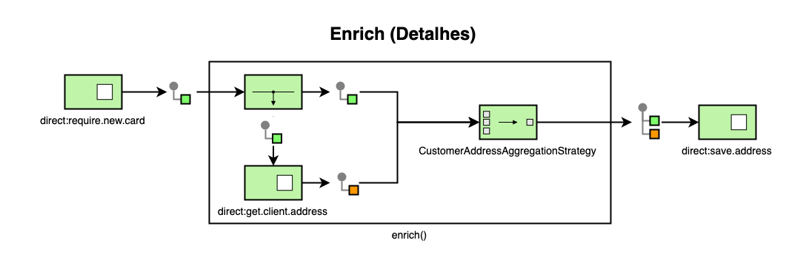

# Enrichment Implementation

Both the use of **beans**, **transform** and **process** to carry out the
transformations are supported by Camel in its most basic package, therefore,
there are few dependencies needed to use these
[EIPs](https://www.enterpriseintegrationpatterns.com/patterns/messaging/).

Minimal dependencies in pom.xml

``` { .xml .copy }
<dependency>
    <groupId>org.apache.camel</groupId>
    <artifactId>camel-core</artifactId>
    <version>${camel-version}</version>
</dependency>
```

camel-core is part of most modules and therefore, as soon as we add these
dependencies (eg **camel-spring-boot-starter, camel-spring-boot,
camel-starter**...) in our project, camel-core will be available.

## Enrichment by DSL enrich()

[enrich()](https://camel.apache.org/components/latest/eips/enrich-eip.html#_content_enrichment_using_enrich_eip)
uses a producer to get the additional data, this producer is obligatorily a
Request Reply, for example to call an external web service.

### Example of enrichment by enrich

``` { .java .copy }
...
CustomerAddressAggregationStrategy aggregationStrategy = new CustomerAddressAggregationStrategy()

from("direct:require.new.card")
  .enrich("direct:get.client.address", aggregationStrategy)
  .to("direct:save.address");

from("direct:get.client.address")
    // Call external service or connect to database
...
```

**enrich()** retrieves additional data by calling the direct:get.client.address
route to enrich an incoming message. An aggregation strategy is used to combine
the original message and the new message coming from the
direct:get.client.address route. The first parameter of the method corresponds
to the original message, the second parameter to the message that will be
aggregated. The final result is sent in the outgoing message which will be
directed to direct:save.address.

Here is an example template for implementing an aggregation strategy:

#### AggregationStrategy implementation example

``` { .java .copy }
public class CustomerAddressAggregationStrategy implements AggregationStrategy {
       public Exchange aggregate(Exchange original, Exchange nova) {
        Customer customer = original.getIn().getBody(Customer.class);
        Address address = nova.getIn().getBody(Address.class);
        customer.setAddress(address);
        if (original.getPattern().isOutCapable()) {
            original.getOut().setBody(customer);
        } else {
            original.getIn().setBody(customer);
        }
        return original;
    }
}
```

It is worth mentioning that for Camel, the use of a strategy is optional if we
do not provide Camel with a strategy, by default it will only use the message
returned in the endpoint, which will return the already enriched data.

#### Enrich example without AggregationStrategy

``` { .java .copy }
...
from("direct:require.new.card")
  .enrich("direct:get.client.address")
  .to("direct:save.address");

from("direct:get.client.address")
...
```

Roughly speaking, what enrich does "under the hood" is similar to what we can
see in the image below:



### Enrichment by DSL transform()

When we have the need to enrich a message in a relatively straightforward way,
Camel provides the DSL **transform()** method, which together with its
expression languages allows us to perform the simplest and fastest
transformations directly in the definition of routes.

Basically, any Camel [expression
language](https://camel.apache.org/manual/latest/expression.html) can be used
inside the transform() DSL, [Simple Expression
Language](https://camel.apache.org/components/latest/languages/simple-language.html) is the
most used expression language, and is even widely used in the examples in the
official documentation.

#### Transform enrichment example

``` { .java .copy }
from("direct:send.new.card")
    .transform().simple(
        "${body.address.street} ${body.address.street} ${body.address.city}\n${body.address.state} ${body.address.country} ${body.address.zip}"
    )
    .to("direct:request.dispatch")
```

In some moments more complex enrichment's may be necessary, for those cases
where **Simple Expression Language** is not enough for a transformation directly
in the DSL, we can use other expression languages ​​supported by Camel for much
more complex transformations and uses. Generally, when it is necessary to choose
a more expressive and powerful language, we can resort to:

* [Groovy](https://camel.apache.org/components/latest/languages/groovy-language.html)
* [SpEL](https://camel.apache.org/components/latest/languages/spel-language.html)
* [MVEL](https://camel.apache.org/components/latest/mvel-component.html)
* [OGNL](https://camel.apache.org/components/latest/languages/ognl-language.html)

> [Simple Expression
> Language](https://camel.apache.org/components/latest/languages/simple-language.html) is part
> of camel-core and covers more than 90% of transformation needs, other
> expression languages may have specific dependencies and may need new
> dependencies in the pom.xml file.

### Enrichment by Bean

To perform per-**bean** enrichment we will take advantage of Camel integration
with the ability to call any method on a **bean** as follows:

#### Bean enrichment example

``` { .java .copy }
from("direct:send.new.card")
    .bean("ClientAddressTransformerBean", "toDispatchAddress")
    .to("direct:request.dispatch")
```

Continuing along the same lines as an example, assuming that the service
(origin) for requesting the issuance of new credit cards needs to create the
shipping request in a logistics service (destination).

### Process Enrichment

Another way that can also be considered to apply the [Content
Enricher](https://camel.apache.org/components/latest/eips/enrich-eip.html) EIP by Camel
is with the use of processors.

#### Example of enrichment by in-line processor

``` { .java .copy }
from("direct:send.new.card")
    .process(new Processor() {
        public void process(final Exchange exchange) throws Exception {
            Customer customer = exchange.getIn().getBody(Customer.class);
            Address address = customer.getAddress();
            StringBuffer sb = new StringBuffer();

            sb.append(address.getStreet());
            sb.append(" ");
            sb.append(address.getNumber());
            sb.append(" ");
            sb.append(address.getCity());
            sb.append("\n");
            sb.append(address.getState());
            sb.append(" ");
            sb.append(address.getCountry());
            sb.append(" ");
            sb.append(address.getZip());
            sb.append(" ");
            exchange.getIn().setBody(sb.toString());
        }
    })
    .to("direct:request.dispatch");
```

!!! warning

    Note that when using a
    [Processor](https://static.javadoc.io/org.apache.camel/camel-core/2.24.2/org/apache/camel/Processor.html)
    in a Camel route, we have to make sure to write it in a safe way, as Camel
    routes can run on concurrent threads and therefore multiple threads can call
    the same
    [Processor](https://static.javadoc.io/org.apache.camel/camel-core/2.24.2/org/apache/camel/Processor.html)
    instance.

The use of the in-line
[processor](https://static.javadoc.io/org.apache.camel/camel-core/2.24.2/org/apache/camel/Processor.html),
that is, directly in the route definition is useful to quickly generate a code
block to perform the most basic transformations, however with the evolution of
the code or even in a refactoring round it is recommended to refactor this block
of code in a separate class that implements the
[Processor](https://static.javadoc.io/org.apache.camel/camel-core/2.24.2/org/apache/camel/Processor.html)
interface.

#### Example of enrichment per processor

``` { .java .copy }
from("direct:send.new.card")
    .process(new ClientToDispatchAddressProcessor())
    .to("direct:request.dispatch");
```

In addition to improving code readability and maintainability, another advantage
of using
[Processor](https://static.javadoc.io/org.apache.camel/camel-core/2.24.2/org/apache/camel/Processor.html)
in a separate class is the possibility of transforming our processors into a
Camel endpoint component since there is a base class called ProcessorEndpoint
that supports the complete Endpoint semantics, given an instance of a Processor.
So we just need to create a
[Component](https://camel.apache.org/manual/latest/component.html) class
deriving from
[DefaultComponent](https://static.javadoc.io/org.apache.camel/camel-core/2.24.2/org/apache/camel/impl/DefaultComponent.html)
that returns instances of
[DefaultComponent](https://static.javadoc.io/org.apache.camel/camel-core/2.24.2/org/apache/camel/impl/DefaultComponent.html).
For more details, see Camel's documentation on [creating
components](https://camel.apache.org/manual/latest/writing-components.html).

### Template transformations

Another little-used possibility that can also be used with Camel is
**Templating** to consume a message and transform it into another format using
[Velocity](https://camel.apache.org/components/latest/velocity-component.html)
to then send it to another destination.

#### Template enrichment example

``` { .java .copy }
from("direct:send.new.card")
    to("velocity:br/com/santander/card/DispatchAddress.vm")
    .to("direct:request.dispatch")
```

#### DispatchAddress.vm

``` { .java .copy }
${body.address.street} ${body.address.street} ${body.address.city}
${body.address.state} ${body.address.country} ${body.address.zip}
```

## References

### EIP

1. [Content
   Enricher](https://www.enterpriseintegrationpatterns.com/patterns/messaging/DataEnricher.html)
2. [Message
   Translator](https://www.enterpriseintegrationpatterns.com/patterns/messaging/MessageTranslator.html)

### Groovy

1. [About Groovy](https://groovy-lang.org/)
2. [About language](https://en.wikipedia.org/wiki/Apache_Groovy)

### SpEL - Spring Expression Language

1. [SpEL](https://docs.spring.io/spring/docs/4.3.10.RELEASE/spring-framework-reference/html/expressions.html)

### Others

1. [AggregationStrategy](https://static.javadoc.io/org.apache.camel/camel-core/2.24.2/org/apache/camel/processor/aggregate/AggregationStrategy.html)
