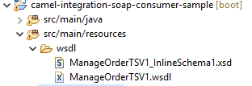
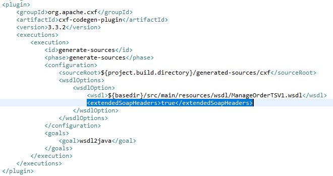
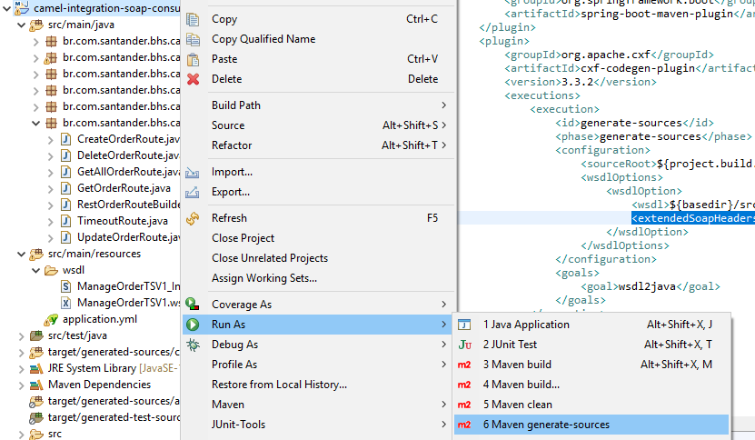
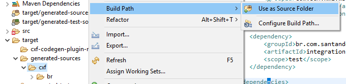

# SOAP Integration Implementation

This guide aims to guide the patterns of integration with SOAP with good
practices and techniques of [EIP (Enterprise Integration
Patterns)](https://www.enterpriseintegrationpatterns.com/){:target="_blank"} for integrations.

For integration with SOAP we will use the [CXF resource with Apache
Camel](https://camel.apache.org/components/4.0.x/cxf-component.html){:target="_blank"}.

Remembering that it is necessary to use the archetype of the integration
architecture for the initial creation of the projects. Follow: [Arsenal Integration Rest Archetype](../../tutorials/archetype-rest.md)

## Project Dependencies

Below are the necessary dependencies to use SOAP resources for integration:

``` { .xml .copy }
<dependency>
    <groupId>org.apache.camel.springboot</groupId>
    <artifactId>camel-cxf-soap-starter</artifactId>
</dependency>
```

## Adding a WSDL file to the project

Now let's add a WSDL file that represents our SOAP integration through a Web
Service, it will be responsible for providing us with information and generating
the necessary Stubs for the integration. The WSDL file must be added inside the
resource structure in a folder called wsdl, as shown below:

``` {}
resources
   ├──wsdl
```

The image below shows how this structure looks in the example:



## Generating the SOAP web-service client

After adding the WSDL file, we need to configure a Generate Sources Plugin for
CXF to generate the client that the project needs to call Web Services.

Inside the &lt;build> tag in the pom.xml file add the following Plugin:

``` { .xml .copy }
<plugin>
   <groupId>org.apache.cxf</groupId>
   <artifactId>cxf-codegen-plugin</artifactId>
   <version>${apache-camel.version}</version>
   <executions>
      <execution>
         <id>generate-sources</id>
         <phase>generate-sources</phase>
         <configuration>
            <wsdlOptions>
               <wsdlOption>
                  <wsdl>src/main/resources/wsdl/{Nome_Do_Arquivo_Wsdl}.wsdl</wsdl>
                  <wsdlLocation>classpath:wsdl/{Nome_Do_Arquivo_Wsdl}.wsdl</wsdlLocation>
                  <extendedSoapHeaders>true</extendedSoapHeaders> <!-- Caso seu wsdl tenha objetos a serem passados via header deixe esse atributo como true -->
               </wsdlOption>
            </wsdlOptions>
         </configuration>
         <goals>
            <goal>wsdl2java</goal>
         </goals>
      </execution>
   </executions>
</plugin>
```

You must change the {Name_Of_File_Wsdl} to the name of the file referring to
your integration.

Below the image illustrates how the example is:



Once this is done, we need to run a command in maven to generate the code for
the client calling SOAP:

``` { .bash .copy }
mvn generate-sources
```

You can use the IDE itself to run the command, as shown in the figure below:



After executing this command, the result will be found inside the target folder
according to the structure below:

``` { .unix }
target
|   ├──generated-sources
|   |   ├──cxf
```

Then add the generated folder to your build path



These generated classes will be used to assemble requests with the Web Service.

Building the Processor's for data transformation of the request and response of
the Web Service Every call via SOAP needs a request object and returns another
response object, objects that are generated from the wsdl, in this case we will
create two processors, one to add to the exchange body the request object of the
SOAP **createOrder** action (**CreateOrderRequest**) and another processor to
retrieve information from the web service response object and transform it into
the return object of the rest resource. The Processor's must be added within the
processor package and must have their nomenclature with this taxonomy
ClassName**Processor**, their implementations must be with the patterns and
structures shown below:

### **TransformCreateOrderRequestProcessor (Class created to transform input object from REST resource to input object requested by SOAP service)**

``` { .java .copy }
package br.com.santander.bhs.caml.soap.integration.processor;

import org.apache.camel.Exchange;
import org.apache.camel.Processor;

import br.com.santander.bhs.caml.soap.integration.model.dto.OrderDTO;
import br.com.santander.services.manageorder.v1.CreateOrderRequest;

public class TransformCreateOrderRequestProcessor implements Processor{

    @Override
    public void process(Exchange exchange) throws Exception {
        CreateOrderRequest createOrderRequest = new CreateOrderRequest();
        OrderDTO orderBody = exchange.getMessage().getBody(OrderDTO.class);

        createOrderRequest.setTitle(orderBody.getTitle());
        createOrderRequest.setDescription(orderBody.getDescription());

        exchange.getMessage().setBody(createOrderRequest, CreateOrderRequest.class);
    }

}
```

### **TransformCreateOrderResponseProcessor (Class created to transform SOAP service response object to REST resource response object)**

``` { .java .copy }
package br.com.santander.bhs.caml.soap.integration.processor;

import org.apache.camel.Exchange;
import org.apache.camel.Processor;

import br.com.santander.bhs.caml.soap.integration.model.dto.OrderDTO;
import br.com.santander.services.manageorder.v1.CreateOrderResponse;
import br.com.santander.services.manageorder.v1.OrderType;

public class TransformCreateOrderResponseProcessor implements Processor{

    @Override
    public void process(Exchange exchange) throws Exception {
        OrderDTO orderResponse = new OrderDTO();
        CreateOrderResponse orderBody = exchange.getMessage().getBody(CreateOrderResponse.class);

        if (orderBody.getOrder() != null && orderBody.getOrder().getId() != null) {
            OrderType order = orderBody.getOrder();
            orderResponse.setId(order.getId().intValue());
            orderResponse.setTitle(order.getTitle());
            orderResponse.setDescription(order.getDescription());
        }


        exchange.getMessage().setBody(orderResponse, OrderDTO.class);
    }

}
```

### Building Router for Integration

We will now create a route to effectively consume the SOAP service and use the
two processors created earlier. Every router must be inside the router package
and its taxonomy must be NomeDaClasseRouter, this class must extend the standard
Apache Camel class called RouteBuilder, so we will have to implement the
configure() method that is responsible for configuring the routes and
integration patterns .

``` { .java .copy }
package br.com.santander.bhs.caml.soap.integration.route;

import org.apache.camel.Exchange;
import org.apache.camel.builder.RouteBuilder;
import org.apache.camel.component.cxf.common.message.CxfConstants;
import org.springframework.http.HttpStatus;
import org.springframework.http.MediaType;
import org.springframework.stereotype.Component;

import br.com.santander.bhs.caml.soap.integration.processor.TransformCreateOrderRequestProcessor;
import br.com.santander.bhs.caml.soap.integration.processor.TransformCreateOrderResponseProcessor;
import br.com.santander.bhs.caml.soap.integration.processor.TransformSoapFaultProcessor;
import br.com.santander.services.manageorder.v1.ManageOrderFault_Exception;

/**
 * CreateOrderRoute
 */
@Component
public class CreateOrderRoute extends RouteBuilder {

    @Override
    public void configure() throws Exception {
        CamelContext camelContext = getContext();
        CxfEndpoint manageOrderEndpoint = new CxfEndpoint();
        manageOrderEndpoint.setAddress("http://localhost:8090/ManageOrderTSV1");
        manageOrderEndpoint.setServiceClass(ManageOrderTSV1.class);
        manageOrderEndpoint.setCamelContext(camelContext);
        manageOrderEndpoint.setDataFormat(DataFormat.POJO);
        camelContext.addEndpoint("manageOrderEndpoint", manageOrderEndpoint);

        from("direct:create")
            .routeId("order-create")
            .hystrix()
                .to("direct:create-backend")
            .onFallback()
                .to("direct:timeout")
            .end();

        from("direct:create-backend")
            .routeId("order-create-backend")
            .doTry()
                .process(new TransformCreateOrderRequestProcessor())
                .removeHeaders("*")
                .setHeader(CxfConstants.OPERATION_NAME, constant("createOrder"))
                .to(manageOrderEndpoint)
                    .id("createOrderEndpoint")
                .process(new TransformCreateOrderResponseProcessor())

                .setHeader(Exchange.CONTENT_TYPE, constant(MediaType.APPLICATION_JSON_VALUE))
                .setHeader(Exchange.HTTP_RESPONSE_CODE, constant(HttpStatus.OK.value()))
            .doCatch(ManageOrderFault_Exception.class)
                .process(new TransformSoapFaultProcessor())
            .end();
    }
}
```

Processor code for handling exceptions coming from the SOAP service.

**TransformSoapFaultProcessor**:

``` { .java .copy }
package br.com.santander.bhs.caml.soap.integration.processor;

import org.apache.camel.Exchange;
import org.apache.camel.Processor;import org.springframework.http.MediaType;

import br.com.santander.bhs.caml.soap.integration.model.dto.ErrorResponseDTO;
import br.com.santander.services.manageorder.v1.ManageOrderFault_Exception;

public class TransformSoapFaultProcessor implements Processor {

    @Override
    public void process(Exchange exchange) throws Exception {
        final Exception exception = exchange.getProperty(Exchange.EXCEPTION_CAUGHT, Exception.class);

        ManageOrderFault_Exception ex = null;

        if (exception instanceof ManageOrderFault_Exception) {
            ex = (ManageOrderFault_Exception) exception;
            ErrorResponseDTO error = new ErrorResponseDTO();
            error.setMessage(ex.getMessage());

            exchange.getMessage().setBody(error);
        }

        exchange.getMessage().setHeader(Exchange.CONTENT_TYPE, MediaType.APPLICATION_JSON_VALUE);

    }
}
```

## References

1. [CXF-Component](https://camel.apache.org/components/4.0.x/cxf-component.html){:target="_blank"}
2. [EIP](https://www.enterpriseintegrationpatterns.com/){:target="_blank"}
3. [maven-cxf-codegen-plugin-wsdl-to-java](https://cxf.apache.org/docs/maven-cxf-codegen-plugin-wsdl-to-java.html){:target="_blank"}
4. [Processor](https://camel.apache.org/manual/latest/processor.html){:target="_blank"}
5. [try-catch-finally](https://camel.apache.org/manual/latest/try-catch-finally.html){:target="_blank"}
