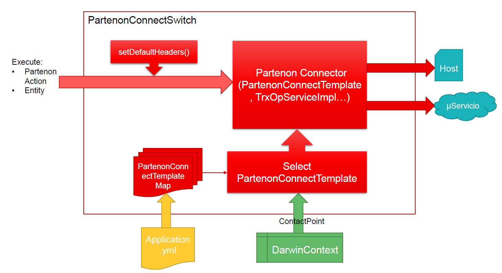
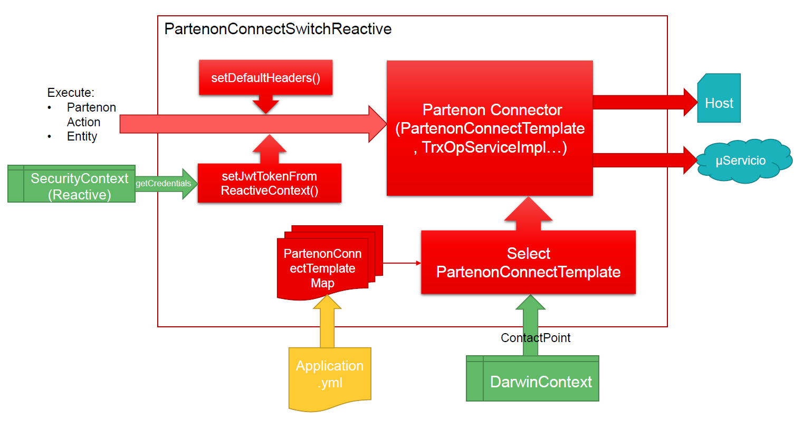
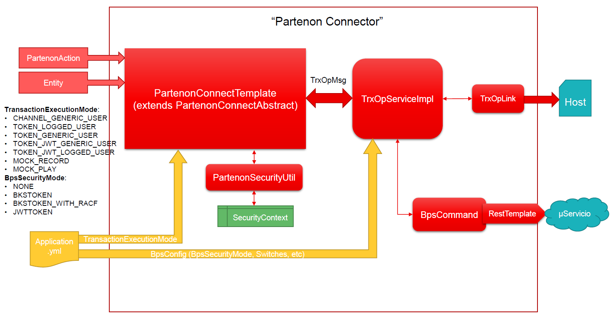
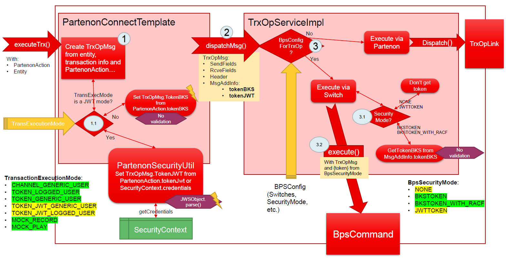
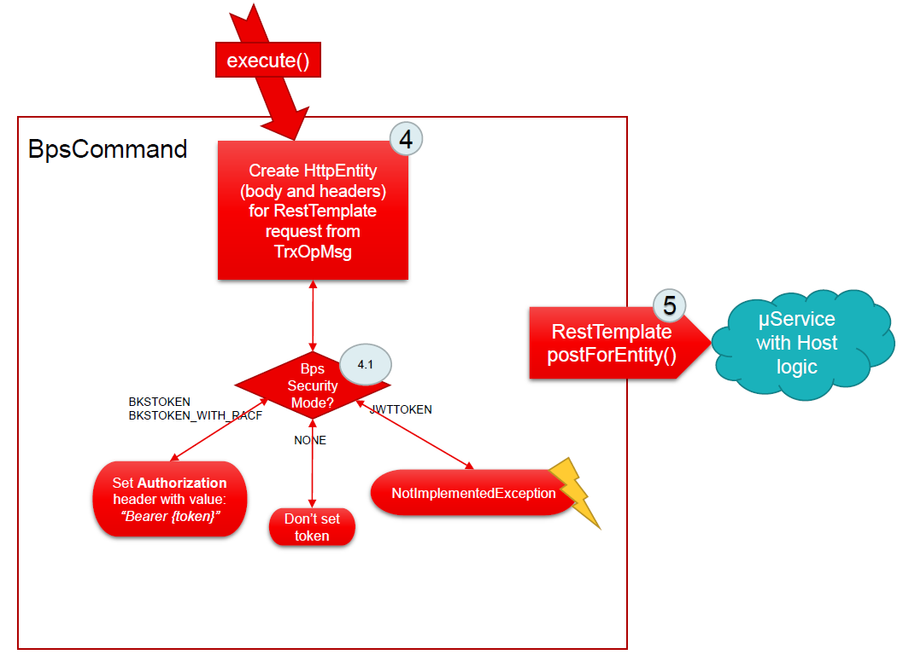

# Darwin Spring Boot Partenon 

 

## Description

The Partenon library extends [SpringBoot Partenon Connector](https://santandernet.sharepoint.com/sites/SEPBKSCCA/SitePages/Annexes/Documentation/Spring%20Libraries%20Documentation/Partenon%20TrxOp%20Spring%20Connector%20-%20User%20Manual.aspx),
adding new functionalities such as: connector configuration (destination host, port, etc) depending on the channel or adapting it for reactive environments.

## Functionality

`Darwin Spring Boot` auto-configuration will detect the type of application it is running in,
autoconfiguring only those functionalities that apply to that environment.

Visit the [Darwin Flavours section](../../ABOUT.md#darwin-flavours)
to get more info about how to work the application type detection.

The `Darwin Spring Boot Partenon` library provides the following functionalities depending on the application type:

### Servlet Applications

The following is added to all the functionality of the Partenon Connector SpringBoot library:

#### Connectors associated to a channel

- It is allowed \* to configure several Partenon connectors associated to a channel \* from the application properties.

#### Default connector

- It is allowed to configure a \* default connector \* from the application properties that will be used when we do not define other connectors or when there is not one associated with the current channel.

#### PartenonConnectOperations implementation

- A *Bean* of the `PartenonConnectSwitch` class is exposed, which implements the\` PartenonConnectOperations\` interface (replacing the one exposed by the original library). This *Bean* will use the Connector corresponding to the channel found in
    the `DarwinContext` (or the default connector) to execute the transaction in a totally transparent way to the project.

#### Partenon headers with default values servlet

- Before carrying out any transaction, the following headers of the PartenonAction object are initialized with default values **if they were not already defined** in it:

    - **INTERNETUSER**: for **non-contact channels** the **userId** of the authenticated token is assigned in the SecurityContext.

    - **LOGICALCHANNEL**: the value of the **logical channel** corresponding to the ContactPoint of the DarwinContext is assigned.

    - **PHYSICALCHANNEL**: the value of the **physical channel** corresponding to the ContactPoint of the DarwinContext is assigned if the property *physicalChannel* had not been configured for the connector.

    - **TOKEN1**: the value of **traceId** from TracerContext when Spring Cloud Sleuth is loaded, which groups all calls that are used to respond to a request.

    - **TOKEN2**: the value of **spanId** from TracerContext when Spring Cloud Sleuth is loaded, which identifies a particular execution.

!!! info "Important"

    Headers will be added in **all** transactions. The methods that do not include a PartenonAction in their parameters will create an object of this class only with these headers to finally carry out the transaction.

!!! note

    The TOKEN1 and TOKEN2 headers were initialized in the original Partenon library with the values of *X-B3-TraceId* and *X-B3-SpanId* from MDC, but from Spring Cloud Sleuth 3.0 these fields doesn't exist.

### Reactive applications

As in the previous type of application, in Reactive applications the following functionality is added:

#### Connectors associated to a channel

- Same functionality as in `Servlet` applications.

#### Default connector

- Same functionality as in `Servlet` applications.

#### Implementation of PartenonConnectOperationsReactive

- It exposes a *Bean* of the `PartenonConnectSwitchReactive` class, which implements the\` PartenonConnectOperationsReactive\` interface with functionality fully equivalent to **PartenonConnectSwitch**. This *Bean* will use the Connector
    corresponding to the channel found in the `DarwinContext` (or the default connector) to execute the transaction in a completely transparent way to the project.

!!! note

    The PartenonConnectOperationsReactive interface defines the same methods as its PartenonConnectOperations counterpart, but in this case it returns a *stream* of Mono with the object type of the response.

- The use of the Connector also incorporates the functionality of retrieving, from the reactive context, the **JWT** token as in the `Servlet` applications, when the *executionMode* property is any of the following types: *TOKEN\_JWT\_LOGGED\_USER
    or TOKEN\_JWT\_GENERIC\_USER*.

!!! note

    This functionality is available from version *2.11.0-RELEASE* thanks to the incorporation of the reactive implementation of **TokenService** defined in [Authentication
    library](../darwin-spring-boot-security-authentication/README.md#reactive-application).

#### Partenon headers with default values reactive

- Same functionality as in `Servlet` applications

### NotWeb Applications

This type of application will have the same functionalities through the *Beans* of the two previous types of application (Servlet and Reactive), so that the project can choose which implementation to use.

However, to achieve some of these functionalities it will be necessary to work with the contexts previously. Below are some [Executing a transaction in NotWeb applications](#executing-a-transaction-in-notweb-applications).

### Limitations

Currently, the use of partenon connector using JMS and MQSeries is not thread safe,
so it is not supported by this wrapper.
In case you want to use Partenon using JMS and MQSeries please add the dependency directly,
instead of using this wrapper:

```xml
<dependency>
    <groupId>com.santander.serenity.corporate.data</groupId>
    <artifactId>partenon-spring-boot-autoconfigure</artifactId>
</dependency>
```

## Installation and configuration

To add the library to any project, include the maven dependency of its starter in the `pom.xml` file:

    <dependency>
        <groupId>com.santander.darwin</groupId>
        <artifactId>darwin-spring-boot-starter-partenon</artifactId>
    </dependency>

!!! note

    From version *2.11.0-RELEASE* the **Darwin Spring Boot Starter Authentication** is imported automatically.

### Configuration

<!tag:properties>

| Name                      | Default value | Mand. | Description                                                                 | Supported values                                                       |
|---------------------------|---------------|-------|-----------------------------------------------------------------------------|------------------------------------------------------------------------|
| darwin.partenon           | N/A           | No    | Map with possible channels and their corresponding connections to Partenon. | Mapa                                                                   |
| darwin.partenon.{channel} | N/A           | No    | Properties of the Partenon connector associated with that **channel**.      | [PartenonConnectProperties](https://santandernet.sharepoint.com/sites/SEPBKSCCA/SitePages/Annexes/Documentation/Spring%20Libraries%20Documentation/Partenon%20TrxOp%20Spring%20Connector%20-%20User%20Manual.aspx#3.2-application-properties) |
| darwin.partenon.default   | N/A           | No    | Default Partenon connector properties.                                      | [PartenonConnectProperties](https://santandernet.sharepoint.com/sites/SEPBKSCCA/SitePages/Annexes/Documentation/Spring%20Libraries%20Documentation/Partenon%20TrxOp%20Spring%20Connector%20-%20User%20Manual.aspx#3.2-application-properties) |

<!end:properties>

!!! tip "Caution"

    In Partenon connectors, default values are established for most of their properties. Therefore, if you do not define any of these properties, they will take their default value, these can be seen in
    [PartenonConnectProperties](https://santandernet.sharepoint.com/sites/SEPBKSCCA/SitePages/Annexes/Documentation/Spring%20Libraries%20Documentation/Partenon%20TrxOp%20Spring%20Connector%20-%20User%20Manual.aspx#3.2-application-properties)

### Darwin Partenon property settings

The minimum that can be configured is a default connector that will be applied regardless of the channel, under the `darwin.partenon.default` property:

    darwin:
      partenon:
        default:
          host: dbd4.isban.dev.corp
          port: 5102
          executionMode: CHANNEL_GENERIC_USER

!!! info "Important"

    In the Darwin Partenon properties you must define **at least** the `host` and the\` port\` **of each connector**.

#### Channel setup and complete

Instead of wanting a single connector, we can define different configurations depending on the channel:

    darwin:
      partenon:
        INT:
          host: dbd4.isban.dev.corp
          port: 5102
          executionMode: CHANNEL_GENERIC_USER
        OFI:
          host: dbd1.isban.dev.corp
          port: 5102
          hostForToken: dbd1s.isban.dev.corp
          portForToken: 5145
          executionMode: TOKEN_GENERIC_USER

!!! warning

    With the configuration like the previous one: if we execute a transaction with a channel other than the ones we have configured or without a channel **an exception will be thrown**, because **there will be no associated
    connector**.

Along with the channel configuration we can also add a default connector, which will be used when the channel is different from those configured or the channel has not been defined:

    darwin:
      partenon:
        INT:
          host: dbd4.isban.dev.corp
          port: 5102
          executionMode: CHANNEL_GENERIC_USER
        OFI:
          host: dbd1.isban.dev.corp
          port: 5102
          hostForToken: dbd1s.isban.dev.corp
          portForToken: 5145
          executionMode: TOKEN_GENERIC_USER
        default:
          host: dbd4.isban.dev.corp
          port: 5102
          executionMode: CHANNEL_GENERIC_USER

### Original Partenon configuration

**For backward compatibility** with the original Partenon library, the possibility of configuring a connector from its properties with the new functionality has been maintained:

    partenon:
      host: dbd4.isban.dev.corp
      port: 5102
      executionMode: CHANNEL_GENERIC_USER

!!! info "Important"

    If the properties of Darwin Partenon and the original Partenon library are defined, **only those of Darwin Partenon** will be used to configure the connectors.

!!! tip "Caution"

    This setting may be deprecated in future versions of the Darwin SpringBoot framework, so **we recommend using Darwin** properties instead.

## Native compilation support

This library can be used on micros that are compiled to a native image with graalvm native.

### Support for third party libraries

Added native compilation support for *Partenon* library in the Darwin framework.

!!! warning

    This support is limited to the functionality used in Darwin tests, projects using these dependencies may need to add more hints for proper operation.

## Exposed API

| Name                                                                                                                                                                                                                       | Type                              | Description                                                                                                                | Application type                          |
|----------------------------------------------------------------------------------------------------------------------------------------------------------------------------------------------------------------------------|-----------------------------------|----------------------------------------------------------------------------------------------------------------------------|-------------------------------------------|
| [PartenonConnectSwitch](https://gluon.dev.corp/microservices/docs/darwin-spring-boot/6.3.4/apidocs/com/santander/darwin/partenon/connector/PartenonConnectSwitch.html)                 | PartenonConnectOperations         | Component that will act as a "switch" to use the Partenon Connector corresponding to the channel at that moment.           | <ul><li>NotWeb</li><li>Servlet</li></ul>  |
| [PartenonConnectSwitchReactive](https://gluon.dev.corp/microservices/docs/darwin-spring-boot/6.3.4/apidocs/com/santander/darwin/partenon/connector/PartenonConnectSwitchReactive.html) | PartenonConnectOperationsReactive | Reactive adaptation that will act as a "switch" to use the Partenon Connector corresponding to the channel at that moment. | <ul><li>NotWeb</li><li>Reactive</li></ul> |

## Darwin - Partenon Connector

The Darwin Spring Boot Partenon module extends the functionality provided by the original Partenon Connector, in this section we will explain in more detail the integration that has been done and the behavior of the connector for certain cases.

### Integration model

The **integration model between Darwin's library and the Partenon Connector** is as follows:



As we can see, Darwin's `PartenonConnectSwitch` component wraps the Partenon Connector (with all the pieces that compose it: PartenonConnectTemplate, TrxOpServiceImpl) adding the [functionalities indicated above](#functionality): add headers by
default, be able to configure several connectors depending on the ContactPoint channel, etc.

The integration **maintains the interface and outputs** of the connector: a PartenonAction and an input *Entity* object, and the outputs to Host or microservice (MPS) to execute the operation.

Also, for reactive applications, the `PartenonConnectSwitchReactive` includes the functionality to **inject the JWT token from the reactive SecurityContext**:

!!! note

    [Later](#injection-of-the-token-to-be-propagated) this functionality is explained in detail.



### Security Token Management for Partenon and MPS in Partenon Connector

The Partenon Connector currently allows you to configure its **execution against Host or against a microservice** that implements the same logic (MPS). For the extraction and management of the security tokens in the Partenon Connector, several
components intervene depending on the type of execution configured.

!!! info "Important"

    All the functionality explained below is specific to the Partenon Connector. Darwin integration manages to extend this functionality without affecting the original.

In the following image we see a diagram of the main parts for this process:



The `PartenonConnectTemplate` **(1)** is the component in charge of initializing the\` TrxOpMsg\` object in which it will include all the transaction information, including the security token. The type of token and the way it is retrieved will
depend on the execution mode (\* TransactionExecutionMode **) that has been configured for the connector through the `executionMode` \*(1.1)** property:

- For **modes with JWT token** (*TOKEN\_JWT\_GENERIC\_USER*, *TOKEN\_JWT\_LOGGED\_USER*): it will use the `PartenonSecurityUtil` class to introduce in the TrxOpMsg the attribute **tokenJwt of the PartenonAction** object, and if the credentials do
    not exist, it will try to retrieve them from the\` SecurityCondence\` from the `SecurityCondence` spring.

!!! info "Important"

    The PartenonSecurityUtil class **is not prepared to retrieve the credentials from the reactive context**; however, Darwin's `PartenonConnectSwitchReactive` class manages to replicate this functionality.

!!! warning

    If it does not find the token or the value of the credentials of the SecurityContext does not correspond to a JWT token, a **PartenonMessageProcessException** will be thrown.

- For the **rest of the modes** (*CHANNEL\_GENERIC\_USER*, *TOKEN\_LOGGED\_USER*, *TOKEN\_GENERIC\_USER*, *MOCK\_RECORD* and *MOCK\_PLAY*): it will try to introduce in the TrxOpMsg the **tokenBks attribute of the PartenonAction object**.

!!! info "Important"

    From the connector **a validation of the type or content of the tokenBKS** is not performed, therefore the project will be in charge of controlling the value entered.

!!! warning

    If the token cannot be found and a **token mode** (*TOKEN\_LOGGED\_USER* or *TOKEN\_GENERIC\_USER*) has been configured, a **PartenonMessageProcessException** will be thrown.



Once the TrxOpMsg message has been correctly formed with the information of the operation (transaction, I / O fields, headers, etc.) and **the token retrieved according to the execution mode** (tokenBks or tokenJwt), it will pass it to the
`TrxOpServiceImpl` to send it to the configured destination (Partenon host or microservice) **(2 and 3)**:

- **If there is no BPS \*configuration for the transaction, then it will continue with the usual execution against Partenon using a \*TrxOpLink**.

- **If there is a BPS** configuration for the transaction: it will be executed via switch, previously retrieving the necessary token from the message according to the `securityMode` of the BPS configuration **(3.1)**:

    - **BKS modes** (*BKSTOKEN* and *BKSTOKEN\_WITH\_RACF*): retrieves the BKS token that was entered in the additional information of the TrxOpMsg.

    - **Rest of modes** (*NONE* and *JWTTOKEN*): does not retrieve any token.

Execution will continue with the `BpsCommand` **(3.2)** class, passing it the message with all the information and the token retrieved in the previous step (it can be null).

This class will be in charge of preparing the request for the RestTemplate **creating an HttpEntity from the TrxOpMsg** **(4)** and making the POST to the microservice that replicates the Host logic.



During the creation of the HttpEntity, the header ***Authorization*** will be added according to the BPS security mode (BpsSecurityMode) configured **(4.1)**:

- **BKS modes** (*BKSTOKEN* and *BKSTOKEN\_WITH\_RACF*): the *Authorization* header will be added with the value ***Bearer {token}***, where *{token}* is the value retrieved from the message in the TrxOpServiceImpl.

- **NONE mode**: it is a non-security mode, so it will not add the header.

- **JWTTOKEN mode**: This security mode is not yet implemented (no token is retrieved for this mode in the above class). Setting this mode for BPS will **always** throw a `NotImplementedException` at this point.

Finally, the request will be sent through RestTemplate to execute the transaction against the configured microservice) **(5)**.

## Gluon Partenon Maven-Plugin

The [Gluon Java Partenon Maven-Plugin](https://gluon.gs.corp/community/docs/latest/components/software/backend/java/darwin/framework/plugins/partenon-plugin/)
is a code generator that creates all necessary sources (a service and request/response transaction POJOs) from configuration
to call Partenon transactions in a Darwin microservice.

Together with this plugin, you still need to configure the [Partenon properties](#configuration) to configure your connections
to Partenon and inject the generated @Service in your application.

## Use cases

### Executing a transaction in Servlet applications

In Web Servlet application environments we must inject a *Bean* from the `PartenonConnectOperations` interface **as it would be done with the original library**:

    import com.santander.serenity.banksphere.data.partenon.autoconfigure.core.PartenonConnectOperations;
    ...

    @Autowired
    PartenonConnectOperations partenonConnect;

Darwin's library will have replaced the original *Bean* with the `PartenonConnectSwitch` implementation, but we can still use any of the original Partenon Connector methods:

    <T> T executeTrx(PartenonAction action, Object entity, Class<T> responseType);

    <T> T executeTrx(Object entity, Class<T> responseType);

    <T> TrxOpResponse<T> executeTrxWithHeader(PartenonAction action, Object entity, Class<T> responseType);

    <T> TrxOpResponse<T> executeTrxWithHeader(Object entity, Class<T> responseType);

For the following examples, we assume that the ***TrxBPG8*** and ***TrxBPG8Result*** classes have been created with annotations from the original Partenon library (*@PartenonBean*, *@PartenonFields*, etc.) to represent the transaction and result
information respectively.

The following lines of code will serve as an example of execution :

    TrxBPG8 inputTrx = new TrxBPG8("0049", "001", "001");

    TrxBPG8Result result = partenonConnect.executeTrx(inputTrx, TrxBPG8Result.class);

!!! info "Important"

    If a connector associated with the current channel has not been found and there is no default connector, the execution will return a value **null**.

!!! note

    Complete examples of transactions with the definition of classes and the use of these methods can be found in [Darwin Samples:
    Partenon](https://github.com/santander-group-shared-assets/gln-back-darwin-java-samples/tree/develop/partenon)

### Executing a transaction in Reactive applications

In Web Reactive applications we must inject a *Bean* from the `PartenonConnectOperationsReactive` interface:

    import com.santander.darwin.partenon.connector.PartenonConnectOperationsReactive;
    ...

    @Autowired
    PartenonConnectOperationsReactive partenonConnectReactive;

The methods that we can use are the same as in Servlet environments, only that they generate a *Mono* of the expected type:

    <T> Mono<T> executeTrx(PartenonAction action, Object entity, Class<T> responseType);

    <T> Mono<T> executeTrx(Object entity, Class<T> responseType);

    <T> Mono<TrxOpResponse<T>> executeTrxWithHeader(PartenonAction action, Object entity, Class<T> responseType);

    <T> Mono<TrxOpResponse<T>> executeTrxWithHeader(Object entity, Class<T> responseType);

Again, we assume that we have the same entities that have been used in the previous example (***TrxBPG8*** and ***TrxBPG8Result***). An example of execution would be the following:

    TrxBPG8 inputTrx = new TrxBPG8("0049", "001", "001");

    partenonConnectReactive.executeTrx(inputTrx, TrxBPG8Result.class)
                .map(result -> {
                    ...
                });

!!! info "Important"

    If a connector associated with the current channel has not been found and there is no default connector, the execution will return a Mono.*empty()*.

!!! note

    Complete examples of transactions with the definition of classes and the use of these methods can be found in [Darwin Samples:
    Partenon](https://github.com/santander-group-shared-assets/gln-back-darwin-java-samples/tree/develop/partenon)

### Executing a transaction in NotWeb applications

In `NotWeb` applications we will have the two *beans* used previously to be able to make use of the reactive implementation (`PartenonConnectOperationsReactive`) and/or the non-reactive implementation (`PartenonConnectOperations`).

It should be noted that in this type of application **we do not have the filters that are responsible for filling in the Darwin contexts** (with the ContactPoint) and Security (with the authenticated user), necessary for certain functionalities that
are offered.

!!! info "Important"

    If we do not have information in these contexts, the functionality will be the following: **use the default connector** (if it has been defined) and **do not set any header by default**.

Below are examples in which these contexts are populated to achieve all the expected performance.

#### Contexts in non-reactive environments

To add to the **DarwinContext** the **ContactPoint** object corresponding to the desired channel, we must follow the same steps defined in this [Omnichannel library
example](https://gluon.dev.corp/microservices/docs/darwin-spring-boot/6.3.4/darwin-project/darwin-spring-boot-omnichannel/), and once the `DarwinContextHolder` finish executing the transaction:

    ...
    DarwinContextHolder.getCurrentContext().setContactPoint(cp);

    TrxBPG8 inputTrx = new TrxBPG8("0049", "001", "001");

    // Now you can retrieve the ContactPoint from the DarwinContextHolder
    TrxBPG8Result result = partenonConnect.executeTrx(inputTrx, TrxBPG8Result.class);

To now add an **Authentication** object with the user to the **SecurityContext**,
follow the steps defined in this [Security library example](../darwin-spring-boot-security-authentication/README.md#how-to-use-security-services-in-notweb-applications) using
the *NotWeb* security service to authenticate a token and then include a SecurityContext with that Authentication object in the `SecurityContextHolder`:

    ...
    Authentication resultToken = securityManagerService.authenticate("token");
    ...

    SecurityContext securityContext = new SecurityContextImpl(resultToken);
    SecurityContextHolder.setContext(securityContext);

    TrxBPG8 inputTrx = new TrxBPG8("0049", "001", "001");

    // Now you can retrieve the userId from the SecurityContext
    TrxBPG8Result result = partenonConnect.executeTrx(inputTrx, TrxBPG8Result.class);

#### Contexts in reactive environments

To fill in the contexts in reactive environments, although we will use similar pieces to those in non-reactive environments, we must make sure to do so in the subscription of the stream that needs it or that we are going to propagate.

To add to the **DarwinContext** the **ContactPoint** object corresponding to the desired channel,
we must follow the same steps defined [example of the Omnichannel library](https://gluon.dev.corp/microservices/docs/darwin-spring-boot/6.3.4/darwin-project/darwin-spring-boot-omnichannel/#how-to-retrieve-the-channel-from-the-darwincontext),
to finish executing the transaction by adding to the Context the DarwinContext with `ReactiveDarwinContextHolder`:

    ...
    Mono<DarwinContext> darwinContextMono = Mono.just(darwinContext);

    TrxBPG8 inputTrx = new TrxBPG8("0049", "001", "001");

    // Now you can retrieve the ContactPoint from the DarwinContextHolder
    partenonConnectReactive.executeTrx(inputTrx, TrxBPG8Result.class)
            .map(result -> ...)
            .suscriberContext(ReactiveDarwinContextHolder.withDarwinContext(darwinContextMono));

To now add an **Authentication** object with the user to the **SecurityContext**, follow the steps defined in this [Security library example](../darwin-spring-boot-security-authentication/README.md#how-to-use-security-services-in-notweb-applications)
using the reactive *NotWeb* security service to authenticate a token and later execute the transaction adding the SecurityContext to the context with `ReactiveSecurityContextHolder`:

    TrxBPG8 inputTrx = new TrxBPG8("0049", "001", "001");

    Mono.just("TokenStringValue")
            .flatmap(stringToken ->
                securityManagerService.authenticate(stringToken))
            .filter(Authentication::isAuthenticated)
            .flatMap(authToken->
                partenonConnectReactive.executeTrx(inputTrx, TrxBPG8Result.class)
                .map(result -> ...)
                .contextWrite(ReactiveSecurityContextHolder.withAuthentication(authToken))
            );

### Overriding default values in Partenon headers

Headers are initialized by default **only if they had not been previously defined**. Therefore, all that would be required to override those values is to define them in the PartenonAction before executing the transaction.

In the execution of the previous examples all the headers would have the [Partenon headers with default values servlet](#partenon-headers-with-default-values-servlet). If we wanted to define another value for the **INTERNETUSER** header:

- ***Servlet environments***

<!-- -->

    PartenonAction partenonAction = new PartenonAction.PartenonActionBuilder()
        .addInfo(KeyRequestHeaders.INTERNETUSER, "user1").build();

    TrxBPG8 inputTrx = new TrxBPG8("0049", "001", "001");

    TrxBPG8Result result = partenonConnect.executeTrx(partenonAction, inputTrx, TrxBPG8Result.class);

- ***Reactive environments***

<!-- -->

    PartenonAction partenonAction = new PartenonAction.PartenonActionBuilder()
        .addInfo(KeyRequestHeaders.INTERNETUSER, "user1").build();

    TrxBPG8 inputTrx = new TrxBPG8("0049", "001", "001");

    partenonConnectReactive.executeTrx(partenonAction, inputTrx, TrxBPG8Result.class)
                .map(result -> {
                    ...
                });

In this way, the values of the headers would be:

- INTERNETUSER: "user1".

- LOGICALCHANNEL: value of the logical channel corresponding to the ContactPoint of the DarwinContext.

- PHYSICALCHANNEL: value of the physical channel corresponding to the ContactPoint of the DarwinContext.

### Token propagation for requests with MPS (*Microservice Partenon Switch*)

The Partenon connector by configuring the MPS allows you to perform
TrxOp [invocations to microservices that replace executions on *Host*
](https://santandernet.sharepoint.com/sites/SEPBKSCCA/SitePages/Annexes/Documentation/Spring%20Libraries%20Documentation/Partenon%20TrxOp%20Spring%20Connector%20-%20User%20Manual.aspx)
(MPS).
These microservices may require that we authenticate ourselves,
so it will be necessary to "propagate" the existing security token in our application towards the Partenon
connector so that it includes it in its request (it is injected in the header ***Authorization: Bearer {token}***).

!!! info "Important"

    We strongly recommend reading the section [5.2 Security Token Management for Partenon and MPS](#security-token-management-for-partenon-and-mps-in-partenon-connector) to understand the proposed solution in this use case.

The only way (at the moment) to get the token to the MPS request with the Partenon Connector is through the BKS token. This use case will focus on showing **how to inject the token so that it is propagated up to the request**.

!!! warning

    Although there is a configuration to use the JWT token, **there is no official implementation to propagate this token**. Its use will cause execution to be interrupted with an exception.

#### Necessary configuration

To send the token to the BPS request, we remember that, for the moment, **we can only send it through the BKS token**.

Therefore, to obtain the token correctly, one of the following **connector execution modes (executionMode)** must be selected: ***CHANNEL\_GENERIC\_USER***, ***TOKEN\_LOGGED\_USER*** or ***TOKEN\_GENERIC\_USER***. And to inject the token obtained in
the request, one of these **BPS security modes (securityMode)** must be selected:\* *BKSTOKEN*\* or ***BKSTOKEN\_WITH\_RACF***.

Here is an example configuration that translates to the following:

- When any transaction **is executed from the INT channel** the request will be sent to the configured Partenon host (*{env.partenon-hostINT}*) as before.

- When the transaction **ABC3-C-00001** is executed with any other channel, the request will be sent to the url [http://mps.host/trx] using the MPS and including the *Authorization* header (in the global configuration the you have selected
 the securityMode **bkstoken**)

- When executing **any other transaction with a channel other than INT**, the request will be sent to the configured Partenon host (*{send.partenon-host}*) as before.

<!-- -->

    darwin:
        (...)
        partenon:
            INT:
              host: ${env.partenon-hostINT}
              port: ${env.partenon-portINT}
              portForToken: ${env.partenon-token-portINT}
            default:
              host: ${env.partenon-host}
              port: ${env.partenon-port}
              portForToken: ${env.partenon-token-port}
              executionMode: TOKEN_GENERIC_USER
              bps.trxop:
                global:
                  executionMode: enabled
                  securityMode: bkstoken
                  (...)
                switches:
                  - trx: "ABC3"
                    op: "C"
                    version: "00001"
                    url: http://mps.host/trx

#### Injection of the token to be propagated

Our objective in the code will be to inject in the ***tokenBKS*** field of the `PartenonAction` object that we will pass to the connector, the token that we want to send to the MPS request.

!!! info "Important"

    As seen in the [token management](#security-token-management-for-partenon-and-mps-in-partenon-connector), the only way to send a token to the MPS request is through this field in the PartenonAction that it is manually passed
    to the connector.

It should be noted that in the Partenon Connector no validation is performed with the tokenBKS. So we could **use this mechanism to inject the JWT token instead** and propagate it to the MPS request.

##### Servlet Applications

To retrieve the token in a Servlet application we will use the `TokenService<String, Token>` bean with which we can retrieve the type of token that we want to propagate from the token with which the request came to our application, and inject it
into the **PartenonAction** object with which we execute the transaction.

    @Autowired
    TokenService<String, Token> tokenService;

    ...

    String token = tokenService.getJWTToken();
    // o
    String token = tokenService.getBKSToken();

    PartenonAction partenonAction = new PartenonAction.PartenonActionBuilder().setTokenBKS(token).build();

    TrxBPG8 inputTrx = new TrxBPG8("0049", "001", "001");

    TrxBPG8Result result = partenonConnect.executeTrx(partenonAction, inputTrx, TrxBPG8Result.class);

##### Reactive applications

To retrieve the token in a Reactive application we will use the bean of `TokenService<Mono<String>, Mono<Token>>` with which we can retrieve the type of token that we want to propagate from the token with which the request arrived at our
application, and inject it into the **PartenonAction** object with which we execute the transaction.

    @Autowired
    TokenService<Mono<String>, Mono<Token>> tokenService;

    ...

    Mono<String> tokenMono = tokenService.getJWTToken();
    // o
    Mono<String> tokenMono = tokenService.getBKSToken();

    tokenMono.flatMap(token -> {
        PartenonAction partenonAction = new PartenonAction.PartenonActionBuilder().setTokenBKS(token).build();

        TrxBPG8 inputTrx = new TrxBPG8("0049", "001", "001");

        return partenonConnectReactive.executeTrx(partenonAction, inputTrx, TrxBPG8Result.class);
    });
