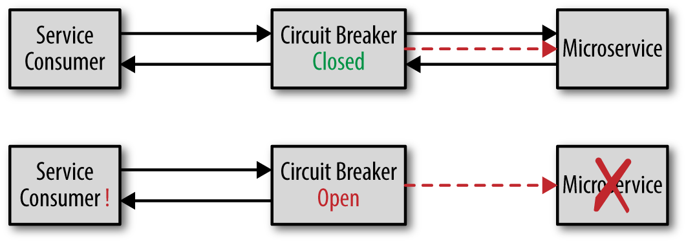
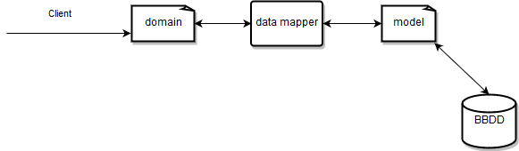

# Spring Darwin Microservices Reference Guide 

## Introduction

This document will give an overview of microservice development based on Darwin Spring framework. It is intended that by reading this document the developer knows what to do and what not. This welcome pack will not go into detail since each
framework library has its own documentation in which all the details are explained. There are also guides with examples of different use cases.

As a prerequisite for reading this document, the developer should know:

- Java.

- Spring Boot 3.X.

- Maven.

### Spring as a starting point

The Darwin microservice framework is based on the Spring ecosystem.

The main features of Spring are:

- The *Spring ecosystem* (Spring Framework, Spring Boot, Spring Cloud, etc.) facilitates the creation of java applications using a set of libraries that cover different problems by adding a simple configuration mechanism.

- *Dependency reversal or Control reversal (CR).* Spring Framework is based on this pattern that encourages decoupling between components. This pattern facilitates the evolution and testability of applications.

- *Convention over configuration.* Configuration via tedious XML is entirely avoided. Instead of writing the necessary configuration and validating if it is correct Spring Boot provides the necessary configurations to different scenarios.

- *Dependency management.* Spring provides a series of dependencies tested together so that you only have to indicate which version of the framework is required without the need to indicate the version of each of the used libraries. In addition to
    this, it offers a convenient way to update versions whenever an upgrade or downgrade is required.

- *Auto-configuration.* Spring and its different projects need to be configured so that they work in an integrated way for each application. Spring Boot possesses the intelligence to be able to activate the necessary configurations in each project
    if certain conditions are met, such as if classes are in the classpath, beans have been created or corresponding properties have been enabled.

- *Monitorization*. By adding the actuator project to the configuration of a Spring Boot application, capabilities like metrics, the status of each application (health indicator) the services to which it connects, the beans or properties of the
    application, etc will be automatically available. Actuator provides access to a series of endpoints such as /beans, /metrics, /health, /env and others.

### Darwin microservice framework components

#### Framework Darwin Spring

The Darwin Spring framework includes a set of libraries with cross functionalities that complement Spring and are necessary for microservices to comply with the Darwin architecture guidelines.

This framework incorporates the following modules:

- **Traces or 'Logging'**. Component that enriches the application traces to meet the format required by the Darwin log platform. Automatically generates activity traces. Provides Helper classes so that microservices can write functional traces.

- **Security - Authentication.** Authentication library offers validation of both JWT and corporate BKS tokens, Helper classes for token conversion, token spread, etc.

- **Security - Authorisation.** Implements integration with Operational Control that allows validating a user's permissions to perform an action (consultative or operational) on a client's contract.

- **Core.** Library with features such as *thread pool* and exceptions management. This allows to homogenize the response of the microservices in the case of handled exceptions as well uncontrolled ones. The answer is a JSON that follows a
    standard format.

- **Super POM.** Darwin microservice framework own dependency manager. Manages dependencies of the different libraries so that there are no incompatibilities between them.

- **Cache:** Library that loads necessary dependencies for the implementation of external cache based on Red Hat JBoss Datagrid.

- **Web services SOAP.** Allows to automatically add user/password or token when using SOAP services.

*Expediters:*

- **Microservice archetype.** Allows for the rapid creation of a basic microservice skeleton with all the requirements of the GLUON ecosystem: logging, authentication, authorisation, etc. The archetype performs a series of questions and generates
    a Maven project, with the dependencies in the *pom.xml* file, minimum configuration properties, and the initial packages and classes.

### Services with which it relates

The Darwin Spring framework is related to a series of external services that must be accessible to the microservice at runtime.

- **Public Key Manager (PKM).** This service offers a REST api to retrieve public keys necessary for validating the authentication or operational control tokens. It is necessary in the case of microservices that implement security. Used by
    authentication and authorization modules.

- **Security Token Service (STS).** This service handles token format transformations from JWT to BKS and vice versa. Required when the microservice must needs an external dependency that uses BKS security. Used by the authentication module.

- **Operational Control Service (CO).** This service is responsible for validating the permissions of a user to execute certain action (consultive or operational) on a client's contract. It is necessary when the microservice performs operations
    concerning the position of a client. Used by the authorization module.

- **Darwin Logging Platform.** The log traces generated by the microservices are directed to a centralized log aggregation system that allows the correct operation of the services in production. Integration with the logging platform is required
    for all microservices. Used by the module logging.

## First steps

### Prerequisites

The development environment to work with **Darwin Spring Framework** is the usual one for any type of Java application.

The developer must have:

- **JDK:** OpenJDK version 17.

- **GIT:** git client or IDE plugin that allows communication with the code repository.

- **Maven:** for the application build process. Maven must be configured to use the Nexus of the ALM environment as a dependency repository.

- **IDE:** any Java, IntelliJ, Eclipse, NetBeans development IDE. The framework is not coupled to any specific IDE. The use of the *Lombok* plugin is recommended to speed up java development.

It is important to configure the development IDE with **UTF-8,** as well as adding it to the pom.xml of the maven project.

To avoid SSL communication problems with the ALM services (Nexus, Git), the tools must be configured so that they do not validate the server certificate.

If any service deployed in the PaaS is accessed from the local application, the certificate must be installed within the keystore of the used JDK so that SSL errors do not occur.

### Microservice archetype

The easiest way to start developing a Darwin microservice is by using the microservice archetype.

The maven microservice archetype enables rapid creation of a project *skeleton* with the minimum requirements to operate in the GLUON ecosystem, or with other libraries and requirements that are wished to be incorporated.

For the generation of microservices, the Gluon developer platform provides the necessary tools for onboarding and the creation of the components. This platform allows developer to select and to configure the required features offered by Gluon:
*logging*, *authentication*, etc.

It also requests cataloging data such as *appkey,* *application,* *system,* *subsystem,* *application,* *subapplication.* This data must correspond to the one entered in the Atlas cataloging system. In case of not having it at the time of creation
it is possible to update it later.

As a result of the execution of the archetype, a microservice will be created on which the developer will add functionalities.

The microservice skeleton will have:

- \* pom.xml: \* maven microservice descriptor. It already uses the parent of the Darwin Spring framework and includes the dependencies required based on the selections made during the archetype execution.

- Default packages and directories

- Application startup class and a controller example

- **Configuration files:** application-local.properties, application.yml

See Darwin archetypes documentation to know how to use it.

The use of the archetype helps to meet the requirements and good practices established by the architecture team for GLUON microservices that are detailed in the next section, so its use is highly recommended.

## Requirements

This section lists **mandatory** characteristics for java microservices in Darwin architecture. Some of these features are described in greater detail in later sections.

Failure to comply with these characteristics could make the microservice unable to be deployed in productive environments.

### Configuration

java microservices should be configured following the [Darwin applications configuration guide](https://sanes.atlassian.net/wiki/spaces/SANACLOUD/pages/16524089097/Darwin+Applications+Configuration)

For this, the Darwin microservices must include the dependency of the module **darwin spring boot client.**

More information on the [Configuration section](#configuration) later in this document.

### Logging

Java microservices should write their log traces to the **Darwin Log Platform.**

For this, the Darwin microservices must include the dependency of the module **darwin spring boot logging.**

More information on the [Logging and Monitoring section](#logging) later in this document.

### Security

If the microservice requires security, it must be based on the validation of the corporate JWT token. The public keys required to validate the tokens will need to be obtained from the PKM service.

For this, the microservices must include the dependency of the module **darwin spring boot authentication.**

More information on the [Security section](#authentication) later in this document.

### Error management

Http error management should follow the instructions and have the format described in the [http services error handling guide](https://sanes.atlassian.net/wiki/spaces/SANACLOUD/pages/16524089063/Errors+management+in+http+services)

The library **darwin sprinng boot core** offers utility classes to meet this requirement.

More information on the [Error Management section](#error-management) later in this document.

### Resilience

#### Health Check

The microservices must have endpoints to check their health and if they are in a position to accept requests.

More information on the [Logging and Monitoring section](#logging) later in this document.

#### Circuit Breaker

Microservices must implement the Circuit Breaker pattern when invoking remote services

#### Timeout

Microservices must implement timeouts when invoking remote services

More information about *circuit breaker* and *timeout* in the [Synchronous Communications section](#synchronous-communications).

### Quality

#### Test automation

Java microservices must implement unit and integration tests in their repository. The degree of coverage must exceed 70%.

More information on the [Testing section](#testing) later in this document.

## Good practices

Here are a series of general recommendations for writing maintainable code.

### Code structure

The architecture of a microservice is not different from that of a monolithic application. Its main difference is that it operates on a smaller domain and that its scope is in *backend*, which has no presentation layer. It is therefore more focused
on business logic and data persistence.

Below is a recommended layer-based model for structuring the code of a microservice:

- **Contract**. It would be the interface or contract between consumers and the microservice. In Spring Boot it would be the @RestController class. A Java interface could be defined that this class should implement so that the contract is more
    explicit. It is also desirable that the contract is created using the Springdoc library.

- **Domain**. The business model and the logic associated with it will go here. If the business logic involves more than one domain model it should be accessed through a service.

- **Persistence**. If the microservice has persistence (a base of data for example) the objects of a database model need to be created and an access layer to them based on the Repository design pattern. Spring has a specific framework for this:
    Spring Data.

A typical package structure could be the following:

| Package    | Comments                                        |
|------------|-------------------------------------------------|
| config     | Spring Boot configuration classes               |
| domain     | Domain model classes                            |
| model      | Data model classes                              |
| repository | Spring Data interfaces to access the data model |
| service    | Business logic of the domain model              |
| web        | Contract o controller                           |

### Dependency injection

One of the main goals when tackling complex problems is to break them down into smaller modules. By doing this each module will have the dependencies of others. A module that has many dependencies will be less reusable, more complex and expensive to
maintain.

The *Dependency injection* design pattern is based on the principle of control reversal (CR). It is not the module that explicitly calls the framework to load the dependencies, it declares the ones that it needs and the framework injects them.

Spring has three ways of doing dependency injection: via *setter*, via *constructor* and via *field*. Below is the difference. The object to inject would be a **@Component:**

    @Component
    public class InjectMeSomewhere {
        ...
    }

Being a **@Component** Spring creates and initializes it and controls its life cycle. Now another module needs it as a dependency.Below is how it can be injected via *setter*:

    @Service
    public class OneService {
        private InjectMeSomewhere dependency;

        @Autowired
        public setDependency(InjectMeSomewhere dependency) {
            this.dependency = dependency;
        }
    }

The second way of injecting is via *constructor*:

    @Service
    public class OneService {
        private final InjectMeSomewhere dependency;

        @Autowired
        public OneService(InjectMeSomewhere dependency) {
            this.dependency = dependency;
        }
    }

The third and last way to inject would be via *field*:

    @Service
    public class OneService {
        @Autowired
        private InjectMeSomewhere dependency;
        ...
    }

The most compact way to inject the dependency is via \`field but is not the most recommended. There are several reasons not to inject it this way:

- Injecting dependencies in this way leaves the door open to being able to instantiate the class using the default constructor. There will be no way to inject these dependencies later as it does not have *setter.* methods. It will be a component
    with its unresolved dependencies, and it will get *NullPointerException.*

- A class of this type cannot be used outside a container that inject dependencies, reducing their reusability.

- This injection form cannot be used with immutable objects (*final*). For example this code would never work:

<!-- -->

    @Service
    public class OneService {
        @Autowired
        private final InjectMeSomewhere dependency;
        ...
    }

Dependency injection via *setter* method is recommended for optional dependencies. The class should be able to work if these dependencies are not resolved. Dependencies can be changed also at runtime if that is what you are looking for.

The main advantage of using dependency injection via *constructor* is that once the instance has been created, all its dependencies have been resolved. The fields that will save those dependencies can be 'final' so the instance regarding their
dependencies is immutable.

When using this form of injection it must be taken into account that circular dependencies cannot be resolved: if class A uses the class B and class B uses class A. This relationship cannot be solved, on the contrary, it is possible by injection
based on 'setter' or 'field'. In any case, it is not recommended to create circular dependencies excepting rare exceptions.

As of Spring Framework version 4.3 it is no longer necessary to use the **@Autowired** annotation for the constructor. The above example based in *constructor injection* would look like this:

    @Service
    public class OneService {
        private final InjectMeSomewhere dependency;

        // Ya no es necesaria la anotacion @Autowired
        public OneService(InjectMeSomewhere dependency) {
            this.dependency = dependency;
        }
    }

As discussed, **injection via *field* should be avoided.** Injection via constructor for mandatory dependencies and via \`setter 'methods for optional dependencies is recommended. Also, these two Latest forms of injection will facilitate the
creation of unit tests: you can create a *dummy* implementation of the interfaces to inject in test classes.

The [recommendation](https://docs.spring.io/spring-framework/docs/6.0.21/reference/html/core.html#beans-factory-collaborators) by the developing team of Spring Framework:

> The Spring team generally advocates constructor injection as it enables one to implement application components as immutable objects and to ensure that required dependencies are not null. Furthermore constructor-injected components are always
> returned to client (calling) code in a fully initialized state. As a side note, a large number of constructor arguments is a bad code smell, implying that the class likely has too many responsibilities and should be refactored to better address
> proper separation of concerns.
>
> Setter injection should primarily only be used for optional dependencies that can be assigned reasonable default values within the class. Otherwise, not-null checks must be performed everywhere the code uses the dependency. One benefit of setter
> injection is that setter methods make objects of that class amenable to reconfiguration or re-injection later.

### Lombok usage

Lombok allows creating POJOs (Plain Old Java Object) avoiding the tedious task of writing *getters,* *setters,* *constructors,* etc. It is one of the Basic utilities recommended when developing in Java.

In this way this POJO:

    package com.santander.darwin.common.clientprofile;

    import java.io.Serializable;

    /**
     * POJO contains Person information
     *
     */
    public class Person implements Serializable {
        private static final long serialVersionUID = 7161386585076362579L;

        private String uid;
        private String type;
        private int code;
        private String nif;
        private Contract contract;
        private String name;
        private String documentType;
        private String lastNames;

        private PersonBasicData basicData;

        public Person() {
            super();
        }

        public Person(String uid, String type, int code, String nif, Contract contract,
                      String name, String documentType, String lastNames,
                      PersonBasicData basicData) {
            super();
            this.uid = uid;
            this.type = type;
            this.code = code;
            this.nif = nif;
            this.contract = contract;
            this.name = name;
            this.documentType = documentType;
            this.lastNames = lastNames;
            this.basicData = basicData;
        }

        public void setUid(String uid) {
            this.uid = uid;
        }

        public void setType(String type) {
            this.type = type;
        }

        public void setCode(int code) {
            this.code = code;
        }

        public void setNif(String nif) {
            this.nif = nif;
        }

        public void setContract(Contract contract) {
            this.contract = contract;
        }

        public void setName(String name) {
            this.name = name;
        }

        public void setDocumentType(String documentType) {
            this.documentType = documentType;
        }

        public void setLastNames(String lastNames) {
            this.lastNames = lastNames;
        }

        public void setBasicData(PersonBasicData basicData) {
            this.basicData = basicData;
        }

        @Override
        public int hashCode() {
            final int prime = 31;
            int result = 1;
            result = prime * result + ((basicData == null) ? 0 : basicData.hashCode());
            result = prime * result + code;
            result = prime * result + ((contract == null) ? 0 : contract.hashCode());
            result = prime * result + ((documentType == null) ? 0 : documentType.hashCode());
            result = prime * result + ((lastNames == null) ? 0 : lastNames.hashCode());
            result = prime * result + ((name == null) ? 0 : name.hashCode());
            result = prime * result + ((nif == null) ? 0 : nif.hashCode());
            result = prime * result + ((type == null) ? 0 : type.hashCode());
            result = prime * result + ((uid == null) ? 0 : uid.hashCode());
            return result;
        }

        @Override
        public boolean equals(Object obj) {
            if (this == obj)
                return true;
            if (obj == null)
                return false;
            if (getClass() != obj.getClass())
                return false;
            Person other = (Person) obj;
            if (basicData == null) {
                if (other.basicData != null)
                    return false;
            } else if (!basicData.equals(other.basicData))
                return false;
            if (code != other.code)
                return false;
            if (contract == null) {
                if (other.contract != null)
                    return false;
            } else if (!contract.equals(other.contract))
                return false;
            if (documentType == null) {
                if (other.documentType != null)
                    return false;
            } else if (!documentType.equals(other.documentType))
                return false;
            if (lastNames == null) {
                if (other.lastNames != null)
                    return false;
            } else if (!lastNames.equals(other.lastNames))
                return false;
            if (name == null) {
                if (other.name != null)
                    return false;
            } else if (!name.equals(other.name))
                return false;
            if (nif == null) {
                if (other.nif != null)
                    return false;
            } else if (!nif.equals(other.nif))
                return false;
            if (type == null) {
                if (other.type != null)
                    return false;
            } else if (!type.equals(other.type))
                return false;
            if (uid == null) {
                if (other.uid != null)
                    return false;
            } else if (!uid.equals(other.uid))
                return false;
            return true;
        }

        @Override
        public String toString() {
            return "Person [uid=" + uid + ", type=" + type + ", code=" + code + ", nif=" + nif + ",                          contract=" + contract + ", name=" + name + ", documentType=" +                                  documentType + ", lastNames=" + lastNames + ", basicData=" +
                             basicData + "]";
        }
    }

Turns into this simple POJO using Lombok:

    package com.santander.darwin.common.clientprofile;

    import java.io.Serializable;

    import lombok.AllArgsConstructor;
    import lombok.Data;
    import lombok.NoArgsConstructor;

    /**
     * POJO contains Person information
     */
    @Data
    @NoArgsConstructor
    @AllArgsConstructor
    public class Person implements Serializable {

        private static final long serialVersionUID = 7161386585076362579L;

        private String uid;
        private String type;
        private int code;
        private String nif;
        private Contract contract;
        private String name;
        private String documentType;
        private String lastNames;

        private PersonBasicData basicData;
    }

- The **@Data** annotation generates *getters* for all fields as well as *setters* for fields other than final. Generate a constructor for all final fields and for non-final fields annotated with @NotNull. Also, the method *toString (), hashCode
    () and equals () .* All this Code generation is done at compilation time.

- The annotation **@NoArgsConstructor** generates a constructor with no arguments.

- The **@AllArgsConstructor** annotation generates a constructor with all fields.

- Annotation **@Slf4j** creates an instance of *Logger* that can be used in the code with the name *log.*

- Last but not least, the **@Builder** annotation generates the code necessary to be able to build complex objects applying the pattern *builder.*

!!! info "Important"

    For small **immutable data** objects, we recommend using the ***record*** keyword instead of using lombok functionalities.

The reader is encouraged to see all the possibilities Lombok has to offer by looking at the [project documentation.](https://projectlombok.org/features/all)

## Configuration

**Spring Boot** offers a number of mechanisms for configuring applications. It also provides a hierarchical model so that properties defined by a mode can be overwritten by higher priority modes. The [Spring Boot
documentation](https://docs.spring.io/spring-boot/docs/3.1.12/reference/html/features.html#features.external-config) defines the available mechanisms.

In Darwin the following mechanisms can be used to configure java applications:

- **Configuration files not included in the software.** These files must contain properties that *do not vary by environment.* Java microservices will contain the following files:

    - **application.yml:** contains all the general properties of the micro.

- **Environment variables:** configured in the microservice execution environment They will contain those *deployment dependent properties* such as the region, the blue / green suffix, etc.

Detailed examples and guidelines for setting up java microservices are described within the following [document](https://sanes.atlassian.net/wiki/spaces/SANACLOUD/pages/16524089097/Darwin+Applications+Configuration). It is necessary to adhere to
what is described in this document to be able to deploy in successive environments.

### Use

It is recommended to use *beans* that group the configuration properties of a certain module. For this, the annotation **@ConfigurationProperties.** is used indicating a prefix of the properties.

    @Data
    @Configuration
    @ConfigurationProperties("acme")
    public class HelloProperties {
        private String hello;
    }

**@ConfigurationProperties** indicates the prefix of the properties that SpringBoot will inject into the bean. For example in the previous case it will map the property *acme.health*

Using **Lombok** avoids having to create the *setters* and *getters* of the properties.

To consume them from a class you will have to inject the *bean* and access its properties.

    @RestController
    @RequestMapping("/hello")
    public class HelloController {
        private HelloProperties props;

        public HelloController(HelloProperties props) {
            this.props = props;
        }

        @RequestMapping(method = RequestMethod.GET)
        public String sayHello() {
            return props.getHello();
        }
    }

The annotation **@RefreshScope** allows you to refresh the configuration of of a *Bean* whenever you want. You just have to write down the class with it:

    @RefreshScope
    @Data
    @Configuration
    @ConfigurationProperties("acme")
    public class HelloProperties {
        private String hello;
    }

The *hello* field can be refreshed without the need for restart the microservice by invoking the *actuator/refresh* endpoint of each of the instances of the micro. By default, this actuator endpoint is disabled so the micro must enable it if you
want to use this functionality.

!!! note

    The refresh only works for those properties defined through *Spring Cloud Config.*

## Authentication

With some exceptions, microservices must check the user's credentials before executing a service. Darwin Security is based on the JWT token.

This token is signed so the microservice must have the corresponding public key. To obtain this public key you must use a service called *Public Key Manager (PKM)*. There is a PKM deployed in the Darwin Security Common Services application.

Additionally, if the microservice needs to call a dependency based on BKS token, it must transform the JWT token received to a BKS token. To be able to do this, there is a service called *Security Token Service (STS)* that performs this
transformation. There is an STS deployed in the Darwin Common Security Services application.

The Darwin framework authentication library offers the following capabilities:

- Authenticate the requests that the microservice receives by validating the JWT/corporate token as a header/parameter in the HTTP request.

- *Helper* for token conversion.

- Propagation of the authentication token when calling other microservices.

To install this library, just add the following dependency and configure it appropriately:

    <dependency>
    <groupId>com.santander.darwin</groupId>
    <artifactId>darwin-spring-boot-starter-authentication</artifactId>
    </dependency>

Details on the full functionality as well as its installation and configuration can be consulted in the module documentation [Darwin Spring
Authentication](darwin-project/darwin-spring-boot-security-authentication/README.md).

The routes of the common security services can be consulted [here.](https://sanes.atlassian.net/wiki/spaces/SANACLOUD/pages/16524083406/Routes+Darwin+Common+Services)

## Logging and monitoring

### Logging

In order to be able to carry out an adequate *troubleshooting* of the Darwin applications once they are in production it is necessary that the components of said application generate their log information and dump it to the **Darwin Logging
platform.**

For this, the microservices must:

- Generate an **activity trace** for each request received.

- Generate **Technical traces** with the information of the produced errors.

- Include in the traces a correlation id that allows to obtain all the logs generated during the processing of a request even if it goes through several microservices.

In addition to the minimum requirements necessary for their exploitation, microservices can generate a functional log as it allows extracting information about *functional events* produced later. For example: number of hires, number of transfers,
amounts, etc.

Consult [logging guide](https://sanes.atlassian.net/wiki/spaces/SANACLOUD/pages/16576941818/Logging+for+microservices) for more details on the platform, formats and requirements.

To facilitate its implementation, Darwin Spring Framework includes a registry library which includes the following functionalities:

- Creation of log appenders so that the microservice logs are written to the log platform.

- Automatic generation of the activity log

- Creation and propagation of the correlation id

- Helper to generate functional log

To install this library, just add the following dependency and configure it appropriately:

    <dependency>
            <groupId>com.santander.darwin</groupId>
            <artifactId>darwin-spring-boot-starter-logging</artifactId>
    </dependency>

Here is a very simple example of how to write technical traces in the log. Lombok annotation *@Slf4j:* is used

    @Slf4j
    public class LoggingDemoController {
        ...
        public ResponseEntity<String> checkCredit(@RequestParam(name="creditcard") String credit){
            ...
            log.info("Technical log indicating all goes well");
        }
    }

To write a functional type trace, you will have to resort to the class *FunctionalLogHelper* and invoke the log method with the trace to be displayed and a Map with the data to be included in the businessLog field. For instance:

    ...
    Map<String, Object> businessLogMap = new HashMap<>();
    businessLogMap.put("function", "checkCredit");
    businessLogMap.put("description", "Checking the credit card status.");
    FunctionalLogHelper.log("No credit card found.", businessLogMap);
    ...

Details on the full functionality as well as its installation and configuration can be consulted in the module documentation [Darwin Spring
Logging](darwin-project/darwin-spring-boot-logging/README.md).

### Health check

All microservices must incorporate a health indicator. Typically the *health check* is implemented through an HTTP endpoint indicating if the microservice is running. The easiest way is to incorporate the library of *Spring Actuator*.

Actuator creates a series of endpoints with different metrics and functionality. Most of them are disabled, the following are displayed by default:

    /actuator/info
    /actuator/health

More information about Acturator in the [Spring Boot documentation](https://docs.spring.io/spring-boot/docs/3.1.12/reference/html/actuator.html#actuator).

#### How to configure the health indicator in OpenShift

Once the microservice is deployed in Openshift, it is convenient to configure the health checks that allow PaaS to know when an application is ready to attend requests and restart it if it detects that it is not available.

It is recommended to use `/actuator/info` for this purpose.

To learn more consult the [health check configuration guide](https://sanes.atlassian.net/wiki/spaces/SANACLOUD/pages/23879254505/Health+Check+in+Spring+Java+microservices) in Java microservices.

## Exception management

Microservices must catch and handle the exceptions that occur and log them with enough information to be able to diagnose the error. When the microservice implements a REST api, it must return to the caller a response with the corresponding http
code and in the response body a standard format defined for Darwin microservices.

In the article: [Http error treatment](https://sanes.atlassian.net/wiki/spaces/SANACLOUD/pages/16524089063/Errors+management+in+http+services) The error codes to be entered and the format defined for the body of the response in case of error are
explained.

Error example:

    {
        "appName": "microservice",
        "timeStamp": 1519919651325,
        "errorName": "UNAUTHORIZED",
        "status": 401,
        "internalCode": 401,
        "shortMessage": "UNAUTHORIZED",
        "detailedMessage": "Invalid credentials"
    }

Within the error message, the *errorName* attribute is a **code that must indicate to consumers the reason that generated the error.** The description of the errors must be part of the documentation of the APIs exposed by the microservice so that
consumers can manage errors adequately.

The Darwin Spring framework core library offers a series of utilities that help to implement this error handling. The library includes the following:

- Base exceptions for different types of http errors that applications should inherit from.

- A generic error handler that returns the defined error format and logs the exception

To include this library, the following dependency must be added:

           <dependency>
             <groupId>com.santander.darwin</groupId>
             <artifactId>darwin-spring-boot-core</artifactId>
           </dependency>

Consult the [framework documentation](darwin-project/darwin-spring-boot-core/README.md) to know the details of the functionalities and how to use
the exception management.

## Web layer

Microservices typically expose their functionality to other microservices or front applications through a REST api.

To implement this layer Spring provides two frameworks:

- **Spring MVC:** classic version

- **Spring WebFlux:** reactive version

### Spring MVC

The exposure of REST services is based on the use of *controllers* defined in Spring MVC. Spring MVC is part of the Spring Framework, and it focuses on building the user interface. Its architecture conforms to the Model View Controller pattern, and
seeks above all simplicity and simplicity.

Through annotations the developer can create the apis that expose the functionality that they implement.

Controller example

    @RestController
    @RequestMapping("/service/personas")
    public class SpringServiceController {

        @RequestMapping(value = "/{dni}", method = RequestMethod.GET)
        public String getFullName(@PathVariable String dni) {
            String result = searchFullName(dni);
            return result;
        }
        ...
    }

Spring MVC offers functionalities such as:

- Routing of requests to the method that implements them

- Mapping of input and output json objects in *beans*

- Exception handlers

Spring MVC runs on a Tomcat server and implements the traditional *Servlet* api.

To know the complete functionality of Spring MVC consult the [documentation](https://docs.spring.io/spring-framework/docs/6.0.21/reference/html/web.html#spring-web) of the project.

Darwin Spring Framework has integrations with Spring MVC in several of its modules: authentication, exception handling, authorization.

For the creation of a Web Controller please consult the [guide to building a web controller with Spring MVC](https://github.com/santander-group-shared-assets/gln-back-darwin-java-samples/tree/develop/webcontroller).

### Spring WebFlux

As of version 5, Spring provides another framework for building the web layer of applications: Spring WebFlux. Spring WebFlux offers the same functionalities as Spring MVC but for a reactive coding model. The reactive or non-blocking model offers
more effective *threads* management than the traditional model. This feature makes reactive microservices more scalable.

However, for this to be effective, all request processing within the *end to end* microservice must be performed reactively.

Spring WebFlux runs on a Netty server and does not implement the traditional *Servlet* api. To know the complete functionality of Spring WebFlux consult the
[documentation](https://docs.spring.io/spring-framework/docs/6.0.21/reference/html/web-reactive.html#spring-webflux) of the project. Darwin Spring Framework has integrations with Spring WebFlux in several of its modules: authentication, exception
handling, authorization.

For creating a reactive web controller, it is recommended to refer to the [guide to building a reactive web controller](https://github.com/santander-group-shared-assets/gln-back-darwin-java-samples/tree/develop/reactivecontroller).

### API versioning

When it is not possible to maintain the contract between the client and the microservice, the API will have to be versioned. In this way, old clients will continue to access the old API and new ones will be able to access the new version.

The first version of the API is advised to have a URL of this type:

    .../v1/recurso

When the API of this resource changes, then the version is increased:

    .../v2/recurso

If all clients migrate to version 2, v1 will not be needed anymore.

In the article: [domain and url management](https://sanes.atlassian.net/wiki/spaces/SANACLOUD/pages/24263033223/Routes+and+Domains+management+in+Darwin+applications) se explican algunas pautas para la definición de rutas que es conveniente conocer a
la hora de implementar las rutas de los microservicios.

### API Documentation

The APIs that a microservice implements must be documented so that client applications know how to use them and how to handle possible returned errors.

To document the apis it is recommended to use *Openapi* and *Springdoc.*

To use them, the following dependencies must be included in the microservice;

If the application is implemented with **Spring MVC**:

       <dependency>
          <groupId>org.springdoc</groupId>
          <artifactId>springdoc-openapi-ui</artifactId>
       </dependency>

If the app is implemented with **Spring WebFlux**:

        <dependency>
            <groupId>org.springdoc</groupId>
            <artifactId>springdoc-openapi-webflux-ui</artifactId>
        </dependency>

And create a Spring config class to enable the use of Openapi. The archetype already creates this class by default.

        @Configuration
        public class SwaggerConfig {
            /**
            * Creates Springdoc object
            * where the API Documentation is grouped
            * by package and path pattern
            *
            * @return GroupedOpenApi
            */
            @Bean
            public GroupedOpenApi api() {
                return GroupedOpenApi.builder()
                    .setGroup("api-web")
                    .packagesToScan("com.santander.dwback.openapisample.web")
                    .build();
            }

Through the use of annotations in the controllers, the different api methods will be documented. *Springdoc* automatically generates an interactive interface from the information included in the annotations.

For more information on API documentation please refer to: [API Documentation with springDoc](https://github.com/santander-group-shared-assets/gln-back-darwin-java-samples/tree/develop/openapi-springdoc)

## Synchronous communications

### Communication with other microservices via REST

Synchronous communication with other microservices is done using the http REST protocol. The Darwin microservices framework provides interceptors that are in charge of automatically propagating the headers related to *logging*, authentication and
authorization.

To make a REST request to another microservice Spring Boot provides the *WebClient* class. The use of *WebClient* is recommended over *RestTemplate* because it performs better resource management. The Darwin framework provides a *WebClient.Builder*
object that includes the interceptors for the architecture.

The following [guide](https://github.com/santander-group-shared-assets/gln-back-darwin-java-samples/tree/develop/webclient) illustrates the use of *WebClient*.

In case the micro does not use the *WebClient* provided by the architecture, you must ensure that it includes the following mandatory headers.

To know the headers that Darwin architecture prescribes as necessary to enrich communication, it is recommended to read the [regulations on enriched
communication](https://sanes.atlassian.net/wiki/spaces/SANACLOUD/pages/24272994492/Enriched+Communication+Policy).

### Communication with SOAP services

For the implementation of SOAP invocations, the use of the *Spring WS module is recommended.* Note that BKS applications are deployed multiple times depending on the channel, so for omnichannel microservices, it is necessary to manage different URLs.
different URLs will have to be managed.

It is recommended to read the [guide](https://sanes.atlassian.net/wiki/spaces/SANACLOUD/pages/16500326772/WebService+SOAP+clients+guide) on building SOAP clients.

The *Darwin Spring WebService* library is used to group several interceptors for authentication when communicating with SOAP services. It currently includes an interceptor for authentication using a BKS token and an interceptor for user and password
authentication.

To know the details about the functionalities and configuration of the library, consult its
[documentation](darwin-project/darwin-spring-boot-webservice/README.md).

### Resilience patterns

In microservices architectures, it is essential to implement patterns in communication between services that ensure the resilience of the application as a whole.

#### Circuit Breaker

The *Circuit Breaker* design pattern prevents a crash of a component causing the entire system to crash. The analogy would be to imagine a component calling another as if it were an electrical circuit. In the normal state, in which everything works,
the circuit is closed or connected. If a component stops responding or its response times are high, the *Circuit Breaker* logic will open the circuit and provide a *fallback* mechanism. In this way the system will not collapse due to the fall of one
of its components. The *Circuit Breaker* logic will also allow the circuit to automatically close when the component 'comes back to life', that is, to reconnect the circuit.

**The use of the Circuit Breaker pattern is mandatory** in the Darwin architecture whenever an external service is invoked synchronously.

The use of the *Resilience4J* library is recommended for the implementation of this pattern.

The guide [Circuit Breaker in Darwin Spring](https://github.com/santander-group-shared-assets/gln-back-darwin-java-samples/tree/develop/resilience) shows an example of how to implement *Circuit Breaker* in Darwin microservices.

#### Timeout

Sometimes a REST or SOAP service invoked from a microservice may not respond in an acceptable time. This delay in responding can cause problems in the calling microservice, so it is necessary to include a *timeout* in calls to external services to
avoid this type of problem.

The *WebClient* class allows you to incorporate *timeouts* into your calls.

Example:

        ConnectionProvider.Builder connPro = ConnectionProvider.builder("custom");
        HttpClient httpClient = HttpClient.create(connPro)
                .option(ChannelOption.CONNECT_TIMEOUT_MILLIS, timeout)
                .doOnConnected(
                        connection -> connection
                                .addHandlerLast(new ReadTimeoutHandler(timeout, TimeUnit.MILLISECONDS))
                                .addHandlerLast(new WriteTimeoutHandler(timeout, TimeUnit.MILLISECONDS))
                );

        webClient = webClientBuilder.clientConnector(new ReactorClientHttpConnector(httpClient)).build();

To learn more please consult the [microservices resilience guide](https://sanes.atlassian.net/wiki/spaces/SANACLOUD/pages/16524089013/Resilience+microservices).

## Asynchronous communications

In distributed architectures, asynchronous communication by messaging is a very widespread pattern for cooperation between different services and applications.

This communication pattern enhances the decoupling between applications, favoring extensibility and resilience.

For its implementation in Spring applications, the use of the modules it provides for integration with the different messaging services is recommended:

- **Spring AMQP:** For integration with *RabbitMQ.* Consult the [project documentation](https://docs.spring.io/spring-amqp/reference/html/).

- **Spring for Apache Kafka:** For the integration with *Kafka.* Consult the [project documentation](https://docs.spring.io/spring-kafka/docs/3.0.17/reference/html).

## Cache

The use of cache is a fundamental method to obtain adequate performance in the microservices architecture.

Two types of cache are distinguished:

- *Local caches:* caches that are created within the virtual machine that runs the service. Access to this cache is faster, but they are not shared between instances of the same application. Useful for very static objects and for

- Remote *Caches:* shared between all application instances and services. It is suitable for all other cache objects.

Within Santander architecture the following are recommended:

- **Caffeine:** for local caches in memory

- Infinispan (JBoss **Datagrid**): for remote caches

The application should control that in case of unavailability of the remote cache it continues to work obtaining the data from the cache.

Regardless of the type of cache used, it will be necessary to define eviction policies for the cache. Otherwise, you run the risk of exhausting the memory associated with the JVM by not removing cache entries, which can lead to OOM errors.

For more information on the eviction policies supported by caffeine you can consult the: [eviction policies](https://github.com/ben-manes/caffeine/wiki/Eviction).

To view the information regarding JBoss Cache consult this [document](https://sanes.atlassian.net/wiki/spaces/SANACLOUD/pages/24272929239/Cache+uses)

Darwin Spring Framework includes a cache module that incorporates connection dependencies to Datagrid and creates error handlers when accessing the cache.

To incorporate the module, the following dependency must be included:

    <dependency>
        <groupId>com.santander.darwin</groupId>
        <artifactId>darwin-spring-boot-starter-cache</artifactId>
    </dependency>

To know the details of the functionality and configuration please refer to the [cache module
documentation](darwin-project/darwin-spring-boot-cache/README.md)

To cache a method, just use Spring's *@Cacheable* annotation.

## Persistence

Both to access to a relational database and a non-relational one, it is recommended to separate the domain of the data model, in this way the mapped classes are not linked to a specific database. In the diagram below there is a business object or
DTO (domain), a data model object (model), and a class that maps between the two. This layout pattern is known as *DataMapper.*

### Access to relational DB

The use of *Spring Data JDBC* is recommended to access to relational databases.

The application must include the corresponding dependencies:

    <dependency>
        <groupId>org.springframework.boot</groupId>
        <artifactId>spring-boot-starter-data-jpa</artifactId>
    </dependency>

Additionally, it will be necessary to add the dependency of the driver of the database manager used. To know the details of the use of Spring Data JDBC consult the [project documentation](https://spring.io/projects/spring-data-jdbc)

The [BBDD SQL access guide](https://github.com/santander-group-shared-assets/gln-back-darwin-java-samples/tree/develop/databasesql) illustrates the case of a database access using Spring Data JDBC.

#### IBM DB2

For the access to DB2 the product driver will be used.

    <dependency>
        <groupId>com.ibm.db2</groupId>
        <artifactId>db2jcc4</artifactId>
        <version>6.6</version>
    </dependency>

In the configuration file, in addition to the connection data, a specific parameterization must be made for the connection pool. **It is mandatory to include the defined configurations** in the following
[article.](https://sanes.atlassian.net/wiki/spaces/SANACLOUD/pages/16500326648/Connections+to+DB2+Mainframe+configuration)

### Non-relational DB access

Spring Data also provides modules for accessing non-sql data repositories such as *MongoDB, Neo4J, ElasticSearch* and others.

Consult [Spring Data documentation](https://spring.io/projects/spring-data) for a complete overview of the capabilities it offers.

To access data with MongoDB, consult the [MongoDB access guide using SpringData Mongo](https://github.com/santander-group-shared-assets/gln-back-darwin-java-samples/tree/develop/mongodb).

## Host access

Access to Banco Santander Host is done through the connectors for Parthenon. There are two types of connectors: TrxOp and SAT.

In the following link you can consult the [Partenon connection library
documentation](https://santandernet.sharepoint.com/sites/SEPBKSCCA/SitePages/Annexes/Documentation/Spring%20Libraries%20Documentation/Partenon%20TrxOp%20Spring%20Connector%20-%20User%20Manual/Partenon%20TrxOp%20Spring%20Connector%20-%20User%20Manual.aspx).
This document explains how to use the library.

To simplify the development of the beans required for Partenon calls,
there is an [auto-generation tool](https://partenonsampleapp-bks-paas-dev.appls.boaw.paas.gsnetcloud.corp/transactions/OJER/C/99999?format=JAVA) of the beans required to use the
connector.

It is also recommended consulting the [access guide to Partenon in Darwin microservices](https://github.com/santander-group-shared-assets/gln-back-darwin-java-samples/tree/develop/partenon)

## Testing

When designing the tests, it is necessary to take into account certain considerations. The first is that the testing process involves multiple profiles, not just QAs. A large part of the tests are designed and executed during the coding of the
application, and are carried out by the developers themselves. In this sense, self-assessment of work is a team responsibility. The implementation and execution of test cases is part of the daily work of each team, as it is necessary to guarantee
the quality of the final product.

All effort invested in testing should be driven by a comprehensive testing and evaluation plan. A test plan must define the objectives to be achieved, the means applied to achieve them, and measurable criteria to evaluate the fulfillment of these
objectives. It is important to remember that not everything can be tested, so the test plan should establish a prioritization of the aspects to be tested, and clarify what cannot be tested.

Automatic tests can also be interpreted as indicators of progress. That is, the tests should serve as a reliable indicator that something is done and working. Thus, it is important to test from the beginning and view the development of the tests as
if they were deliverable. It is recommended to develop the tests before the code itself (*Test Driven Development*), and update them when the product changes.

### Test types

From a general point of view, several criteria can be used to define types of tests. Thus, several types of tests can be distinguished according to their objective:

#### Functional testing

These tests are intended to verify that the behavior of the application conforms to the functional specifications defined for it.

#### Load tests

These tests are intended to observe the behavior of an application under different load volumes. This load can be the expected number of concurrent users using the application, or the number of transactions to execute for a batch under normal
conditions.

#### Stress tests

These tests are intended to take the system beyond its normal operating limits and observe the results. For example, in a load test, the number of concurrent users increases until the application crashes and the behavior during that process is seen.

#### Regression tests

These tests are intended to verify that the behavior of the application has not been affected by the latest changes. In other words, they aim to ensure that existing functionalities have not been affected by the side effects of recently introduced
changes. These tests are of a functional kind.

### Testing for Microservices

#### Unit tests

These are white box tests that are intended to verify the correct operation of the basic classes and/or components of the application. The goal of unit testing is to isolate each part of the application and show that the individual parts are
correct. They provide a written contract that the code block must satisfy. For a unit test to be considered valid, it must meet the following requirements:

- Be automatic: unit tests must be run in an automated way. This is especially necessary in a continuous integration context.

- Be deterministic: this property means that a unit test should only fail if there is an error in the code being tested. That is, they should not depend on non-deterministic elements for their correct achievement. If this is the case, then the use
    of mock-ups should be used to replace these elements with others under the developer's control.

- Be repeatable: you should not create tests that can only be executed once. Unit tests must be able to run repeatedly and, if there have been no changes, return the same results. This behavior is related to the idempotency of the tests, and is
    critical for continuous integration.

- Be independent: the execution of one test should not affect the execution of another.

- Be idempotent: no matter how many times a test is run, the result must always be the same. That is, for the same input data set, the output must always be the same. Otherwise, it must be understood that there are uncontrolled variables that
    affect the result of the execution (which also collides with the requirement of determinism).

- Provide broad coverage: should cover as much code as possible. As will be seen later, getting to cover 100% of the source code is practically impossible, but there are thresholds from which coverage begins to be considered adequate.

Given the potential complexity of identifying all possible test cases for a code unit, there are approaches that rely on random object generation to extend the scope of unit testing. This technique is known as random testing (RT: Random Testing).

To learn more, please consult the guide to unit tests and integration in Darwin: [Testing for MVC applications](https://github.com/santander-group-shared-assets/gln-back-darwin-java-samples/tree/develop/testing-mvc) and [Testing for Reactive
applications](https://github.com/santander-group-shared-assets/gln-back-darwin-java-samples/tree/develop/testing-webflux).

#### Integration testing

It is important to be aware that unit testing will not discover every error in your code. By their very definition, they won't uncover integration errors, performance issues, and other issues that affect the entire system as a whole. Unit tests are
only effective when used in conjunction with other software tests.

Integration tests verify the means for communication and interactions between components in order to detect defects between interfaces. These tests treat the various components in a grouped way to verify that they cooperate adequately to achieve the
expected behavior of the assembly.

Managing the state can be complex when tested against external components as tests depend on certain data being available. One way to mitigate this problem is to agree on a fixed set of representative but innocuous data that is guaranteed to exist
for all environments. In the case of integration with databases, ORM (Spring Data) technology will be used, which means that special attention must be paid to the use of caches in order to avoid data inconsistencies during testing.

To learn more, please consult the guide to unit tests and integration in Darwin: [Testing for MVC applications](https://github.com/santander-group-shared-assets/gln-back-darwin-java-samples/tree/develop/testing-mvc) and [Testing for Reactive
applications](https://github.com/santander-group-shared-assets/gln-back-darwin-java-samples/tree/develop/testing-webflux).

#### Component testing

Component tests limit the scope of tests to its limits. In this sense, the internal dependencies are replaced by mock-ups to completely isolate the module and eliminate the uncertainty associated with the behavior of external elements. This
isolation allows testing to focus on validating the complete behavior of the module. Both logical and technical aspects can be measured separately (observing, for example, the performance of the different capacities of the module), and then made
comparisons with the operation in a complete environment (during end-to-end tests).

Although these tests allow to perform a validation of the operation of the module in an independent way of the environment, it is important to remember that the observed behavior is framed in a test environment. Therefore, the behavior in a real
environment could differ.

#### End-to-end testing

The objective of these tests is to demonstrate that the application works correctly and the operations that it implements fully satisfy the business requirements. They are black box tests, which focus on the inputs and outputs generated.

End-to-end tests are the most granular of all that have been defined. They require the coordinated operation of all the application modules in order to determine the correct operation at the business level. They are therefore expensive tests, since
they require prior preparation work that guarantees the aforementioned test conditions: independence, consistency, idempotency, etc.

Due to the high cost of preparing and maintaining these tests, a prioritized list should be drawn up with the business functions considered most relevant. Depending on the time available, the tests associated with these functions can be developed
and maintained.

### JUnit

JUnit is a Java library used to automate testing processes, particularly unit tests. By creating tests, JUnit allows you to build specific and automatic tests on the different parts of the code.

Normally this type of tests are developed by the programmer himself, as part of the quality process of the generated code. Defining the test cases allows you to establish a contract regarding the behavior of the code that you test.

There are several reasons to use JUnit when testing code:

- It is an open-source tool with a wide circulation, to the point of constituting a de facto standard.

- There are several plugins to be used with the most common development environments.

- There are also several coverage tools that use JUnit.

- Working with JUnit is natural for a developer, since the test cases are run as part of the validations after the compilation

While historically the use of JUnit components has been based on inheritance, the latest versions provide greater flexibility using annotations. The examples that have been collected in this section make use of these annotations.

    public class PersonaTest {
        @Test
        public void testNullEdadPersona(){
            Integer resultado = 2+2;
            Assert.assertNotNull(resultado);
        }
    }

### Mockito

In order to create a good set of unit tests, it is necessary to focus exclusively on the class to be tested, simulating the operation of the lower layers (in these tests the part of access to real databases was excluded). To carry out this task it
is possible to make use of mock objects, which are nothing more than objects that simulate part of the behavior of a class. Mockito is a tool that allows you to generate dynamic mock objects.

Mockito is based on EasyMock, and the operation is practically the same, although it improves the API at a syntactic level, making it more intuitive; and also allows you to create mocks of specific classes (and not just interfaces).

The core idea of testing with Mockito is the cycle: stubbing - execute - verify. That is, schedule a behavior, execute the calls, and verify the calls. The use of mocks helps to focus efforts, not on the results obtained by the methods to be tested
(or at least not only on it), but on the interactions of the classes to be tested and the auxiliary classes supplanted by the mocks.

Mockito applies the Proxy design pattern to create the mock objects. Internally it uses CGLib to create the stubs of the proxies. A stub is a piece of code used as a substitute for other functionality. A stub can simulate the behavior of existing
code (such as a procedure on a remote machine) or be a temporary substitute for undeveloped code. CGLib is used to dynamically generate proxy objects and intercept calls to their fields.

    LinkedList mockedList = mock(LinkedList.class);

    //stubbing
    when(mockedList.get(0)).thenReturn("first");
    when(mockedList.get(1)).thenThrow(new RuntimeException());

    // Imprime "first"
    System.out.println(mockedList.get(0));

    // Lanza runtime exception
    System.out.println(mockedList.get(1));

    // Imprime "null" porque no se ha hecho stubbing de get(999)
    System.out.println(mockedList.get(999));
    verify(mockedList).get(0);
