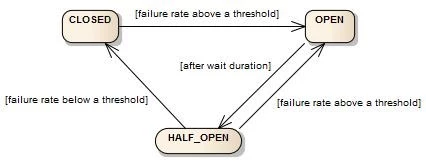

# Resilience microservices

## Resilient design

Failures occur and the functional **definition of the system should consider how to act in the event of a failure**. User stories should include how the service reacts, and how the user experience is managed,
 when one or more of its functionality is unavailable or degraded.

For example, if I cannot communicate with a third-party system in a contract, one option might be to allow it to continue and subsequently reattempt to communicate with the failed system.

At the technical level, the alternative paths defined for error cases should be implemented in addition to the happy path.

In addition, micro-services should follow the following principles:

- **To be autonomous**, the fewer external units have a micro-service, the fewer points of failure.
   If data from other applications are needed, consider alternatives such as asynchronous Caches or Communications that avoid synchronous communication at the time of resolution of the request.
- **Apply resilience patterns** where communication with the external service is unavoidable.
- **Handle errors**, properly manage errors that may occur and use **fallbacks** as far as possible.
- **Highly observable**, to plot information on errors produced to make an appropriate diagnosis and to provide mechanisms for monitoring the health of the micro-service from the outside.

## Resilience patterns

### Circuit breaker

In distributed architectures it is very common for a microservice to make remote calls to another microservice or external system. These calls may fail if the invoked service is not available or may take a long time to respond or never respond.

When the concurrency is large, problems in these remote calls can lead to the exhaustion of critical resources and cause cascade failures in the calling micro-services.

**Circuit breaker is a resilience pattern** used in microservice architectures that aims to prevent problems in an external dependency from affecting the microservices that invoke that dependency.

The pattern is based on the fact that if the number of errors in the call to an external service is very high,
 it is preferable to stop calling this service (open the circuit) in order to avoid continuous erroneous calls affecting the stability of the calling party.

The idea of the circuit breaker is straightforward if the number of failed calls exceeds a certain threshold the circuit is 'opened' and the subsequent requests return error quickly without making the call, thus avoiding unnecessary resource expenditure.
 If possible, when the circuit is 'open', instead of an error, a fallback with a default functionality can be executed.

Circuit breaker is implemented as a state machine with three states:

- **CLOSED**: Calls are executed normally.
- **OPEN**: Normal calls are not made but the defined fallback.
- **HALF_OPEN**: A certain number of normal calls are allowed to pass to verify whether the problem has been resolved and can be returned TO CLOSED status.

### Fallback

Related to the previous pattern, when normal execution fails, an alternative functionality or ‘fallback’ is executed. This fallback varies depending on the use case, and can range from not presenting anything to the user,
 displaying default data or using an alternative route.

It is important that the action to implement is functionally defined as fail-back when the main execution has failed.

### Timeout

Sometimes a remote service does not fail but takes a long time to respond. In such cases, such latency may put the calling service at risk. The use of time-out avoids this problem by cutting calls that exceed a certain time threshold.

### Re-attempts/Exponential Back-off

Sometimes a problem in the call to a service may be temporary, either because it has been a communications failure or because the destination has been recovered. The use of re-attempts allows the error to be exceeded without the user noting it.

*Exponential back-off* it is to reduce the use of some type of service in an exponential way, when an error has been detected.

### Bulkhead

This pattern is to isolate parts of the application's functionality from others so that if one of them becomes saturated it does not affect the rest. An example of this pattern is the creation of specific connection pools for different endpoints,
 or back-end services.

### Fail Fast

This pattern indicates that it is better that in the event of an error, it should occur as soon as possible so that it does not affect the service as a whole. Related to the use of timeouts.

### Request Collapsing

This pattern consists of grouping sequence of requests into a single request containing all of them. This reduces the necessary network resources and connections.

## Error management

In developing micro-services, proper **error management** is essential to ensure resilience as a whole.

Error management **applies to both errors that the microservice can receive** when communicating with an external system, api, repository, etc., and **errors that occur** in the same microservice.

In the first case, when implementing a communication with an external service, it is necessary to consider that errors may occur. In the case of communication with an api via http, **it is necessary to know which error codes this service returns,
 as well as the body of the error message received**. In this error message there should be additional information to help understand the cause of the error and to take the measures or fallback that it applies in each case. This is not the same,
  for example, the treatment of a technical error, e.g. "missing mandatory field" as a functional error, e.g. "there is not enough balance." Both types of errors should be treated differently. Patterns such as **fallback** should be applied in these cases.

In addition, **errors may occur in the communication** itself which result in a response not being received or this late too much to arrive, such technical failures should also be properly addressed.
 Patterns such as **Circuit breaker, fallback and time-out** apply in these cases.

Similarly, when writing errors that occur in **the application to the log, it is important to apply the appropriate log level (ERROR, WARN, INFO) and to include sufficient information to enable the error to be diagnosed**.

**The response from the micro-service should** indicate to the complainant the cause for which the request could not be successfully executed. To do so,
 it is necessary to **return an appropriate http code and a body with an error message indicating its cause**. Any errors to be returned by an api should be adequately documented so that the calling party can properly handle them.

## Observability

In addition to resilience patterns, **services should be observable** so that potential problems can be identified and corrective actions can be taken before they are detected by users.

Some of the capabilities that services should have are:

### Health Check

Having a health check allows you to observe the health status of a service from outside the public. Coupled with the capabilities of OpenShift / Kubernetes, it allows the service to be restarted and users to be redirected to this service.

### Logging

All instances of the different services of a system shall have their logs dumped into a repository where they can be analyzed centrally. The services shall capture their errors and dump into the logs the information necessary to diagnose a problem.

### Monitoring

The different technical metrics of the service (memory, cpu, etc.) should be exported and centralized in a repository in order to monitor the health status of the system and anticipate possible problems.

### Distributed Tracing

For the proper diagnosis of incidents it should be possible to recognize all logs generated during the processing of a request by generating a request identifier that will be propagated to all
 services involved in its processing and added to the generated logs.

### Alerts

Define the events or errors that should generate alerts that trigger corrective or mitigating actions. This allows rapid reaction to system problems.
