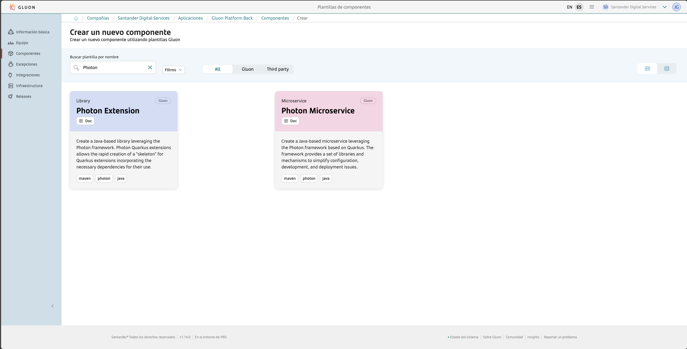
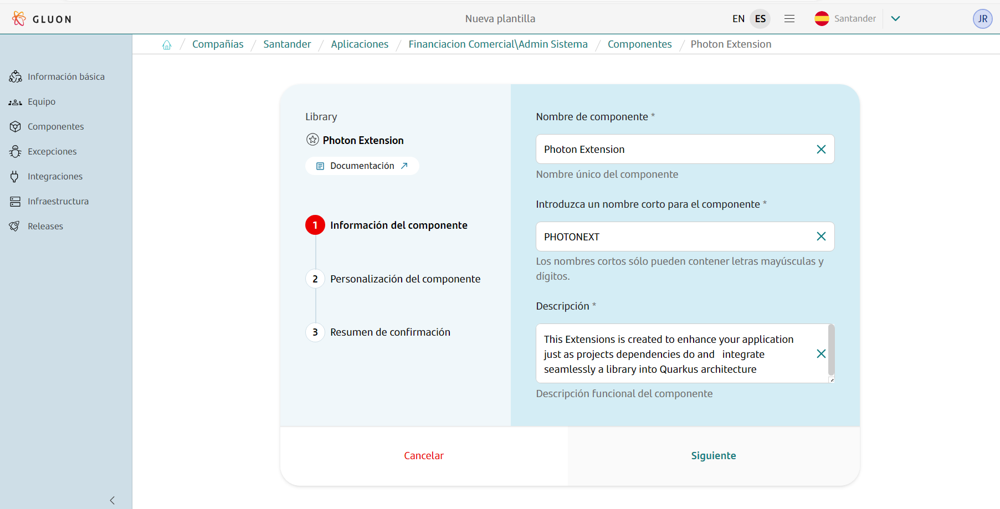
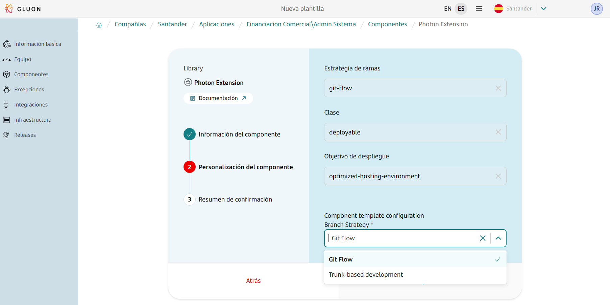
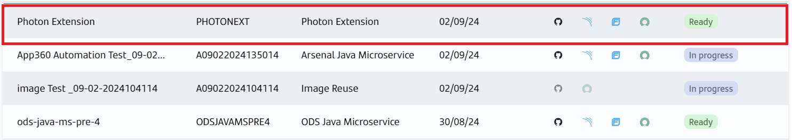

## Introduction

**Photon Extension**  is a component are designed to provide additional features or capabilities to the Photon Extension, where default configuration does not meet all the needs of business uses cases.

The philosophy Photon Extension making it easy to integrate with different libraries, frameworks, and technologies. that extends the core functionality and results in significantly improved resource utilization even when GraalVM is not used

### Key Characteristics of Quarkus Extensions

**Integration:**: Extensions handle the integration with specific technologies or libraries, abstracting the complexity and boilerplate code needed to use these technologies in your applications.
**Optimization:** They are optimized for both JVM (Java Virtual Machine) and native compilation, ensuring that applications using these extensions are efficient and performant in both environments.
**Container First:** Designed with containerized environments in mind, extensions help ensure that applications are lightweight and have fast startup times, making them ideal for cloud deployments.

The purpose of this documentation is to provide a **step-by-step guide** on how to orchestrate the generation of extension built with the **Photon Extension** framework within the GLUON platform, and with Maven as the basis for
building your project.

This guide will allow you to understand how to build and deploy our extension through a CI/CD process.

## Setup your local environment

{!
   include-markdown "../../../../snippets/setup/maven-setup.md"
!}

## Create Extension

### Gluon Portal

To create a component, follow the steps described in [**Componnet Management**](../../../../../application/component-management/create-component.md), searching for the component to be created.

You have to select the type of component you want to create, in this case you are going to create a **Photon Extension**.



???+ remember

    To follow the naming convention visit [Repository Naming Convention](../../../../../application/component-management/create-component.md#repository-naming-convention).

Once you have selected type of component, fill the different attribute as a show in the following image



The user can select the branch strategy that they want to implement in your workflow. For this example we have created a Photon Extension and chosen branch strategy 'git-flow' with the following characteristics:



Photon Extension Template Parameters:

| **Input**                                  | **Required** |         **Default value**          | **Description**                                                                                        |
|--------------------------------------------|:------------:|:----------------------------------:|--------------------------------------------------------------------------------------------------------|
| **Branch Strategy**                        |     true     | git-flow/Trunk-based Development   | Git branching model that involves the use of feature branches and multiple primary branches.                                                  |
| **Class**                                  |     true     |             deployable             | Indicates the type of component being created, which is a component that should be deployed in a PaaS. |
| **Deployment target**                      |     true     |   optimized-hosting-environment    | Indicate target  hosting-environment that should be deployed in a PaaS.                                |

???+ remember

    Git-flow and Trunk-based Development (TBD) are two different approaches to managing branches in version control systems like Git.<br>
    in the case Git-flow is a branching model that defines a strict branching strategy designed, making it suitable for projects that have scheduled releases. and where stability is a priority.
    <br/> for the case TBD is a branching model that  is a simpler, more continuous integration-focused approach where developers work in short-lived branches or directly in the trunk therefore reducing the chances of conflicts and integration issues.

Once the component is created we can see under the application that there is a new repository created with the name of the component, Sonar project and Fortify project.



We have the following links in:

| Item              | Link                                     | Role Permission                                                                                                                                                                                                                  |
|-------------------|------------------------------------------|----------------------------------------------------------------------------------------------------------------------------------------------------------------------------------------------------------------------------------|
| GitHub Repository | Link to the repository created in GitHub | Developer (RW) /Technical Lead (Maintain) [All roles explained](https://docs.github.com/es/organizations/managing-user-access-to-your-organizations-repositories/managing-repository-roles/repository-roles-for-an-organization) |
| Sonar Project     | Link to the Sonar project created        | All Users (Read)                                                                                                                                                                                                                 |
| Fortify Project   | Link to the Fortify project created      | All Users (Read)                                                                                                                                                                                                                 |

### Photon Extension Template

#### Branches

{!
   include-markdown "../../../../snippets/setup/photon-extension-branch-setup.md"
!}

#### Structure

The generated Photon Extension has a structure similar to the following, only narrowing down the content changes in the src and test folders based on your selection in previous steps.

```text
📂.github
 ┣ 📂workflows
 | ┣ 📜maven-ci-image.yml
 | ┣ 📜maven-quality-image.yml
 | ┣ 📜maven-rl-library.yml
 | ┣ 📜maven-security-image.yml
 | ┣ 📜maven-version-validation.yml
 | ┣ 📜update-component-workflow.yml
 | ┗ 📜workflow.yml
 ┗ 📜CODEOWNERS
 📂.gluon
 ┗ 📜blank-file
📂deployment
 ┣ 📂src
 | ┣ 📂main
 | | ┣ 📂java
 | | | | ┗ 📂com
 | | | | | ┗ 📂santander
 | | | | | | ┗ 📂gluon
 | | | | | | | ┣ 📂extension
 | | | | | | | | ┣ 📂demo
 | | | | | | | | | ┗ 📂deployment
 | | | | | | | | | | ┗ ☕PhotonQuarkusExtensionDemoProcessor.java
 | ┗ 📜pom.xml
📂envs
 ┗ 📜properties.env
 📂runtime
 ┣ 📂src
 | ┣ 📂main
 | | ┣ 📂java
 | | | | ┗ 📂com
 | | | | | ┗ 📂santander
 | | | | | | ┗ 📂gluon
 | | | | | | | ┣ 📂extension
 | | | | | | | | ┣ 📂demo
 | | | | | | | | |  ┗ 📂runtime
 | | | | | | | | | |  ┣ ☕DemoConfig.java
 | | | | | | | | | |  ┗ ☕DemoProducer.java
 | ┗ 📜pom.xml
📜.gitignore
📜pom.xml
```

For more information on the structure and functionality of Photon Extension, please refer to the [Photon Extension Archetype documentation](./framework/current/extensions/index.md) provided by the framework.

## Local Running

??? abstract "Cloning your repository"

    ### Cloning your repository

    Once we have the device properly configured, the first step is to clone the project locally.

    To do so, visit [**How to clone de project**](../../../../../application/component-management/create-component.md#cloning-a-repository).

## Component Configuration

### Branches

{!
   include-markdown "../../../../snippets/configuration/photon-maven-configuration.md"
   start="<!--Start Gitflow Branches-->"
   end="<!--End Gitflow Branches-->"
!}

### Configuration Files

{!
   include-markdown "../../../../snippets/configuration/photon-extension-maven-configuration.md"
   start="<!--Start Configuration Files-->"
   end="<!--End Configuration Files-->"
!}

#### Properties

=== "Photon Extension"

```properties
# Sonar parameters
SONAR_ID="SONAR_GLUON_COMMUNITY"
SONAR_PROJECT_KEY=""
SONAR_PROPERTIES="-Dsonar.findbugs.analyzeTests=false -Dsonar.coverage.jacoco.xmlReportPaths='../target/site/jacoco-aggregate/jacoco.xml'"

# Docker parameters
DOCKER_BUILD_ARGUMENTS=""

# Fortify parameters
FORTIFY_PROJECT=""

JAVA_VERSION="adoptopenjdk-17.0.8+7"
```

{!
   include-markdown "../../../../snippets/configuration/photon-extension-maven-configuration.md"
   start="<!--Start Common Properties-->"
   end="<!--End Common Properties-->"
!}

## Build and upload your Extension

{!
   include-markdown "../../../../snippets/lifecycle/photon-extension-gitflow.md"
!}

## Use the Extension in a Photon Microservice

### Build your extension

Run ``` mvn clean install ``` in your extension's root directory.

### Add your extension to a Photon Microservice

Include your runtime module as a dependency in the Photon Microservice's pom.xml.

``` { .xml .copy }
<dependency>
   <groupId>com.santander.gluon</groupId>
   <artifactId>Photon Extension</artifactId>
   <version>${project.version}</version>
</dependency>
```
