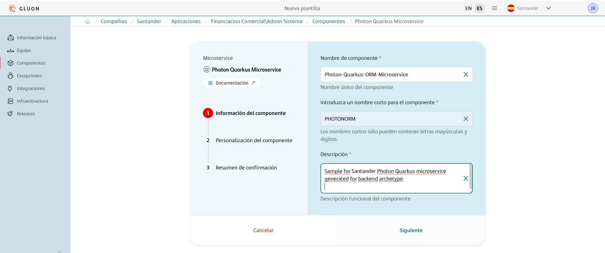
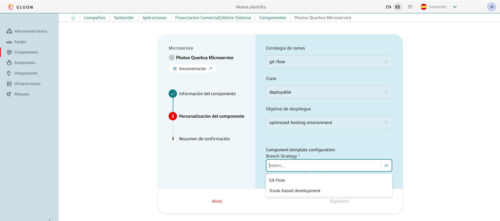
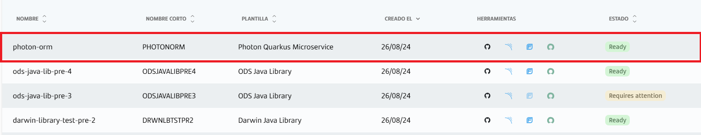

## Introduction

**Photon Microservice**  is a modern Java framework designed for building fast and efficient microservices and serverless applications. It's optimized for cloud environments, offering quick startup times and low memory usage, making it ideal for scaling
and deploying in container platforms like Kubernetes.

The purpose of this documentation is to provide a **step-by-step guide** on how to orchestrate the generation of microservices backend built with the **Photon Microservice** framework within the GLUON platform, and with Maven as the basis for
building your project.

This guide will allow you to understand how to build and deploy our microservices through a CI/CD process.

All deployments will be done in a Kubernetes cluster from an immutable image that we will previously upload to a registry (Harbor/JFROG/ECR).

## Setup your local environment

{!
   include-markdown "../../../../snippets/setup/maven-setup.md"
!}

## Create Component

### Gluon Portal

First you have to [**onboard your application.**](../../../../../application/application-management/index.md)
Once you have your application created, you can start creating your component.

To create a component, follow the steps described in [**Componnet Management**](../../../../../application/component-management/create-component.md), searching for the component to be created.

You have to select the type of component you want to create, in this case you are going to create a **Photon Microservice**.


???+ remember

    To follow the naming convention visit [Repository Naming Convention](../../../../../application/component-management/create-component.md#repository-naming-convention).

Once you have selected type of component, fill the different attribute as a show in the following image



The user can select the branch strategy that they want to implement in your workflow. For this example we have created a Photon microservice and chosen branch strategy 'git-flow' with the following characteristics:



Photon Microservice Template Parameters:

| **Input**                                  | **Required** |         **Default value**          | **Description**                                                                                        |
|--------------------------------------------|:------------:|:----------------------------------:|--------------------------------------------------------------------------------------------------------|
| **Branch Strategy**                        |     true     | git-flow/Trunk-based Development   | Git branching model that involves the use of feature branches and multiple primary branches.                                                  |
| **Class**                                  |     true     |             deployable             | Indicates the type of component being created, which is a component that should be deployed in a PaaS. |
| **Deployment target**                      |     true     |   optimized-hosting-environment    | Indicate target  hosting-environment that should be deployed in a PaaS.                                |

???+ remember

    Git-flow and Trunk-based Development (TBD) are two different approaches to managing branches in version control systems like Git.<br>
    in the case Git-flow is a branching model that defines a strict branching strategy designed, making it suitable for projects that have scheduled releases. and where stability is a priority.
    <br/> for the case TBD is a branching model that  is a simpler, more continuous integration-focused approach where developers work in short-lived branches or directly in the trunk therefore reducing the chances of conflicts and integration issues.

Once the component is created we can see under the application that there is a new repository created with the name of the component, Sonar project and Fortify project.



We have the following links in:

| Item              | Link                                     | Role Permission                                                                                                                                                                                                                  |
|-------------------|------------------------------------------|----------------------------------------------------------------------------------------------------------------------------------------------------------------------------------------------------------------------------------|
| GitHub Repository | Link to the repository created in GitHub | Developer (RW) /Technical Lead (Maintain) [All roles explained](https://docs.github.com/es/organizations/managing-user-access-to-your-organizations-repositories/managing-repository-roles/repository-roles-for-an-organization) |
| Sonar Project     | Link to the Sonar project created        | All Users (Read)                                                                                                                                                                                                                 |
| Fortify Project   | Link to the Fortify project created      | All Users (Read)                                                                                                                                                                                                                 |

### Photon Microservice Template

#### Branches

{!
   include-markdown "../../../../snippets/setup/photon-extension-branch-setup.md"
!}

#### Structure

The generated Photon extension has a structure similar to the following, only narrowing down the content changes in the src and test folders based on your selection in previous steps.

```text
📂.chart
 ┣ 📜values.yaml
 ┣ 📜values-cert.yaml
📂.github
 ┣ 📂workflows
 | ┣ 📜bluegreen-switch-workflow.yml
 | ┣ 📜maven-cd-image.yml
 | ┣ 📜maven-ci-image.yml
 | ┣ 📜maven-quality-image.yml
 | ┣ 📜maven-rc-image.yml
 | ┣ 📜maven-security-image.yml
 | ┣ 📜maven-version-validation.yml
 | ┣ 📜update-component-workflow.yml
 | ┗ 📜workflow.yml
 ┗ 📜CODEOWNERS
 📂.gluon
 ┗ 📜blank-file
📂envs
 ┗ 📜properties.env
📂src
 ┣ 📂main
 | ┣ 📂java
 | | ┗ 📂com
 | | | ┗ 📂santander
 | | | | ┗ 📂gluon
 | | | | | ┣ 📂mapper
 | | | | | | | ┗ ☕PhotonMapper.java
 | | | | | ┣ 📂model
 | | | | | | | ┗ ☕PhotonEntity.java
 | | | | | ┣ 📂repository
 | | | | | | ┗ 📂impl
 | | | | | | | ┗ ☕ PhotonRepositoryImpl.java
 | | | | | | ┗ ☕ PhotonRepository.java
 | | | | | ┣ 📂resource
 | | | | | | | ┗ ☕PhotonResource.java
 | | | | | ┣ 📂service
 | | | | | | ┗ 📂impl
 | | | | | | | ┗ ☕ PhotonServiceImpl.java
 | | | | | | ┗ ☕ ExternalDataService.java
 | | | | | | ┗ ☕ PhotonService.java
 | ┗ 📂resources
 | | ┣ 📜application.properties
 | | ┣ 📜import.sql
 | | ┗ 📜openapi.yaml
 ┗ 📂test
 | ┣ 📂java
  | | ┗ 📂com
 | | | ┗ 📂santander
 | | | | ┗ 📂gluon
 | | | | | | ┣ 📂client.resources
 | | | | | | | ┗ ☕HoverflyResource.java
 | | | | | | ┣ 📂middleware
 | | | | | | | ┗ ☕MiddlewareTest.java
 | | | | | | ┗ ☕PhotonOpenIdEndpointTest.java
 | ┗ 📂resources
 | | ┗ (*) Application test resources
📜.gitignore
📜Dockerfile
📜README.md
📜deployment.yaml
📜lombok.config
📜multiregistry.json
📜pom.xml
```

For more information on the structure and functionality of Photon microservices, please refer to the [Photon Microservice Archetype documentation](./framework/current/index.md) provided by the framework.

## Local Running

??? abstract "Cloning your repository"

    ### Cloning your repository

    Once we have the device properly configured, the first step is to clone the project locally.

    To do so, visit [**How to clone de project**](../../../../../application/component-management/create-component.md#cloning-a-repository).

??? abstract "Run your microservice"
    ### Running the microservice
    {!
       include-markdown "**/snippets/templates/photon-template.md"
       start="<!-- Start Running Microservice -->"
       end="<!-- End Running Microservice -->"
       heading-offset=-1
    !}

## Infrastructure

{!
   include-markdown "../../../../snippets/infrastructure/kubernetes.md"
!}

## Component Configuration

### Branches

{!
   include-markdown "../../../../snippets/configuration/photon-maven-configuration.md"
   start="<!--Start Gitflow Branches-->"
   end="<!--End Gitflow Branches-->"
!}

### Configuration Files

{!
   include-markdown "../../../../snippets/configuration/photon-maven-configuration.md"
   start="<!--Start Configuration Files-->"
   end="<!--End Configuration Files-->"
!}

#### Properties

=== "Photon Quarkus"

```properties
# Sonar parameters
SONAR_ID="SONAR_GLUON_COMMUNITY"
SONAR_PROJECT_KEY=""

# Docker parameters
DOCKER_BUILD_ARGUMENTS=""

# Fortify parameters
FORTIFY_PROJECT=""

JAVA_VERSION="adoptopenjdk-17.0.8+7"
```

{!
   include-markdown "../../../../snippets/configuration/photon-maven-configuration.md"
   start="<!--Start Common Properties-->"
   end="<!--End Common Properties-->"
!}

#### Dockerfile

{!
   include-markdown "../../../../snippets/configuration/maven-configuration.md"
   start="<!--Start Dockerfile-->"
   end="<!--End Dockerfile-->"
!}

#### Multiregistry

```json title="Simple multiregistry example" linenums="1"
[
{
    "registry-type": "harbor",
    "registry":   "registry.global.ccc.srvb.can.paas.cloudcenter.corp",
    "image":      "c3-alm-immutable-test/maven-micro-alonextgen",
    "usernameId": "REGISTRY_USERNAME",
    "passwordId": "REGISTRY_PASS"
}
]
```

???+ warning "Credentials and Secrets"

      Make sure the parameters `usernameId` and `passwordId` are registered as secrets in your repository and are valid credentials to deploy in the registries.

      Secrets can be set up, managed and deployed with [the vault](../../../../../application/security/security-enablers/hashicorp-vault/journeys/developer/index.md).

{!
   include-markdown "../../../../snippets/configuration/maven-configuration.md"
   start="<!--Start Multiregistry-->"
   end="<!--End Multiregistry-->"
!}

!!! info "Registry Configuration"

      These values indicate where the image of the microservice will be deployed. They do not depend on GLUON. They are specific to the application to be deployed.

#### Deployment

```yaml title="Photon Quarkus Deployment example" linenums="1"
environments:
   - name: cert
     regions:
        - name: cert
          properties:
             #         Name of the application / helm release to deploy
             #         also the value of the placeholder ${APPLICATION_NAME} usable from
             #         values files.
             application: APPLICATION
             cluster:
                #           Cluster api server url to communicate with APIs
                apiServer: https://APISERVER:APIPORT
                # Type of cloud to deploy to. Possible values: ohe, aws or azure.
                # The default value is ohe
                # cloud: ohe
                # Type of authentication. Possible values: token, kubeconfig or basic.
                # The default value is token
                # authType: token

                #           Namespace where to deploy application inside cluster
                namespace: my-namespace
                # hostname DNS without protocol of the registry associated with the cluster
                registry: DNS
                #           Here the cluster auth with 3 available methods, svc account token, user/pass
                #           or kubeconfig
                #             - Use property credentialsId setting the name of the github secret storing the token.
                #           This is the recommended method.
                # credentialsId: CREDENTIAL_ID_SECRET
                #             - Use properties credentialsUserId/credentialsPassId placing there github secret names
                #           with username and password to use to authenticate with server
                # credentialUserId: DEPLOYER_USERNAME_DEV
                # credentialPassId: DEPLOYER_PASS_DEV
                #             - use property kubeconfigFile with the name of the secret storing a kubeconfig
                #           file content to use for cluster authentication
                # kubeconfigFile: KUBE_CONFIG_FILE_SECRET
             helm:
                # Leave these properties as they are. Reference to chart to use
                # Include them in all regions you add in this file
                #           When using file references from values will need to unzip the tgz. This
                #           property set to true does the job. By default, is false
                # chartUnzip: true
                #           Chart path from repo root, will be used to locate values files in valuesFile list
                chartPath: ./.chart
                #           Optional properties to use to authenticate with helm repo.
                # repoUserCredentialId: USERNAME
                # repoPassCredentialId: PASS
                #           Property with list of values files to use, values.yaml if exists
                #           inside chartPath then will be added to the list as first element
                valuesFile:
                   - values.yaml
                   - values-cert.yaml
                   #           Set parameters to override values entries.
                   #           These are a list of key: value entries where key is the json path of the value
                   #           in the chart available values and value the value to set.
                   #           Parameters preveal over valuesFile (more priority when overiding values)
                parameters: []
   - name: pre
     regions:
        - name: pre
          properties:
             application: APPLICATION
             cluster:
                apiServer: https://APISERVER:APIPORT
                namespace: my-namespace
                registry: DNS
                credentialUserId: DEPLOYER_USERNAME_DEV
                credentialPassId: DEPLOYER_PASS_DEV
             helm:
                chartPath: ./.chart
                valuesFile:
                   - values.yaml
                   - values-pre.yaml
                parameters: []
   - name: pro
     regions:
        - name: pro
          properties:
             application: APPLICATION
             cluster:
                apiServer: https://APISERVER:APIPORT
                namespace: my-namespace
                registry: DNS
                credentialUserId: DEPLOYER_USERNAME_DEV
                credentialPassId: DEPLOYER_PASS_DEV
             helm:
                chartPath: ./.chart
                valuesFile:
                   - values.yaml
                   - values-pro.yaml
                parameters: []
gluon:
   framework: arsenalback # do not change this line
```

!!! info "Cluster Configuration"

      These values indicate where the microservice will be deployed. They do not depend on **GLUON**. They are specific to the application to be deployed.

!!! info "Cluster Authentication"

      There are three ways to authenticate against a Cluster:

      - **credentialsId**: Use property credentialsId setting the name of the github secret storing the token. **This is the recommended method**.
      - **credentialUserId** / **credentialPassId**: Use properties credentialsUserId/credentialsPassId placing there github secret names with username and password to use to authenticate with server.
      - **kubeconfigFile**: Use property kubeconfigFile with the name of the secret storing a kubeconfig file content to use for cluster authentication

!!! info "Helm Configuration"

      The **repo**,**project**,**chart**,**version** values will arrive correctly populated with the helm chart required for deployment.

{!
   include-markdown "../../../../snippets/configuration/photon-maven-configuration.md"
   start="<!--Start Deployment-->"
   end="<!--End Deployment-->"
!}

#### Helm Configuration

You must have the next files in the root of your project with the following structure:

- **values.yaml**: Helm values file with the default values to deploy the microservice
- **values-cert.yaml**: Helm values file with the values to deploy the microservice in the Cert environment

``` bash
📂/.chart
 ┣ 📜values.yml
 ┗ 📜values-cert.yml
```

Examples of values files:

=== "values.yaml"

      ```yaml linenums="1"
      # Default values for arsenal micro-java chart.
      # This is a YAML-formatted file.
      # Declare variables to be passed into your templates.
      ## Active
      active: online

      ## @section Common parameters

      ## @param commonLabels [object] Labels to add to all deployed objects
      ##
      commonLabels: {}
      ## @param commonAnnotations [object] Annotations to add to all deployed objects
      ##
      commonAnnotations: {}
      ## @param podLabels [object] Extra labels for the micro service pods
      ## Ref: https://kubernetes.io/docs/concepts/overview/working-with-objects/labels/
      ##
      podLabels: {}
      ## @param podAnnotations [object] Annotations for the micro service pods
      ## ref: https://kubernetes.io/docs/concepts/overview/working-with-objects/annotations/
      ##
      podAnnotations: {}

      ## Arsenal Micro Service image version
      ## @param image.registry arsenal micro image registry
      ## @param image.repository arsenal micro image name
      ## @param image.tag arsenal micro image tag
      ## @param image.digest arsenal micro image digest in the way sha256:aa.... Please note this parameter, if set, will override the tag
      # Here is an example file for deploying a Arsenal micro-service with the micro-java helm chart.
      # It is necessary to reference this file in the deployment.yaml
      # Documentation of all available parameters can be found at
      #   https://gluon.gs.corp/community/docs/latest/application/arsenal/arsenal-java/current/arsenal-helm/
      # This example has the minimum necessary parameters to be able to perform the deployment.
      # Please update the values with the correct ones for your project.
      image:
      ## @param image.registry micro image registry
      repository: my-project-name/my-image-name
      ## @param image.repository micro image name
      # With ${REGISTRY} placeholder this will be replaced by the registry value of
      # cluster properties block for each region
      registry: ${REGISTRY}
      ## @param image.tag micro image tag
      ## Use ${TAG_VERSION} for the value will use the same version of pom.xml.
      tag: ${TAG_VERSION}
      digest: ""
      ## @param image.pullPolicy arsenal micro image pull policy
      ## Specify a imagePullPolicy
      ## Defaults to 'Always' if image tag is 'latest', else set to 'IfNotPresent'
      ## ref: https://kubernetes.io/docs/user-guide/images/#pre-pulling-images
      ##
      pullPolicy: IfNotPresent

      ## @param replicaCount Number of replicas of the micro service pod
      ##
      replicaCount: 1

      ## @param lifecycle [object] Override default micro service container hooks
      ## If you do not set this property, the default hook is:  `{lifecycle: {preStop: {exec: {command: [sleep 120]}}}}`
      ##
      lifecycle: {}

      ## @param terminationGracePeriodSeconds In seconds, time the given to the pod needs to terminate gracefully
      ## ref: https://kubernetes.io/docs/concepts/workloads/pods/pod/#termination-of-pods
      ##
      terminationGracePeriodSeconds: 300

      ## photon Micro Service pods' Security Context
      ## ref: https://kubernetes.io/docs/tasks/configure-pod-container/security-context/#set-the-security-context-for-a-pod
      ## @param podSecurityContext.enabled Enable security context for the pods
      ## @param podSecurityContext.fsGroup Set Arsenal Micro Service pod's Security Context fsGroup
      ## e.g:
      ##   podSecurityContext:
      ##     enabled: true
      ##     fsGroup: 1001
      ##
      podSecurityContext:
      enabled: false

      ## Arsenal Micro Service containers' Security Context
      ## ref: https://kubernetes.io/docs/tasks/configure-pod-container/security-context/#set-the-security-context-for-a-container
      ## @param containerSecurityContext.enabled Enable Arsenal Micro Service containers' Security Context
      ## @param containerSecurityContext.runAsUser Set Arsenal Micro Service containers' Security Context runAsUser
      ## @param containerSecurityContext.runAsNonRoot Set Arsenal Micro Service containers' Security Context runAsNonRoot
      ## @param containerSecurityContext.allowPrivilegeEscalation Force the child process to be run as nonprivilege
      ## e.g:
      ##   containerSecurityContext:
      ##     enabled: true
      ##     runAsUser: 1001
      ##     runAsNonRoot: true
      ##     allowPrivilegeEscalation: false
      ##
      containerSecurityContext:
      enabled: false

      ## Configures the ports microservice listens on
      ## @param containerPorts.http Sets http port inside container
      ## @param containerPorts.https Sets https port inside container
      ##
      containerPorts:
      http: 8080
      https: 8443

      ## @param extraContainerPorts Array of additional container ports for the container
      ## e.g:
      ## extraContainerPorts:
      ##   - name: grpc
      ##     containerPort: 4317
      ##
      extraContainerPorts: []

      ## arsenal microservices containers resource requests and limits
      ## ref: https://kubernetes.io/docs/user-guide/compute-resources/
      ## @param resources.limits [object] The resources limits for the etcd container
      ## @param resources.requests [object] The requested resources for the etcd container
      ##
      resources:
      ## Example:
      ## limits:
      ##    cpu: 500m
      ##    memory: 1Gi
      ##
      limits:
      memory: 2G
      cpu: 1000m
      requests:
      memory: 500M
      cpu: 200m

      ## @param updateStrategy.rollingUpdate deployment rolling update configuration parameters
      ## ref: https://kubernetes.io/docs/concepts/workloads/controllers/deployment/#strategy
      ## Note: Set to Recreate if you use persistent volume that cannot be mounted by more than one pods to make sure the pods is destroyed first.
      ## E.g:
      ## updateStrategy:
      ##  type: RollingUpdate
      ##  rollingUpdate:
      ##    maxSurge: 25%
      ##    maxUnavailable: 25%
      ##
      updateStrategy:
      type: RollingUpdate
      rollingUpdate: {}

      ## Configure extra options for liveness probe
      ## ref: https://kubernetes.io/docs/tasks/configure-pod-container/configure-liveness-readiness-startup-probes/#configure-probes
      ## @param livenessProbe.enabled Enable livenessProbe by default /actuator/health/liveness
      ## @param livenessProbe.initialDelaySeconds Initial delay seconds for livenessProbe
      ## @param livenessProbe.periodSeconds Period seconds for livenessProbe
      ## @param livenessProbe.timeoutSeconds Timeout seconds for livenessProbe
      ## @param livenessProbe.failureThreshold Failure threshold for livenessProbe
      ## @param livenessProbe.successThreshold Success threshold for livenessProbe
      ##
      livenessProbe:
      enabled: true
      failureThreshold: 3
      initialDelaySeconds: 200
      periodSeconds: 10
      successThreshold: 1
      timeoutSeconds: 1

      ## Configure extra options for readiness probe
      ## ref: https://kubernetes.io/docs/tasks/configure-pod-container/configure-liveness-readiness-startup-probes/#configure-probes
      ## @param readinessProbe.enabled Enable readinessProbe, by default /actuator/health/readiness
      ## @param readinessProbe.initialDelaySeconds Initial delay seconds for readinessProbe
      ## @param readinessProbe.periodSeconds Period seconds for readinessProbe
      ## @param readinessProbe.timeoutSeconds Timeout seconds for readinessProbe
      ## @param readinessProbe.failureThreshold Failure threshold for readinessProbe
      ## @param readinessProbe.successThreshold Success threshold for readinessProbe
      readinessProbe:
      enabled: true
      failureThreshold: 3
      initialDelaySeconds: 15
      periodSeconds: 10
      successThreshold: 1
      timeoutSeconds: 1

      ## @param customLivenessProbe [object] Override default liveness probe
      ##
      customLivenessProbe: {}

      ## @param customReadinessProbe [object] Override default readiness probe
      ##
      customReadinessProbe: {}

      ## @param extraEnvVars Extra environment variables to be set on Node container
      ## For example:
      ##  - name: BEARER_AUTH
      ##    value: true
      ##  - name: ARSENAL_CM_KEY
      ##    valueFrom:
      ##      configMapKeyRef:
      ##        name: "cm4"
      ##        key: LOGGING_ROOT_LEVEL
      ##        optional: false
      ##  - name: PHOTONSECRET_KEY
      ##    valueFrom:
      ##      secretKeyRef:
      ##        name: "datagrid-app"
      ##        key: "application-password"
      ##        optional: false
      ##
      extraEnvVars: []

      ## @param extraEnvVarsCM Name of existing ConfigMap containing extra environment variables
      ##
      extraEnvVarsCM:

      ## @param extraEnvVarsSecret Name of existing Secret containing extra environment variables
      ##
      extraEnvVarsSecret:

      ## @param extraVolumes Optionally specify extra list of additional volume for the container(s)
      ## For example:
      ## - name: data
      ##   persistentVolumeClaim:
      ##   claimName: test-volumes
      ##
      extraVolumes: []

      ## @param extraVolumeMounts Optionally specify extra list of additional volumeMounts for the container(s)
      ## For example:
      ## - mountPath: /opt/test
      ##   name: data
      ##
      extraVolumeMounts: []

      ## @param controller.initContainers Add additional init containers to the Controller pods
      ## ref: https://kubernetes.io/docs/concepts/workloads/pods/init-containers/
      ## E.g:
      ## initContainers:
      ##   - name: your-image-name
      ##     image: your-image
      ##     imagePullPolicy: Always
      ##     ports:
      ##       - name: portname
      ##         containerPort: 1234
      ##
      initContainers: []

      ## @section service configuration
      ##
      service:
      type: ClusterIP
      ## @param service.ports.http Service HTTP port
      ## @param service.ports.https Service HTTPS port
      ##
      ports:
      http: 8080
      https: 8443
      targetPort:
      http: 8080
      https: 8443
      ## @param service.annotations [object] Additional annotations for the service of the micro
      ##
      annotations: {}

      ## @section server TLS configuration

      ## TLS configuration
      ##
      ssl:
      ## @param ssl.enabled Enable init container that generate the truststore and keystore
      ##
      enabled: false
      ## @param ssl.image.registry Init container cert-store-generation registry name
      ## @param ssl.image.repository Init container cert-store-generation image name
      ## @param ssl.image.tag Init container cert-store-generation image tag

      image:
      registry: registry.global.ccc.srvb.bo.paas.cloudcenter.corp
      repository: produban/init-certs-container
      tag: 1.0.0.RELEASE
      ## @param ssl.image.pullPolicy Init container cert-store-generation image pull policy
      ## Defaults to 'Always' if image tag is 'latest', else set to 'IfNotPresent'
      ## ref: https://kubernetes.io/docs/user-guide/images/#pre-pulling-images    
      pullPolicy: IfNotPresent
      ## Init container resource requests and limits
      ## ref: https://kubernetes.io/docs/user-guide/compute-resources/
      ## If you do want to specify resources, uncomment the following
      ## lines, adjust them as necessary, and remove the curly braces after 'resources:'.
      ## @param ssl.resources.limits [object] Init container ssl- resource  limits
      ## @param ssl.resources.requests [object] Init container cert-store-generation resource requests
      ##
      resources:
      ## Example:
      ## limits:
      ##    cpu: 500m
      ##    memory: 1Gi
      ##
      limits: {}
      ## Examples:
      ## requests:
      ##    cpu: 100m
      ##    memory: 128Mi
      ##
      requests: {}
      ## @param ssl.keystorePassword Password for the keystore to create. If no value is specified, a random password is generated.
      ##
      keystorePassword: ""
      ## @param ssl.truststorePassword Password for the truststore to create. If no value is specified, a random password is generated.
      ##
      truststorePassword: ""

      ## @section Arsenal configuration

      ## Photon Microservice Framework parameters
      ##
      photon:
         ## @param photon.frameworkType. Photon Framework Type.
         ## Examples values: `Backend`, `Integration`
         frameworkType: "Backend"
         ## @param photon.version. Photon Framework Version.
         ## Examples values: `3.6.2`, `3.7.0`, `3.7.1`
         version: "3.7.1"
         ## @param photon.gitRepo. Git repository with the source code of the microservice.
         ## Example value: `https://github.com/santander-group-gluon/gln-back-arsenal-backend-spring.git`
         gitRepo: "https://github.com/santander-group-gluon/gln-back-arsenal-backend-spring.git"
         ## @param photon.region. Cluster identifier.
         ## Possible values: `""`, `bo1`, `bo2`, `weu1.az` or `weu2.az`
         region: ""
         ## @param photon.sufix. Suffix to blue green deployments.
         ## Possible values: `""`, `-b` or `-g`
         suffix: ""
         logging_level_root: INFO
         tz: America/Sao_Paulo
         ## @param photon.configType Allows to set the configuration from ConfigMap or Configuration Service
         ## It indicates the location from which the configuration is retrieved.
         ## Four possible values are allowed:
         ##  - "cm" creates a Kubernetes ConfigMap with the name cm-{app_name}. It will be mounted.
         ##  - "secret" creates a Kubernetes Secret with the name secret-{app_name}. It will be mounted.
         ##  - "cm-secret" creates a Kubernetes ConfigMap with name cm-{app_name} and a Kubernetes Secret with name secret-{app_name}. They will be mounted.
         ##  - "configserver" to use Spring Cloud Configuration Server.
         configType: ""
         quarkus:
           profiles: dev
           cloud_config:
           failfast: true
           # Values to connect with Configuration Service
           uri_http: http://configuration-service${arsenal.suffix}:8080
           uri_https: https://configuration-service${arsenal.suffix}.${PROJECT_NAME}.svc.cluster.local:8443
           username:
           password:
           retry:
            initialInterval : 3000
            maxInterval : 6000
            maxAttempts : 10  
         java:
           opts_ext: "-Djava.security.egd=file:/dev/./urandom -Dfile.encoding=UTF-8 -XX:ActiveProcessorCount=2 -XX:MaxRAMPercentage=60.0 -XX:+UseParallelGC"
           parameters:
      ```

=== "values-cert.yaml"

      ```yaml linenums="1"
      # Here is an example file of how to give deployment values for a specific environment.
      # It is necessary to reference this file in the deployment.yaml
      image:
        ## @param image.pullPolicy photon micro image pull policy
        ## Specify a imagePullPolicy
        ## ref: https://kubernetes.io/docs/user-guide/images/#pre-pulling-images
        ## Default value is 'IfNotPresent', but if you want to always pull the image set it to 'Always'
        ## This could the key of cert environment because we want to deploy different images with the same tag SNAPSHOT
        pullPolicy: Always

      photon:
        quarkus:
           # Set profile value. It is used to logging porpoises and to select spring profile
           profiles: cert
      ```

??? note "All Helm Configuration parameters"

     | **Parameter**            | **Description**                                                                                        |
     |--------------------------|--------------------------------------------------------------------------------------------------------|
     | image.repository         | Name of the project and image that we are going to deploy to Kubernetes with HELM                      |
     | image.registry           | Registry from where we are going to retrieve the image for our deployment                              |
     | photon.gitRepo           | Url of the microservice repository in GitHub                                                           |
     | photon.region            | Region where we are going to deploy the microservice                                                   |
     | photon.configType        | We must configure the use of configmap, for this it will be necessary to indicate "cm"                 |     
     | photon.version           | Version that we are going to deploy of our microservice                                                |     

### Secrets Configuration

{!
   include-markdown "../../../../snippets/configuration/maven-configuration.md"
   start="<!--Start Github Secrets-->"
   end="<!--End Github Secrets-->"
!}

## Build and Deploy your application

{!
   include-markdown "../../../../snippets/lifecycle/gitflow.md"
!}
