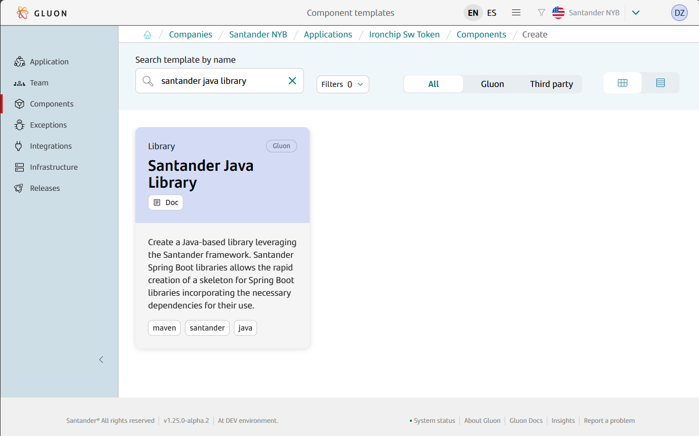
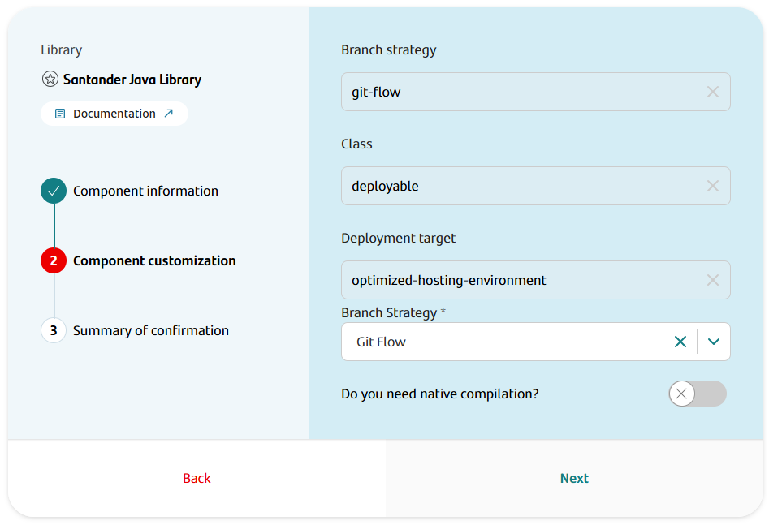
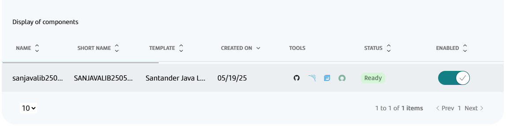

## Introduction

The purpose of this documentation is to provide a **step-by-step guide** on how to deploy a library built with the **Santander Spring Boot** framework within the GLUON platform, and with Maven as the basis for building your project.

This guide will allow you to understand how to build and deploy our library through a CI/CD process.

All deployments will be done in corporate [Nexus](https://nexus.alm.europe.cloudcenter.corp/).

## Setup your local environment

{!
   include-markdown "../../../../snippets/setup/maven-setup.md"
!}

## Create Component

### Gluon Portal

First you have to [**onboard your application.**](../../../../..//index.md)
Once you have your application created, you can start creating your component.

To create a component, follow the steps described in [**Component Management**](../../../../../application/component-management/create-component.md),
searching for the component to be created.

You have to select the type of component you want to create, in this case you are going to create a **Santander Spring Boot Library**.



???+ remember

    To follow the naming convention visit [Repository Naming Convention](../../../../../application/component-management/create-component.md#repository-naming-convention).

The user can customize the type of application that they want to create. For this example we have created a Santander Spring Boot microservice with the following characteristics:



- **Branch Strategy**: git-flow
- **Class**: deployable
- **Deployment target**: optimized-hosting-environment
- **Branch Strategy**: Git Flow
- **Native Compilation**: False

Once the component is created we can see under the application that there is a new repository created with the name of the component, Sonar project and Fortify project.



We have the following links in:

| Item | Link | Role Permission |
| --- | --- | --- |
| GitHub Repository | Link to the repository created in GitHub | Developer (RW) /Technical Lead (Maintain) [All roles explained](https://docs.github.com/es/organizations/managing-user-access-to-your-organizations-repositories/managing-repository-roles/repository-roles-for-an-organization) |
| Sonar Project | Link to the Sonar project created | All Users (Read) |
| Fortify Project | Link to the Fortify project created | All Users (Read) |

### Santander Spring Boot Library Template

#### Git Flow

##### Branches

{!
   include-markdown "../../../../snippets/setup/branch-library-setup.md"
!}

##### Structure

The generated Santander library has a structure similar to the following:

``` bash
📂.github
 ┣ 📂workflows
 | ┣ 📜ci-fix-gfw.yml
 | ┣ 📜ci-gfw.yml
 | ┣ 📜create-release-branch.yml
 | ┣ 📜sntander-sb-code-analysis.yml
 | ┣ 📜quality.yml
 | ┣ 📜release-fix-gfw.yml
 | ┣ 📜release-gfw.yml
 | ┣ 📜security.yml
 | ┣ 📜update-component-workflow.yml
 | ┗ 📜version-validation.yml
 ┗ 📜CODEOWNERS
📂.gluon
 ┗ 📂ci
    ┗ 📜properties.env
📂src
 ┣ 📂main
 | ┣ 📂java
 | | ┗ (*) Library java files
 | ┗ 📂resources
 | | ┗ (*) Library resources
 ┗ 📂test
 | ┣ 📂java
 | | ┗ (*) Library test java files
 | ┗ 📂resources
 | | ┗ (*) Library test resources
📜lombok.config
📜pom.xml
📜README.adoc
```

#### Trunk Based Development

##### Branches

{!
include-markdown "../../../../snippets/setup/branch-library-tbd-setup.md"
!}

##### Structure

The generated Santander Spring Boot library has a structure similar to the following:

``` bash
📂.github
 ┣ 📂workflows
 | ┣ 📜ci-tbd.yml
 | ┣ 📜create-release-branch.yml
 | ┣ 📜santander-code-analysis.yml
 | ┣ 📜quality.yml
 | ┣ 📜release-tbd.yml
 | ┣ 📜security.yml
 | ┣ 📜update-component-workflow.yml
 | ┗ 📜version-validation.yml
 ┗ 📜CODEOWNERS
📂.gluon
 ┗ 📂ci
    ┗ 📜properties.env
📂src
 ┣ 📂main
 | ┣ 📂java
 | | ┗ 📂com
 | | | ┗ 📂santander
 | | | | ┗ 📂glnapp
 | | | | | ┗ 📂sovkofaxlibstart
 | | | | | | ┣ 📂config
 | | | | | | | ┣ ☕HelloWorldAutoConfig.java
 | | | | | | | ┗ ☕HelloWorldConfigProperties.java
 | | | | | | ┗ 📂components
 | | | | | | | ┗ ☕HelloWorldBean.java
 | ┗ 📂resources
 | | ┣ 📂META-INF
 | | | ┗ 📂spring
 | | | | ┗ 📜org.springframework.boot.autoconfigure.AutoConfiguration.imports
 ┗ 📂test
 | ┣ 📂java
 | | ┗ 📂com
 | | | ┗ 📂santander
 | | | | ┗ 📂glnapp
 | | | | | ┗ 📂sovkofaxlibstart
 | | | | | | ┣ 📂config
 | | | | | | | ┣ ☕HelloWorldAutoConfigTest.java
 | | | | | | | ┗ ☕HelloWorldConfigPropertiesTest.java
 | | | | | | ┗ 📂components
 | | | | | | | ┗ ☕HelloWorldBeanTest.java
 | ┗ 📂resources
 | | ┗ 📜application.yml
📜lombok.config
📜pom.xml
📜README.adoc
```

For more information on the structure and functionality of Santander Spring Boot Library archetype, please refer to the
 <!-- [Santander Spring Boot Library Archetype documentation](framework/current/antander-sb-archetypes/santander-spring-boot-archetype-library/README.md) --> provided.

## Local Running

??? abstract "Cloning your repository"

    ### Cloning your repository

    Once we have the device properly configured, the first step is to clone the project locally.

    To do so, visit [**How to clone the project**](../../../../../application/component-management/create-component.md#cloning-a-repository).

## Infrastructure

All deployments will be done in corporate [Nexus](https://nexus.alm.europe.cloudcenter.corp/).

## Component Configuration

### Branches

{!
   include-markdown "../../../../snippets/configuration/maven-configuration.md"
   start="<!--Start Gitflow Branches-->"
   end="<!--End Gitflow Branches-->"
!}
{!
   include-markdown "../../../../snippets/configuration/maven-configuration.md"
   start="<!--Start TBD Branches-->"
   end="<!--End TBD Branches-->"
!}

## Build and Deploy your application

{!
   include-markdown "../../../../snippets/lifecycle/gitflow-library-santander.md"
!}

{!
include-markdown "../../../../snippets/lifecycle/tbd-library-santander.md"
!}

## Fix/Release Flow

{!
   include-markdown "../../../../snippets/lifecycle/fix-release-flow.md"
!}
