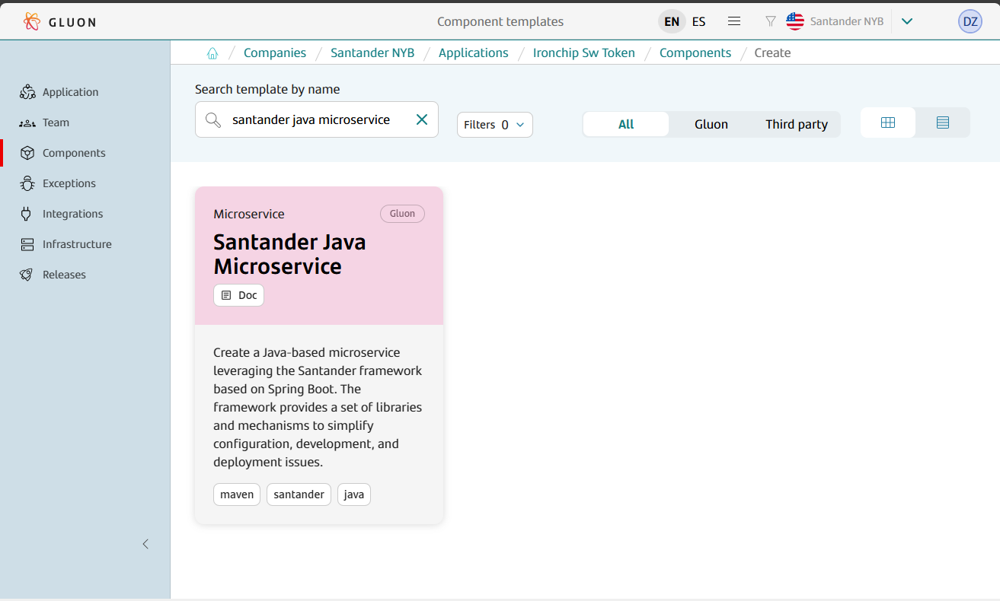
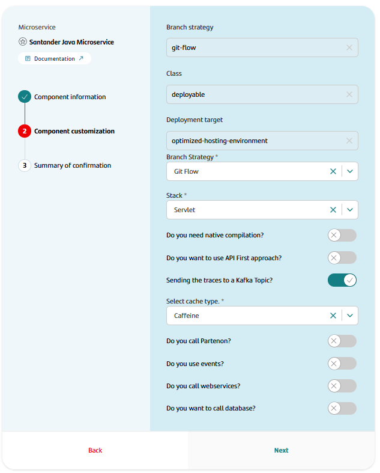
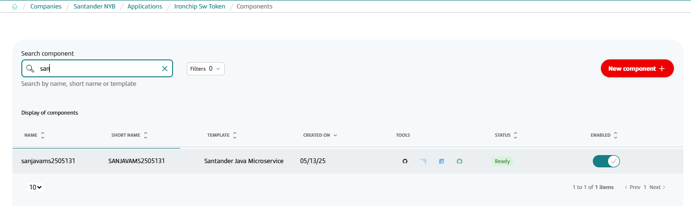

## Introduction

The purpose of this documentation is to provide a **step-by-step guide** on how to orchestrate the integration of microservices built with the **Santander Spring Boot** framework
within the GLUON platform, and with Maven as the basis for building your project.

This guide will allow you to understand how to build and deploy our microservices through a CI/CD process.

All deployments will be done in a Kubernetes cluster from an immutable image that we will previously upload to a registry (Harbor/JFROG/ECR).

## Setup your local environment

{!
   include-markdown "../../../../snippets/setup/maven-setup.md"
!}

## Create Component

### Gluon Portal

First, you have to [**onboard your application.**](../../../../../application/application-management/index.md)
Once you have your application created, you can start creating your component.

To create a component,
follow the steps described in [**Component Management**](../../../../../application/component-management/create-component.md),
searching for the component to be created.

You have to select the type of component you want to create,
in this case you are going to create a **Santander Spring Boot Microservice**.



???+ remember

    To follow the naming convention visit [Repository Naming Convention](../../../../../application/component-management/create-component.md#repository-naming-convention).

The user can customize the type of application that they want to create.
For this example, we have created a Santander microservice with the following characteristics:



Santander Spring Boot Microservice Template Parameters:

| **Input**                                  | **Required** |       **Default value**       | **Description**                                                                                                                               |
|--------------------------------------------|:------------:|:-----------------------------:|-----------------------------------------------------------------------------------------------------------------------------------------------|
| **Branch Strategy**                        |     true     |           git-flow            | Git branching model that involves the use of feature branches and multiple primary branches.                                                  |
| **Class**                                  |     true     |          deployable           | Indicates the type of component being created, which is a component that should be deployed in a PaaS.                                        |
| **Deployment target**                      |     true     | optimized-hosting-environment | Indicate target  hosting-environment that should be deployed in a PaaS.                                                                       |
| **Branch Strategy**                        |     true     |           git-flow            | Git branching model that involves the use of feature branches and multiple primary branches.                                                  |
| **Stack**                                  |     true     |            Servlet            | Indicate archetype application as WebApplicationType (SERVLET and REACTIVE) based on the runtime environments.                                |
| **Do you need native compilation**         |    false     |              No               | If you want to create a microservice that be able to compile as a native image with GraalVM.                                                  |
| **Do you want to use API First approach?** |    false     |              No               | Indicates that the app will be generated as an API First and adds the necessary generator based on sample OpenApi Specification file.         |
| **OpenAPI contract**                       |    false     |             Empty             | Attach the URL with the "OpenAPI file" specification.                                                                                         |
| **Sending the traces to a kafka Topic**    |    false     |              Yes              | Indicates that the app load kafka appenders for logging.                                                                                      |
| **Cache type**                             |     true     |           caffeine            | Sets the type of cache to be incorporated into the application. Possible values: caffeine, infinispan and dual.                               |
| **Do you call Partenon?**                  |    false     |              No               | Indicates that you want to incorporate the component with the partenon connector (and partenon maven-plugin) into the application.            |
| **Do you use events?**                     |    false     |              No               | Indicates that you want to incorporate the events component into the application.                                                             |
| **Do you call webservices?**               |    false     |              No               | Indicates that you want to incorporate the webservice component into the application.                                                         |
| **Do you want to call database?**          |    false     |              No               | Indicates that you want to incorporate the component with a database connector into the application. Only available for servlet applications. |
| **Select database type**                   |    false     |            Oracle             | Indicates with what database type (Oracle or PostgreSQL) the microservice will communicate with.                                              |

??? abstract "Steps to build microservices using API First approach"

    1. Select "YES" into the combo "Do you want to use API First approach?".
    2. Once the input "OpenAPI Contract" is shown, you can attach the URL to the "OpenAPI file" specification.
    3. When no file is attached, Santander provides an "openapi.yaml" file under "resources/config" folder with a sample "OpenAPI Specification" file, as default configuration.

Once the component is created,
we can see under the application that there is a new repository created with the name of the component,
Sonar project and Fortify project.



We have the following links in:

| Item              | Link                                     | Role Permission                                                                                                                                                                                                                  |
|-------------------|------------------------------------------|----------------------------------------------------------------------------------------------------------------------------------------------------------------------------------------------------------------------------------|
| GitHub Repository | Link to the repository created in GitHub | Developer (RW) /Technical Lead (Maintain) [All roles explained](https://docs.github.com/es/organizations/managing-user-access-to-your-organizations-repositories/managing-repository-roles/repository-roles-for-an-organization) |
| Sonar Project     | Link to the Sonar project created        | All Users (Read)                                                                                                                                                                                                                 |
| Fortify Project   | Link to the Fortify project created      | All Users (Read)                                                                                                                                                                                                                 |

### Santander Spring Boot Microservice Template

#### Git Flow

##### Branches

{!
   include-markdown "../../../../snippets/setup/branch-setup.md"
!}

##### Structure

The generated Santander Spring Boot microservice has a structure similar to the following, only narrowing down the content changes in the src and test folders based on your selection in previous steps.

```text
📂.github
┣ 📂workflows
┃ ┣ 📜cd.yml
┃ ┣ 📜ci-gfw.yml
┃ ┣ 📜version-validation.yml
┃ ┣ 📜quality.yml
┃ ┣ 📜release-gfw.yml
┃ ┗ 📜security.yml
┃ ┗ 📜update-component-workflow.yml
┗ 📜CODEOWNERS
📂.mvn
┣ 📂wrapper
| ┣ 📜maven-wrapper.jar
| ┗ 📜maven-wrapper.properties  
📂.gluon
┣ 📂cd
┃ ┣ 📂cert
┃ ┃ ┣ 📜cd.yml
┃ ┃ ┗ 📜values-cert.yml
┃ ┣ 📂pre
┃ ┃ ┣ 📜cd.yml
┃ ┃ ┗ 📜values-pre.yml
┃ ┣ 📂pro
┃ ┃ ┣ 📜cd.yml
┃ ┃ ┗ 📜values-pro.yml
┃ ┗ 📜values.yaml
┗ 📂ci
┃ ┗ 📜properties.env
📂src
 ┣ 📂main
 | ┣ 📂java
 | | ┗ (*) Application java files
 | ┗ 📂resources
 | | ┗ (*) Application resources
 ┗ 📂test
 | ┣ 📂java
 | | ┗ (*) Application test java files
 | ┗ 📂resources
 | | ┗ (*) Application test resources
📜CHANGELOG.md
📜Dockerfile
📜Dockerfile.native
📜lombok.config
📜mvnw
📜mvnw.cmd
📜pom.xml
📜README.md
```

#### Trunk Based Development

##### Branches

{!
include-markdown "../../../../snippets/setup/branch-setup-tbd.md"
!}

##### Structure

The generated microservice has a structure similar to the following, only narrowing down the content changes in the src and test folders based on your selection in previous steps.

```text
📂.github
┣ 📂workflows
┃ ┣ 📜cd.yml
┃ ┣ 📜ci-tbd.yml
┃ ┣ 📜santander-code-analysis.yml
┃ ┣ 📜quality.yml
┃ ┣ 📜release-tbd.yml
┃ ┣ 📜security.yml
┃ ┣ 📜update-component-workflow.yml
┃ ┗ 📜version-validation.yml
┗ 📜CODEOWNERS
📂.mvn
┣ 📂wrapper
| ┣ 📜maven-wrapper.jar
| ┗ 📜maven-wrapper.properties  
📂.gluon
┣ 📂cd
┃ ┣ 📂cert
┃ ┃ ┣ 📜cd.yml
┃ ┃ ┗ 📜values-cert.yml
┃ ┣ 📂pre
┃ ┃ ┣ 📜cd.yml
┃ ┃ ┗ 📜values-pre.yml
┃ ┣ 📂pro
┃ ┃ ┣ 📜cd.yml
┃ ┃ ┗ 📜values-pro.yml
┃ ┗ 📜values.yaml
┗ 📂ci
┃ ┗ 📜properties.env
📂src
 ┣ 📂main
 | ┣ 📂java
 | | ┗ (*) Application java files
 | ┗ 📂resources
 | | ┗ (*) Application resources
 ┗ 📂test
 | ┣ 📂java
 | | ┗ (*) Application test java files
 | ┗ 📂resources
 | | ┗ (*) Application test resources
📜CHANGELOG.md
📜Dockerfile
📜Dockerfile.native
📜lombok.config
📜mvnw
📜mvnw.cmd
📜pom.xml
📜README.md
```

???+ info "Note"

      For more information on the structure and functionality of Santander Spring Boot microservices,
      please refer to the [Santander Spring Boot Microservice Archetype documentation](./framework/current/santander-archetypes/santander-spring-boot-archetype-microservice/README.md)
      provided by the framework.

## Local Running

??? abstract "Cloning your repository"

    ### Cloning your repository

    Once we have the device properly configured, the first step is to clone the project locally.

    To do so, visit [**How to clone de project**](../../../../../application/component-management/create-component.md#cloning-a-repository).

??? abstract "Run your microservice"
    ### Running the microservice
    {!
       include-markdown "**/snippets/templates/santander-template.md"
       start="<!-- Start Running Microservice -->"
       end="<!-- End Running Microservice -->"
       heading-offset=-1
    !}

## Infrastructure

{!
   include-markdown "../../../../snippets/infrastructure/kubernetes.md"
!}

### How to configure your deployment environment

{!
   include-markdown "../../snippets/snippet-oam.md"
   start="<!--Start Infrastructure 2.0-->"
   end="<!--End Infrastructure 2.0-->"
!}

## Component Configuration

### Branches

{!
   include-markdown "../../../../snippets/configuration/maven-configuration.md"
   start="<!--Start Gitflow Branches-->"
   end="<!--End Gitflow Branches-->"
!}

{!
   include-markdown "../../../../snippets/configuration/maven-configuration.md"
   start="<!--Start TBD Branches-->"
   end="<!--End TBD Branches-->"
!}

### Configuration Files

{!
   include-markdown "../../../../snippets/configuration/maven-configuration.md"
   start="<!--Start Configuration Files 2.0-->"
   end="<!--End Configuration Files 2.0-->"
!}

#### Properties

The location of the properties.env is:

``` bash
📂.gluon
┗ 📂ci
  ┗ 📜properties.env
```

=== "Santander Spring Boot Example"

```properties
# Sonar parameters
SONAR_PROJECT_KEY="real-sonar-project-key"

# Fortify parameters
FORTIFY_PROJECT="real-fortify-project-key"

JAVA_VERSION="adoptopenjdk-17.0.7+7"

ARTIFACT_NATIVE_COMPILATION=false
```

For getting more information about this file,
please refer to [Continuous Integration file documentation](../../../../../application/ci-cd/cd/cd-rm/cd-workflow/ci-envs-configuration.md).

{!
   include-markdown "../../../../snippets/configuration/maven-configuration.md"
   start="<!--Start Common Properties-->"
   end="<!--End Common Properties-->"
!}

##### Activate native compilation

If you want to create a microservice that can be compiled as a native image with GraalVM, you must set the `ARTIFACT_NATIVE_COMPILATION` parameter to `true` and select the GraalVM version in the `JAVA_VERSION` parameter `oracle-graalvm-21.0.1`.
Also, it is necessary that the microservice has been created with native compilation option active.

???+ note "Using GraalVM Java 21"

      We are using GraalVM Java 21.0.1 to compile the microservice as a native image but our pipeline does not support java 21, so you have to keep `<java.version>` property in `pom.xml with value `17`

#### Dockerfile

{!
   include-markdown "../../../../snippets/configuration/maven-configuration.md"
   start="<!--Start Dockerfile-->"
   end="<!--End Dockerfile-->"
!}

!!! info "Registry Configuration"

      These values indicate where the image of the microservice will be deployed. They do not depend on GLUON. They are specific to the application to be deployed.

#### Continuous Deployment files

{!
   include-markdown "../../../../snippets/configuration/maven-configuration.md"
   start="<!--Start Deployment 2.0-->"
   end="<!--End Deployment 2.0-->"
!}

#### Helm Configuration

You must have the next files in the `.gluon/cd` folder of your project with the following structure:

``` bash
📂.gluon
┣ 📂cd
┃ ┣ 📂cert
┃ ┃ ┗ 📜values-cert.yml
┃ ┣ 📂pre
┃ ┃ ┗ 📜values-pre.yml
┃ ┣ 📂pro
┃ ┃ ┗ 📜values-pro.yml
┗ ┗ 📜values.yaml
```

Description of the files:

- **values.yaml**: Helm values file with the default values to deploy the microservice.
- **values-cert.yaml**: Helm values file with the values to deploy the microservice in the CERT environment.
- **values-pre.yaml**: Helm values file with the values to deploy the microservice in the PRE environment.
- **values-pro.yaml**: Helm values file with the values to deploy the microservice in the PRO environment.

Examples of values files:

=== "values.yaml"

      ```yaml linenums="1"
      # Default values for santander micro-java chart.
      # This is a YAML-formatted file.
      # Declare variables to be passed into your templates.
      
      ## Active
      active: online
      
      ## @section Common parameters
      
      ## @param commonLabels [object] Labels to add to all deployed objects
      ##
      commonLabels: {}
      ## @param commonAnnotations [object] Annotations to add to all deployed objects
      ##
      commonAnnotations: {}
      ## @param podLabels [object] Extra labels for the micro service pods
      ## Ref: https://kubernetes.io/docs/concepts/overview/working-with-objects/labels/
      ##
      podLabels: {}
      ## @param podAnnotations [object] Annotations for the micro service pods
      ## ref: https://kubernetes.io/docs/concepts/overview/working-with-objects/annotations/
      ##
      podAnnotations: {}
      
      ## Santander Micro Service image version
      ## @param image.registry santander micro image registry
      ## @param image.repository santander micro image name
      ## @param image.tag santander micro image tag
      ## @param image.digest santander micro image digest in the way sha256:aa.... Please note this parameter, if set, will override the tag
      ##
      # Here is an example file for deploying a Santander micro-service with the micro-java helm chart.
      # Documentation of all available parameters can be found at
      #   https://github.com/santander-group-shared-assets/gln-back-santander-chart-java
      # This example has the minimum necessary parameters to be able to perform the deployment.
      # Please update the values with the correct ones for your project.
      image:
         ## @param image.registry micro image registry
         registry: ${REGISTRY}         
         ## @param image.repository micro image name
         # With ${REGISTRY} placeholder this will be replaced by the registry value of
         # cluster properties block for each region
         repository: ${PROJECT}/${APPLICATION_NAME}
         ## @param image.tag micro image tag
         ## Use ${TAG_VERSION} for the value will use the same version of pom.xml.
         tag: ${TAG_VERSION}
         digest: ""
         ## @param image.pullPolicy santander micro image pull policy
         ## Specify a imagePullPolicy
         ## Defaults to 'Always' if image tag is 'latest', else set to 'IfNotPresent'
         ## ref: https://kubernetes.io/docs/user-guide/images/#pre-pulling-images
         ##
         pullPolicy: IfNotPresent
      
      ## @param replicaCount Number of replicas of the micro service pod
      ##
      replicaCount: 1
      
      ## @param lifecycle [object] Override default micro service container hooks
      ## If you do not set this property, the default hook is:  `{lifecycle: {preStop: {exec: {command: [sleep 120]}}}}`
      ##
      lifecycle: {}
      
      ## @param terminationGracePeriodSeconds In seconds, time the given to the pod needs to terminate gracefully
      ## ref: https://kubernetes.io/docs/concepts/workloads/pods/pod/#termination-of-pods
      ##
      terminationGracePeriodSeconds: 300
      
      ## Santander Micro Service pods' Security Context
      ## ref: https://kubernetes.io/docs/tasks/configure-pod-container/security-context/#set-the-security-context-for-a-pod
      ## @param podSecurityContext.enabled Enable security context for the pods
      ## @param podSecurityContext.fsGroup Set Santander Micro Service pod's Security Context fsGroup
      ## e.g:
      ##   podSecurityContext:
      ##     enabled: true
      ##     fsGroup: 1001
      ##
      podSecurityContext:
         enabled: false
      
      ## Santander Micro Service containers' Security Context
      ## ref: https://kubernetes.io/docs/tasks/configure-pod-container/security-context/#set-the-security-context-for-a-container
      ## @param containerSecurityContext.enabled Enable Santander Micro Service containers' Security Context
      ## @param containerSecurityContext.runAsUser Set Santander Micro Service containers' Security Context runAsUser
      ## @param containerSecurityContext.runAsNonRoot Set Santander Micro Service containers' Security Context runAsNonRoot
      ## @param containerSecurityContext.allowPrivilegeEscalation Force the child process to be run as nonprivilege
      ## e.g:
      ##   containerSecurityContext:
      ##     enabled: true
      ##     runAsUser: 1001
      ##     runAsNonRoot: true
      ##     allowPrivilegeEscalation: false
      ##
      containerSecurityContext:
         enabled: false
      
      ## Configures the ports microservice listens on
      ## @param containerPorts.http Sets http port inside container
      ## @param containerPorts.https Sets https port inside container
      ##
      containerPorts:
         http: 8080
         https: 8443
      
      ## @param extraContainerPorts Array of additional container ports for the container
      ## e.g:
      ## extraContainerPorts:
      ##   - name: grpc
      ##     containerPort: 4317
      ##
      extraContainerPorts: []
      
      ## Santander microservices containers resource requests and limits
      ## ref: https://kubernetes.io/docs/user-guide/compute-resources/
      ## @param resources.limits [object] The resources limits for the etcd container
      ## @param resources.requests [object] The requested resources for the etcd container
      ##
      resources:
         ## Example:
         ## limits:
         ##    cpu: 500m
         ##    memory: 1Gi
         ##
         limits:
         memory: 2G
         cpu: 1000m
         requests:
         memory: 500M
         cpu: 200m
      
      ## @param updateStrategy.rollingUpdate deployment rolling update configuration parameters
      ## ref: https://kubernetes.io/docs/concepts/workloads/controllers/deployment/#strategy
      ## Note: Set to Recreate if you use persistent volume that cannot be mounted by more than one pods to make sure the pods is destroyed first.
      ## E.g:
      ## updateStrategy:
      ##  type: RollingUpdate
      ##  rollingUpdate:
      ##    maxSurge: 25%
      ##    maxUnavailable: 25%
      ##
      updateStrategy:
         type: RollingUpdate
         rollingUpdate: {}
      
      ## Configure extra options for liveness probe
      ## ref: https://kubernetes.io/docs/tasks/configure-pod-container/configure-liveness-readiness-startup-probes/#configure-probes
      ## @param livenessProbe.enabled Enable livenessProbe by default /actuator/health/liveness
      ## @param livenessProbe.initialDelaySeconds Initial delay seconds for livenessProbe
      ## @param livenessProbe.periodSeconds Period seconds for livenessProbe
      ## @param livenessProbe.timeoutSeconds Timeout seconds for livenessProbe
      ## @param livenessProbe.failureThreshold Failure threshold for livenessProbe
      ## @param livenessProbe.successThreshold Success threshold for livenessProbe
      ##
      livenessProbe:
         enabled: true
         failureThreshold: 3
         initialDelaySeconds: 200
         periodSeconds: 10
         successThreshold: 1
         timeoutSeconds: 1
      
      ## Configure extra options for readiness probe
      ## ref: https://kubernetes.io/docs/tasks/configure-pod-container/configure-liveness-readiness-startup-probes/#configure-probes
      ## @param readinessProbe.enabled Enable readinessProbe, by default /actuator/health/readiness
      ## @param readinessProbe.initialDelaySeconds Initial delay seconds for readinessProbe
      ## @param readinessProbe.periodSeconds Period seconds for readinessProbe
      ## @param readinessProbe.timeoutSeconds Timeout seconds for readinessProbe
      ## @param readinessProbe.failureThreshold Failure threshold for readinessProbe
      ## @param readinessProbe.successThreshold Success threshold for readinessProbe
      readinessProbe:
         enabled: true
         failureThreshold: 3
         initialDelaySeconds: 15
         periodSeconds: 10
         successThreshold: 1
         timeoutSeconds: 1
      
      ## @param customLivenessProbe [object] Override default liveness probe
      ##
      customLivenessProbe: {}
      
      ## @param customReadinessProbe [object] Override default readiness probe
      ##
      customReadinessProbe: {}
      
      ## @param extraEnvVars Extra environment variables to be set on Node container
      ## For example:
      ##  - name: BEARER_AUTH
      ##    value: true
      ##  - name: SANTANDER_CM_KEY
      ##    valueFrom:
      ##      configMapKeyRef:
      ##        name: "cm4"
      ##        key: LOGGING_ROOT_LEVEL
      ##        optional: false
      ##  - name: SANTANDER_SECRET_KEY
      ##    valueFrom:
      ##      secretKeyRef:
      ##        name: "datagrid-app"
      ##        key: "application-password"
      ##        optional: false
      ##
      extraEnvVars: []
      
      ## @param extraEnvVarsCM Name of existing ConfigMap containing extra environment variables
      ##
      extraEnvVarsCM:
      
      ## @param extraEnvVarsSecret Name of existing Secret containing extra environment variables
      ##
      extraEnvVarsSecret:
      
      ## @param extraVolumes Optionally specify extra list of additional volume for the container(s)
      ## For example:
      ## - name: data
      ##   persistentVolumeClaim:
      ##      claimName: test-volumes
      ##
      extraVolumes: []
      
      ## @param extraVolumeMounts Optionally specify extra list of additional volumeMounts for the container(s)
      ## For example:
      ## - mountPath: /opt/test
      ##   name: data
      ##
      extraVolumeMounts: []
      
      ## @param controller.initContainers Add additional init containers to the Controller pods
      ## ref: https://kubernetes.io/docs/concepts/workloads/pods/init-containers/
      ## E.g:
      ## initContainers:
      ##   - name: your-image-name
      ##     image: your-image
      ##     imagePullPolicy: Always
      ##     ports:
      ##       - name: portname
      ##         containerPort: 1234
      ##
      initContainers: []
      
      ## @section service configuration
      ##
      service:
         type: ClusterIP
         ## @param service.ports.http Service HTTP port
         ## @param service.ports.https Service HTTPS port
         ##
         ports:
         http: 8080
         https: 8443
         targetPort:
         http: 8080
         https: 8443
      ## @param service.annotations [object] Additional annotations for the service of the micro
      ##
      annotations: {}
      
      ## @section server TLS configuration
      
      ## TLS configuration
      ##
      ssl:
         ## @param ssl.enabled Enable init container that generate the truststore and keystore
         ##
         enabled: false
         ## @param ssl.image.registry Init container cert-store-generation registry name
         ## @param ssl.image.repository Init container cert-store-generation image name
         ## @param ssl.image.tag Init container cert-store-generation image tag
      
      image:
         registry: registry.global.ccc.srvb.bo.paas.cloudcenter.corp
         repository: produban/init-certs-container
         tag: 1.0.8.RELEASE
         ## @param ssl.image.pullPolicy Init container cert-store-generation image pull policy
         ## Defaults to 'Always' if image tag is 'latest', else set to 'IfNotPresent'
         ## ref: https://kubernetes.io/docs/user-guide/images/#pre-pulling-images    
         pullPolicy: IfNotPresent
      ## Init container resource requests and limits
      ## ref: https://kubernetes.io/docs/user-guide/compute-resources/
      ## If you do want to specify resources, uncomment the following
      ## lines, adjust them as necessary, and remove the curly braces after 'resources:'.
      ## @param ssl.resources.limits [object] Init container ssl- resource  limits
      ## @param ssl.resources.requests [object] Init container cert-store-generation resource requests
      ##
      resources:
         ## Example:
         ## limits:
         ##    cpu: 500m
         ##    memory: 1Gi
         ##
         limits: {}
         ## Examples:
         ## requests:
         ##    cpu: 100m
         ##    memory: 128Mi
         ##
         requests: {}
      ## @param ssl.keystorePassword Password for the keystore to create. If no value is specified, a random password is generated.
      ##
      keystorePassword: ""
      ## @param ssl.truststorePassword Password for the truststore to create. If no value is specified, a random password is generated.
      ##
      truststorePassword: ""
      
      ## @section Santander configuration
      
      ## Santander Framework parameters
      ##
      santander:
         ## @param santander.gitRepo. Git repository with the source code of the microservice.
         ## Example value: `https://github.alm.europe.cloudcenter.corp/sanes-santander-poc/poc-certificates.git`
         gitRepo: ${GITHUB_SERVER_URL}/${GITHUB_REPOSITORY}
         ## @param santander.region. Cluster identifier.
         ## Possible values: `""`, `bo1`, `bo2`, `weu1.az` or `weu2.az`
         region: my-deploy-region
         ## @param santander.sufix. Suffix to blue green deployments.
         ## Possible values: `""`, `-b` or `-g`
         suffix: ""
         logging_level_root: INFO
         tz: Europe/Madrid
         ## @param santander.configType Allows to set the configuration from ConfigMap or Configuration Service
         ## It indicates the location from which the configuration is retrieved.
         ## Four possible values are allowed:
         ##  - "cm" creates a Kubernetes ConfigMap with the name cm-{app_name}. It will be mounted.
         ##  - "secret" creates a Kubernetes Secret with the name secret-{app_name}. It will be mounted.
         ##  - "cm-secret" creates a Kubernetes ConfigMap with name cm-{app_name} and a Kubernetes Secret with name
         ##     secret-{app_name}. They will be mounted.
         ##  - "configserver" to use Spring Cloud Configuration Server.
         configType: cm
         ## @param santander.technologyVersion. JRE version of the image.
         ## Possible values: `11`, `17`, `21`, or `native`
         technologyVersion: my-project-java-version
         ## @param santander.version. Santander Framework Version.
         ## Examples values: `3.0.1-RELEASE`, `3.1.0-RELEASE`, `3.2.0-RELEASE`
         version: my-santander-project-santander-framework-version
         ## Literal file and internalization configuration
         ##
         i18n:
           ## @param i18n.enabled Allow customizing the internationalization files.
           ##
           enabled: false
           ## @param i18n.path Define the path to store the literal and internationalization files
           path: /etc/i18n
           ## @param i18n.prefix Define the internalization files prefix. If the file name is errors_en.properties, the prefix is errors.
           prefix: errors
         spring:
            profiles: cert
            cloud_config:
               failfast: true
               # Values to connect with Configuration Service
               uri_http: http://configuration-service${santander.suffix}:8080
               uri_https: https://configuration-service${santander.suffix}.${PROJECT_NAME}.svc.cluster.local:8443
               username:
               password:
               retry:
                  initialInterval : 3000
                  maxInterval : 6000
                  maxAttempts : 10
         java:
            opts_ext: "-Djava.security.egd=file:/dev/./urandom -Dfile.encoding=UTF-8 -XX:ActiveProcessorCount=2 -XX:MaxRAMPercentage=60.0 -XX:+UseParallelGC"
            parameters: 
      ```

=== "values-cert.yaml"

      ```yaml linenums="1"
      image:
         ## @param image.pullPolicy Santander Spring Boot micro image pull policy
         ## Specify a imagePullPolicy
         ## ref: https://kubernetes.io/docs/user-guide/images/#pre-pulling-images
         ## Default value is 'IfNotPresent', but if you want to always pull the image set it to 'Always'
         ## This could the key of cert environment because we want to deploy different images with the same tag SNAPSHOT
         pullPolicy: Always
      
      santander:
         spring:
            # Set profile value. It is used to logging porpoises and to select spring profile
            profiles: cert
      ```
=== "values-pre.yaml"

      ```yaml linenums="1"
      santander:
         spring:
            # Set profile value. It is used to logging porpoises and to select spring profile
            profiles: pre
      ```

=== "values-pro.yaml"

      ```yaml linenums="1"
      santander:
         spring:
            # Set profile value. It is used to logging porpoises and to select spring profile
            profiles: pro
      ```

??? note "All Helm Configuration parameters"

     | **Parameter**            | **Description**                                                                                        |
     |--------------------------|--------------------------------------------------------------------------------------------------------|
     | image.repository         | Name of the project and image that we are going to deploy to Kubernetes with HELM                      |
     | image.registry           | Registry from where we are going to retrieve the image for our deployment                              |
     | santander.gitRepo           | Url of the microservice repository in GitHub                                                           |
     | santander.region            | Region where we are going to deploy the microservice                                                   |
     | santander.configType        | We must configure the use of configmap, for this it will be necessary to indicate "cm"                 |
     | santander.technologyVersion | Java version                                                                                           |
     | santander.version           | Version that we are going to deploy of our microservice                                                |
     | santander.i18n.enabled      | Enable the loading of the literal and internalization files from the file system. Disabled by default. |
     | santander.i18n.path         | Container path to mount literal and internalization files. Default directory: '/etc/i18n'.             |
     | santander.i18n.prefix       | Define the internalization files prefix. Default directory: 'errors'.                                  |

### Secrets Configuration

{!
   include-markdown "../../../../snippets/configuration/maven-configuration.md"
   start="<!--Start Github Secrets 2.0-->"
   end="<!--End Github Secrets 2.0-->"
!}

## Build and Deploy your application

{!
   include-markdown "../../../../snippets/lifecycle/gitflow-rm.md"
!}

{!
   include-markdown "../../../../snippets/lifecycle/tbd-rm.md"
!}

## Fix/Release Flow

{!
   include-markdown "../../../../snippets/lifecycle/fix-release-flow.md"
!}

## Changelog

### Version 1.1.1

- Migrate to the latest component template model (global).
- Update the component template microservice scaffolding to use the new CI/CD framework components.
