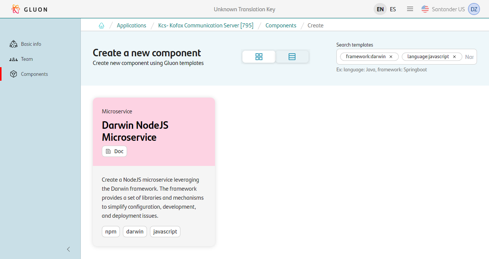
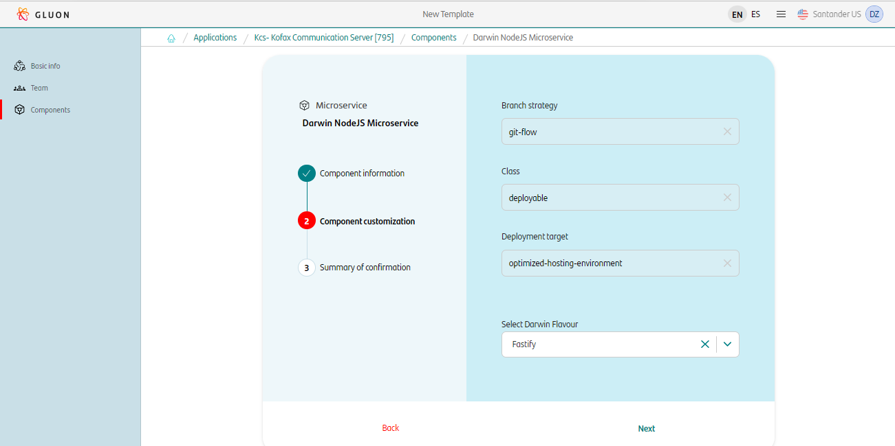
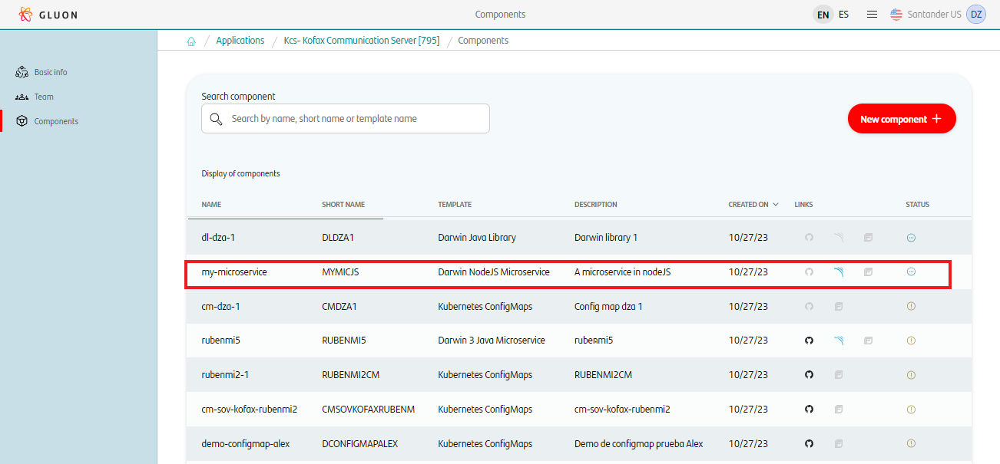

## Introduction

The purpose of this documentation is to provide a **step-by-step guide** on how to orchestrate the integration of microservices built with the **Darwin NodeJS** framework within the GLUON platform.

This guide will allow you to understand how to build and deploy our microservices through a CI/CD process.

All deployments will be done in a Kubernetes cluster from an immutable image that we will previously upload to a registry (Harbor/JFROG/ECR).

## Setup your local environment

{!
   include-markdown "../../../../snippets/setup/npm-setup.md"
!}

## Create Component

### Gluon Portal

First you have to [**onboard your application.**](../../../../../application/application-management/index.md)
Once you have your application created, you can start creating your component.

To create a component, follow the steps described in [**Component Management**](../../../../../application/component-management/create-component.md), searching for the component to be created.

You have to select the type of component you want to create, in this case you are going to create a **Darwin NodeJS Microservice**.



???+ remember

    To follow the naming convention visit [Repository Naming Convention](../../../../../application/component-management/create-component.md#repository-naming-convention).

The user can customize the type of application that they want to create. For this example we have created a Darwin microservice with the following characteristics:



- **Branch Strategy**: git-flow
- **Class**: deployable
- **Deployment target**: optimized-hosting-environment
- **Darwin Flavour**: Fastify

Once the component is created we can see under the application that there is a new repository created with the name of the component, Sonar project and Fortify project.



We have the following links in:

| Item | Link | Role Permission |
| --- | --- | --- |
| GitHub Repository | Link to the repository created in GitHub | Developer (RW) /Technical Lead (Maintain) [All roles explained](https://docs.github.com/es/organizations/managing-user-access-to-your-organizations-repositories/managing-repository-roles/repository-roles-for-an-organization) |
| Sonar Project | Link to the Sonar project created | All Users (Read) |
| Fortify Project | Link to the Fortify project created | All Users (Read) |

### Darwin Microservice Template

#### Branches

{!
   include-markdown "../../../../snippets/configuration/node-configuration.md"
   start="<!--Start Gitflow Branches-->"
   end="<!--End Gitflow Branches-->"
!}

{!
   include-markdown "../../../../snippets/configuration/node-configuration.md"
   start="<!--Start TBD Branches-->"
   end="<!--End TBD Branches-->"
!}

#### Structure

???+ warning

      The structure of the Darwin NodeJS microservice is documented on the `Readme.md` and depends on the type of microservice that you are using (Fastify or GraphQl).

```yaml
.
├── .editorconfig       # EditorConfig style defined
├── .eslintignore       # Configuration for linter
├── .eslintrc.js        # Configuration for linter
├── .gitignore          # Files to ignore in git
├── .npmrc              # NPM configuration file
├── .npmignore          # Files to ignore in git
├── .github/            # Contains all github security and quality workflows
├── .gluon/             # Contains all github deployment workflows and helm chart values
├── .husky/             # Contains pre-commit hook code
├── api
│   └── swagger         # API Documentation
├── app/                # Source code of application
│   ├── config/         # Folder to store configurations, variables, etc.
│   ├── controllers/    # Folder that contains the aplication controllers.
│   ├── routes/         # Routes of the application
│   │   │── tools/      # Folder that contains Joi validation
│   │   └── validation/ # Folder that contains Joi schemas.
│   └── server/         # Define server-side startup point
├── src/                # Source code of application, similar to app/ (typescript and GraphQL only)
├── Dockerfile          # Scripts necessary to deploy the component
├── catalog.properties  # Cataloguing properties
├── package-lock.json   # Automatically generated for any operations where npm
│                       # modifies either the node_modules tree, or package.json
├── package.json        # Application dependencies and configuration
├── changelog           # Changelog example
├── readme.md           # Readme example
└── test                # Application tests
```

For more information about the utilities and libraries of Darwin microservices, please refer to the [Darwin Node Microservice Archetype documentation](framework/index.md) provided by the framework.

## Local Running

### Cloning your repository

Once we have the device properly configured, the first step is to clone the project locally.

To do so, visit [**How to clone de project**](../../../../../application/component-management/create-component.md#cloning-a-repository).

### Run your microservice

{!
   include-markdown "**/snippets/templates/node-darwin-template.md"
   start="<!-- Start Running Microservice -->"
   end="<!-- End Running Microservice -->"
   heading-offset=-1
!}

## Infrastructure

{!
   include-markdown "../../../../snippets/infrastructure/kubernetes-node.md"
!}

### Deployment Configuration

{!
   include-markdown "../../../../snippets/configuration/oam/snippet-oam.md"
   start="<!--Start Infrastructure 2.0-->"
   end="<!--End Infrastructure 2.0-->"
!}

## Component Configuration

### Configuration Files

{!
   include-markdown "../../../../snippets/configuration/node-configuration.md"
   start="<!--Start Configuration Files-->"
   end="<!--End Configuration Files-->"
!}

#### Properties

{!
   include-markdown "../../../../snippets/configuration/node-configuration.md"
   start="<!--Start Common Properties-->"
   end="<!--End Common Properties-->"
!}

#### Dockerfile

{!
include-markdown "../../../../snippets/configuration/node-configuration.md"
start="<!--Start Dockerfile-->"
end="<!--End Dockerfile-->"
!}

!!! info "Registry Configuration"

      These values indicate where the image of the microservice will be deployed. They do not depend on GLUON. They are specific to the application to be deployed.

#### Deployment Environment

???+ warning "Credentials and Secrets"

      Make sure the parameters set up as secrets in your OAM repository are also set up in your microservice repository.

      Secrets can be set up, managed and deployed with [the vault](../../../../../application/security/security-enablers/hashicorp-vault/journeys/developer/index.md).

{!
   include-markdown "../../../../snippets/configuration/node-configuration.md"
   start="<!--Start Deployment-->"
   end="<!--End Deployment-->"
!}

#### Helm Configuration

{!
   include-markdown "../../../../snippets/configuration/node-configuration.md"
   start="<!--Start Helm Configuration-->"
   end="<!--End Helm Configuration-->"
!}

### Secrets Configuration

{!
   include-markdown "../../../../snippets/configuration/node-configuration.md"
   start="<!--Start Github Secrets 2.0-->"
   end="<!--End Github Secrets 2.0-->"
!}

## Build and Deploy your application

{!
   include-markdown "../../../../snippets/lifecycle/gitflow-rm.md"
!}

{!
   include-markdown "../../../../snippets/lifecycle/tbd-rm-node.md"
!}

## Fix/Release Flow

{!
   include-markdown "../../../../snippets/lifecycle/fix-release-flow.md"
!}

## Changelog

### Version 1.1.1

- Migrate to the latest component template model (global).
- Update the component template microservice scaffolding to use the new CI/CD framework components.
