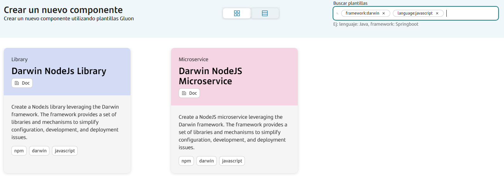
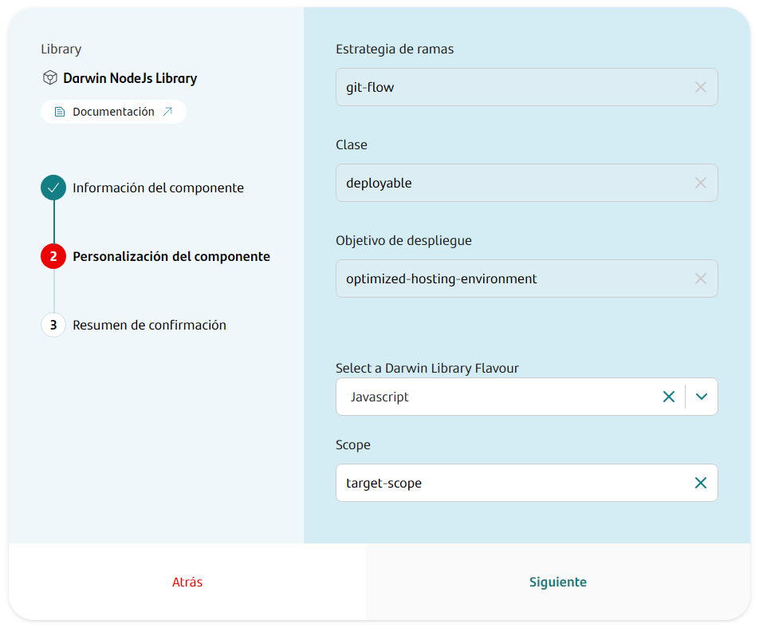
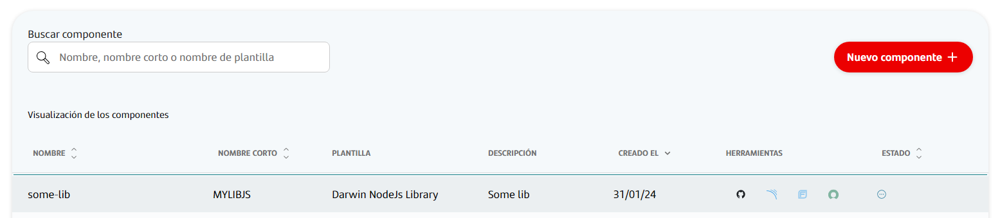

## Introduction

The purpose of this documentation is to provide a **step-by-step guide** on how to orchestrate the integration of libraries built with the **Darwin NodeJS** framework within the GLUON platform.

This guide will allow you to understand how to build and deploy our libraries through a CI/CD process.

## Setup your local environment

{!
   include-markdown "../../../../snippets/setup/npm-setup.md"
!}

## Create Component

### Gluon Portal

First you have to [**onboard your Library.**](../../../../..//index.md)
Once you have your Library created, you can start creating your component.

To create a component, follow the steps described in [**Component Management**](../../../../../application/component-management/create-component.md), searching for the component to be created.

You have to select the type of component you want to create, in this case you are going to create a **Darwin NodeJS Library**.



???+ remember

    To follow the naming convention visit [Repository Naming Convention](../../../../../application/component-management/create-component.md#repository-naming-convention).

The user can customize the type of Library that they want to create. For this example we have created a Darwin library with the following characteristics:



- **Branch Strategy**: git-flow
- **Class**: deployable
- **Deployment target**: optimized-hosting-environment
- **Darwin library flavour**: Javascript
- **scope**: target-scope

!!! info "Scope Parameter"

      The scope parameter is an optional configuration element when generating a library component. By defining a scope, you establish a standardized naming convention that enables efficient categorization and organization of library components. This approach facilitates logical grouping of components that share similar functional domains or purposes.

      When a scope is specified, the library name is automatically prefixed with the application alias, resulting in the following nomenclature pattern: `@<<application-alias>>-<<scope>>/<<repository-name>>`.

      The following examples illustrate library component naming conventions with and without the scope parameter in the respective `package.json`:

      **Without Scope:**

      

      **With Scope:**

      

!!! warning "Typescript Flavour"

    When generating a Typescript library, an important change MUST be made to its package.json file. This change is important to be able to compile the library correctly in the CI/CD process.
    
    The "build" script must be changed from:
    
    ```json
    "scripts": {
        "build": "tsc",
    },
    ```

    To:

    ```json
    "scripts": {
        "build": "tsc --build tsconfig.json",
    },
    ```

Once the component is created we can see under the Library that there is a new repository created with the name of the component, Sonar project and Fortify project.



We have the following links in:

| Item | Link | Role Permission |
| --- | --- | --- |
| GitHub Repository | Link to the repository created in GitHub | Developer (RW) /Technical Lead (Maintain) [All roles explained](https://docs.github.com/es/organizations/managing-user-access-to-your-organizations-repositories/managing-repository-roles/repository-roles-for-an-organization) |
| Sonar Project | Link to the Sonar project created | All Users (Read) |
| Fortify Project | Link to the Fortify project created | All Users (Read) |

### Darwin Library Template

#### Branches

##### GitFlow

Creating a library through the Gluon platform generates a Git repo with two branches:

- A **Main** branch, containing only the github workflows.
- A **Development** branch, with all the skeleton code.

##### Trunk Based Development

Creating a library through the Gluon platform generates a Git repo with one branch:

- A **Main** branch, containing only the github workflows and all the skeleton code.

## Local Running

??? abstract "Cloning your repository"

    ### Cloning your repository

    Once we have the device properly configured, the first step is to clone the project locally.

    To do so, visit [**How to clone the project**](../../../../../application/component-management/create-component.md#cloning-a-repository).

## Infrastructure

All deployments will be done in corporate [Nexus](https://nexus.alm.europe.cloudcenter.corp/).

## Component Configuration

### Branches

{!
   include-markdown "../../../../snippets/configuration/node-configuration.md"
   start="<!--Start Gitflow Branches-->"
   end="<!--End Gitflow Branches-->"
!}

{!
   include-markdown "../../../../snippets/configuration/node-configuration.md"
   start="<!--Start TBD Branches-->"
   end="<!--End TBD Branches-->"
!}

#### Structure

The generated Darwin library has a structure similar to the following:

```bash
.
├── .editorconfig      # EditorConfig style defined
├── .eslintrc.js       # Configuration for linter
├── .tsconfig.json     # Configuration for Typescript transformations ONLY Typescript flavour
├── .git/              # Git control version folder
├── .gitignore         # Files to ignore in git
├── .npmrc             # NPM configuration file
├── src/               # Source code of application
│   ├── config/          # Folder to store configurations, variables, etc.
│   └── tools/           # Application tools
├── node_modules/
├── package-lock.json  # Automatically generated for any operations where npm
│                      # modifies either the node_modules tree, or package.json do not remove it.
├── package.json       # Application dependencies and configuration
├── changelog.md       # Changelog of application
└── test               # Application tests
```

???+ warning

      The structure of the Darwin NodeJS library is documented on the `Readme.md` and depends on the type of library that you are using (Typescript or Javascript).

### Configuration Files

- **properties.env**: Properties with the CI/CD configuration

???+ remember

    Do not change the values of the properties.env file, as they are automatically generated by the Gluon platform.

## Build and Deploy your application

{!
   include-markdown "../../../../snippets/lifecycle/gitflow-library-node.md"
!}

{!
   include-markdown "../../../../snippets/lifecycle/tbd-library-node.md"
!}

## Fix/Release Flow

{!
   include-markdown "../../../../snippets/lifecycle/fix-release-flow.md"
!}
