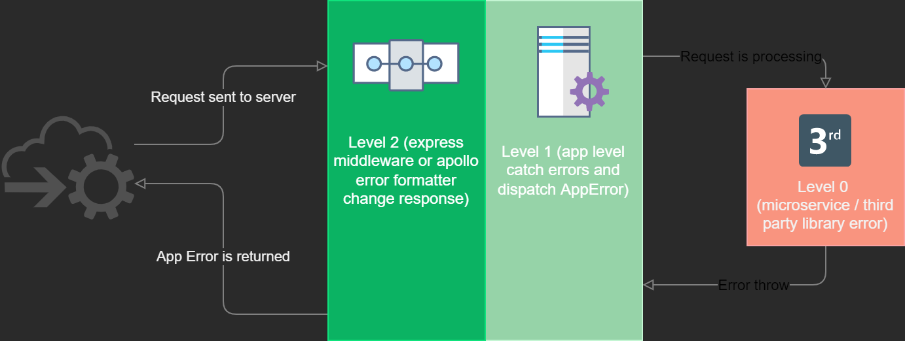

# Darwin Error Handler

## Summary

**Darwin error** is a library designed for the generation and handling of errors in applications under Node.Js.
It is composed of four elements:

- **AppError:** this class **extends from [Error](https://nodejs.org/api/errors.html)** and adds some fields of Darwin architecture that are the following:
    - **errorName:** Error name.
    - **status:** Http error code.
    - **internalCode:** Internal code of the application that will be defined by each team.
    - **shortMessage:** Short error message.
    - **detailedMessage:** Extended message with the detail of our error.
    - **extendData:** An object with more data, if necessary. (optional)
- **errorHandler:** It is a middleware for Express that takes care of **generating an error log in Kibana**. In addition to returning a response with the appropriate format to whoever has requested a service from us.
- **fastifyErrorHandler:** It is an error handler for fastify that captures Darwin type errors thrown by fastify applications. It also takes care of **generating and sending an error log into the ELK circuit**.
In addition to returning a response with the appropriate format to whoever has requested a service from us.
- **graphqlErrorFormatter:** It is a error formatter for Apollo that takes care of **generating an error log in Kibana**. In addition to returning a response with the appropriate format to whoever has requested a service from us.

Finally we send the error format depends of the configuration of the application. This type of error format is only allowed in **Fastify** applications.

### Darwin format

```json
{
    "appName": any,
    "timeStamp": any,
    "errorName": any,
    "internalCode": any,
    "shortMessage": any,
    "detailedMessage": any,
    "mapExtendedMessaged": {},
    "status": any
}
```

### Gluon format

```json
{
    "errors":[{
        "code": any,
        "message": any,
        "level": any,
        "description": any
    }]
}
```

> You can enable the different format setting the following environment variable `DARWIN_CORE_EXCEPTIONS_ERROR_FORMAT`. visit [Environment variables](#environment-variables) for more information.

## Flow

Our proposal is as follows:


Level **0** any library, microservice and job that can generate errors.<br>
Level **1** is our application that is responsible for capturing these errors and generating an AppError with the format proposed by Architecture, in this way we avoid giving information to third parties about possible errors in our application.<br>
Level **2** is our error handler/formatter. If you are using apollo error formatter, it will be in charge of registering each query/mutation operation error in Kibana and also formatting errors property response.
When using apollo, It also **must be the last middleware** that the underlying Express app uses and that will be in charge of registering the error in Kibana and also returning a response.

!!! info "Important"
    This library has .d.ts declaration files so that it can be instantiated from typescript.

## Installation

```sh
npm i -S @darwin-node/error
```

## Unit tests

For unit tests we use [Jest](https://jestjs.io/).
You can try:

```sh
npm run test:coverage
```

## How to use it

The AppError class inherits from the Error class. It stablishes the format of Errors produced by Darwin applications.
An AppError class instance must be thrown when an error occurs in the application code. AppError needs to be instanced with these parameters:

- **errorName:** Error name. It is string type.
- **status:** Http error code. it is a number type.
- **internalCode:** Internal code of the application that will be defined by each team. It is number type
- **shortMessage:** Short error message. It is a string type
- **detailedMessage:** Extended message with the detail of our error. It is a string type
- **extendData:** An object with more data, it is optional.

We can use errorHandler (and errorFormatter in GraphQL) in our applications. When an errorHandler or errorFormatter receives an AppError instance, it sends high quality information about the error to Kibana.

### Fastify Handler

Fastify generates an onError event whenever an error is thrown. The error is immediately processed through the errorHandler.

> Important: It must be used with setErrorHandler function.

Setting the errorHandler on fastify app:

```js
const fastify = require('fastify');
const app = fastify();
// we can import it or require it either in Javascript or Typescript
const { fastifyErrorHandler } = require('@darwin-node/error');
// .... we use all the routes and plugins/hooks of our app

// Finally, we set the error handler
app.setErrorHandler(fastifyErrorHandler);
```

At any level of our application we can throw an error upwards.

```js
// we can import it or require it either in Javascript or Typescript
const { AppError } = require('@darwin-node/error');
import { AppError } from '@darwin-node/error';

const err = new AppError('error', 403, 1000, 'Short message', 'Detailed Message', {
    extend: {
      whateveryouwant: {
        key: 1,
        key2: 2
      }
    }
  });
throw err;
```

> It may be the case that a connection layer (database, kafka, redis ...) fails. In this case we must capture the error using the handler and throw a Darwin custom error using AppError class.

```js
const controllerExample = (req, res) => {
  try {
    domain.someFunction();
  } catch (err) {
    throw new AppError( /* info from caught error */);
  }
};
```

### Apollo GraphQL error formatter

Apollo will generate a errors property in response object, each error thrown by your code will be in response errors property. The formatter function will receive these errors separately.
Each generated error is the first parameter in a format error function and we need to return something (as the same error). We need to add our error formatter to your apollo server.

```js
const express = require('express');
const { ApolloServer } = require('@apollo/server');
const { expressMiddleware } = require('@apollo/server/express4');
// we can import it or require it either in Javascript or Typescript
const { graphqlErrorFormatter, errorHandler } = require('@darwin-node/error');

// setup app
let app =  express()
// .... do some stuff here

// Add error formatter as formatError in Apollo Server options.
const apolloServer = new ApolloServer({
  formatError: graphqlErrorFormatter
});
app.use(
  '/graphql',
  expressMiddleware(server),
);

app.use(errorHandler)
```

In order to properly propagate the errors, in the resolver's layer we throw the error.

```js
const myResolver = (params) => {
  try {
    domain.someFunction();
  } catch (err) {
    throw err;
  }
};
```

Resolve errors generate GraphQLError instances but [Apollo side errors](https://www.apollographql.com/docs/apollo-server/data/errors/#error-codes) (schema validation, bad user input, etc) generate an error inherited from an ApolloError class.

### Environment variables

| Key                               | Default                                 | Description                         |
|-----------------------------------|-----------------------------------------| ------------------------------------|
| DARWIN_CORE_EXCEPTIONS_ERROR_FORMAT | `DARWIN` allowed ['DARWIN', 'GLUON'] | It allows to change the error format. It is only allowed in Express and Fastify applications |
