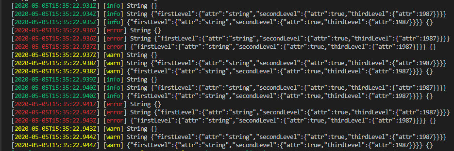

# Darwin Logger

[**Wiston**](https://www.npmjs.com/package/winston) is a library for registering applications under Node.Js, this library is used as a base for **Darwin Logger**

## Summary

**Darwin Logger** is a library designed to be a simple and universal log library for multiple transports.
**Transports** are essentially a storage device for your records. We have two types of transport in this library:

- **Console:** All logs will appear by console at runtime.
- **Kibana:** All records end in the configured Kibana, we send it using a Kafka transport to the [**ELK**](https://aws.amazon.com/es/what-is/elk-stack/) stack.

Our main idea is to decouple parts of the registration process to make it more flexible and more extensive. The flexibility allows us to use **formats** linked to **transports**, so that we can have different formats on our storage devices.
Moreover, we have levels associated with the log types **INFORMATION, ERROR AND WARNING**. This is how we can ensure that the APIs are decoupled from the implementation of the transport registry, to the API we expose to the developer.

> Important: This library has .d.ts declaration files so that it can be instantiated from typescript.

## Installation

```sh
npm i -S @darwin-node/logger
```

## Unit test

For unit tests we use [Jest](https://jestjs.io/).

```sh
npm run test:coverage
```

## How to use it

We have two ways to use it, either for Javascript or Typescript. We are going to put two examples of them.

> Important: we can log N parameters, and this parameters will be [this](https://www.w3schools.com/js/js_datatypes.asp)

### Javascript

```js
const { techLog: log } = require('@darwin-node/logger');
log.info('info');
log.warn('info');
log.error('info');
log.debug('info');
// The following examples could be logged in Console and Kibana
const data = {
  data: {
    1: 'bar',
    2: 'foo'
  }
};
log.info('Printing mensaje', null, undefined, true, 1, data, data, 'foo');
log.info(data, data, data, 'foo', data);
log.info('Printing mensaje');
log.info(null);
log.info(undefined); // -> you will obtain an empty object
log.info(1);
log.info(false);
log.info(Number.MAX_SAFE_INTEGER);
log.info(data);
log.info('Printing mensaje', null, undefined, true, 1, data, data, 'foo');
log.info(null, undefined, true, 1, data, data, 'foo', 'Printing mensaje');
log.info(undefined, true, 1, data, data, 'foo', 'Printing mensaje', null);
log.info(true, 1, data, data, 'foo', 'Printing mensaje', null, undefined);
log.info(1, data, data, 'foo', 'Printing mensaje', null, undefined, true);
log.info(data, data, 'foo', 'Printing mensaje', null, undefined, true, 1);
log.info(data, 'foo', 'Printing mensaje', null, undefined, true, 1, data);
log.info('foo', 'Printing mensaje', null, undefined, true, 1, data, data);
log.info('bar', data);
log.info(data, 'bar');
```

### Typescript

This example varies because we have included more types in the example.

```js
import { techLog } from '@darwin-node/logger';
const obj = {
  firstLevel: {
    attr: 'string',
    secondLevel: {
      attr: true,
      thirdLevel: {
        attr: 1987
      }
    }
  }
}

techLog.info('String');
techLog.info('String', obj);
techLog.info(obj);

techLog.error('String');
techLog.error('String', obj);
techLog.error(obj);

techLog.warn('String');
techLog.warn('String', obj);
techLog.warn(obj);
```



## Kibana logs environment

Keep in mind that the environments used in the logs are not the same as in the applications.
If we do not include the environment well, the logs will not be seen in **Kibana** so it is something **critical**.
We will include a detail of them to facilitate their understanding.

**We have created a map with the following values:**

| Key  | Value |
|------|-------|
| TEST | TEST  |
| DEV  | CERT  |
| PRE  | PREP  |
| PRO  | PROD  |
| CERT | CERT  |
| PREP | PREP  |
| PROD | PROD  |

The environment variable that decides the key is **process.env.NODE_ENV**, if it does not come, it fills the library and assigns the value by default **CERT**.

## Global Format

Currently we support the ``global format``, it means that all the traces generated by this library follows this [convention](../../../../../../../application/observability-insights/observability/obs-foundations/logs/gluonlog-v100/attributes.md)

### Adding custom attributes to Global log

When used in conjunction with [Darwin Composer](./darwin-composer.md) and
[Darwin Middlewares](./darwin-middlewares.md),
this module allows to send data to ELK to supervise our applications.
This feature allow us to inject data to the ``customLog`` attribute.
In this attribute we can extend all type of data, to do it we can use:

- **request:context:custom**: This context allow us to inject data to every customLog ```Activity and Technical```
- **request:activityContext:custom**: This context allow us to inject data only to Activity customLog
- **request:technicalContext:custom**: This context allow us to inject data only to Technical customLog

> We use the **request-context** middleware to add and retrieve context to an incoming request during its lifecycle. At any point during the request's lifecycle,
  custom Logs can be set by retrieving and modifying a map that is set during the early stages of the incoming request handling process.

#### Custom Logs for individual endpoints

To add custom Logs to an individual endpoint, we get a map object from the request's context and set a key-value pair with our custom Logs.

The following example:

- Generates a fastify microservice with Darwin FW
- Adds an endpoint that:
  - Logs a technical trace with no injected properties
  - Injects properties to both technical and activity logs
  - Injects properties to activity logs
  - Injects properties to technical logs
  - Logs an activity trace with injected properties
  - Logs a technical trace with injected properties
- Runs the microservice

```js
const fastify = require('fastify');
const { generateExpressApp } = require('@darwin-node/composer');
const { techLog, actLog } = require('@darwin-node/logger');
const contextService = require('request-context');
const routes = require('../routes');
const options = require('../options');

const app = generateFastifyApp(fastify(), routes,  options);

app.get('/custom/log', (req, res) => {

  techLog.info('before custom');

  const mapCommon = contextService.get('request:context:custom');
  mapCommon.set('commonLog', { commonlog: 'a', anotherComon: false});

  const mapActivity = contextService.get('request:activityContext:custom');
  mapActivity.set('activityLog', 125);

  const mapTechnical = contextService.get('request:technicalContext:custom');
  mapTechnical.set('technicalLog', 'Your String')

  actLog.info('activity');
  techLog.info('after custom');
  
  res.send('some response');
})
app.listen({ port: 8080 });
```

>NOTE: setting a value to a preexisting custom Log will replace its previous value

#### Custom Logs for multiple endpoints

To add custom Logs to multiple endpoints, we must add a preHandler function that gets a map object from the request's context and sets a key-value pair with our custom Logs.

The following example:

- Exports a preHandler function that:
  - Logs a technical trace with no injected properties
  - Injects properties to both technical and activity logs
  - Injects properties to activity logs
  - Injects properties to technical logs
  - Logs an activity trace with injected properties
  - Logs a technical trace with injected properties
- Adds the preHandler to a generic route

```js
const contextService = require('request-context');

const preHandler = (req, res, next) => {
  const mapCommon = contextService.get('request:context:custom');
  mapCommon.set('commonLog', { commonlog: 'a', anotherComon: false});

  const mapActivity = contextService.get('request:activityContext:custom');
  mapActivity.set('activityLog', 125);

  const mapTechnical = contextService.get('request:technicalContext:custom');
  mapTechnical.set('technicalLog', 'Your String')

  actLog.info('activity');
  techLog.info('technical');
  next();
}

module.exports =  preHandler;

// In your routes declaration
const router = (app, options, done) => {
  app.route({
    method: 'GET',
    url: '/',
    handler: /* your main logic *//,
    preHandler: preHandler
  });
  done();
};
```

>NOTE: setting a value to a preexisting custom Log will replace its previous value

## Transport Mode

The transport mode is the way that the logs are present. There are two different ways to send the logs:

- **Console**: This mode is used to print the logs in the console in json format.
- **Kafka**: This mode is used to send the logs to a Kafka topic and prints the logs in the console in human readable format.

> Look at [Environment variables](#environment-variables) to see how to configure the transport mode

## Kerberos Authentication

Kerberos is a network authentication protocol that works on the basics of tickets to allow nodes communicating over a non-secure network to prove their identity to one another in a secure manner.
This library supports kerberos authentication to send logs to kafka.
Kerberos Authentication is always enabled when the transport mode is kafka.
To log in with kerberos authentication, you need to set the following environment variables:

| Key                                  |   Default value             |         Description           |
|--------------------------------------|-----------------------------| ------------------------------|
| DARWIN_LOGGING_KAFKA_USERNAME        | `username`                  | `{String}:` Kerberos username.|
| DARWIN_LOGGING_KAFKA_PASSWORD        | `password`                  | `{String}:` Kerberos password.|

Ensure that the kerberos username and password are set as environment variables in the environment where the application is running.

## Environment Variables

| Key                                  |   Default value             |         Description           |
|--------------------------------------|-----------------------------| ------------------------------|
| PROJECT_NAME                         | `UNSPECIFIED_PROJECT_NAME`  | `{String}:` Project name      |
| DARWIN_LOGGER_ENTITY                 | `ESP`                       | `{String}:` Application Entity           |
| APP_NAME                             | `UNSPECIFIED_APP_NAME`      | `{String}:` Cluster application name |
| NODE_ENV                             | `CERT`                      | `{String}:` Defines the environment (`TEST, CERT, PRE, PRO`) for Python applications      |
| HOSTNAME                             | `NODEJS`                    | `{String}:` Cluster application name            |
| REGION                               | `NODEJS`                    | `{String}:` Cluster region    |
| DARWIN_LOGGING_KAFKA_HOST            | None                        | `{Array}:` Kafka host |
| DARWIN_LOGGING_KAFKA_UNIQUE_TOPIC | `nuar-mrsv-log`                                 | {String}: Enable unique topic for each application. |
| DARWIN_LOGGING_TRANSPORT         | `KAFKA`                                 | {String}: Transport type (`KAFKA, CONSOLE`). |
| DARWIN_LOGGING_FORMAT             | `GLOBAL`                                | {String}: Log format (`GLOBAL, GLUON`).      |
| DARWIN_LOGGING_KAFKA_SSL          | `true`                         | `{Boolean}`: Enable SSL for Kafka transport. |
| DARWIN_LOGGING_KAFKA_TIMEOUT      | `30000`                        | `{Number}`: Timeout for Kafka transport. |

> The following environment variables are **deprecated in the Gluon format exclusive**:
>
> - DARWIN_LOGGER_ENTITY
> - DARWIN_APPKEY
> - APP_NAME
> - REGION
> - DARWIN_PYTHON_APPLICATION_VERSION

### Gluon Format

| Key                               | Default                                 | Description                         |
|-----------------------------------|-----------------------------------------| ------------------------------------|
|DARWIN_LOGGING_COMPANY             |   `ERROR_COMPANY_NOT_DEFINED`           | `{String}`: Maps to the company code in Gluon.|
|DARWIN_LOGGING_COMPANY_COMPONENT_NAME |   `ERROR_COMPONENT_NAME_NOT_DEFINED` | `{String}`: Maps to the short-name of the component in Gluon. |
|DARWIN_LOGGING_COMPANY_COMPONENT_ID             |   `DARWIN_LOGGING_COMPANY_COMPONENT_ID` | `{String}`: Maps to the ID of the component in Gluon.|
|DARWIN_LOGGING_COMPANY_COMPONENT_TYPE             | `DARWIN_LOGGING_COMPANY_COMPONENT_TYPE` | `{String}`: Maps to the component type in Gluon. |
|DARWIN_LOGGING_COMPANY_APP_NAME            |  `DARWIN_LOGGING_COMPANY_APP_NAME` | `{String}`: Maps to technical application in Gluon. |
|DARWIN_LOGGING_APP_ID             |  `DARWIN_LOGGING_APP_ID`  | `{String}`: Maps to the technical application ID in Gluon. |

> Note: The Component version in Gluon is the same as the package version, as set in the package.json of the microservice
