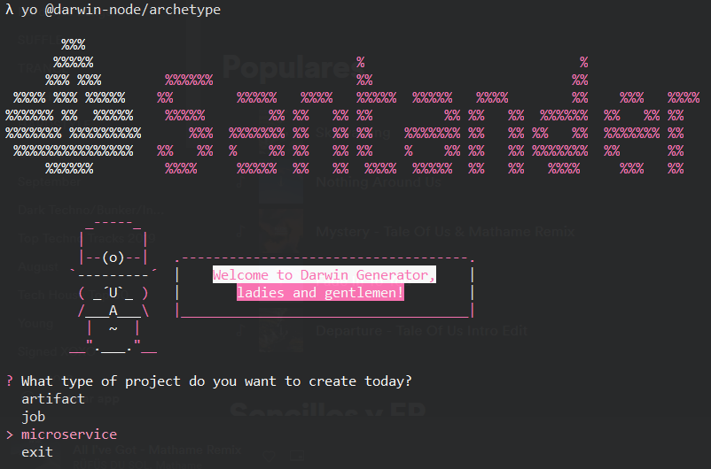
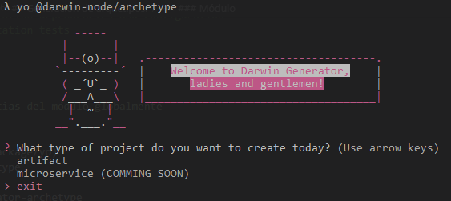
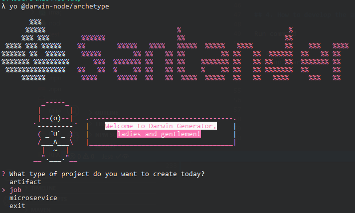

# Darwin Archetype Generator

[**Yeoman**](https://yeoman.io/) is an archetype generator, so it saves developers the hassle of creating a starter project. Within this archetype generator, lessons learned previously are introduced, as well as their good practices.

## Summary

**Library in charge of the generation of Darwin archetypes.** Either through command line or through interface we have the possibility of generating them.
**Three types of archetypes are generated**

- Modules (Artifacts or Libraries)
- Microservices
- Jobs

> Important: There are two ways to run the library. Interactively (Interface-Console) and by passing parameters through command line.

## Installation

> You have to install the module dependencies globally
Dependencies:

- [Yo](https://www.npmjs.com/package/yo)
- @darwin-node/generator-archetype

```sh
npm i -g yo@4 @darwin-node/generator-archetype
```

> Important: you must install the yeoman version v4 **not** higher, because the generator is not compatible with the latest version of yeoman.

## Unit tests

For unit tests we use [Jest](https://jestjs.io/).

```sh
npm run test:coverage
```

## How to use it

Yo can generate the different archetypes using:

- **console interface**
- **command line**

### Command line parameters

|           Name                  |                         Description                          |                                                               Limitations                                                              |             Type               |
| ------------------------------- | ------------------------------------------------------------ | -------------------------------------------------------------------------------------------------------------------------------------- | ------------------------------ |
|`component`                      | Type of project to be generated                              |                                             `artifact`, `job`, `microservice`, `serverless`                                            |          `Required`            |
|`microservice-type`              | Type of microservice to be generated.                        |                                                    `graphql`, `fastify`                                                                |          `Required`            |
|`component-name`                 | Name of the project to be generated                          | Must start with a lowercase letter and continue with lowercase letters, numbers and hyphens. |          `Required`            |
|`acronym-app`                    | Acronym of the project to be generated                       | Must start with a lowercase letter and continue with lowercase letters, numbers and hyphens.  |          `Required`            |
|`system`                         | Name of the system to which the application belongs          |                                                      `String`                                                                 |   `Optional only in artifacts` |
|`sub_system_code`                | Name of the sub-system to which the application belongs      |                                                               `String`                                                                 |   `Optional only in artifacts` |
|`functional_application_code`    | Name of the application to which it belongs                  |                                                               `String`                                                                 |   `Optional only in artifacts` |
|`functional_sub_application_code`| Name of the sub-application to which the application belongs |                                                               `String`                                                                 |   `Optional only in artifacts` |
|`flavour`                        | Programming language used in the project. By default `javascript`|                                                      `javascript`, `typescript`                                                    |          `Optional`            |
|`scope`                          | Documentation reference [here](https://docs.npmjs.com/cli/v7/using-npm/scope), **it does not need** to include the character **@**. Exclusive for artifacts |                   `String`                                     |          `Optional`            |
|`gluon`                          | Gluon application                                            |                                                         `true`, `false` Defaults `false`                                               |          `Optional`            |
|`company`                        | Maps to the company code in Gluon.                           |  String not empty                                                                                                                      |          `Optional *`            |
|`component_name_observability`   | Maps to the short-name of the component in Gluon.            |  String not empty                                                                                                                      |          `Optional *`            |
|`component_id`                   | Maps to the ID of the component in Gluon.                    |  String not empty                                                                                                                      |          `Optional *`            |
|`component_type`                 | Maps to the component type in Gluon.                         |  String not empty                                                                                                                      |          `Optional *`            |
|`app_name`                       | Maps to technical application in Gluon.                      |  String not empty                                                                                                                      |          `Optional *`            |
|`app_id`                         | Maps to the technical application ID in Gluon.               |  String not empty                                                                                                                      |          `Optional *`            |
|`package_url`                    | *Only available for packages*: URL of the repository where the package is hosted.|  Any                                                                                                               |          `Optional *`            |
|`cloud-provider`                 | Cloud provider for `serverles` parameter                     |                                                         `aws`, `azure`, `openshift`                                                    |          `Optional`            |

> Optional * : These parameters are only mandatory if the `gluon parameter` is set to `true`.

## Generate Microsevices

We can generate the following types:

- GraphQl Microservice (under Express.js)
- Fastify Microservice

### Through command line

#### To generate GraphQL microservice through command line

```sh
yo @darwin-node/archetype --component=microservice --microservice-type=graphql --component-name=graphql-micro-js --system=system-name --sub-system-code=subSystem-name --functional-application-code=application-name --functional-sub-application-code=subApplication-name --acronym-app=myapp --gluon=false
```

#### To generate Fastify microservice through command line

```sh
yo @darwin-node/archetype --component=microservice --microservice-type=fastify --component-name=fastify-micro-js-configmap --system=system-name --sub-system-code=subSystem-name --functional-application-code=application-name --functional-sub-application-code=subApplication-name --acronym-app=myapp --gluon=false
```

> Important: We can generate a typescript Fastify microservice by adding the following parameter ```--flavour=typescript```
> Important: We can generate a Gluon microservice adding the following parameter ```--gluon=true```

### Through console interface

```sh
yo @darwin-node/archetype
```

Select microservice from menu



> **We must to fill in the data requested by the generator.**

## Generation of a library

By passing parameters we execute the following

```sh
yo @darwin-node/archetype --component=artifact --component-name=artifact-name --acronym-app=dwback
```

> Important: we can generate a typescript library by adding the following parameter ```--flavour=typescript```
> Important: we can add the parameter ```--scope='your-scope'``` we have the reference documentation [aquí](https://docs.npmjs.com/cli/v7/using-npm/scope), **it does not need** to include the character **@**.

By using interface, we execute the following command

```sh
yo @darwin-node/archetype
```

We select the type of archetypal to generate**



> **We must to fill in the data requested by the generator.**

## Generating a Job

In IT, a task is an execution unit or a work unit. The term is ambiguous; other more precise terms are process, thread (for execution), request, step, among others.
In a micro-service the actions are triggered when we "attack the endpoints at its disposal", however, a task does not have those endpoints and basically its flow is to incite, execute all the actions that we specify and stop it.

There are two ways to generate a Job in Darwin, either through a console interface or through command lines

### Through command line

In a console, we execute the following command

```sh
yo @darwin-node/archetype --component=job --component-name=job-name --system=system-name --sub-system-code=subSystem-name --functional-application-code=application-name --functional-sub-application-code=subApplication-name --acronym-app=myapp
```

> Important: we can generate a typescript library by adding the following parameter ```--flavour=typescript```

### Through console interface

We execute the following command

```sh
yo @darwin-node/archetype
```

We select job



> **We must to fill the data requested by the generator.**
