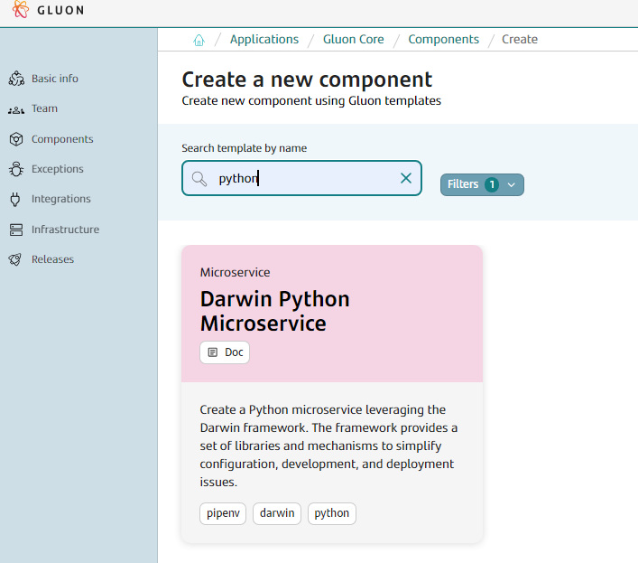
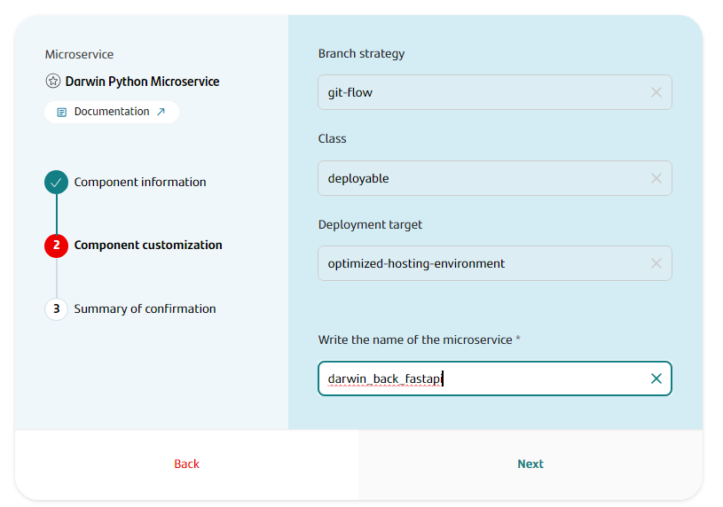
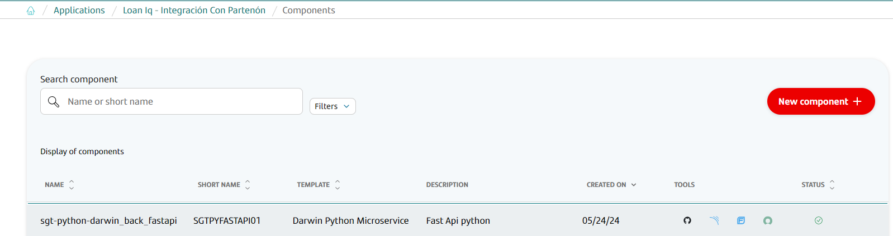

## Introduction

The purpose of this documentation is to provide a **step-by-step guide** on how to orchestrate the integration of microservices built with the **Darwin Python** framework within the GLUON platform.

This guide will allow you to understand how to build and deploy our microservices through a CI/CD process.

All deployments will be done in a Kubernetes cluster from an immutable image that we will previously upload to a registry (Harbor/JFROG/ECR).

## Setup your local environment

{!
   include-markdown "../../../../snippets/setup/python-setup.md"
!}

## Create Component

### Gluon Portal

First you have to [**onboard your application.**](../../../../../application/application-management/index.md)
Once you have your application created, you can start creating your component.

To create a component, follow the steps described in [**Componnet Management**](../../../../../application/component-management/create-component.md), searching for the component to be created.

You have to select the type of component you want to create, in this case you are going to create a **Darwin Python Microservice**.



???+ remember

    To follow the naming convention visit [Repository Naming Convention](../../../../../application/component-management/create-component.md#repository-naming-convention).

The user can customize the type of application that they want to create. For this example we have created a Darwin microservice with the following characteristics:



- **Branch Strategy**: git-flow
- **Class**: deployable
- **Deployment target**: optimized-hosting-environment
- **Name of the microservice**: The name of your microservice

Once the component is created we can see under the application that there is a new repository created with the name of the component, Sonar project and Fortify project.



We have the following links in:

| Item | Link | Role Permission |
| --- | --- | --- |
| GitHub Repository | Link to the repository created in GitHub | Developer (RW) /Technical Lead (Maintain) [All roles explained](https://docs.github.com/es/organizations/managing-user-access-to-your-organizations-repositories/managing-repository-roles/repository-roles-for-an-organization) |
| Sonar Project | Link to the Sonar project created | All Users (Read) |
| Fortify Project | Link to the Fortify project created | All Users (Read) |

### Darwin Microservice Template

#### Git Flow

##### Branches

{!
   include-markdown "../../../../snippets/setup/branch-setup-python.md"
!}

##### Structure

???+ warning

      The structure of the Darwin Python microservice is documented on the `Readme.md`.

```text
📂.github
┣ 📂workflows
┃ ┣ 📜bluegreen-switch.yml
┃ ┣ 📜cd.yml
┃ ┣ 📜ci-fix-gfw.yml
┃ ┣ 📜ci-gfw.yml
┃ ┣ 📜quality.yml
┃ ┣ 📜release-fix-gfw.yml
┃ ┣ 📜release-gfw.yml
┃ ┣ 📜release-gfw.yml
┃ ┣ 📜security.yml
┃ ┗ 📜update-component-workflow.yml
┗ 📜CODEOWNERS
📂.gluon
┣ 📂cd
┃ ┣ 📂cert
┃ ┃ ┣ 📜cd.yml
┃ ┃ ┗ 📜values-cert.yml
┃ ┣ 📂pre
┃ ┃ ┣ 📜cd.yml
┃ ┃ ┗ 📜values-pre.yml
┃ ┣ 📂pro
┃ ┃ ┣ 📜cd.yml
┃ ┃ ┗ 📜values-pro.yml
┃ ┗ 📜values.yaml
┗ 📂ci
┃ ┗ 📜properties.env
📂docs
┣ 📂openapi
┃ ┗ (*) Definition Python files
📂src
┃ ┣ 📂app
┃ ┗ ┗ (*) Application source code
📂test
┃ ┗ (*) Python Test files  
📝.gitignore
📝.dockerignore
📝.editorconfig
📝Dockerfile
📝Pipfile
📝Pipfile.lock
📝Readme.md
📝asgi.py
📝changelog.md
📝entrypoint.sh
📝gunicorn_config.py
📝logging_config.ini
📝pytest.ini
📝setup.py
📝version.py
```

#### Trunk Based Development

##### Branches

{!
include-markdown "../../../../snippets/setup/branch-setup-python-tbd.md"
!}

##### Structure

The generated Darwin microservice has a structure similar to the following:

```text
📂.github
┣ 📂workflows
┃ ┣ 📜cd.yml
┃ ┣ 📜ci-tbd.yml
┃ ┣ 📜bluegreen-switch.yml
┃ ┣ 📜quality.yml
┃ ┣ 📜release-tbd.yml
┃ ┣ 📜security.yml
┃ ┣ 📜update-component.yml
┃ ┗ 📜version-validation.yml
┗ 📜CODEOWNERS
📂.gluon
┣ 📂cd
┃ ┣ 📂cert
┃ ┃ ┣ 📜cd.yml
┃ ┃ ┗ 📜values-cert.yml
┃ ┣ 📂pre
┃ ┃ ┣ 📜cd.yml
┃ ┃ ┗ 📜values-pre.yml
┃ ┣ 📂pro
┃ ┃ ┣ 📜cd.yml
┃ ┃ ┗ 📜values-pro.yml
┃ ┗ 📜values.yaml
┗ 📂ci
┃ ┗ 📜properties.env
📂docs
┣ 📂openapi
┃ ┗ (*) Definition Python files
📂src
┃ ┣ 📂app
┃ ┗ ┗ (*) Application source code
📂test
┃ ┗ (*) Python Test files  
📝.gitignore
📝.dockerignore
📝.editorconfig
📝Dockerfile
📝Pipfile
📝Pipfile.lock
📝Readme.md
📝asgi.py
📝changelog.md
📝entrypoint.sh
📝gunicorn_config.py
📝logging_config.ini
📝pytest.ini
📝setup.py
📝version.py
```

## Local Running

### Cloning your repository

Once we have the device properly configured, the first step is to clone the project locally.

To do so, visit [**How to clone de project**](../../../../../application/component-management/create-component.md#cloning-a-repository).

### Run your microservice

{!
   include-markdown "**/snippets/templates/python-darwin-template.md"
   start="<!-- Start Running Microservice -->"
   end="<!-- End Running Microservice -->"
   heading-offset=-1
!}

## Infrastructure

{!
   include-markdown "../../../../snippets/infrastructure/kubernetes-python.md"
!}

### How to configure your deployment environment

{!
   include-markdown "../../../../snippets/configuration/oam/snippet-oam.md"
   start="<!--Start Infrastructure 2.0-->"
   end="<!--End Infrastructure 2.0-->"
!}

## Component Configuration

### Branches

{!
   include-markdown "../../../../snippets/configuration/python-configuration.md"
   start="<!--Start Gitflow Branches-->"
   end="<!--End Gitflow Branches-->"
!}
{!
   include-markdown "../../../../snippets/configuration/python-configuration.md"
   start="<!--Start TBD Branches-->"
   end="<!--End TBD Branches-->"
!}

### Configuration Files

{!
   include-markdown "../../../../snippets/configuration/python-configuration.md"
   start="<!--Start Configuration Files-->"
   end="<!--End Configuration Files-->"
!}

#### Properties

{!
   include-markdown "../../../../snippets/configuration/python-configuration.md"
   start="<!--Start Common Properties-->"
   end="<!--End Common Properties-->"
!}

#### Dockerfile

{!
include-markdown "../../../../snippets/configuration/python-configuration.md"
start="<!--Start Dockerfile-->"
end="<!--End Dockerfile-->"
!}

!!! info "Registry Configuration"

      These values indicate where the image of the microservice will be deployed. They do not depend on GLUON. They are specific to the application to be deployed.

#### Continuous Deployment files

{!
   include-markdown "../../../../snippets/configuration/python-configuration.md"
   start="<!--Start Deployment-->"
   end="<!--End Deployment-->"
!}

#### Helm Configuration

{!
   include-markdown "../../../../snippets/configuration/python-configuration.md"
   start="<!--Start Helm Configuration-->"
   end="<!--End Helm Configuration-->"
!}

### Secrets Configuration

{!
   include-markdown "../../../../snippets/configuration/python-configuration.md"
   start="<!--Start Github Secrets-->"
   end="<!--End Github Secrets-->"
!}

## Build and Deploy your application

{!
   include-markdown "../../../../snippets/lifecycle/gitflow-rm.md"
!}

{!
   include-markdown "../../../../snippets/lifecycle/tbd-rm-python.md"
!}

## Fix/Release Flow

{!
   include-markdown "../../../../snippets/lifecycle/fix-release-flow.md"
!}

## Changelog

### Version 1.1.1

- Migrate to the latest component template model (global).
- Update the component template microservice scaffolding to use the new CI/CD framework components.
