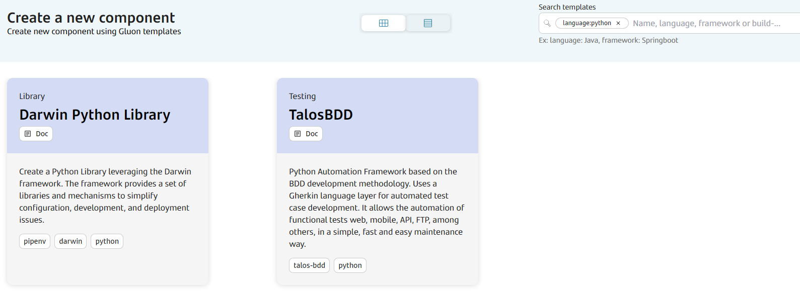
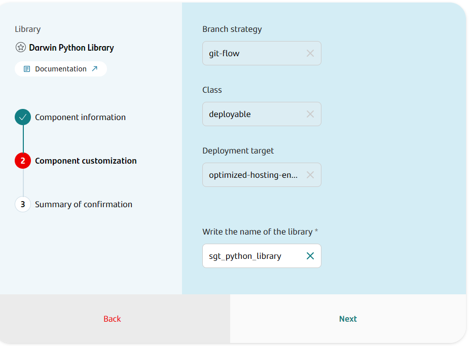
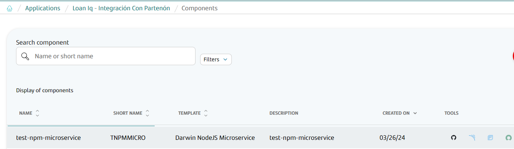
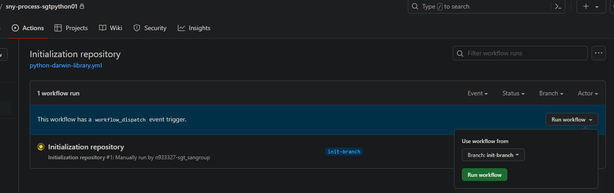

## Introduction

The purpose of this documentation is to provide a **step-by-step guide** on how to deploy a library built with the **Darwin** framework within the GLUON platform, and with Python as the basis for building your project.

This guide will allow you to understand how to build and deploy our library through a CI/CD process.

All deployments will be done in corporate [Nexus](https://nexus.alm.europe.cloudcenter.corp/).

## Setup your local environment

{!
   include-markdown "../../../../snippets/setup/python-setup.md"
!}

## Create Component

### Gluon Portal

First you have to [**onboard your Library.**](../../../../..//index.md)
Once you have your Library created, you can start creating your component.

To create a component, follow the steps described in [**Component Management**](../../../../../application/component-management/create-component.md), searching for the component to be created.

You have to select the type of component you want to create, in this case you are going to create a **Darwin Python Library**.



???+ remember

    To follow the naming convention visit [Repository Naming Convention](../../../../../application/component-management/create-component.md#repository-naming-convention).

The user can customize the name of Library that they want to create. For this example we have created a Darwin Python library with the following characteristics:



- **Branch Strategy**: git-flow
- **Class**: deployable
- **Deployment target**: optimized-hosting-environment
- **Name of the library**: To fill by the user

Once the component is created we can see under the Library that there is a new repository created with the name of the component, Sonar project and Fortify project.



We have the following links in:

| Item | Link | Role Permission |
| --- | --- | --- |
| GitHub Repository | Link to the repository created in GitHub | Developer (RW) /Technical Lead (Maintain) [All roles explained](https://docs.github.com/es/organizations/managing-user-access-to-your-organizations-repositories/managing-repository-roles/repository-roles-for-an-organization) |
| Sonar Project | Link to the Sonar project created | All Users (Read) |
| Fortify Project | Link to the Fortify project created | All Users (Read) |

???+ Warning

    In some cases the Initialice Repository action not work properly and it does not execute automatically. In this case, you must execute it manually.

    

### Darwin Library Template

#### Git Flow

##### Branches

Creating a library through the Gluon platform generates a Git repo with two branches:

- A **Main** branch, containing only the github workflows.
- A **Development** branch, with all the skeleton code.

##### Structure

The generated Darwin Python library has a structure similar to the following:

```text
📂.github
┣ 📂workflows
┃ ┣ 📜create-release-branch.yml
┃ ┣ 📜ci-gfw.yml
┃ ┣ 📜ci-fix-gfw.yml
┃ ┣ 📜quality.yml
┃ ┣ 📜version-validation.yml
┃ ┣ 📜release-gfw.yml
┃ ┣ 📜release-fix-gfw.yml
┃ ┣ 📜security.yml
┃ ┗ 📜update-component-workflow.yml
┗ 📜CODEOWNERS
📂.gluon
┗ 📂ci
┃ ┗ 📜properties.env
📂src
┃ ┗ (*) Application source code
📂test
┃ ┗ (*) Python Test files  
📝.gitignore
📝.editorconfig
📝Pipfile
📝Pipfile.lock
📝Readme.md
📝changelog.md
📝LICENSE
📝pytest.ini
📝setup.py
📝version.py
```

#### Trunk Based Development

##### Branches

{!
include-markdown "../../../../snippets/setup/arsenal-branch-setup-tbd.md"
!}

##### Structure

The generated Darwin Python library has a structure similar to the following:

```text
📂.github
┣ 📂workflows
┃ ┣ 📜create-release-branch.yml
┃ ┣ 📜ci-tbd.yml
┃ ┣ 📜quality.yml
┃ ┣ 📜version-validation.yml
┃ ┣ 📜release-tbd.yml
┃ ┣ 📜security.yml
┃ ┗ 📜update-component-workflow.yml
┗ 📜CODEOWNERS
📂.gluon
┗ 📂ci
┃ ┗ 📜properties.env
📂src
┃ ┗ (*) Application source code
📂test
┃ ┗ (*) Python Test files  
📝.gitignore
📝.editorconfig
📝Pipfile
📝Pipfile.lock
📝Readme.md
📝changelog.md
📝LICENSE
📝pytest.ini
📝setup.py
📝version.py
```

## Local Running

??? abstract "Cloning your repository"

    ### Cloning your repository

    Once we have the device properly configured, the first step is to clone the project locally.

    To do so, visit [**How to clone the project**](../../../../../application/component-management/create-component.md#cloning-a-repository).

## Infrastructure

All deployments will be done in corporate [Nexus](https://nexus.alm.europe.cloudcenter.corp/).

## Component Configuration

### Branches

{!
   include-markdown "../../../../snippets/configuration/python-configuration.md"
   start="<!--Start Gitflow Branches-->"
   end="<!--End Gitflow Branches-->"
!}
{!
   include-markdown "../../../../snippets/configuration/python-configuration.md"
   start="<!--Start TBD Branches-->"
   end="<!--End TBD Branches-->"
!}

#### Structure

The generated Darwin library has a structure similar to the following:

```bash
.
├── .editorconfig      # EditorConfig style defined
├──  Pipfile           # Development dependencies
├──  Pipfile.lock      # Lock file for dependencies
├──  pytest.ini        # Pytest configuration file
├── .git/              # Git control version folder
├── .gitignore         # Files to ignore in git
├── env/               # Folder to store environment variables
|   └── properties.env # Environment properties
├── src/               # Source code of application
│   ├── config/          # Folder to store configurations, variables, etc.
│   └── tools/           # Application tools
├── changelog.md       # Changelog of application
└── test               # Application tests
```

???+ tip

    The structure of the Darwin Python library is documented on the `Readme.md`.
    The development dependencies are managed by the Pipfile and the Pipfile.lock files.

???+ warning

    **The runtime dependencies are managed by the setup.py file**.

???+ warning

    **Do not modify the properties.env file**.

### Configuration Files

- **properties.env**: Properties with the CI/CD configuration

???+ remember

    Do not change the values of the properties.env file, as they are automatically generated by the Gluon platform.

## Build and Deploy your application

{!
   include-markdown "../../../../snippets/lifecycle/gitflow-library-python.md"
!}

{!
include-markdown "../../../../snippets/lifecycle/tbd-library-darwin.md"
!}

## Fix/Release Flow

{!
   include-markdown "../../../../snippets/lifecycle/fix-release-flow.md"
!}
