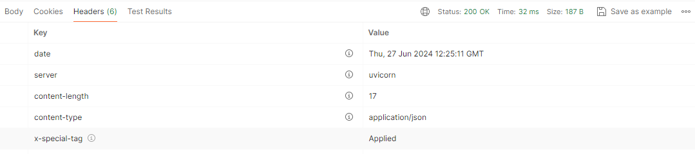

This article documents a solution for implementing endpoint-level middleware in FastAPI, specifically focusing on the conditional
execution of middleware logic based on endpoint tags.

## Problem Statement

The requirement is to execute different middleware conditions for specific endpoint(s). Traditional middleware applies the same
logic to all requests, but in some scenarios, it is necessary to vary the middleware behavior based on the endpoint being
accessed. Tags can be used to categorize endpoints and inform middleware of the specific logic to execute.

## Solution

The proposed solution involves assigning tags to endpoints and defining a custom middleware that checks these tags to determine
which conditions to execute. This approach leverages FastAPI’s robust routing system and the flexibility of custom middleware.

## Steps to Implement the Solution

### Define a FastAPI Application

```python
from fastapi import FastAPI

app = FastAPI()

```

### Create Custom Middleware

A custom middleware is implemented to inspect the tags of the endpoint being accessed and execute different conditions based on
these tags.

```python
@app.middleware("http")
async def new_middleware(request, call_next):
    # Check the route path and method
    route = next((route for route in app.router.routes
            if route.path == request.url.path and request.method in route.methods), None)

    # Get the tags for the current endpoint
    tags = route.tags if hasattr(route, 'tags') else []

    # Custom conditions based on tags
    if "special_tag" in tags:
        # Execute custom condition for endpoints with "special_tag"

        response = await call_next(request)
        response.headers["X-Special-Tag"] = "Applied"
        return response

    # Default condition
    return await call_next(request)

```

### Define Tags for Endpoints

Tags are assigned to endpoints when defining them. Tags serve as markers to indicate which middleware conditions should be
applied.

```python
@app.get("/", tags=["another_tag"])
def read_root():
    return {"Hello": "World"}

@app.get("/test1", tags=["special_tag"])
def  read_test():
    return {"Hello": "Test1"}

```

## How the Solution Works

1. **Tag Assignment**: Endpoints are assigned tags like `special_tag` during their definition.

2. **Route Matching**: The custom middleware inspects each incoming request, finds the matching route, and retrieves the tags
associated with the endpoint.

3. **Conditional Execution**: Based on the retrieved tags, the middleware executes different logic. For example, if an endpoint has the tag `special_tag`, a custom header is added to the response.

Example:

**Request**: `http://127.0.0.1:8080/test1`

**Response Body**:

```json
{
    "Hello": "Test1"
}
```

**Response Headers**:



## Benefits of the Proposed Solution

`Flexibility`: Allows different middleware logic to be applied based on endpoint-specific tags.

`Scalability`: Easily scalable by adding more tags and corresponding conditions without modifying the core middleware logic.

`Maintainability`: Centralizes the conditional logic within the middleware, making it easier to maintain and update.

## Potential Use Cases

1. **Logging and Monitoring**: Enable detailed logging for critical endpoints while using standard logging for others.

2. **Authentication and Authorization**: Apply different authentication mechanisms based on the endpoint.

and many more...

## Conclusion

Using tags to inform middleware of different conditions for specific endpoints in FastAPI is an effective approach to handle
cross-cutting concerns with granularity. This solution leverages FastAPI’s tagging and routing capabilities, providing a
flexible, scalable, and maintainable way to implement conditional middleware logic. This method ensures that middleware can adapt
to the requirements of different endpoints without compromising the simplicity and performance of the application.
