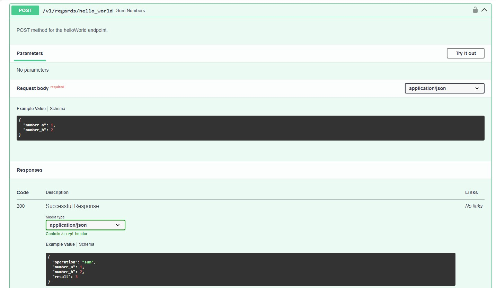

## 1. Introduction

The `Darwin_Python_Microservice` is a Gluon FastAPI microservice component which seamlessly integrates with various Darwin
Libraries, including Darwin Composer, Darwin Logging, Darwin Middlewares, Darwin Security, and Darwin Error Handler. This
guide will explore how these components contribute to the microservice's setup and extended functionalities, enabling it to operate at full scale.

???+ Tip

    This guide extensively documents the usability of the Darwin Python Microservice component generated from the Gluon Portal after cloning it from GitHub to a local machine.

???+ Tip

    For comprehensive details on creating the Darwin Python Microservice using the Gluon Portal,
    building, and deploying it across different environments (Certification, Preproduction, and Production), refer to the [Darwin Python Microservice Journey](../../darwin-python-journey.md).

## 2. Project Structure of the Darwin Python Microservice Component

### Setting Up Your Local Environment

{!
   include-markdown "../../../../../../snippets/setup/python-setup.md"
!}

### Structure

Once generated, the Darwin Python Microservice follows a structured format similar to the following:

```text
📂.github
┣ 📂workflows
┃ ┗ (*) yml workflow files
┗ 📜CODEOWNERS
📂.gluon
┣ 📂cd
┃ ┣ 📂cert
┃ ┃ ┣ 📜cd.yml
┃ ┃ ┗ 📜values-cert.yml
┃ ┣ 📂pre
┃ ┃ ┣ 📜cd.yml
┃ ┃ ┗ 📜values-pre.yml
┃ ┣ 📂pro
┃ ┃ ┣ 📜cd.yml
┃ ┃ ┗ 📜values-pro.yml
┃ ┗ 📜values.yaml
┗ 📂ci
┃ ┗ 📜properties.env
📂docs
┣ 📂openapi
┃ ┗ (*) Definition Python files
📂src
┃ ┣ 📂app
┃ ┗ ┗ (*) Application source code
📂test
┃ ┗ (*) Python Test files  
📝.gitignore
📝.dockerignore
📝.editorconfig
📝Dockerfile
📝Pipfile
📝Pipfile.lock
📝Readme.md
📝asgi.py
📝changelog.md
📝entrypoint.sh
📝gunicorn_config.py
📝logging_config.ini
📝pytest.ini
📝setup.py
📝version.py
```

- **.github/**: Contains continuous integration (CI) and continuous deployment (CD) workflows for the microservice.
- **.gluon/**: Contains CI/CD configurations, infrastructure identifiers, deployment properties, and Helm configuration for deployment.
- **docs/**: Contains OpenAPI definition Pydantic models to facilitate automatic documentation of API endpoints.
- **src/**: Contains the application source code and business logic.
- **test/**: Holds Python test files for the application.
- **.gitignore**: Defines files and directories to be ignored by Git.
- **.dockerignore**: Specifies files and directories to exclude from Docker builds.
- **.editorconfig**: Maintains consistent code style across different editors and IDEs.
- **Dockerfile**: Defines instructions for building the microservice Docker image.
- **Pipfile**: Lists project dependencies managed via Pipenv.
- **Pipfile.lock**: Locks dependency versions to ensure consistency across environments.
- **README.md**: Provides an overview and instructions for using the microservice.
- **asgi.py**: Entry point module to run the microservice.
- **changelog.md**: Documents changes and updates to the microservice.
- **entrypoint.sh**: Bash script to launch the microservice using Gunicorn.
- **gunicorn_config.py**: Configures Gunicorn to serve the microservice.
- **logging_config.ini**: Contains logging configuration settings.
- **pytest.ini**: Specifies settings for running tests with pytest.
- **setup.py**: Defines the setup script for packaging and distributing the microservice.
- **version.py**: Stores the current version of the microservice.

### Cloning Your Repository

After configuring your local environment, the next step is to clone the project locally.
For detailed instructions, refer to [How to Clone the Project](../../../../../../../application/component-management/create-component.md#cloning-a-repository).

### Microservice Configuration

When the microservice application is being deployed, the environment variables of the will be configured through `ConfigMap` as being an API
object used to store configuration data(such as environment variables or configuration files) separated from the application code.
To learn more on ConfigMaps, visit the [docs](../../../../../../../components/configuration/kubernetes/configmaps-rm.md).

Additionally, `Extra Environment Variables` required for deployment can be specified in the `Helm values.yml file`, located under `.gluon/cd` in the Darwin Python Microservice project.

Note:
When running the microservice locally, environment variables can be set in the following ways:

Using the terminal:

```sh
set DARWIN_SECURITY_WHITE_LIST=["/hello_world"]
```

Or within the application code:

```python
import os
os.environ["DARWIN_SECURITY_WHITE_LIST"] = '["/hello_world"]'
```

These variables should be set before the instantiation of the library within the FastAPI app instance.
For a demonstration, refer to the Darwin Security library documentation.
More details on the whitelist feature can be found in the related [docs section](#darwin-security).

### Microservice dependencies

As a dependency manager we use [Pipenv](https://pipenv-es.readthedocs.io/es/latest/).
All package dependencies must be in the locked versions and included in the Pipfile files. They must be placed under **packages** section.

Example of the file ```Pipfile```

```yml
[[source]]
name = "pypi"
url = "https://nexus.alm.europe.cloudcenter.corp/repository/pypi-public/simple"
verify_ssl = false

[packages]
fastapi-health = "~=0.4.0"
pytest = "~=8.1.1"
```

### Running the Microservice

To run the microservice, follow these steps:

1. Install dependencies:

    ```sh
    pipenv install
    ```

2. Run the microservice:

    ```sh
    pipenv run python -m asgi
    ```

Once the service has been lifted it is possible to send requests via CURL:

CURL:

````commandline
curl --location --request GET 'http://127.0.0.1:8080/v1/regards/hello_world' \
--header 'x-b3-traceid: f32197c9a3cb99f7' \
--header 'app-init: app-init' \
--header 'contact-point: contact-point' \
--header 'session-id: session' \
--header 'x-clientId: cliente' \
--header 'x-santander-channel: channel' \
--header 'Authorization: Bearer [TOKEN-JWT]'
````

**Tip**: Sending a request to the microservice requires a valid Bearer [TOKEN-JWT] for some endpoints.

### Code test

To perform the unit tests defined in each microservice, whether or not they are event-based microservices,
the following command must be executed

```sh
pipenv run python -m pytest
```

## 3. Darwin Library Components and Their Integration into the FastAPI Microservice

### Darwin Composer

The **Darwin Composer** library orchestrates the implementation of the Darwin Framework in a FastAPI microservice. It simplifies the integration of all Darwin Framework components and utilities into a single module.

With `darwin_composer`, the following functionalities are set up:

- Darwin Error Handling
- Darwin Security
- Darwin Logging
- Cross Origin Resource Sharing [(CORS) middleware](https://fastapi.tiangolo.com/tutorial/cors/)
- Internationalization (i18n)
- OpenAPI documentation

It also sets up the following resource:

- Health-check endpoint

???+ Tip

    For further details on its integration and how to set it up in the Framework, refer to [Darwin Composer Documentation](../darwin-libraries/darwin-composer.md).

### Darwin Error Handler

The **Darwin Error Handler** centralizes the handling of common web exceptions within the Darwin Python Framework, ensuring standardized error responses.

It is characterized by the return of a response in JSON format, specifying the type of error and description if it is available.

The format of the JSON response depends on the configuration.

#### 1.1 Darwin format

```json
{
    "appName": any,
    "timeStamp": any,
    "errorName": any,
    "internalCode": any,
    "shortMessage": any,
    "detailedMessage": any,
    "mapExtendedMessaged": {},
    "status": any
}
```

#### 1.2 Gluon format

```json
{
    "errors":[{
        "code": any,
        "message": any,
        "level": any,
        "description": any
    }]
}
```

???+ Tip

    You can enable the different format setting the following environment variable `DARWIN_CORE_EXCEPTIONS_ERRROR_FORMAT`.
    Visit [Environment variables](../darwin-libraries/darwin-error-handler.md#environment-variables) for more information.

???+ Tip
    For more details on the functionalities and the integration of the Darwin Error Handler library into the microservice, visit [Darwin Error Handler Documentation](../darwin-libraries/darwin-error-handler.md).

### Darwin Logging

The **Darwin Logging** library is responsible for traceability and logging. It monitors incoming and outgoing requests, manages technical logs and activity logs via Kafka distributed event transmission.

> **Note:** The transport mode for logging can be configured via the environment variable `DARWIN_LOGGING_TRANSPORT`. Setting it to `CONSOLE` prints logs in JSON format to the console.

???+ Important

    The Darwin Logging Library can also be integrated in other general applications which are not Darwin Python Microservice.
    Visit this [docs section](../darwin-libraries/darwin-logging.md#32-integration-into-general-applications) for more information.

???+ Tip

    To explore available transport modes, refer to [Logging Documentation](../darwin-libraries/darwin-logging.md#5-transport-mode).

???+ Tip

    For further details on extended logging and tracing functionalities, visit [Darwin Logging Documentation](../darwin-libraries/darwin-logging.md).

### Darwin Middlewares

The **Darwin Middlewares** library enhances the FastAPI microservice by providing middleware functionalities that intercept and process HTTP requests and responses.

> **Hint:** Middleware functions enable additional operations before or after request handling.

#### Internationalization (i18n)

The functionality of the Darwin Middlewares allows developers to easily add internationalization support to
their FastAPI applications. It provides features for translating text messages, interpolating
variables into translated strings, and handling pluralization rules based on the target language.

To enable this feature,
The microservice must be configured to enable Internationalization (i18n) through the various environment variables:

```sh
DARWIN_MIDDLEWARES_I18N = 'True' # Set as False by default
```

Also the configuring the path to the folder languages with json files. i.e. (`es.json`) through the environment variable

```sh
DARWIN_MIDDLEWARES_I18N_LOCALES = '/etc/i18n/locales' # Set as /etc/i18n/locales by default
```

Finally, we have to enable i18n in the `composer_config.py` file in the microservice.

```python
from version import __version__
from ..config import global_config

config = {
     "version": __version__,
     "cors": {
          "enable": True
     },
     "openapi": {
          "enable": True,
          "title": "Some App",
          "description": "It does some cool stuff",
          "contact": {
               "name": "myName",
               "url": "myurl"
          }
     },
     "i18n": {
          "enable": True, # Enable i18n by setting it to True
          "fallback": "en",
     }
}
```

???+ Tip

    To learn more, visit [Darwin Middlewares Documentation](../darwin-libraries/darwin-middlewares.md).

### Darwin Security

The **Darwin Security** library provides token validation, ensuring global protection for FastAPI-based microservice endpoints.

#### Authorization Server (JKU)

It allow us to validate our JWT token using Json Web Key Server. To enable it we must to set the following environment variable

```sh
DARWIN_SECURITY_AUTHENTICATION_TYPE = 'jku'
```

#### Whitelist

This environment variable allow us to exclude an endpoint of the verification security. The whitelist can contain the following items:

**String**: a url string with the exclusion
**Dict**: a dictionary that must have two attributes:
**path**: string with url target
**method**: the HTTP method you would like to exclude

> **Note** To configure the whitelist, the environment variable `DARWIN_SECURITY_WHITE_LIST` will be used.

```sh
DARWIN_SECURITY_WHITE_LIST = '[{'path' : '/hello_world' , 'method' : 'GET'}]'
```

???+ Tip

    For further details on its integration and functionalities, visit [Darwin Security Documentation](../darwin-libraries/darwin-security.md).

## 4. Building an API Rest

To build a Rest API, the APIRouter class will be used, which allows the controllers to be grouped into routers by doing
the most modular, straightforward and simple development. In addition, the design will adhere to the structure of guidelines defined by the archetype.

### i. Development and registration of controllers

The definition of the routes that make up the controllers will be carried out within the sub-directory **resources**, grouping them together
By affinity, for example, if two controllers were created, named *HelloWorld* and *helloMoon*, it would make sense
they were grouped into a file called regards.

The following steps are required to define the controllers:

1. Import the APIRouter class from the *fastapi* library.
2. Create the router object from the APIRouter class.
3. Decorate the path operation functions defined with the router object and also specify the resource path.

Example.

```regards.py```

```python

from fastapi import APIRouter

HelloWorldRouter = APIRouter()

@HelloWorldRouter.get("/hello_world")
def get_message():
  pass

@HelloWorldRouter.post("/hello_world")
def post_message():
  pass


HelloMoonRouter = APIRouter()
```

Once the routers and path operation functions have been created, they must be registered in the *main* of the application following
the following steps:

1. Import all of the Router definitions in a *routers.py* file
2. Import the RouterClass from darwin_composer
3. Create a list of RouteClass with all your Router definitions. Indicate the tag section groups the routers belong. This provides enhanced readability and navigation of the API documentation.
4. Import the routers list in the *main.py* file and feed it into the composer.

Example:

```python
from .regards import HelloWorldRouter, HelloMoonRouter
from darwin_composer.DarwinComposer import RouteClass

routers = [
    RouteClass(HelloWorldRouter, ["QA", "REGARDS"]),
    RouteClass(HelloMoonRouter, ["QA", "REGARDS"])
]

```

```python
from fastapi import FastAPI
from darwin_composer.DarwinComposer import DarwinComposer
from src.resources.routers import routers
from src.app.config.composer_config import config as composer_config

app = FastAPI()

DarwinComposer(app, config=composer_config, routers=routers)
```

### ii. API versioning

It is important to maintain control of API versions in order for there to be retrocompatibility. In this way, the old versions of the API, with the new versions, are accessible. For this purpose, it is recommended that the path of the api be set as follows:

*/{version}/{api-id}/{path_to_resource}

- {version}: api version
- {api-id}: identifies the api among all those exposed in a Gateway
- {path_to_resource}: rest of the path to the api resource to invoke

#### iii. Controllers documentation and API exposure in Openapi

The microservice offers a highly efficient development experience with automatic generation of OpenAPI documentation, made possible with it
integration with Pydantic and FastAPI for data validation and serialization. Describing the API documentation is facilitated by defining
Pydantic class models and this will be carried out within the sub-directory **docs** . This approach ensures clarity and coherence in the API documentation.

##### OpenAPI Documentation

The microservice automatically generates detailed documentation for your API endpoints based on the defined route handlers and Pydantic models. This documentation is available in two formats:

1. **Swagger UI (Docs Path)**: It generates an interactive Swagger UI interface at `/docs`, allowing for exploration and testing of the API endpoints directly from their web browser.
2. **ReDoc (ReDoc Path)**: Additionally, It generates a clean and user-friendly ReDoc interface at `/redoc`, providing a structured view of the API documentation for better readability and navigation.

##### OpenAPI Specification

It also generates the OpenAPI schema in JSON format, which is available at `/openapi.json`.

**Example of using Pydantic models for each defined route handler.**

Python file where the specifications of the POST method of the helloWorld controller are defined

> docs/openapi/helloPOST.py

```python
""" Make the sum of two numbers. """

from pydantic import BaseModel, Field

class SumRequest(BaseModel):
    number_a: int = Field(json_schema_extra={"description":"integer number",'examples': [1]})
    number_b: int = Field(json_schema_extra={"description":"integer number",'examples': [2]})

class SumResponse(BaseModel):
    operation: str = Field(json_schema_extra={"description":"operation performed with both numbers",'examples': ['sum']})  
    number_a: int = Field(json_schema_extra={"description":"integer number",'examples': [1]})
    number_b: int = Field(json_schema_extra={"description":"integer number",'examples': [2]})
    result: int = Field(json_schema_extra={"description":"The result of the sum",'examples': [3]})

```

Importing the python file to the POST method of the helloWorld controller

```python
import logging
from fastapi import APIRouter
from docs.openapi.helloPOST import SumResponse, SumRequest

logger = logging.getLogger(__name__)

HelloWorldRouter = APIRouter()

@HelloWorldRouter.post("/v1/regards/hello_world",response_model=SumResponse)
async def sum_numbers(request:SumRequest):
    """
    POST method for the helloWorld endpoint.
    """

    logger.info("Calling to Hello World Sum Service")
    result = hello_world_sum(request.number_a, request.number_b)

    return JSONResponse(content={
                                    "operation": "sum",
                                    "number_a": request.number_a,
                                    "number_b": request.number_b,
                                    "result": result
                                }, status_code=200)

```

The result in swagger ui is as follows:



## 5. Conclusion

This guide provides a comprehensive overview of how to utilize the Darwin Python Microservice and its accompanying libraries efficiently.
For further exploration, consult the related documentation linked throughout this article.
