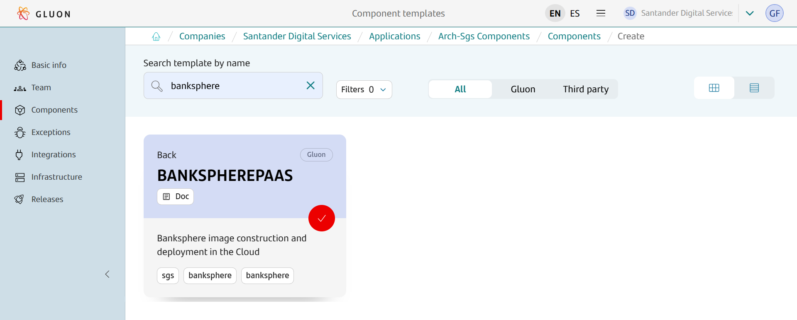
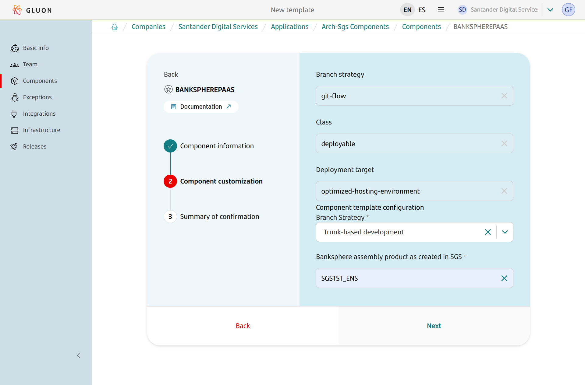
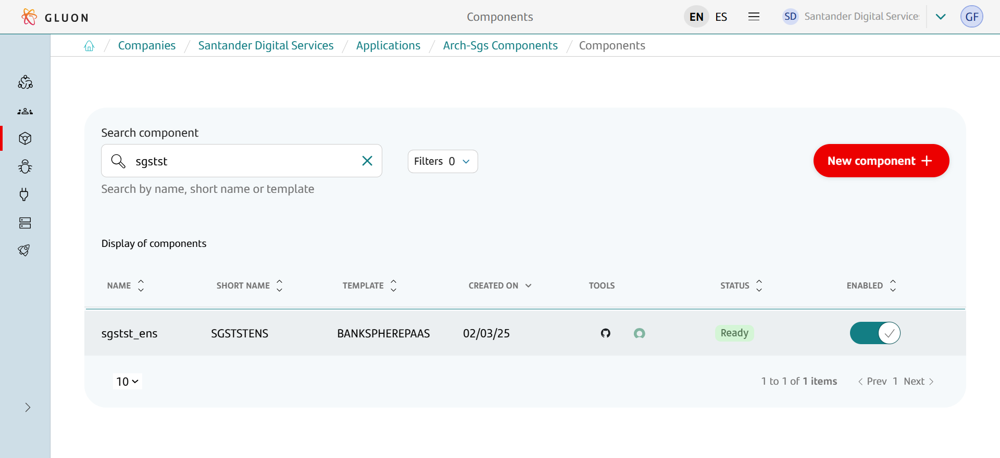

## Introduction

The purpose of this documentation is to provide a **step-by-step guide** on how to orchestrate the integration of Banksphere within the GLUON platform.

This guide will allow you to understand how to build and deploy Banksphere images through a CI/CD process.

All deployments will be done in a Kubernetes cluster from an immutable image that we will previously upload to a registry (Harbor).

## Create Component

### Gluon Portal

First, you have to [**onboard your application.**](../../../application/application-management/index.md)
Once you have your application created, you can start creating your component.

To create a component,
follow the steps described in [**Component Management**](../../../application/component-management/create-component.md),
searching for the component to be created.

You have to select the type of component you want to create, in this case you are going to create a **Banksphere PaaS** component.



???+ remember

    To follow the naming convention visit [Repository Naming Convention](../../../application/component-management/create-component.md#repository-naming-convention).

The user must customize the Banksphere assembly product as created in SGS (respecting case):



Banksphere PaaS Template Parameters:

| Input | Required | Default value | Description |
|--|:--:|:--:|--|
| **Branch Strategy** | true | Trunk-based development | Git branching model that involves the use of feature branches and multiple primary branches. |
| **Banksphere assembly product** | true | | Fill with Banksphere assembly product as created in SGS (respecting case). |

Once the component is created,
we can see under the application that there is a new repository created with the name of the component.



We have the following links in:

| Item | Link | Role Permission |
|--|--|--|
| GitHub Repository | Link to the repository created in GitHub | Developer (RW) /Technical Lead (Maintain) [All roles explained](https://docs.github.com/es/organizations/managing-user-access-to-your-organizations-repositories/managing-repository-roles/repository-roles-for-an-organization) |

### Banksphere PaaS Template

#### Trunk-Based Development

##### Branches

{!
include-markdown "../../snippets/setup/banksphere-branch-setup-tbd.md"
!}

##### Structure

The generated Banskphere component has a structure similar to the following.

```text
📂.github
┣ 📂workflows
┃ ┣ 📜cd.yml
┃ ┣ 📜ci.yml
┃ ┣ 📜release.yml
┃ ┣ 📜update-component-workflow.yml
┃ ┗ 📜version-validation.yml
┗ 📜CODEOWNERS
📂.gluon
┣ 📂cd
┃ ┣ 📂cert
┃ ┃ ┣ 📜cd.yml
┃ ┃ ┗ 📜values-cert.yml
┃ ┗ 📜values.yaml
┗ 📂ci
┃ ┗ 📜properties.env
📜.gitignore
📜VERSION
```

???+ abstract "Equivalent versions"

    The component version located in the `VERSION` file should be equivalent to the functional version of Banksphere assembly product (BKS_VRF) located in `.gluon/ci/properties.env` file.

## Local Development

??? abstract "Cloning your repository"

    ### Cloning your repository

    Once we have the device properly configured, the first step is to clone the project locally.

    To do so, visit [**How to clone de project**](../../../application/component-management/create-component.md#cloning-a-repository).

## Infrastructure

### How to configure your deployment environment

{!
   include-markdown "./snippets/snippet-oam.md"
   start="<!--Start Infrastructure-->"
   end="<!--End Infrastructure-->"
!}

## Component Configuration

### Branches

{!
   include-markdown "../../snippets/configuration/banksphere-configuration.md"
   start="<!--Start TBD Branches-->"
   end="<!--End TBD Branches-->"
!}

### Configuration Files

{!
   include-markdown "../../snippets/configuration/banksphere-configuration.md"
   start="<!--Start Configuration Files-->"
   end="<!--End Configuration Files-->"
!}

#### Properties

The location of the properties.env is:

``` bash
📂.gluon
┗ 📂ci
  ┗ 📜properties.env
```

=== "Banksphere Example"

```properties
########################
# MANDATORY PROPERTIES #
########################

# Functional version of banksphere product (PSI).
#   Example: V01R00F00
BKS_VRF=V26R02F04

# Version or URL of Tabla de Parámetros component.
#   Example: V14R55F00
#   Example: https://nexusmaster.alm.europe.cloudcenter.corp/repository/binaries_releases/SGT/JAVA_NOMAVEN/sgt-servqa/Tablas_Parametros_BKS/GlobalesTblParam/GlobalesTblParam-14.55.0.zip
BKS_TBLPARAM=https://nexusmaster.alm.europe.cloudcenter.corp/repository/binaries_releases/SGT/JAVA_NOMAVEN/sgt-servqa/Tablas_Parametros_BKS/GlobalesTblParam/GlobalesTblParam-14.55.0.zip

# Release recipient client.
#   Available clients:
#     GSC
#     OPENBANK
#     SAN
#     SANGO
#     SANTANDER
#     SANTANDERCORPBANKINGUK
#     SANTANDERGERMANY
#     SANTANDERUK
#     SGT
#     TOTTA
#     SOVEREIGN
#     SANTANDERMEXICO
#     SCIB
#     NNGG
#     BRASIL
CLIENT=SANTANDERUK

# Name of the Certification environment you want to deploy your assembly.
# All current SGS PAAS environments are available for GLUON.
#   Example: CERT_BKS_PAAS
BKS_CERTIFICATION_ENVIRONMENT=CERT_BKS_PAAS_UKRETAIL


#######################
# OPTIONAL PROPERTIES #
#######################

# SGS Package Software Id (PSI) to create image. If not specified, it uses the latest PSI in DEV state.
#   Example: 1277146
# PSI=

# Branch or tag for the BKS self-contained image build scripts (dockerfile). If not specified, it uses the default value 'latest'
#   Example: V02R25F54
# BKS_ARQ_GITBRANCH=

# BKS Liberty Docker image base name. If not specified, it uses the default value 'registry.global.ccc.srvb.can.paas.cloudcenter.corp/produban/bks-liberty'
#   Example: registry.global.ccc.srvb.can.paas.cloudcenter.corp/produban/bks-liberty
# BKS_BASE_IMAGE=

# BKS Runtime version. If not specified, it uses the default value 'release'. You may check other versions by accessing: BKS Architecture
#   Example: release
# BKS_BASE_VERSION=

# Global arch version. Possible products: GLOBAL_ARQ o GLOBAL_ARQATM. If not specified, it uses the latest released version of GLOBAL_ARQ.
#   Example: 1062336
# BKS_GLOA=

# Global usa version. Possible products: GUESTD_GESTANDARD / GLOBAL_USA / GLOBAL_STD. If not specified, it uses the latest released version of GLOBAL_USA.
#   Example: 1096582
# BKS_GLOU=

# Banksphere Hotfix. If not specified, it uses empty value
# BKS_HOTFIXES=

# Banksphere external libraries. If not specified, it uses empty value
# BKS_EXTERNAL_LIBS=

# Additional image build arguments. If not specified, it uses empty value
#   Example: CONTAINER_BUILD_ARGS="--build-arg arg1=value1 --build-arg arg2=value2"
# CONTAINER_BUILD_ARGS=

# User definition labels. Limited to 20 labels. If not specified, it uses empty value
#   Example: CONTAINER_LABELS="--label label1=value1 --label label2=value2"
# CONTAINER_LABELS=

# Banksphere Java options.
#   Example: BKS_JAVA_OPTIONS="-Daeb earcompact=true,-XX:InitialRAMPercentage=20,-XX:MaxRMPercentage=60,-XX:MaxHeapFreeRatio=10,.Xmcrs2M,-Xcodecachetotal40M"
# BKS_JAVA_OPTIONS=

# It will contain the url of a file with which the scripts will then overwrite the assembly's functional log configuration
# (which is stored in the assemblyLogsLevels.xml file in the release). If not specified, it uses empty value
# BKS_ASSEMBLY_LOGS_LEVEL=
```

For getting more information about this file,
please refer to [Continuous Integration file documentation](../../../application/ci-cd/cd/cd-rm/cd-workflow/ci-envs-configuration.md).

{!
   include-markdown "../../snippets/configuration/banksphere-configuration.md"
   start="<!--Start Common Properties-->"
   end="<!--End Common Properties-->"
!}

#### Continuous Deployment files

{!
   include-markdown "../../snippets/configuration/banksphere-configuration.md"
   start="<!--Start Deployment-->"
   end="<!--End Deployment-->"
!}

#### Helm Configuration

You must have the next files in the `.gluon/cd` folder of your project with the following structure:

``` bash
📂.gluon
┣ 📂cd
┃ ┣ 📂cert
┗ ┗ 📜values.yaml
```

Description of the files:

- **values.yaml**: Helm values file with the default values to deploy the Banksphere assembly product. **It will be automatically configured during the deployment process in the certification environment, so any value specified in this file will be ignored.**

## Build and Deploy your application

{!
   include-markdown "../../snippets/lifecycle/tbd-banksphere.md"
!}
