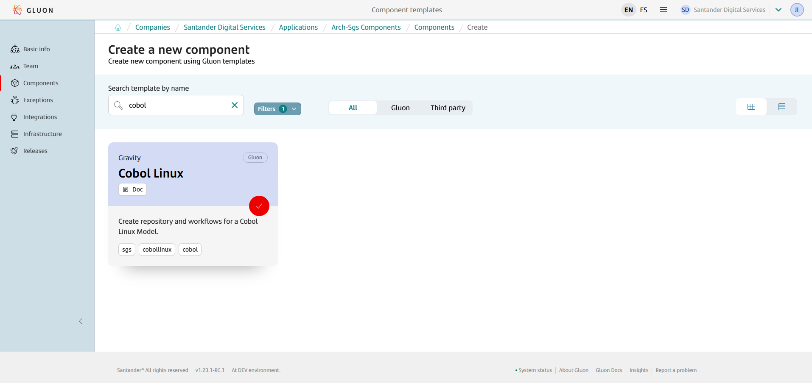
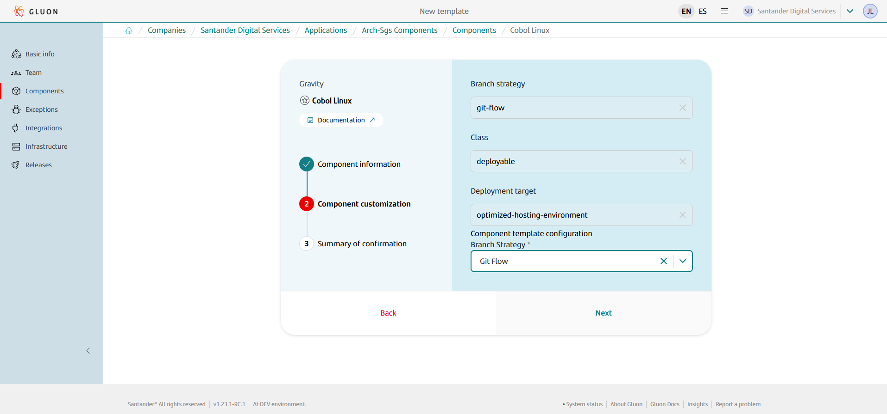
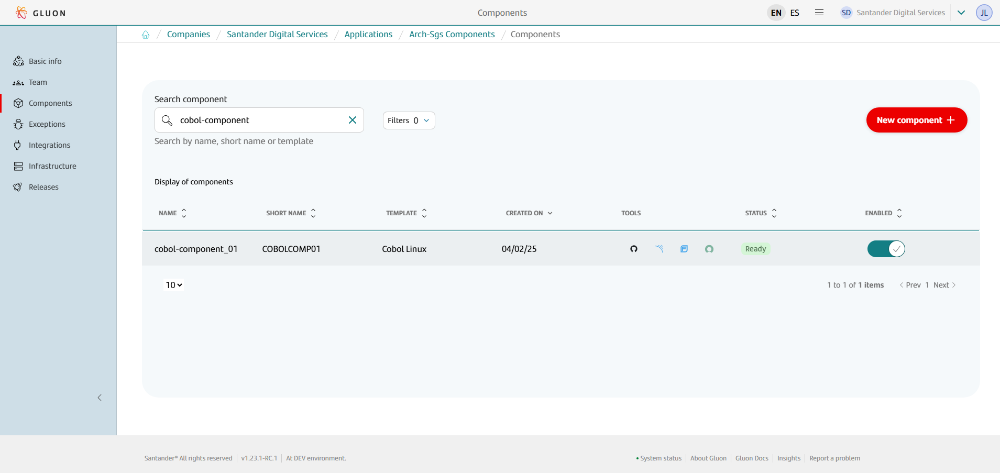
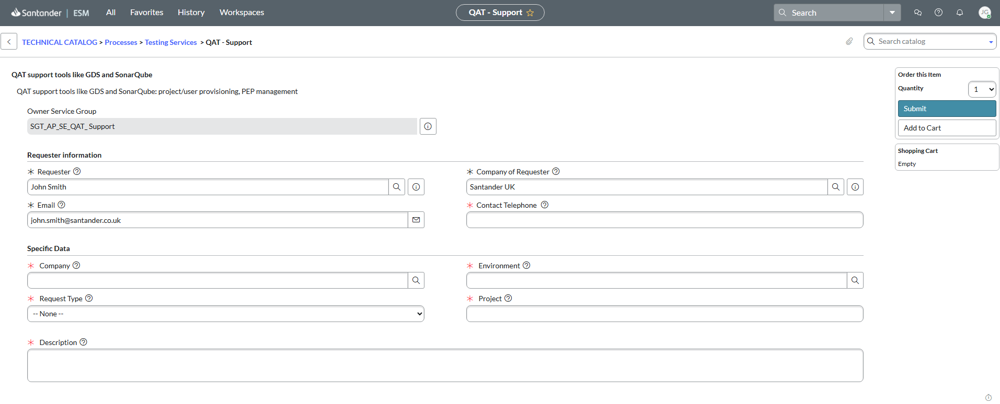

## Introduction

The purpose of this documentation is to provide a **step-by-step** guide on how to orchestrate the integration of COBOL Linux within the GLUON platform.

This guide will allow you to understand how to build COBOL Linux components through a CI process.

The deployment process (CD) will not be carried out through GLUÓN, but will continue to be carried out through SGS.

## Create Component

### Gluon Portal

First, you have to [**onboard your application.**](../../../application/application-management/index.md)
Once you have your application created, you can start creating your component.

To create a component,
follow the steps described in [**Component Management**](../../../application/component-management/create-component.md),
searching for the component to be created.

You have to select the type of component you want to create, in this case you are going to create a **Cobol Linux** component.



???+ remember

    To follow the naming convention visit [Repository Naming Convention](../../../application/component-management/create-component.md#repository-naming-convention).

The only option the user must select during the creation of the component is the Branch Strategy, which will always be Git Flow:



Cobol Linux Template Parameters:

| Input | Required | Default value | Description |
|--|:--:|:--:|--|
| **Branch Strategy** | true | Git Flow | Git branching model that use main and development branches in addition to feature, release and fix branches. |

Once the component is created,
we can see under the application that there is a new repository created with the name of the component,
Sonar project and Fortify project.



We have the following links in:

| Item | Link | Role Permission |
|--|--|--|
| GitHub Repository | Link to the repository created in GitHub | Developer (RW) /Technical Lead (Maintain) [All roles explained](https://docs.github.com/es/organizations/managing-user-access-to-your-organizations-repositories/managing-repository-roles/repository-roles-for-an-organization) |
|Sonar Project|Link to the Sonar project created|All Users (Read)|
|Fortify Project*|Link to the Fortify project created|All Users (Read)|

*: Despite the appearance of the Fortify project link, for now, SAST and SCA analyses will not be performed on the Cobol Linux components.

???+ warning "Important!"

    Once the Sonar project is created, it is necessary to create a ticket in Service Now requesting that the cobol-linux profile be set for that project, otherwise the analysis will not be performed correctly.
    The ticket should be created at the following path:

    This ticket must be created at:  
    TECHNICAL CATALOG > Processes > Testing Services > QAT – Support

    

### Cobol Linux Template

#### Git Flow

##### Branches

{!
include-markdown "../../snippets/setup/cobol-linux-branch-setup-gfw.md"
!}

##### Structure

The generated Cobol Linux component has a structure similar to the following.

```text
📂.github
┣ 📂workflows
┃ ┣ 📜ci.yml
┃ ┣ 📜quality.yml
┃ ┣ 📜release.yml
┃ ┣ 📜update-component-workflow.yml
┃ ┗ 📜version-validation.yml
┗ 📜CODEOWNERS
📂.gluon
┗ 📂ci
┃ ┗ 📜properties.env
📜.gitignore
📜VERSION
```

???+ abstract "Equivalent versions"

    The component functional version (x.y.z) located in the `VERSION` file should be equivalent to the functional version (VRF) located in COBOL Linux component `ivy.xml` file.

## Local Development

??? abstract "Cloning your repository"

    ### Cloning your repository

    Once we have the device properly configured, the first step is to clone the project locally.

    To do so, visit [**How to clone de project**](../../../application/component-management/create-component.md#cloning-a-repository).

## Component Configuration

### Branches

{!
   include-markdown "../../snippets/configuration/cobol-linux-configuration.md"
   start="<!--Start GFW Branches-->"
   end="<!--End GFW Branches-->"
!}

### Configuration Files

{!
   include-markdown "../../snippets/configuration/cobol-linux-configuration.md"
   start="<!--Start Configuration Files-->"
   end="<!--End Configuration Files-->"
!}

#### Properties

The location of the properties.env is:

``` bash
📂.gluon
┗ 📂ci
  ┗ 📜properties.env
```

=== "Cobol Linux Example"

```properties
########################
# MANDATORY PROPERTIES #
########################

# List of customers where we are going to send the software when the release is publish to SGS. Current available clients:
#   | Client              | Description                                            |
#   |---------------------|--------------------------------------------------------|
#   | Abbey               | Cliente para publicaciones a Abbey                     |
#   | Alemania            | Cliente para publicaciones a Alemania                  |  
#   | AreasCorp           | Cliente para publicaciones a Areas Corporativas        |
#   | Brasil              | Cliente para publicaciones a Brasil                    |
#   | GEMoney             | Cliente para publicaciones a GeMoney                   |
#   | HUB                 | Cliente para publicaciones a HUB (Global Service)      |
#   | Isban               | Cliente para publicaciones a Isban                     |
#   | NNGG                | Cliente para publicaciones a Negocios Globales         |
#   | Santander           | Cliente para publicaciones a Santander                 |
#   | SantanderChile      | Cliente para publicaciones a Chile                     |
#   | SantanderConsumerES | Cliente para publicaciones a Santander Consumer España |
#   | SantanderConsumerHQ | Cliente Santander Consumer HQ                          |
#   | SantanderMexico     | Cliente Santander México                               |
#   | SCU                 | Cliente para Publicaciones UK Corporate                |
#   | Sovereign           | Cliente para publicaciones a Sovereign                 |
#   | Totta               | Cliente para publicaciones a Totta                     |
#   | Wealth              | Cliente para publicaciones a Wealth                    |
#
# Example:
#   CLIENTS="Isban"
CLIENTS=”Santander”


#######################
# OPTIONAL PROPERTIES #
#######################

#Cobol Linux custom JAVA_HOME
#JAVA_HOME=

#Sonar timeout (in minutes). Default 15.
#SONAR_TIMEOUT=
```

To get more information about this file,
please refer to [Continuous Integration file documentation](../../../application/ci-cd/cd/cd-rm/cd-workflow/ci-envs-configuration.md).

{!
   include-markdown "../../snippets/configuration/cobol-linux-configuration.md"
   start="<!--Start Common Properties-->"
   end="<!--End Common Properties-->"
!}

## Build and Deploy your application

{!
   include-markdown "../../snippets/lifecycle/gitflow-cobol-linux.md"
!}
