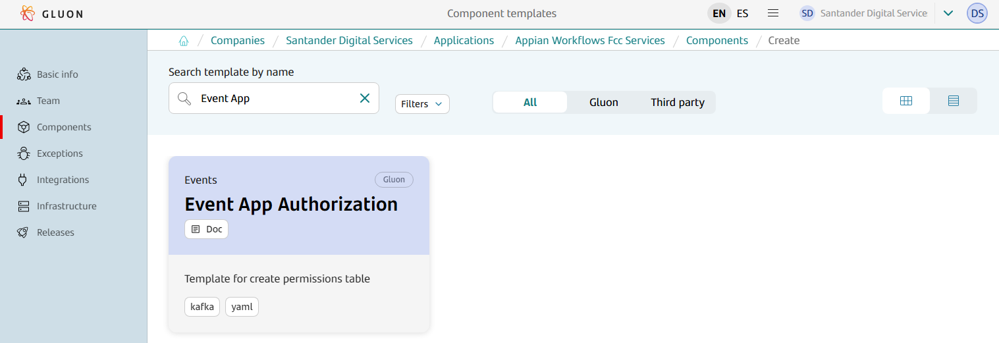

# Event app authorization Journey

## Introduction

The purpose of this documentation is to provide a **step-by-step guide** on how to gibe the proper application authorization permissions of the topic pattern of your applications.

## Gluon portal

To create a new event app authorization component we have to login into the portal. Then, go to Components and click on New component.
Search Event App Authorization component:



Introduce proper values for component name, shortname an description, click on Continue twice, and then click to Create componente. A new Github repository will be created then.

## Create new event authorization repository

The scaffolding of our application must have been performed automatically. In case it is not done automatically, we will execute the scaffolding workflow manually from the **Actions** menu of the same repository.
Once the scaffolding is executed, we will see that we already have our files configured in our repository, on the _main_ branch, with this structure:

``` bash

📦new-event-app-authorization-repo
 ┣ 📂.github
 ┃ ┣ 📂workflows
 ┃ ┃ ┣ 📜cd.yml
 ┃ ┃ ┣ 📜event-authorization-version-validation.yml
 ┃ ┃ ┣ 📜quality.yml
 ┃ ┃ ┗ 📜update-component-workflow.yml
 ┃ ┗ 📜CODEOWNERS
 ┣ 📂.gluon
 ┃ ┣ 📂cd
 ┃ ┃ ┣ 📂[env]
 ┃ ┃ ┃ ┗📜cd.yml
 ┣ 📂conf
 ┃ ┃ ┣ 📂[env]
 ┃ ┃ ┃ ┗📜application.yml
 ┗ version.yaml
```

The ``.github/workflows`` folder will be used to store the automatic processes we will show in the next steps.

In ``.gluon/cd`` folder, you will have to indicate the CI ID of the OAM of your application.
For more information about it, check [Gluon Application Model (OAM)](../../../../application/ci-cd/cd/cd-rm/gluon-application-model-oam/oam-config-and-params/gluon-application-model-oam-params.md).
There is one folder per environment, and you can add/remove any folder so you can adapt it to your environments structure.

In the folder called ``conf`` there is one folder per environment, and into it there is one file ``application.yml``, where some information about the entity and application in order to create the topic pattern.

## Complete the repository files

There are several things to change in order to configure the repository. For that, create a new branch from main and do the changes you need. Here we indicate the most common changes.

### Infrastructure file

One of the files that must be changed are the ones included in folders ``.gluon/cd/[env]``.

In each environment you will have to indicate the CI ID of the environment of your OAM with the same name of the folder.
For instance, if you have a folder named `cert`, you will have to have an entry in your OAM with an environment with the name of `cert`, and search the ID of the infrastructure you want to deploy.
Include this ID in your `cd.yml` file.

After all the changes have been made, a **Pull Request** must be done against the main branch.

## QA Validations

When the Pull Request is created again the main branch, several controls will be done for validating the repository.

### Fields validation

Quality workflow will check if the `application.yml` has the correct fields (if user hasn't edited the file, all would be okay).

### Version validation

Event version validation workflow checks that in the file `version.yml` there is a value of a version that hasn't been released yet.

## Publish and deploy

### Certification Environment

When all the changes are ready, and if the Quality and Version Validation workflows have been successfully executed, you can merge the branch against the main one, so the CD workflow will be automatically executed.

That will publish a new release and deploy the event app authorization in your environment of type `certification`. In this workflow, a release and a tag is created based on ``version`` field into ``version.yml`` file, placed in the root of the repository.

When the authorization action is being executing, two entries are added in the authorization table of the server, for adding read and write permissions to the topic pattern [ENTITY].[APPLICATION].*,
 where [ENTITY] is the shortname of the entity, and [APPLICATION] the short name of the application.

### Other environments

Apart from deploying in the environment of type `certification` when a change is merged into main branch,
the workflow ``.github/workflows/cd.yml`` can be called via [Release Management](../../../../application/release-management/zero-touch/index.md) passing an environment name or an environment type, and a version.
The same CD process will be executed, so we can deploy in any environment that we want. The same release that was generated in the first deployment will be used.
