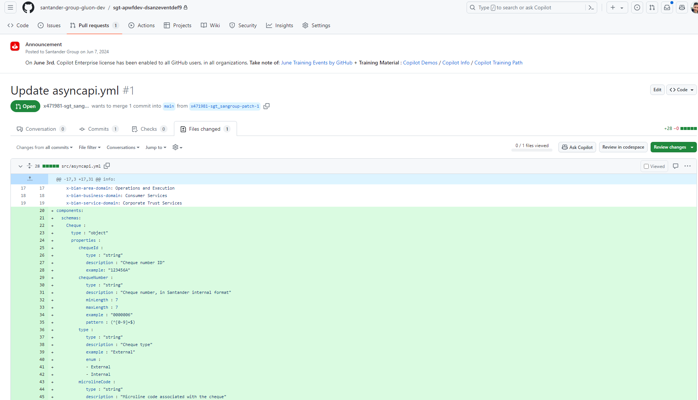
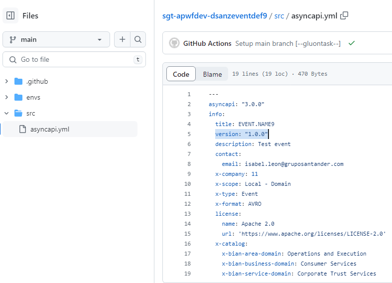
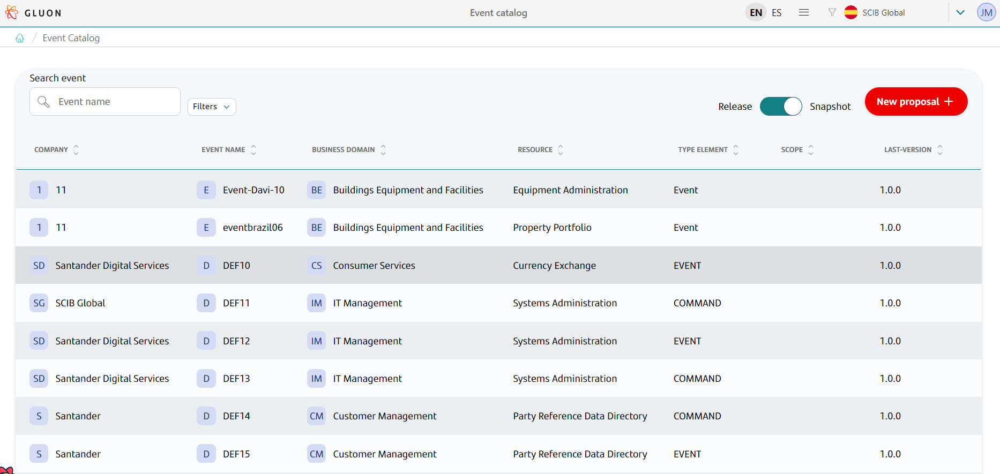
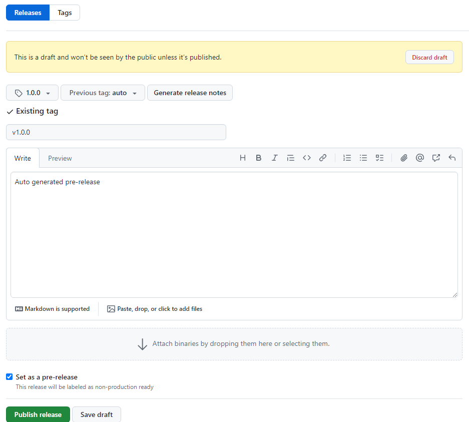

# Event definition Journey

## Introduction

The purpose of this documentation is to provide a **step-by-step guide** on how to create the definition of an event.

## Create new event definition

When the event proposal is resolved by a user who is into the proper group, an automatic process will be executed, and a new repository will be created.
If you enter to it (it will be displayed in a comment in the issue), you will see that the repository only has one branch, called init-branch, and into ``.github/workflows`` there are only one workflow, called ``init-workflow.yml``.

Then, this workflow will be automatically executed in order to prepare the base structure of the repository. Once the workflow is finished, you will see the next structure in the repository:

``` bash

📦new-event-definition-repo
 ┣ 📂.github
 ┃ ┣ 📂workflows
 ┃ ┃ ┣ 📜event-definition-version-validation.yml
 ┃ ┃ ┣ 📜pre-release.yml
 ┃ ┃ ┣ 📜quality.yml
 ┃ ┃ ┣ 📜release.yml
 ┃ ┃ ┗ 📜update-component-workflow.yml
 ┃ ┗ 📜CODEOWNERS
 ┣ 📂envs
 ┃ ┗ 📜properties.env
 ┣ 📂src
 ┃ ┗ 📜asyncapi.yml
```

The ``.github/workflows`` folder will be used to store the automatic processes we will show in the next steps.
In ``envs`` folder several properties are stored for these workflows.
And the folder called ``src`` is the one you need to modify in order to prepare the event definition.

## Configuration

### Create AVRO Schema

All event definitions must include a schema contract, which serves as the blueprint for the event's structure. In this step, you will define the schema for your contract.
The schema file should be placed in the `src` directory and can be created in either JSON Schema format (`*.json`) or AVRO format (`*.avsc`), depending on your requirements.
You may choose a custom file name that aligns with your event's context, ensuring clarity and consistency.

Below is an example of an AVRO schema:

```json
{
  "type": "record",
  "name": "MYEVENT",
  "namespace": "es.santander.cdc.event",
  "fields": [
    {
      "name": "id",
      "type": "string"
    },
    {
      "name": "otherInfo",
      "type": "string"
    }
  ],
  "version": "1"
}
```

### Complete asyncapi file

Here's an example of the base AsyncAPI specification (`src/asyncapi.yml`) generated by the scaffolding workflow:

```yml
---
asyncapi: 3.0.0
info:
  title: APWFDEV.BUILDINGMAINTENANCE.MYEVENT
  version: "1.0.0"
  description: My event.
  contact:
    email: mailbox@mailbox.com
  x-company: 11
  x-scope: Local - Application
  x-type: Event
  x-format: AVRO
  x-confidentialData: PUBLIC
  license:
    name: Apache 2.0
    url: 'https://www.apache.org/licenses/LICENSE-2.0'
  x-catalog:
    x-bian-version: 11
    x-bian-business-area: Business Support
    x-bian-business-domain: Buildings Equipment and Facilities
    x-bian-service-domain: Building Maintenance
components:
  messages:
    APWFDEV.BUILDINGMAINTENANCE.MYEVENT:
      payload:
        schemaFormat: 'application/vnd.apache.avro;version=1.9.0'
        schema:
          $ref: "src/<MY_SCHEMA_FILE>"
```

???+ info "Note"

    Replace `<MY_SCHEMA_FILE>` with the exact name of the schema file you create in the `src` directory. Ensure the file name matches precisely, including the extension (e.g., `myevent-schema.avsc` or `myevent-schema.json`),
    to correctly reference your schema in the AsyncAPI specification.

To begin, create a new branch in the repository. Then, update the `components` section of the `src/asyncapi.yml` file to reference your event's schema file.

Below is an example of a completed AsyncAPI specification with the event structure properly defined:

```yaml
---
asyncapi: 3.0.0
info:
  title: APWFDEV.BUILDINGMAINTENANCE.MYEVENT
  version: "1.0.0"
  description: My event.
  contact:
    email: mailbox@mailbox.com
  x-company: 11
  x-scope: Local - Application
  x-type: Event
  x-format: AVRO
  x-confidentialData: PUBLIC
  license:
    name: Apache 2.0
    url: 'https://www.apache.org/licenses/LICENSE-2.0'
  x-catalog:
    x-bian-version: 11
    x-bian-business-area: Business Support
    x-bian-business-domain: Buildings Equipment and Facilities
    x-bian-service-domain: Building Maintenance
components:
  messages:
    APWFDEV.BUILDINGMAINTENANCE.MYEVENT:
      payload:
        schemaFormat: 'application/vnd.apache.avro;version=1.9.0'
        schema:
          $ref: "src/my-event-schema.avsc"
```

???+ info "Note"
  Pay attention to the `schemaFormat` field. It will be automatically populated based on the schema format you selected during the Proposal step. Ensure that the `schemaFormat` matches the type of the referenced schema:

  - Use `application/vnd.apache.avro;version=1.9.0` for **AVRO** schemas.
  - Use `application/schema+json;version=draft-07` for **JSON** schemas.

  Consistency between the `schemaFormat` and the schema file format is crucial for proper validation and functionality.

### Upload user system credentials in Vault

Last necessary part is to upload a system user credentials into Vault (identity-based secrets and encryption management system).
The documentation about what is Vault and how to manage credentials can be found in [this link](../../../../application/security/security-enablers/hashicorp-vault/index.md).

The name of the credentials depends on what is assigned in the [OAM](../../../../application/ci-cd/cd/cd-rm/gluon-application-model-oam/oam-config-and-params/gluon-application-model-oam-params.md).

If the credentials are not configured in Vault, they can be configured in the same repository in github.

If both credentials exist, the ones used are from Vault.

## Actions

### Quality - Verifications of the event definition

When you have your changes ready, you must create a **Pull Request** against the main branch.



When the PR is created, an automatic quality workflow will be executed. That workflow checks different aspects of the event definition, so we can be sure that the changes are correct:

#### Validate BIAN

Another control applied is validating correct values in BIAN Domain fields. BIAN Area, Business and Service will be validated.
If you have indicated the BIAN Domain in the issue template (when creating the proposal) and you haven't changed the values, there shouldn't be any problem with this validation step.

#### Schema Validation

The third validation step ensures the presence of a valid schema file in the `src` directory. This step verifies that the schema is correctly defined in either AVRO (`*.avsc`) or JSON Schema (`*.json`) format.
The validation process checks for proper syntax, structure, and adherence to the expected schema standards, ensuring the event definition is accurate and reliable.

### Release Version Validation

When a Pull Request is created against the specified branches, a series of validations will be performed to ensure the correctness of the event version release.

#### Triggering the Workflow

The workflow is triggered on Pull Requests targeting the following branches:

- `development`
- `develop`
- `main`
- `master`

#### Workflow Details

It goes to the `asyncapi.yml` file, gets the version, and checks that a release with that number has not been created in the repository.

### Publish the event definition

#### Snapshot version

???+ warning "Note"
    If you had already published a previous version, you must change the ``version`` field into the ``src/asyncapi.yml`` file, in order to have a new version.
    If you don't do that, the workflow will indicate there is already a published version with this number and won't create anything.

    

After complete the ``src/asyncapi.yml``, and merge this changes with main branch, ``pre-release.yml`` workflow will be executed and it will create a **Draft Release** and a tag.
When this workflow is finished, we will see the **Snapshot version** in Events Catalog.



#### Release version

For generating a Release version, you must go to Release screen, in the Github repository, select the Release you want to publish, and edit it. Unmark the **"Set as pre-release"** option, and click on **Publish Release**.



That will execute the ``release.yml`` workflow, so when finished you will be able to see your new **Release version** in Events Catalog into the Gluon Portal.


### Update Framework

Workflow ``.github/workflows/cd.yml`` can be called via `workflow_dispatch`.
This workflow allows you to manually update the CI/CD workflows by providing a specific version of the component template.
