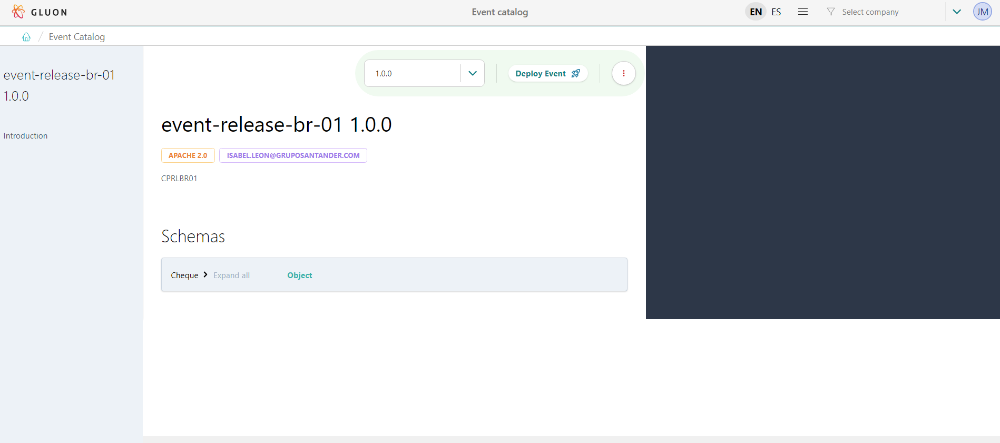
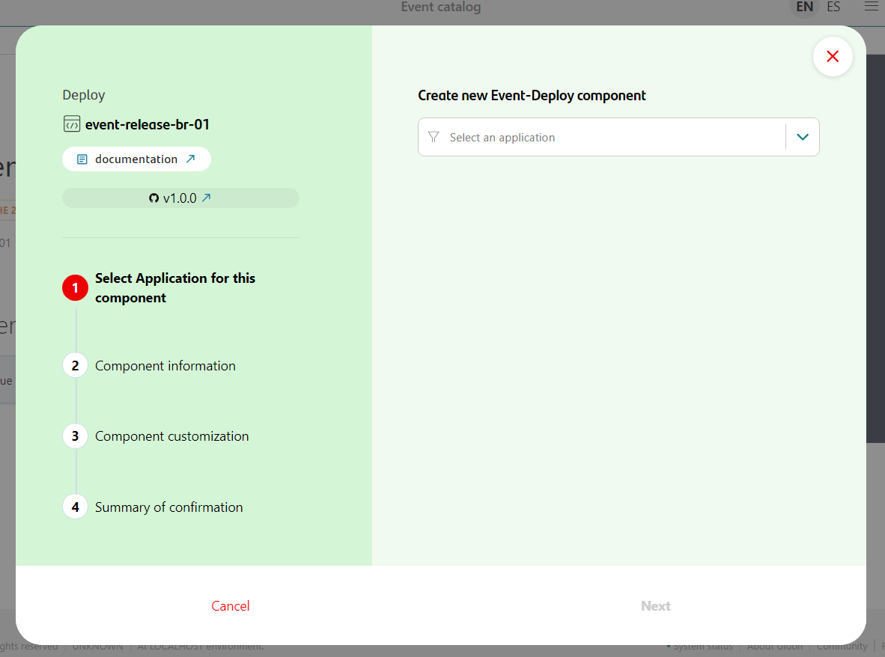
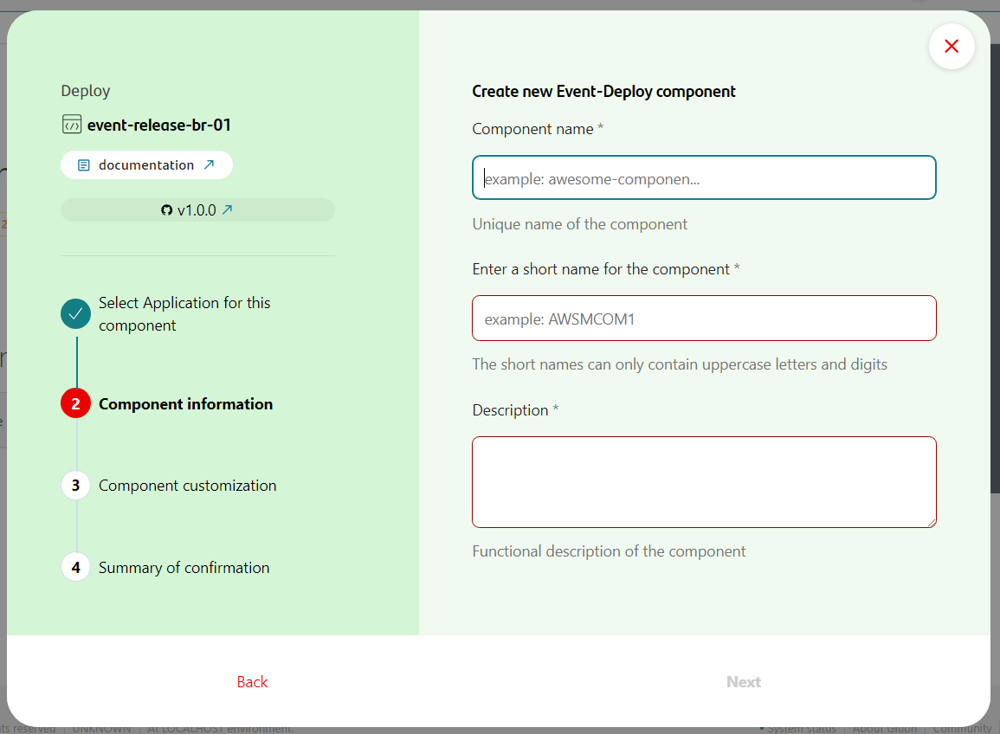
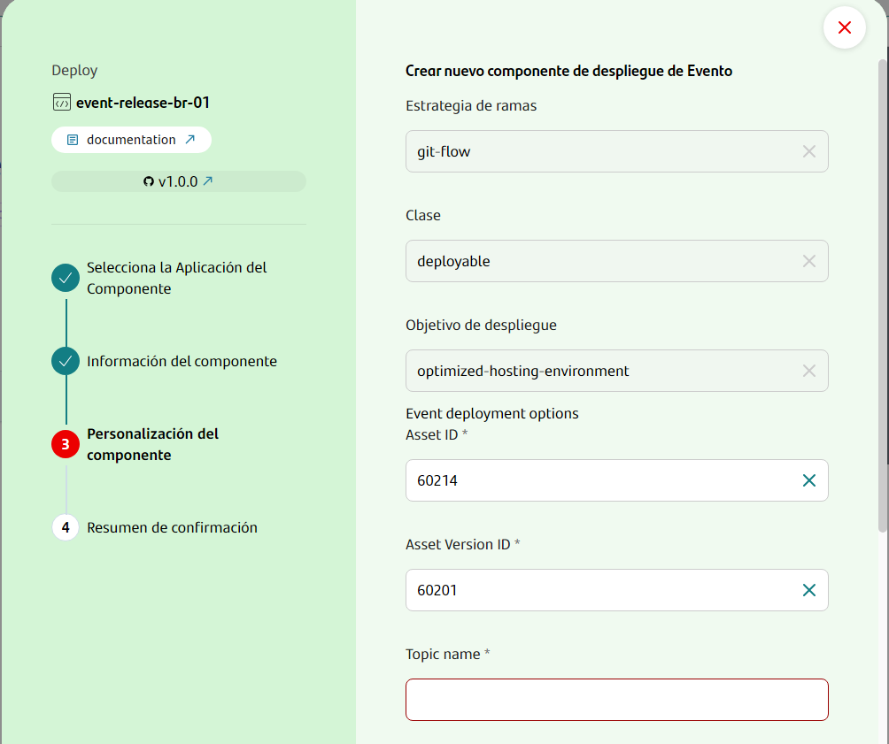
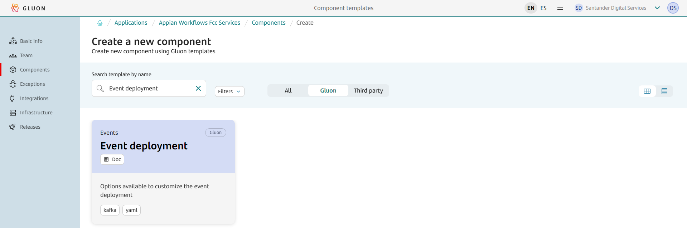
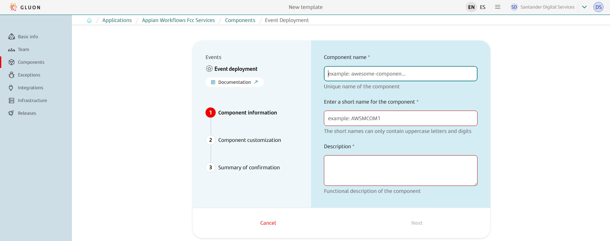
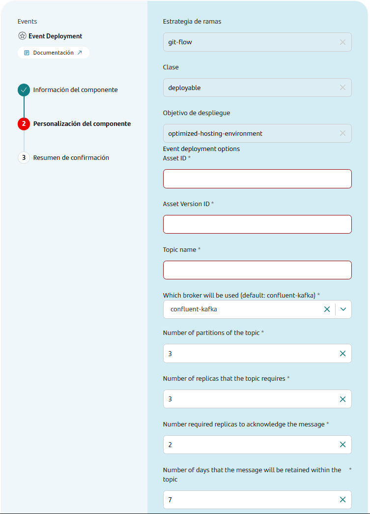
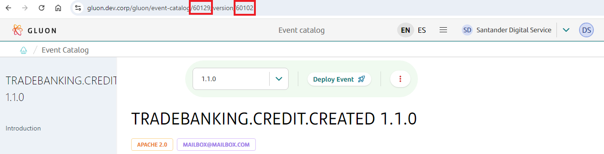

# Event deployment Journey

## Introduction

The purpose of this documentation is to provide a **step-by-step guide** on how to deploy an event.

## Gluon portal

There are two alternatives for deploying a new event. Both options need to enter into Gluon portal.

### Events catalog

The first option is to enter in the Events Catalog. Click on the menu, between the language selector and the company selector, and click on the option **"Event Catalog"**.


Once you enter to this screen, you will see the different event definitions that have been already created.


You can search the event definition you want to deploy and click on it to see the detail of this event definition. On that detail screen, there will be a button **Deploy an event**:



Click on it and you will have to select the application that you wanna to deploy, and then it will appear different fields in order to complete the component creation (some of them will be automatically filled):







Once you complete all the fields, click on Create and a new Event deployment component will be created in Gluon Portal, and therefore a new Event Deployment repository will be created in Github.

### Application components

The second option is selecting in Gluon Portal the application where you want to deploy the event, and click on **Components** section. Then, you will see a **Create new component** button, and you will be able to search for **Event deployment** component.



Click on that option and you will have to complete the name of the component, the short name, and a description of it:



Once you click on Next, it will appear several fields that you have to complete. The main ones are **Asset ID** (the ID of the Asset created in the marketplace in the CD workflow in the event definition repository),
and **Asset Version ID** (the ID of the Version of the Asset created in the marketplace in the CD workflow in the event definition repository).

That information is not needed in the first alternative because you are clicking on Deploy an Event into the detail of a specific event definition, with a specific version.



???+ info "Note"
    In order to get the Asset ID and Asset Version ID of your event definition repository, you can go to the Gluon Portal, access to Event catalog and search your event definition.
    Click on it to go to the detail, select the proper version in the dropbox, and in the URL you will have the Asset ID and Asset Version ID:
    

Once you complete all the fields, click on Next and you will see a Summary. Click on Create and a new Event deployment component will be created in Gluon Portal, and therefore a new Event Deployment repository will be created in Github.

## Create new event deployment repository

First, you will see that the repository only has one branch, called init-branch, and into ``.github/workflows`` there are only one workflow, called ``init-workflow.yml``.

Then, this workflow will be automatically executed in order to prepare the base structure of the repository. Once the workflow is finished, you will see the next structure in the repository:

``` bash

📦new-event-deployment-repo
 ┣ 📂.github
 ┃ ┣ 📂workflows
 ┃ ┃ ┣ 📜event-deployment-version-validation.yml
 ┃ ┃ ┣ 📜quality.yml
 ┃ ┃ ┣ 📜cd.yml
 ┃ ┃ ┗ 📜update-component-workflow.yml
 ┃ ┗ 📜CODEOWNERS
 ┣ 📂.gluon
 ┃ ┣ 📂cd
 ┃ ┃ ┣ 📂[env]
 ┃ ┃ ┃ ┗📜cd.yml
 ┣ 📂config
 ┃ ┗ 📂[env]
 ┃ ┃ ┣ 📂topics
 ┃ ┃ ┃ ┗ topics_[env].yaml
 ┗ 📜repo_info.yaml
```

The ``.github/workflows`` folder will be used to store the automatic processes we will show in the next steps.

In ``.gluon/cd`` folder, you will have to indicate the CI ID of the OAM of your application.
For more information about it, check [Gluon Application Model (OAM)](../../../../application/ci-cd/cd/cd-rm/gluon-application-model-oam/oam-config-and-params/gluon-application-model-oam-params.md).
There is one folder per environment, and you can add/remove any folder so you can adapt it to your environments structure.

In the folder called ``config`` there is one folder per environment, and into it, there is a folder called ``topics``, where the file named ``topics_[env].yaml`` (depends on the environment, for example, ``config/cert/topics/topics_cert.yaml``)
must be modified for introducing the necessary values.

## Configuration

There are several things to change in order to configure the repository. For that, create a new branch from main and do the changes you need. Here we indicate the most common changes.

### Infrastructure file

One of the files that must be changed are the ones included in folders ``.gluon/cd/[env]``.

In each environment you will have to indicate the CI ID of the environment of your [OAM](../../../../application/ci-cd/cd/cd-rm/gluon-application-model-oam/oam-config-and-params/gluon-application-model-oam-params.md) with the same name of the folder.
For instance, if you have a folder named `cert`, you will have to have an entry in your OAM with an environment with the name of `cert`, and search the ID of the infrastructure you want to deploy.
Include this ID in your `cd.yml` file.

### Topic file

You will also have to edit the files with pattern ``config/[env]/topics/topics_[env].yaml`` to complete or change the fields that you need. Please note that you must respect the quality rules (for more information, visit section [QA Validations](#qa-validations)).

### Add file event example

If you have indicated in metadata field named ``topicScope`` a valid value different of ``Local - Application``, you have to be aware that you must indicate a file name in field ``eventExample``,
and that you must create the file in the same folder where the topic file is located, with an example of the event.

After all the changes have been made, a **Pull Request** must be done against the main branch.

### Upload user system credentials in Vault

Last necessary part is to upload a system user credentials into Vault (identity-based secrets and encryption management system).
The documentation about what is Vault and how to manage credentials can be found in [this link](../../../../application/security/security-enablers/hashicorp-vault/index.md).

The name of the credentials depends on what is assigned in the [OAM](../../../../application/ci-cd/cd/cd-rm/gluon-application-model-oam/oam-config-and-params/gluon-application-model-oam-params.md).

If the credentials are not configured in Vault, they can be configured in the same repository in github.

If both credentials exist, the ones used are from Vault.

## Actions

### QA Validations

When the Pull Request is created again the main branch, several controls will be done for validating the repository.

#### Topic schema validation

The controls applied are validation of the topics schema file and the asyncApi file.  For that, the topics_[env].yml file must be present in the src/config/[env]/topics folder (env depends on the environment, for example: src/config/cert/topics/topics_cert.yaml).

In this file, we execute a validator tool, where we check if every defined rule for the general structure of all the topic schema files are correct. For checking the complete list of validations, see [here](../framework/validations/index.md#topic-schema-validation).

### Release Version Validation

When a Pull Request is created against the specified branches, a series of validations will be performed to ensure the correctness of the event version release.

#### Triggering the Workflow

The workflow is triggered on Pull Requests targeting the following branches:

* `development`
* `develop`
* `main`
* `master`

#### Workflow Details

It goes to the `repoinfo.yml` file, gets the version, and checks that a release with that number has not been created in the repository.

### Publish and deploy

#### Certification Environment

When all the changes are ready, and if the Quality workflow has been successfully executed, you can merge the branch against the main one, so the CD workflow will be automatically executed, publishing and deploying in your environment of type `certification`.

In this workflow, a release and a tag is created based on ``release_version`` field into ``repo_info.yaml`` file, placed in the root of the repository.
If the release is already created, you must change the value of this field and merge again in order to execute the workflow correctly.

#### Other environments

Apart from deploying in the environment of type `certification` when a change is merged into main branch,
the workflow ``.github/workflows/cd.yml`` can be called via [Release Management](../../../../application/release-management/zero-touch/index.md) passing an environment name or an environment type, and a version.
The same CD process will be executed, so we can deploy in any environment that we want. The same release that was generated in the first deployment will be used.

### Update Framework

Workflow ``.github/workflows/cd.yml`` can be called via `workflow_dispatch`.
This workflow allows you to manually update the CI/CD workflows by providing a specific version of the component template.
