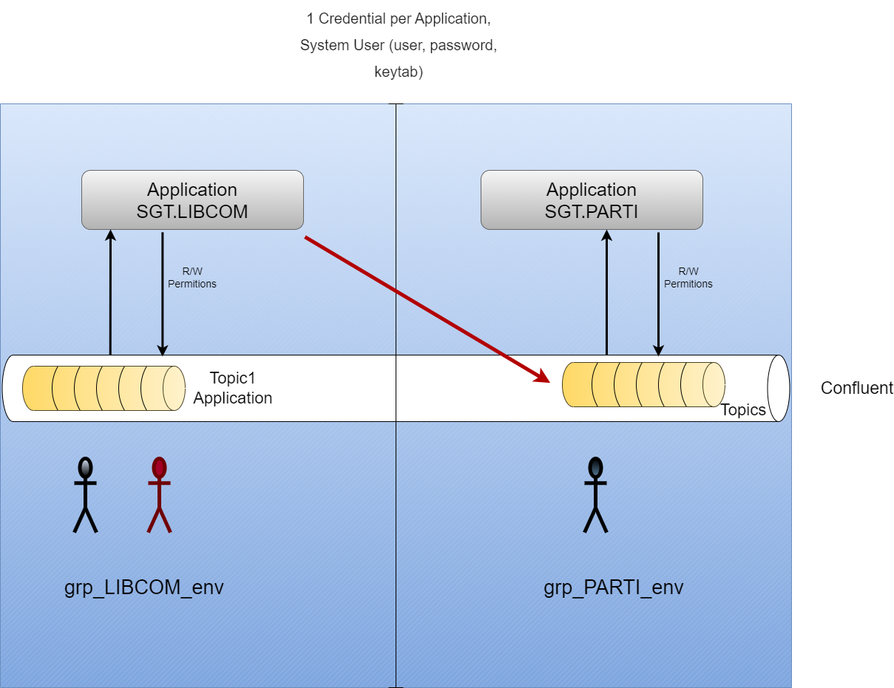
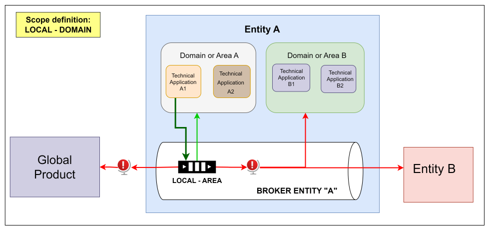
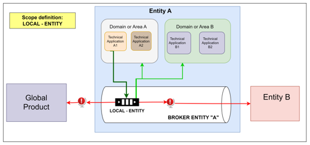
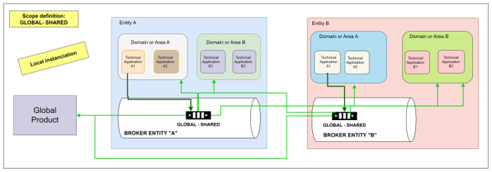
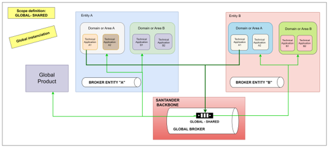

# Prerequisites

## Introduction

The purpose of this documentation is to provide a **list of prerequisites** needed in order to follow the rest of the parts of the Event documentation.

## Confluent server

First mandatory step is to have an available Confluent server. The infrastructure must be given by the team/organization who wants to follow the Event journey.

### MDS API

Confluent has a Confluent Platform Metadata Service (MDS). With MDS, you can use an API in order to configure your Confluent Plartform. We will use this API in order to prepare the creation and authorization of the necessary groups in the infrastructure.

Some documentation about MDS can be found [here](https://docs.confluent.io/platform/current/security/authorization/rbac/mds-api.html).

## Creation of necessary groups in Active Directory

The next step is to register the users and groups in the Active Directory according to the rules defined in [Event Authorization section](../authorization/index.md).
Right now these groups and users must be created manually, although in the future it might be managed automatically.

## Upload user system credentials in Vault

Last necessary part is to upload a system user credentials into Vault (identity-based secrets and encryption management system). This user must be in the groups indicated in the previous step.
The documentation about what is Vault and how to manage credentials can be found in [this link](../../../../../application/security/security-enablers/hashicorp-vault/index.md).

There are two types of authorizaton methods.
In order to use the basic authorization method, **username** and **password** Vault credentials must be given.
If we prefer to use Kerberos for authentication, **keytab** (with the base-64 encoded value of the keytab file) and **principal** credentials must be given too.

The last necessary part is to upload a system user's credentials into Vault (an identity-based secrets and encryption management system).
This system user is used for deployment purposes. More information about the deployment journey can be found in [this link](../../../events/deployment/index.md).

The entity must create a Group and a System User for each Application. The owner of an application has all permissions over the topics associated with that application.
If they wish to access the topics of an application from another application, they must request permissions from the owner of that application,
who will be responsible for authorizing or denying this request.

## Scope

When making a proposal for asynchronous communication, the scope for which this definition is defined is very important.

The defined scope will entail levels of standardization and quality validations.

The defined scope will limit or offer greater visibility for the subscription and production of topics that use the definition.

The scope of the definitions is the same regardless of the type of element selected (Event or Command).

#### Application

- Definitions created within an application application and for consumption only within an application:
  - The scope of the definition will only be that of the technical application.
  - The quality and standardization rules required will be `BASIC`.
  - The information they provide, as a general rule, will be to carry out communications between the components or notify events with little functional interest beyond the technical application.
  - Although the validations will be basic, it is recommended to use defined terms as much as possible.
  - In the same way as in the use of terms, the use of specifications.
  - The encoding of the message should be as far as possible **avro** format. 
  They are events whose main function is to exchange messages between application components to resolve part of the operation/functionality.

        The following image shows a producer and who could subscribe to the topic that uses the definition:

       and that can only be consumed within the domain for both the producer and consumers producer and consumers.
  - The scope of the element that uses the definition will be an entire business domain.
  - The quality and standardization rules required will be `INTERMEDIATE`.
  - The information they provide as a general rule could be both technical and functional.
  - Although the use of dictionary terms will not be required in creating the Area definition, it is recommended to use them as much as possible. 
  The main function of Area definitions is to notify events within the same context, area or business domain.

    The following image shows a producer and who could subscribe to the topic that uses the definition:

      

#### Entity

- Event definitions within the scope of an APM company APM company and which can only be consumed within the same company
for both the producer and the consumers
  - The scope of the element that uses the definition will be the entire entity where it is displayed.
  - The required quality and standardization rules will be `COMPLETE`.
  - The information they provide could be technical or business.
  The main function of Entity definitions is to notify a potentially interesting or necessary fact for the entire entity.

        The following image shows a producer and who could subscribe to the topic that uses the definition:

      

#### Global

- Global Event Definitions that are reusable across all companies and globally all companies and globally governed in shared assets as well as globally consumed.
consumed globally.
  - The definition agreement must be global.
  - Can be instantiated on local or global infrastructure:
  - If instantiated in local infrastructure, global entities or products will be able to access these resources. You can subscribe or replicate the information.
  - If they are instantiated in global infrastructure, all entities will have production and subscription access.
  - The information contained in these definitions can be produced by all entities and be interesting for all of them.
  - The required quality and standardization rules will be `COMPLETE`.

        The following image shows a producer and who could subscribe to the topic that uses the definition. View for local Instanciation:

      

        The following image shows a producer and who could subscribe to the topic that uses the definition. View for Global Instanciation:

      
