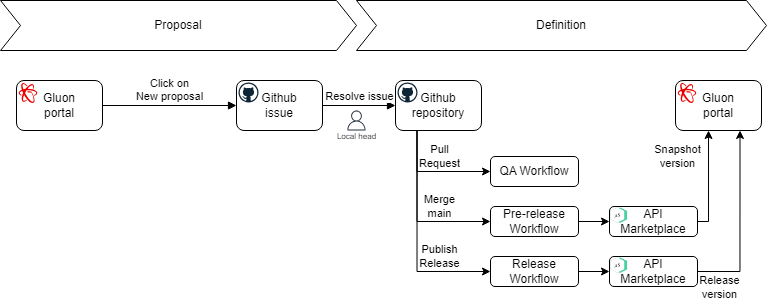
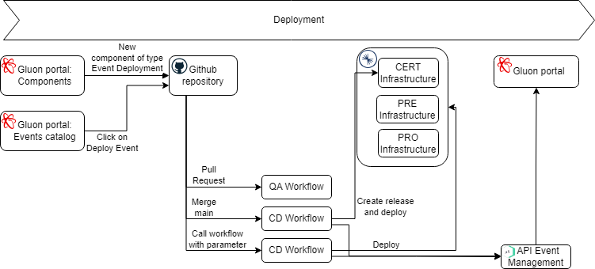
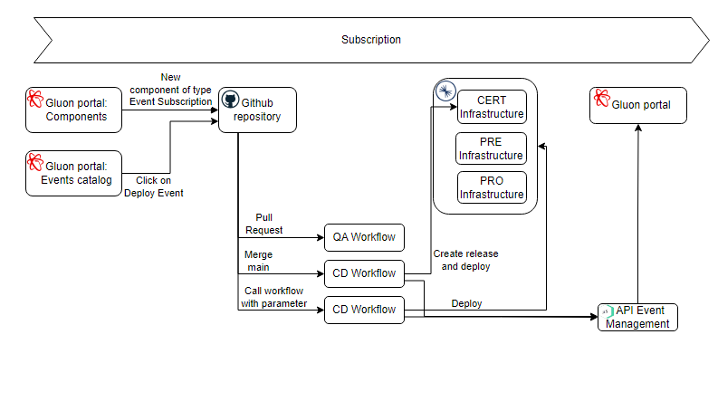

# Event life cycle journey

## Introduction

Here we will show everything related to Events. A very basic flow can be checked in the image below. There are four main stages when we want to deploy a new Event in production.

---

---

---

## Roles

The next roles will be part of the Event Journey:

### Local head

Local head users are the users who are able to authorize the creation of a new event definition. They must be included in the groups with the syntax **GR_ALMNXTGN_[ENTITY]-CCT-EVNT_CTM**,
where [ENTITY] is the acronym of the company where the new event definitions want to be located.
