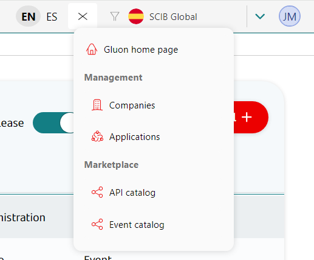
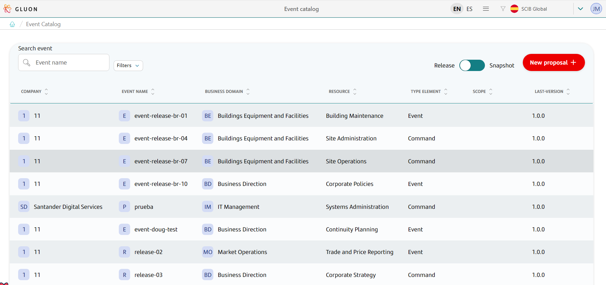
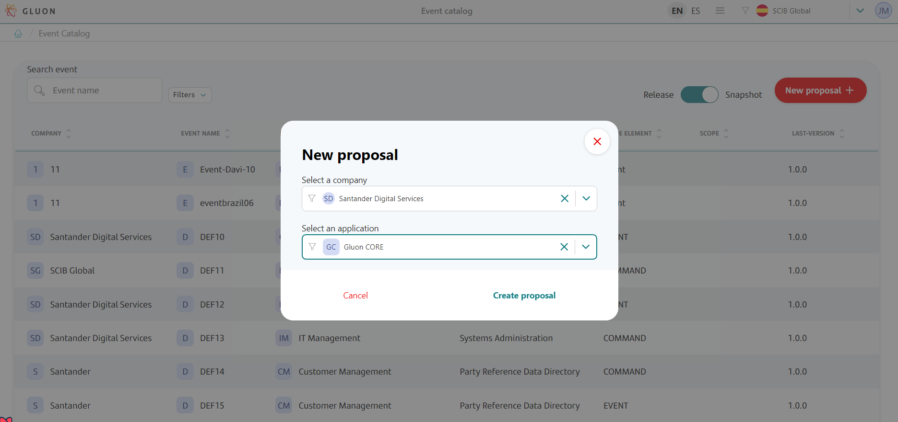
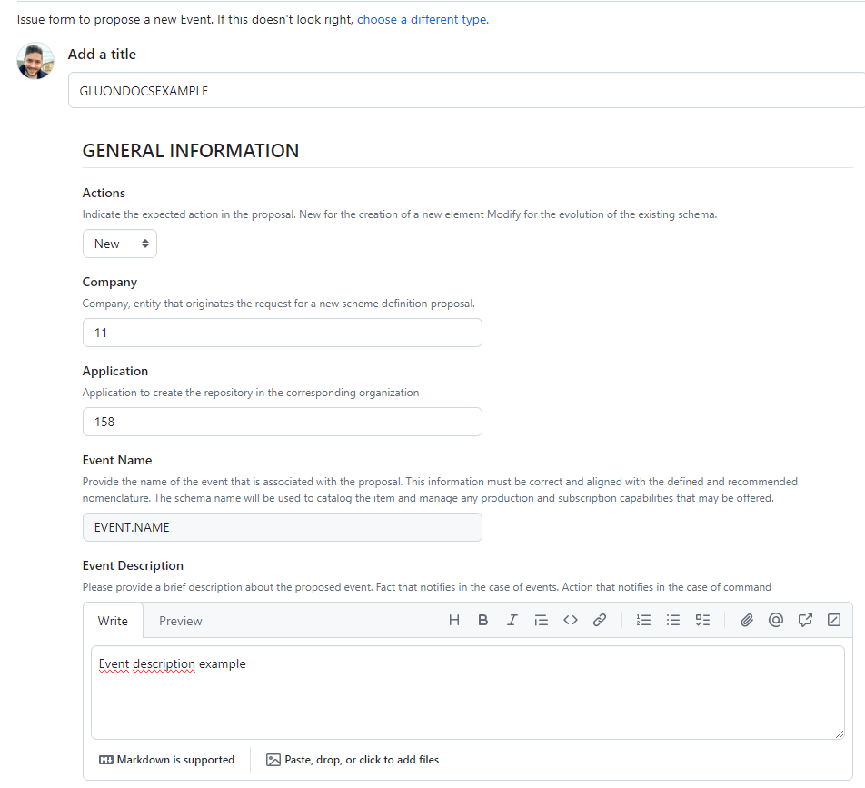
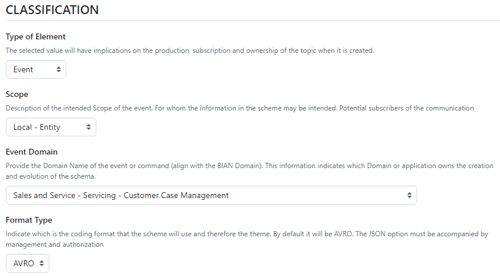
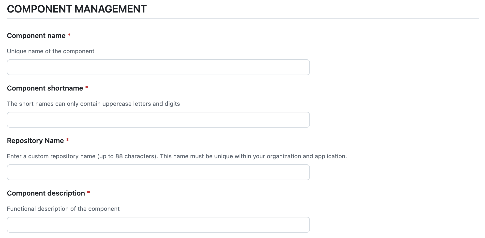
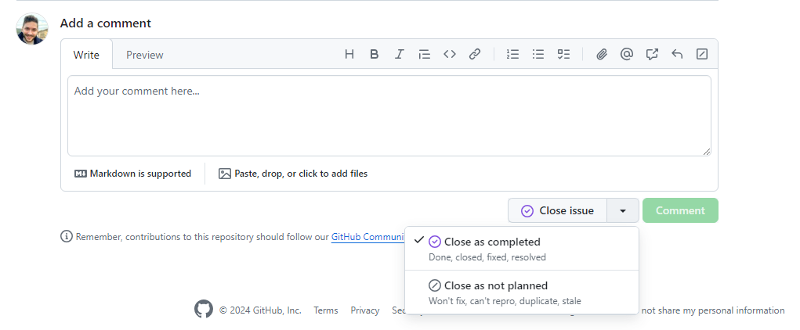
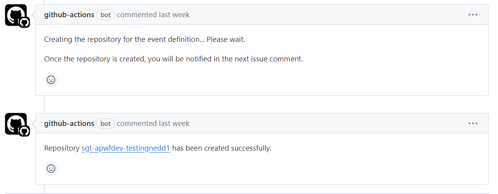
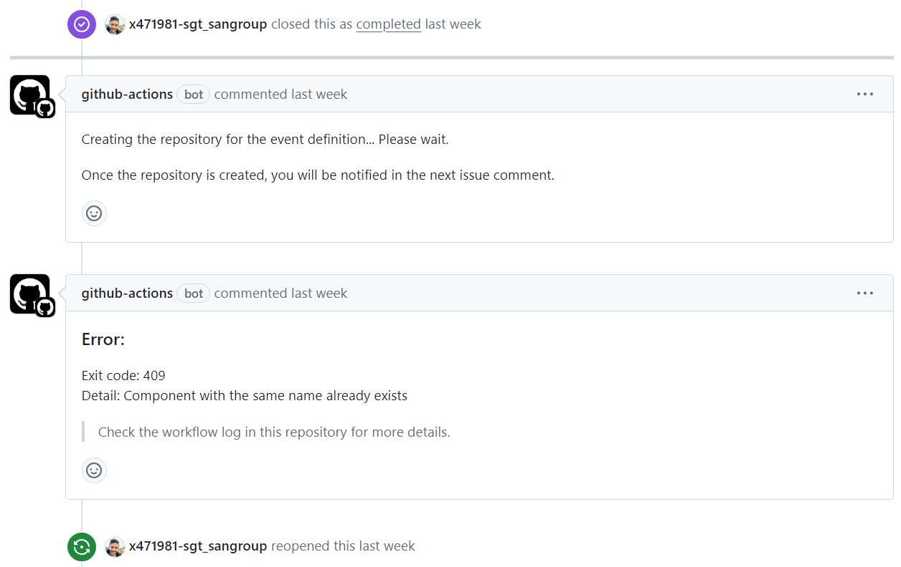
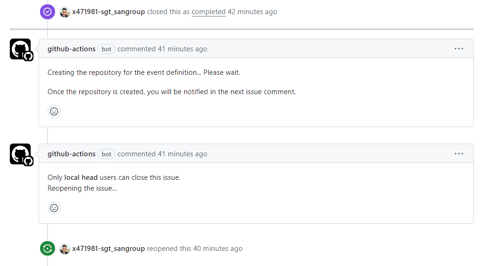

# Event proposal Journey

## Introduction

The purpose of this documentation is to provide a **step-by-step guide** on how to create an event definition proposal.

## Gluon Portal

To create a new proposal of event definition, enter to the Gluon Portal, and click on the menu, between the language selector and the company selector, and click on the option **"Event Catalog"**.

Once you enter to this screen, you will see the different event definitions that have been already created.

## Create new event definition proposal

For creating a new event definition, first we have to create a new **event definition proposal**.
Click on **New proposal** button into the event catalog screen, and you will have to select the company and the application of this event definition.
After that, a new issue template in a Github repository will be opened in order to fill the necessary fields.
You must complete all the fields, and an issue will be opened in that repository.

## Complete issue template

There are several fields that must be filled in order to create a new proposal and potentially create a new event definition. We will explain each field:

### General information

* **Actions**: Indicate the expected action in the proposal. **New** for the creation of a new element, and **Modify** for the evolution of the existing schema. New will be the default value.
If Modify, Event name must be filled with the value of the element to be modified.

* **Company**: ID of the company that originates the request for a scheme definition proposal. This field will be provided from the Gluon Portal.

* **Application**: ID of the company where the repository of the event definition will be created. This field will be provided from the Gluon Portal.

* **Event description**: Brief description about the proposed event. Fact that notifies in the case of events. Action that notifies in the case of command.

* **Event name**: Provide the name of the event that is associated with the proposal. This information must be **correct and aligned with the [defined and recommended nomenclature](../framework/nomenclatures/index.md#event-name)**.
The schema name will be used to catalog the item and manage any production and subscription capabilities that may be offered.

### Classification

* **Type of element**: indicates whether it is an **Event** or a **Command**. The selected value will have implications on the production, subscription and ownership of the topic when it is created.
For more information about the differences between them, see [this](../framework/definitions/index.md#eventcommand).

* **Scope**: Description of the intended Scope of the event. For whom the information in the scheme may be intended. Potential subscribers of the communication. There are four different types of available scopes:

    * **Local - Application**: Definitions created within an application and for consumption only within an application.

    * **Local - Domain**: Event Definitions within the scope of an APM domain (or Functional Application) and that can only be consumed within the domain for both the producer and consumers producer and consumers.

    * **Local - Entity**: Event definitions within the scope of an APM company and which can only be consumed within the same company for both the producer and the consumers.

    * **Global**: Event Definitions that are reusable across all companies and globally governed in shared assets as well as globally consumed.

* **Event domain**: Domain Name of the event or command. This information indicates which Domain or application owns the creation and evolution of the schema.

* **Format type**: Indicate which is the coding format that the scheme will use and therefore the theme. By default it will be **AVRO**. The **JSON** option must be accompanied by management and authorization, so AVRO is the recommended option.

### Component information

* **Component name**: Unique name of the component. That will be the name of the component that will be created in Gluon Portal.

* **Component shortname**: unique shortname for the component that will be created in Gluon Portal. It must only contain uppercase letters and digits, and cannot have more than 16 characters.

* **Repository Name**: A unique name for the repository associated with the component, specific to the company and application. The name must not exceed 88 characters.

* **Component description**: functional description of the component.

## Accept event definition proposal

When the issue has been submitted, the event definition won't be created until someone with the necessary permissions close it as completed. If someone close it as not planned, the issue will stayed closed and the event definition won't be created.

When we click on Close issue, if everything is fine there will be a new comment in the issue indicating the URL of the new repository:

If there is any problem during the creation of the repository, the issue will be reopened and a message explaining why the process hasn't been successfully finished will be displayed:

In these repositories is where the proposals are created:
[Repository](https://github.com/santander-group-shared-assets/santander-events-community)

### Roles

When an issue is opened, only certain roles will be able to close the issue, and therefore to register the new event definition. This role group are called **Local Event Head**.
This users manages the Event Portfolio of the entity (decides which Events should be added/updated) according to the Global Strategy. Also centralizes the entity's Event Demands, and Validates all the entity's Event Definitions.
They also promote Event Definition proposals to Global Governance when appropriate.

Local Event Head are designated as a **Company Custom Team (CCT)**. They must be created with the short alias **EVNT**.  
For detailed instructions on creating a new company team, please visit the provided [link](../../../../getting-started/company-management/company-teams-management/index.md#create-a-new-company-team).  
After the team is created, the Gluon Adoption Team will be granted access to the repository where the issues are created.

???+ info "Note"
    The naming convention for Local Event Head teams is **GR_ALMNXTGN_[COMPANY]-CCT-EVNT_CTM**, where [COMPANY] will be substituted with the acronym of the company for which the event is being defined.

If someone without the proper role try to close the issue as completed, the automatic workflow will reopen the issue and will add a comment in the issue indicating that the issue has been reopened.

