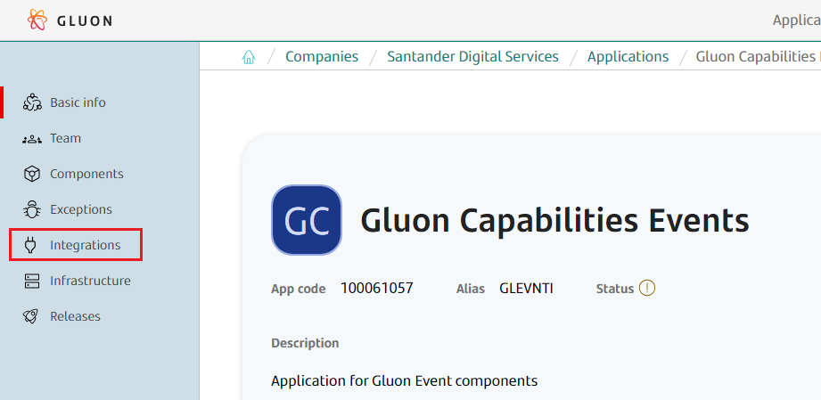
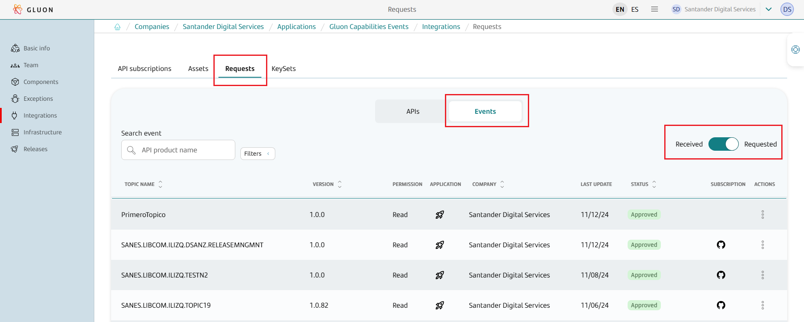
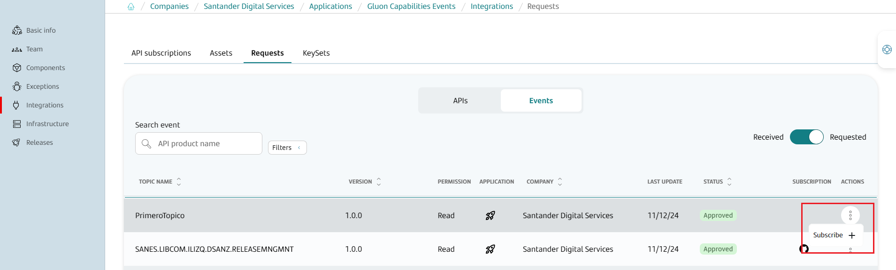
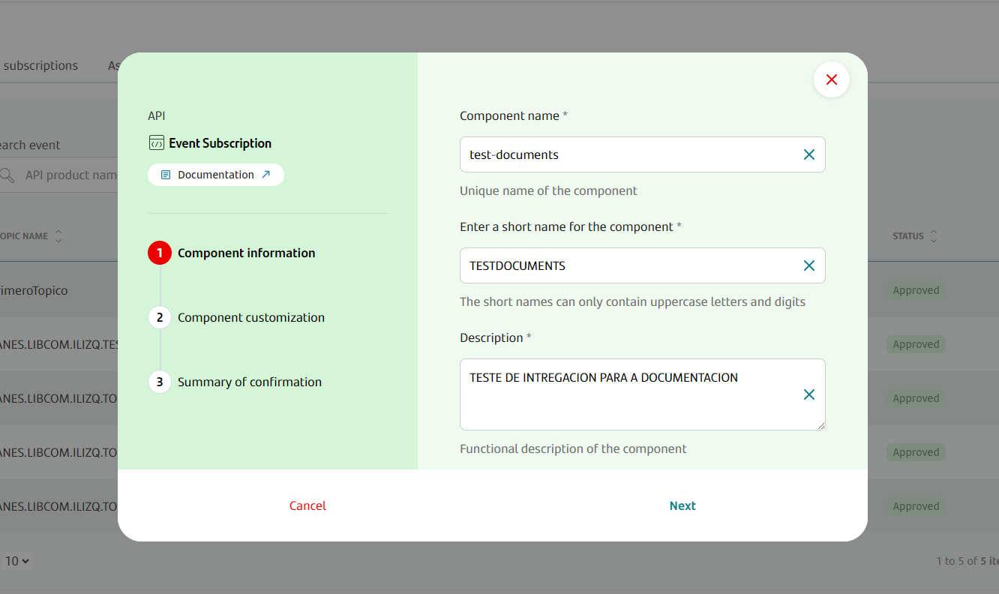
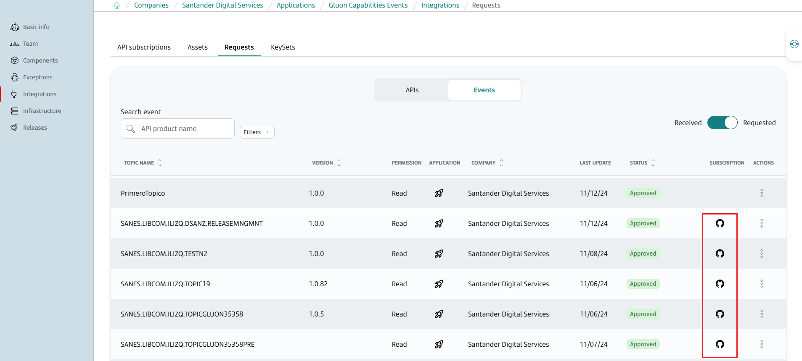

# Event subscription Journey

## Introduction

The purpose of this documentation is to provide a **step-by-step guide** on how to create a subscription of an event.

## Gluon portal

To create a new event subscription we have to login into the portal.



Once inside _integrations_, we have to click on _Requests_, select _Events_ and click on _Requested_ option. A list of events to which we have requested a subscription will appear.



If we want to confirm the subscription to that event, we will click on the three dots in the column _ACTIONS_, and we will click on the option **Subscribe**.



This will create a new repository, with its respective scaffolding with the data of our subscription.



Once the repository is created, we will see that in the _SUBSCRIPTIONS_ commune appears a Github logo, if we click on it we will access to the repository of our subscription.



## Create new event subscription repository

The scaffolding of our application must have been performed automatically. In case it is not done automatically, we will execute the scaffolding workflow manually from the **Actions** menu of the same repository.
Once the scaffolding is executed, we will see that we already have our files configured in our repository, on the _main_ branch, with this structure:

``` bash

📦new-event-subscription-repo
 ┣ 📂.github
 ┃ ┣ 📂workflows
 ┃ ┃ ┣ 📜cd.yml
 ┃ ┃ ┣ 📜event-subscription-version-validation.yml
 ┃ ┃ ┣ 📜quality.yml
 ┃ ┃ ┗ 📜update-component-workflow.yml
 ┃ ┗ 📜CODEOWNERS
 ┣ 📂.gluon
 ┃ ┣ 📂cd
 ┃ ┃ ┣ 📂[env]
 ┃ ┃ ┃ ┗📜cd.yml
 ┣ 📂conf
 ┃ ┗ 📜subscriptions.yml
 ┗ version.yaml
```

The ``.github/workflows`` folder will be used to store the automatic processes we will show in the next steps.

In ``.gluon/cd`` folder, you will have to indicate the CI ID of the OAM of your application.
For more information about it, check [Gluon Application Model (OAM)](../../../../application/ci-cd/cd/cd-rm/gluon-application-model-oam/oam-config-and-params/gluon-application-model-oam-params.md).
There is one folder per environment, and you can add/remove any folder so you can adapt it to your environments structure.

In the folder called ``conf`` there is one file ``subscriptions.yml``, where some information about the topic and the applications in the subscription.

## Configuration

There are several things to change in order to configure the repository. For that, create a new branch from main and do the changes you need. Here we indicate the most common changes.

### Infrastructure file

One of the files that must be changed are the ones included in folders ``.gluon/cd/[env]``.

In each environment you will have to indicate the CI ID of the environment of your [OAM](../../../../application/ci-cd/cd/cd-rm/gluon-application-model-oam/oam-config-and-params/gluon-application-model-oam-params.md) with the same name of the folder.
For instance, if you have a folder named `cert`, you will have to have an entry in your OAM with an environment with the name of `cert`, and search the ID of the infrastructure you want to deploy.
Include this ID in your `cd.yml` file.

After all the changes have been made, a **Pull Request** must be done against the main branch.

### Upload user system credentials in Vault

Last necessary part is to upload a system user credentials into Vault (identity-based secrets and encryption management system).
The documentation about what is Vault and how to manage credentials can be found in [this link](../../../../application/security/security-enablers/hashicorp-vault/index.md).

The name of the credentials depends on what is assigned in the [OAM](../../../../application/ci-cd/cd/cd-rm/gluon-application-model-oam/oam-config-and-params/gluon-application-model-oam-params.md).

If the credentials are not configured in Vault, they can be configured in the same repository in github.

If both credentials exist, the ones used are from Vault.

## Actions

### QA Validations

When the Pull Request is created again the main branch, several controls will be done for validating the repository.

#### Scope validation

Quality workflow will check if the application that requested the subscription is able to create the subscription based on the scope of the event.

If the scope is _Global_, any application can request a subscription.
If the scope is _Local - Entity_, only applications from the same company can request a subscription.
If the scope is _Local - Application_, as only the own application can be subscribed to the event, any application can't request a subscription.

#### Version validation

Event version validation workflow checks that in the file `version.yml` there is a value of a version that hasn't been released yet.

### Release Version Validation

When a Pull Request is created against the specified branches, a series of validations will be performed to ensure the correctness of the event version release.

#### Triggering the Workflow

The workflow is triggered on Pull Requests targeting the following branches:

* `development`
* `develop`
* `main`
* `master`

#### Workflow Details

It goes to the `version.yml` file, gets the version, and checks that a release with that number has not been created in the repository.

### Publish and deploy

#### Certification Environment

When all the changes are ready, and if the Quality and Version Validation workflows have been successfully executed, you can merge the branch against the main one, so the CD workflow will be automatically executed.

That will publish a new release and deploy the event subscription in your environment of type `certification`. In this workflow, a release and a tag is created based on ``version`` field into ``version.yml`` file, placed in the root of the repository.

#### Other environments

Apart from deploying in the environment of type `certification` when a change is merged into main branch,
the workflow ``.github/workflows/cd.yml`` can be called via [Release Management](../../../../application/release-management/zero-touch/index.md) passing an environment name or an environment type, and a version.
The same CD process will be executed, so we can deploy in any environment that we want. The same release that was generated in the first deployment will be used.

### Update Framework

Workflow ``.github/workflows/cd.yml`` can be called via `workflow_dispatch`.
This workflow allows you to manually update the CI/CD workflows by providing a specific version of the component template.
