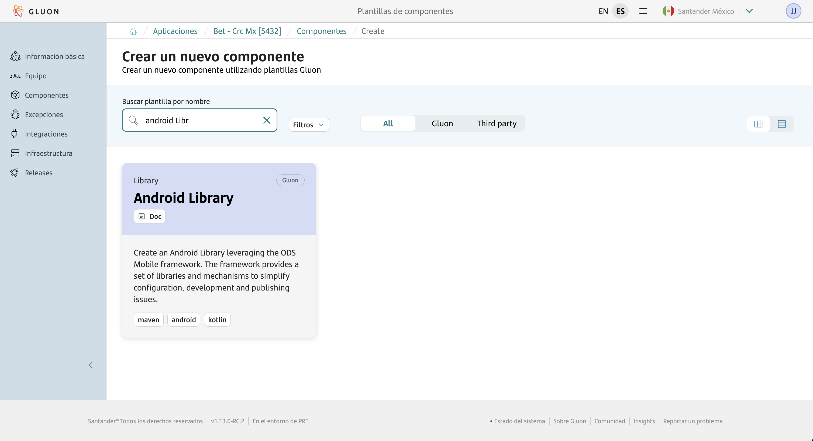
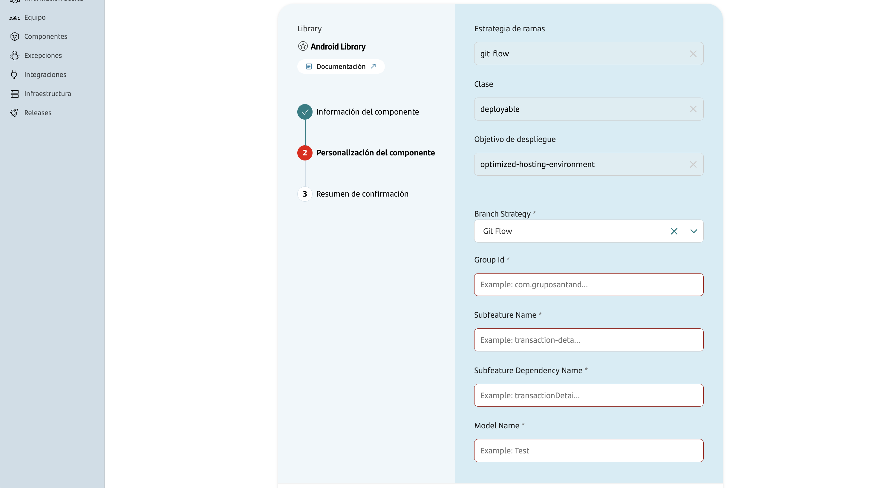

## Introduction

This documentation provides a **complete step-by-step guide** for creating, building, analyzing, and publishing Android Libraries using the **ODS framework** within the GLUON platform.

**What you'll build:**

- 📚 **Android Library**: Your main library with reusable functionality.
- 📱 **SampleApp**: A companion test application that demonstrates and validates your library.

**What you'll learn:**

- ✅ How to create an Android library component through the GLUON portal.
- ✅ How to configure and build both library and SampleApp using CI/CD pipelines.
- ✅ How to analyze code quality and security for both components.
- ✅ How to publish your library to artifact repositories (i.e. Nexus).
- ✅ How to distribute the SampleApp to testing platforms.

**Automated distribution:**

- 📚 **Library**: Gets stored in your organization's artifact repository for other developers to use.
- 📱 **SampleApp**: Gets automatically uploaded to:
  - **Mobile Distribution Platform** (TestFairy) for internal testing and validation.
  - **Testing Platform** (SauceLabs) for QA teams and automated testing to perform library certification.

**Scope of this guide:**

- ✅ **CI/CD processes**: Building and publishing through automated pipelines.
  - **Mobile Distribution Platform** (TestFairy) for internal testing and validation.
  - **Mobile Distribution Platform** (TestFairy) for internal testing and validation.
- ❌ **Development practices**: Android coding techniques and implementation details.

???+ info "Need Development Help?"

    For Android library development guidance, coding best practices, and technical implementation details, refer to [Android documentation](./framework/index.md).

**Final outcome:** Both your library and SampleApp will be automatically built, tested, and distributed to their respective platforms, ready for use and validation.

## How to create the Android library component

### Gluon Portal

To create an Android library component, first ensure your application is [**onboarded in the GLUON Portal**](../../../../../application/application-management/index.md).
Once onboarded, you can create the component by following the [**Component Management**](../../../../../application/component-management/create-component.md) guide and selecting **Android library** as your component type.



???+ tip "Naming Convention"

    Follow the [Repository Naming Convention](../../../../../application/component-management/create-component.md#repository-naming-convention) guidelines when naming your component.

The next step starts the wizard that requests the following information:



| Parameter Name             | Description                                          |
| -------------------------- | ---------------------------------------------------- |
| Branch Strategy            | Repository branching model (currently Git Flow only) |
| Group Id                   | groupId for the library, typically the domains name in reverse order |
| Subfeature Name            | Subfeature name to implement as part of the library. Additional subfeatures to be added during development process                       |
| Subfeature Dependency Name | Dependencies of the subfeature                       |
| Model Name                 | Prefix to name the Model classes required by the feature                                    |

After successfully creating the component, you will see the link to the following resources automatically generated under your application:

- ✅ **Git Repository**: Source code repository with your component name.
- ✅ **SonarQube Project**: Code quality analysis project.
- ✅ **Fortify Project**: Security analysis project.


The permissions assigned to previous resources are:

| Item              | Role Permission       |
| ----------------- | ----------------------|
| GitHub Repository | Developer (RW) /Technical Lead (Maintain) [All roles explained](https://docs.github.com/es/organizations/managing-user-access-to-your-organizations-repositories/managing-repository-roles/repository-roles-for-an-organization){:target="\_blank"} |
| Sonar Project     | All Users (Read)      |
| Fortify Project   | All Users (Read)      |

### Android Library Template

#### Branches

{! include-markdown "../../../../snippets/setup/branch-setup-for-front.md" !}

#### Structure

The generated Android Library structure is similar to the following:

```bash
📂sample-app
 ┣ 📜build.gradle
 ┣ 📜proguard-rules.pro
 ┗ 📂src
   ┗ 📂main
     ┣ 📜AndroidManifest.xml
     ┣ 📂assets
     ┃ ┗ 📜local_configuration.json
     ┣ 📂kotlin
     ┃ ┗ 📂com
     ┃   ┗ 📂gruposantander
     ┃     ┗ 📂modelbank
     ┃       ┗ 📂android
     ┃         ┗ 📂feature
     ┃           ┗ 📂androidlib0077
     ┃             ┗ 📂sample
     ┃               ┣ 📜SampleApp.kt
     ┃               ┣ 📂di
     ┃               ┃ ┣ 📜VerticalSampleDIApp.kt
     ┃               ┃ ┣ 📜VerticalSampleDIFeatureModule.kt
     ┃               ┃ ┣ 📜VerticalSampleDILibrary.kt
     ┃               ┃ ┣ 📜VerticalSampleNavigationMapDIModule.kt
     ┃               ┃ ┗ 📂platform
     ┃               ┃   ┗ 📜LocalizationPlatformModule.kt
     ┃               ┣ 📂navigation
     ┃               ┃ ┣ 📜SampleNavigatorOutNavData.kt
     ┃               ┃ ┣ 📜SampleNavigatorOutType.kt
     ┃               ┃ ┗ 📂mapper
     ┃               ┃   ┗ 📜SampleNavigationMapImpl.kt
     ┃               ┗ 📂platform
     ┃                 ┗ 📜UrlPlatformMapperImpl.kt
     ┗ 📂res
       ┣ 📂drawable
       ┃ ┗ 📜ic_launcher_foreground.xml
       ┣ 📂mipmap-xxxhdpi
       ┃ ┣ 📜ic_launcher.webp
       ┃ ┗ 📜ic_launcher_round.webp
       ┗ 📂values
         ┣ 📜config.xml
         ┣ 📜config_url.xml
         ┣ 📜ic_launcher_background.xml
         ┣ 📜strings.xml
         ┗ 📜translations.xml
📂gradle
 ┣ 📂wrapper
 ┃ ┣ 📜gradle-wrapper.jar
 ┃ ┗ 📜gradle-wrapper.properties
 ┗ 📜lib.versions.toml
📦 subfeature-test
 ┣ 📂data
 ┃ ┣ 📜build.gradle
 ┃ ┣ 📜upload.properties
 ┃ ┗ 📂src
 ┃   ┣ 📂main
 ┃   ┃ ┗ 📂kotlin
 ┃   ┃   ┗ 📂com
 ┃   ┃     ┗ 📂gruposantander
 ┃   ┃       ┗ 📂modelbank
 ┃   ┃         ┗ 📂android
 ┃   ┃           ┗ 📂feature
 ┃   ┃             ┗ 📂androidlib0077
 ┃   ┃               ┗ 📂subfeatures
 ┃   ┃                 ┗ 📂subfeaturetest
 ┃   ┃                   ┗ 📂data
 ┃   ┃                     ┣ 📂configuration
 ┃   ┃                     ┃ ┗ 📜ModelTestConfigurationMapper.kt
 ┃   ┃                     ┣ 📂entity
 ┃   ┃                     ┃ ┗ 📜ModelTestEntity.kt
 ┃   ┃                     ┣ 📂repository
 ┃   ┃                     ┃ ┗ 📜ModelTestRepositoryImpl.kt
 ┃   ┃                     ┗ 📂source
 ┃   ┃                       ┣ 📜ModelTestSource.kt
 ┃   ┃                       ┣ 📂local
 ┃   ┃                       ┃ ┣ 📜ModelTestLocalSource.kt
 ┃   ┃                       ┃ ┗ 📜ModelTestLocalSourceImpl.kt
 ┃   ┃                       ┗ 📂remote
 ┃   ┃                         ┣ 📜ModelTestRemoteSource.kt
 ┃   ┃                         ┣ 📜ModelTestRemoteSourceImpl.kt
 ┃   ┃                         ┣ 📂api
 ┃   ┃                         ┃ ┗ 📜ModelTestApi.kt
 ┃   ┃                         ┗ 📂mapper
 ┃   ┃                           ┣ 📜ModelTestRemoteMapper.kt
 ┃   ┃                           ┗ 📜ModelTestRemoteMapperImpl.kt
 ┃   ┗ 📂test
 ┃     ┗ 📂kotlin
 ┃       ┗ 📂com
 ┃         ┗ 📂gruposantander
 ┃           ┗ 📂modelbank
 ┃             ┗ 📂android
 ┃               ┗ 📂feature
 ┃                 ┗ 📂androidlib0077
 ┃                   ┗ 📂subfeatures
 ┃                     ┗ 📂subfeaturetest
 ┃                       ┗ 📂data
 ┃                         ┣ 📂entity
 ┃                         ┃ ┗ 📜ModelTestEntityTest.kt
 ┃                         ┣ 📂repository
 ┃                         ┃ ┗ 📜ModelTestRepositoryImplTest.kt
 ┃                         ┗ 📂source
 ┃                           ┣ 📂local
 ┃                           ┃ ┗ 📂mapper
 ┃                           ┃   ┗ 📂configuration
 ┃                           ┗ 📂remote
 ┃                             ┣ 📜ModelTestRemoteSourceImplTest.kt
 ┃                             ┗ 📂mapper
 ┃                               ┗ 📜ModelTestRemoteMapperImplTest.kt
 ┣ 📂domain
 ┃ ┣ 📜build.gradle
 ┃ ┣ 📜upload.properties
 ┃ ┗ 📂src
 ┃   ┣ 📂main
 ┃   ┃ ┗ 📂kotlin
 ┃   ┃   ┗ 📂com
 ┃   ┃     ┗ 📂gruposantander
 ┃   ┃       ┗ 📂modelbank
 ┃   ┃         ┗ 📂android
 ┃   ┃           ┗ 📂feature
 ┃   ┃             ┗ 📂androidlib0077
 ┃   ┃               ┗ 📂subfeatures
 ┃   ┃                 ┗ 📂subfeaturetest
 ┃   ┃                   ┗ 📂domain
 ┃   ┃                     ┣ 📂event
 ┃   ┃                     ┃ ┗ 📜ModelTestTrackerContextEvent.kt
 ┃   ┃                     ┣ 📂model
 ┃   ┃                     ┃ ┣ 📜ModelTestAndConfigurationModel.kt
 ┃   ┃                     ┃ ┣ 📜ModelTestModel.kt
 ┃   ┃                     ┃ ┗ 📂configuration
 ┃   ┃                     ┃   ┗ 📜ModelTestConfigurationModel.kt
 ┃   ┃                     ┣ 📂repository
 ┃   ┃                     ┃ ┗ 📜ModelTestRepository.kt
 ┃   ┃                     ┗ 📂usecase
 ┃   ┃                       ┣ 📜GetModelTestInfoUseCase.kt
 ┃   ┃                       ┗ 📜GetModelTestInfoUseCaseImpl.kt
 ┃   ┗ 📂test
 ┃     ┗ 📂kotlin
 ┃       ┗ 📂com
 ┃         ┗ 📂gruposantander
 ┃           ┗ 📂modelbank
 ┃             ┗ 📂android
 ┃               ┗ 📂feature
 ┃                 ┗ 📂androidlib0077
 ┃                   ┗ 📂subfeatures
 ┃                     ┗ 📂subfeaturetest
 ┃                       ┗ 📂domain
 ┃                         ┣ 📂event
 ┃                         ┃ ┗ 📜ModelTestTrackerContextEventTest.kt
 ┃                         ┣ 📂model
 ┃                         ┃ ┣ 📜ModelTestAndConfigurationModelTest.kt
 ┃                         ┃ ┣ 📜ModelTestModelTest.kt
 ┃                         ┃ ┗ 📂configuration
 ┃                         ┃   ┗ 📜ModelTestConfigurationModelTest.kt
 ┃                         ┗ 📂usecase
 ┃                           ┗ 📜GetModelTestInfoUseCaseImplTest.kt
 ┣ 📂lib
 ┃ ┣ 📜build.gradle
 ┃ ┣ 📜upload.properties
 ┃ ┗ 📂src
 ┃   ┣ 📂main
 ┃   ┃ ┗ 📂kotlin
 ┃   ┃   ┗ 📂com
 ┃   ┃     ┗ 📂gruposantander
 ┃   ┃       ┗ 📂modelbank
 ┃   ┃         ┗ 📂android
 ┃   ┃           ┗ 📂feature
 ┃   ┃             ┗ 📂androidlib0077
 ┃   ┃               ┗ 📂subfeatures
 ┃   ┃                 ┗ 📂subfeaturetest
 ┃   ┃                   ┗ 📂lib
 ┃   ┃                     ┣ 📂config
 ┃   ┃                     ┃ ┗ 📂tracker
 ┃   ┃                     ┃   ┗ 📜ModelTestContextTrackerMapImpl.kt
 ┃   ┃                     ┗ 📂di
 ┃   ┃                       ┣ 📜SubFeatureModelTestDILibrary.kt
 ┃   ┃                       ┣ 📂data
 ┃   ┃                       ┃ ┗ 📜ModelTestDataModule.kt
 ┃   ┃                       ┣ 📂domain
 ┃   ┃                       ┃ ┗ 📜ModelTestDomainModule.kt
 ┃   ┃                       ┗ 📂presentation
 ┃   ┃                         ┣ 📜ModelTestNavigationModule.kt
 ┃   ┃                         ┗ 📜ModelTestPresentationModule.kt
 ┃   ┗ 📂test
 ┃     ┗ 📂kotlin
 ┃       ┗ 📂com
 ┃         ┗ 📂gruposantander
 ┃           ┗ 📂modelbank
 ┃             ┗ 📂android
 ┃               ┗ 📂feature
 ┃                 ┗ 📂androidlib0077
 ┃                   ┗ 📂subfeatures
 ┃                     ┗ 📂subfeaturetest
 ┃                       ┗ 📂lib
 ┃                         ┗ 📂config
 ┃                           ┗ 📂tracker
 ┃                             ┗ 📜ModelTestContextTrackerMapImplTest.kt
 ┗ 📂presentation
   ┣ 📜build.gradle
   ┣ 📜upload.properties
   ┗ 📂src
     ┣ 📂main
     ┃ ┣ 📜AndroidManifest.xml
     ┃ ┣ 📂kotlin
     ┃ ┃ ┗ 📂com
     ┃ ┃   ┗ 📂gruposantander
     ┃ ┃     ┗ 📂modelbank
     ┃ ┃       ┗ 📂android
     ┃ ┃         ┗ 📂feature
     ┃ ┃           ┗ 📂androidlib0077
     ┃ ┃             ┗ 📂subfeatures
     ┃ ┃               ┗ 📂subfeaturetest
     ┃ ┃                 ┗ 📂presentation
     ┃ ┃                   ┣ 📜ModelTestAction.kt
     ┃ ┃                   ┣ 📜ModelTestActivity.kt
     ┃ ┃                   ┣ 📜ModelTestData.kt
     ┃ ┃                   ┣ 📜ModelTestScreen.kt
     ┃ ┃                   ┣ 📜ModelTestState.kt
     ┃ ┃                   ┣ 📜ModelTestTracker.kt
     ┃ ┃                   ┣ 📜ModelTestUIData.kt
     ┃ ┃                   ┣ 📜ModelTestUIState.kt
     ┃ ┃                   ┣ 📜ModelTestViewModel.kt
     ┃ ┃                   ┣ 📂layout
     ┃ ┃                   ┃ ┣ 📜ModelTestContentContentLayout.kt
     ┃ ┃                   ┃ ┣ 📜ModelTestScaffoldContentLayout.kt
     ┃ ┃                   ┃ ┗ 📂components
     ┃ ┃                   ┣ 📂mapper
     ┃ ┃                   ┃ ┣ 📜ModelTestUIMapper.kt
     ┃ ┃                   ┃ ┗ 📜ModelTestUIMapperImpl.kt
     ┃ ┃                   ┣ 📂model
     ┃ ┃                   ┃ ┗ 📜ModelTestUIModel.kt
     ┃ ┃                   ┣ 📂navigation
     ┃ ┃                   ┃ ┣ 📜ModelTestNavigator.kt
     ┃ ┃                   ┃ ┗ 📂in
     ┃ ┃                   ┃   ┣ 📜ModelTestInData.kt
     ┃ ┃                   ┃   ┣ 📜ModelTestInParams.kt
     ┃ ┃                   ┃   ┗ 📜ModelTestInType.kt
     ┃ ┃                   ┣ 📂product
     ┃ ┃                   ┃ ┣ 📜ProductModelTestData.kt
     ┃ ┃                   ┃ ┣ 📜ProductModelTestScreen.kt
     ┃ ┃                   ┃ ┣ 📜ProductModelTestState.kt
     ┃ ┃                   ┃ ┣ 📜ProductModelTestTracker.kt
     ┃ ┃                   ┃ ┣ 📜ProductModelTestUIData.kt
     ┃ ┃                   ┃ ┗ 📜ProductModelTestViewModel.kt
     ┃ ┃                   ┣ 📂provider
     ┃ ┃                   ┃ ┣ 📜ModelTestContentContentProvider.kt
     ┃ ┃                   ┃ ┣ 📜ModelTestScaffoldContentProvider.kt
...
📜.gitignore
📜build.gradle
📜gradle.properties
📜gradlew
📜gradlew.bat
📜local.properties
📜README.md
📜settings.gradle
```

## Local Running

??? abstract "Cloning your repository"

    ### Cloning your repository

    Once we have the computer properly configured, the first step is to clone the project locally.

    To do so, visit [**How to clone the project**](../../../../../application/component-management/create-component.md#cloning-a-repository).

## Component Configuration

### Branches

{! include-markdown "../../../../snippets/configuration/front-configuration.md" start="<!--Start Gitflow Branches-->" end="<!--End Gitflow Branches-->" !}

### Configuration Files

- **.gluon/ci/properties.env**: Properties with the CI/CD configuration

=== "Default"

    ```properties
    FORTIFY_PROJECT_NAME=__FORTIFY_PROJECT_NAME__
    SONAR_PROJECT_KEY=__SONAR_PROJECT_KEY__
    ANDROID_SONAR_PROPERTIES="-Dsonar.sources=subfeatures/__SUBFEATURE_NAME__/data/src/main/kotlin,subfeatures/__SUBFEATURE_NAME__/domain/src/main/kotlin,    subfeatures/__SUBFEATURE_NAME__/lib/src/main/kotlin,subfeatures/__SUBFEATURE_NAME__/presentation/src/main/kotlin -Dsonar.exclusions=**/*.java,**/*.jar     -Dsonar.coverage.jacoco.xmlReportPaths=./**/codeCoverageReport.xml"

    # Uncomment the right App distribution upload url according to your location and project needs.
    # APP_DISTRIBUTION_UPLOAD_URL=https://santander-eu.testfairy.com/api/upload
    # APP_DISTRIBUTION_UPLOAD_URL=https://santander-na.testfairy.com/api/upload
    # APP_DISTRIBUTION_UPLOAD_URL=https://santander-sa.testfairy.com/api/upload

    # Set the proper value for your project in APP_DISTRIBUTION_TESTERS_GROUPS
    # APP_DISTRIBUTION_TESTERS_GROUPS=testers
    ```

Where developer teams must configure the **APP_DISTRIBUTION_UPLOAD_URL** parameter to specify the correct instance of the Internal Distribution Platform where the SampleApp will be uploaded. Alternatively, they can customize the distribution behaviour
using these additional parameters:

  - APP_DISTRIBUTION_TESTER_GROUPS: To assign  uploaded builds to predefined testing groups
  - APP_DISTRIBUTION_FOLDER_NAME: To organize uploads in specific folder structure.
  - APP_DISTRIBUTION_NOTIFY: To send notifications to beta testers about new builds

### Organization environment variables

The Organizations should declare the following environment variables:

- **MOB_TESTING_UPLOAD_URL**: The required url to upload mobile application to SauceLabs for automatic testing. It is required only if the organization has this solution. If the variable does not exist, the step is skipped. Example: <https://api.eu-central-1.saucelabs.com/v1/storage/upload>

### Secrets

The following secrets are required for the execution of the workflows:

- **APP_DISTRIBUTION_TOKEN**: The required token to upload the mobile application to TestFairy for internal testing.
- **MOB_TESTING_TOKEN**: The required token to upload the mobile application to the SauceLabs for automatic testing.
- **MOB_TESTING_USERNAME**: The required user name to upload the mobile application to the SauceLabs for automatic testing.

## Build and Publish your library

### Pull requests

The Pull Request event executes the `ci-checks.yml` to ensure the code meets all required verifications before reaching the integration branch. This workflow executes the following steps:

- Build and unit Testing
- Source Code Quality Analysis (SCQA)
- Static Application Security Testing (SAST)
- Software Composition Analysis (SCA)

A final step has been added to generate a summary with  result and links to previous steps, and send data to Insights.

### Push to branches

A push event to any of the branches `main`, `master`, `development`, `develop`, or `release-v**`, executes the `integration.yml` workflow.

The code is integrated and the temporary artifacts are created for testing and uploaded to the artifact repository. The Android library is created, but also the SampleApp that will be used to test the library.

### Release

The execution of the `release.yml`workflow integrates the code and creates the production artifacts. This workflow only runs in `main` and `release-v**` branches.

The workflow performs all steps to assure final code meets required verifications and productions artifacts are created:

- Build and unit Testing
- Source Code Quality Analysis (SCQA)
- Static Application Security Testing (SAST)
- Software Composition Analysis (SCA)
- Create the production artifacts
- Store the artifacts in the artifact store (Nexus, Artifactory, etc)
- Create a GitHub release
- Deploy the artifacts to the development environment

The workflow can be executed manually. Inside "Actions" tab, click on "Release workflow" on the left pane and click on the "Run workflow" button on the right side of the screen. A popover message will be displayed where to select the source branch to
be published.


### Deploy

Deploy a generated artifact in the selected environment. For SampleApp the deployment is done to TestFairy and SauceLabs to allow the distribution of the app and test its internal library.

The workflow can be executed manually. Inside "Actions" tab, click on "Deployment workflow" on the left pane and click on the "Run workflow" button on the right side of the screen.
A popover message will be displayed where you can select the source branch, the environment, and the version to deploy.


