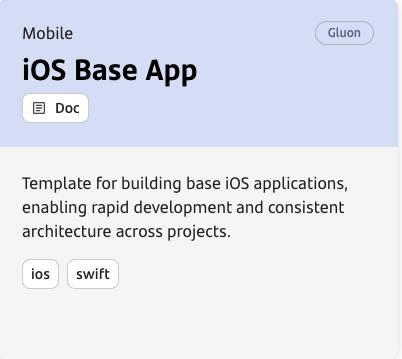
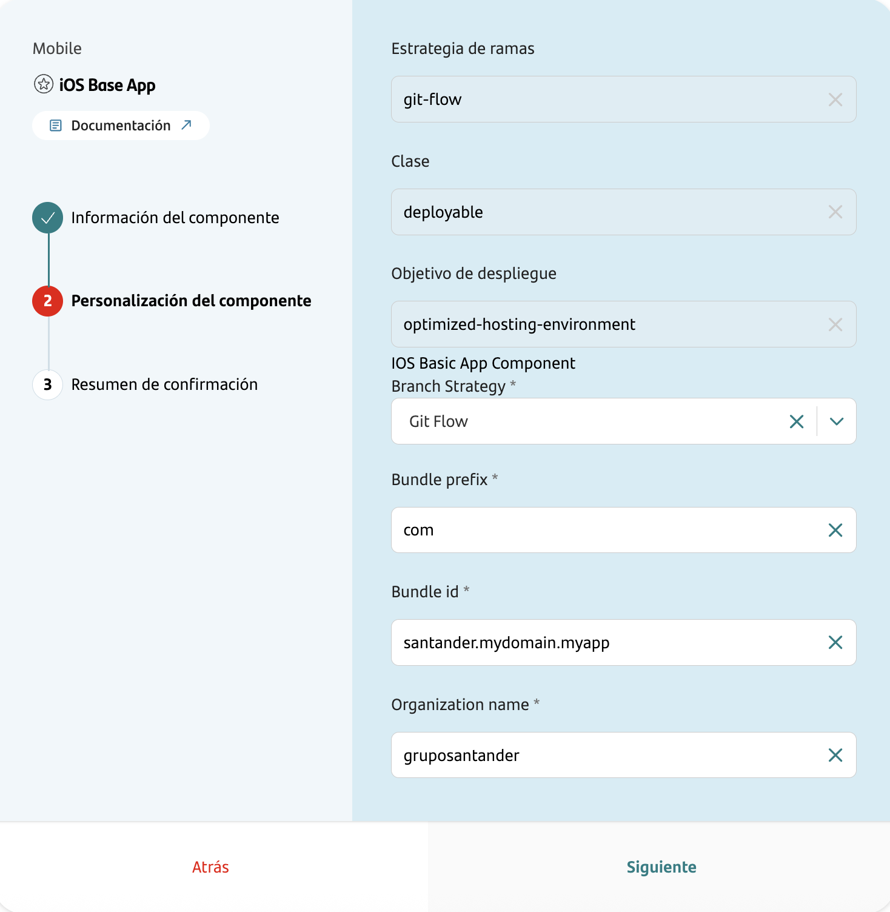
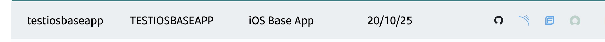
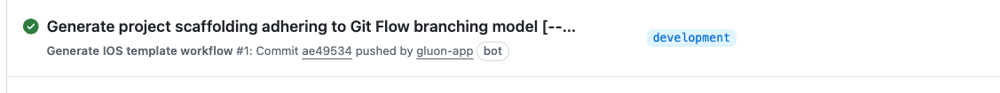
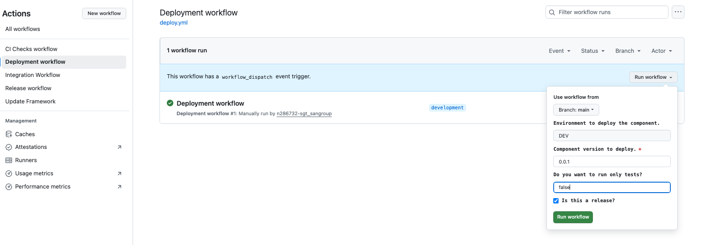

???+ warning "Limited Availability"
    The iOS Base Application component is currently not available to all entities because the current SonarQube Community License does not support iOS analysis. At this time, the component will only be delivered to a limited number of projects to
    avoid exceeding the line count permitted by a temporary Enterprise license. Once Gluon adopts the final SonarQube Enterprise License, the component will be fully available to all entities and projects.

## Introduction

This documentation provides a **complete step-by-step guide** for creating, building, analyzing, and publishing iOS applications within the GLUON platform.

**What you'll learn:**

- ✅ How to create an iOS application component through the GLUON portal.
- ✅ How to configure and build the application using CI/CD pipelines.
- ✅ How to analyze code quality and security for both components.
- ✅ How to publish your application to artifact repositories (i.e. Nexus).
- ✅ How to distribute the app to testing platforms.

**Current workflows limitations:**

- ❌ **Production builds**: Current workflows do not build the release application with production certificates.
- ❌ **App Store deployment**: Automated deployment to App Store Connect is not currently supported.
- ❌ **Distribution certificates**: Only development/debug certificates are supported at this time.

???+ info "CD Workflows in Development"
    Complete Continuous Deployment (CD) workflows for production builds and App Store deployment are currently in our development backlog. Gluon provides these Continuous Integration (CI) workflows as a first step to meet the immediate demand from
    various organizations across Santander Group.

    For now, production builds and App Store submissions must be handled manually outside of Gluon workflows.

**Final outcome:** Your iOS application will be automatically built, tested, and distributed to testing platforms (TestFairy, SauceLabs). Additionally, comprehensive security checks and code quality analysis will be performed to ensure your app meets
Santander standards before distribution.

## How to create the iOS application component

### Pre requisites

Before creating the component, your **DevOps team must configure** the following organization-level variables and secrets.

#### Variables (Must be configured by DevOps)

| Variable | Mandatory | Description | Example |
|----------|-----------|-------------|---------|
| `APPLE_TEAM_NAME` | Yes | Organization name registered in Apple Developer Program | `Banco Santander SA` |
| `APPLE_TEAM_ID` | Yes | 10-character Team ID from Apple Developer Portal | `6YVLU6LV9S` |
| `MATCH_GIT_URL` | Yes | Private repository URL containing iOS certificates and provisioning profiles for signature using _match_| `https://github.com/{org}/ios-certificates` |
| `MOB_MATCH_GIT_BRANCH` | Yes | Git branch in the certificates repository where _match_ stores encrypted certificates and profiles | `main` |
| `APP_DISTRIBUTION_UPLOAD_URL` | Optional | TestFairy instance URL (if your organization uses TestFairy). Format: `https://santander-{instance}.testfairy.com/api/upload` where instance is `eu`, `na`, or `sa` | `https://santander-eu.testfairy.com/api/upload` |
| `MOB_TESTING_UPLOAD_URL` | Optional | SauceLabs API endpoint (if your organization uses SauceLabs). Format: `https://api.{aws-region}.saucelabs.com/v1/storage/upload` where aws-region depends on your organization contract | `https://api.eu-central-1.saucelabs.com/v1/storage/upload` |

#### Secrets (Must be configured by DevOps)

| Secret | Mandatory | Description | Purpose |
|--------|-----------|-------------|---------|
| `MATCH_GIT_TOKEN` | Yes | GitHub token with repository access | Download **development** certificates and profiles from private repo. See [certificates and provisioning profiles](#repository-with-certificates-and-provisioning-profiles) |
| `MATCH_PASSWORD` | Yes | Encryption password for certificates | Decrypt stored **development** certificates and profile. See [certificates and provisioning profiles](#repository-with-certificates-and-provisioning-profiles)|
| `APP_DISTRIBUTION_TOKEN` | Optional | TestFairy API token (if your organization uses TestFairy) | Upload apps to internal distribution platform |
| `MOB_TESTING_USERNAME` | Optional | SauceLabs username (if your organization uses SauceLabs) | Authenticate with SauceLabs platform |
| `MOB_TESTING_TOKEN` | Optional | SauceLabs access key (if your organization uses SauceLabs) | Authenticate with SauceLabs platform |

???+ warning "Action Required"

    **Contact your DevOps team** to ensure these secrets are properly configured before attempting to use this iOS component. Without proper configuration, the CI/CD workflows will fail.

### Gluon Portal

To create an iOS application component, first ensure your application is [**onboarded in the GLUON Portal**](../../../../../application/application-management/index.md).
Once onboarded, you can create the component by following the [**Component Management**](../../../../../application/component-management/create-component.md) guide and selecting **iOS Base Application** as your component type.



???+ tip "Naming Convention"

    Follow the [Repository Naming Convention](../../../../../application/component-management/create-component.md#repository-naming-convention) guidelines when naming your component.

The next step starts the wizard that requests the following information:



| Parameter Name                     | Description                                          |
| ---------------------------------- | ---------------------------------------------------- |
| Branch Strategy                    | Repository branching model (currently Git Flow only) |
| Bundle prefix                      | iOS bundle identifier prefix (reverse domain format) |
| Bundle id                          | Organization identifier for the bundle               |
| Organization name                  | Your organization's display name                     |

After the component is successfully created, you will have immediate access to the following resources, automatically provisioned for your application:

- ✅ **Git Repository**: A dedicated source code repository named after your component.
- ✅ **SonarQube Project**: An integrated project for automated code quality analysis.
- ✅ **Fortify Project**: An integrated project for automated security analysis.

 

The following permissions are assigned to each of the resources created:

| Item              | Role Permission       |
| ----------------- | ----------------------|
| GitHub Repository | Developer (RW) /Technical Lead (Maintain) [All roles explained](https://docs.github.com/es/organizations/managing-user-access-to-your-organizations-repositories/managing-repository-roles/repository-roles-for-an-organization){:target="\_blank"} |
| Sonar Project     | All Users (Read)      |
| Fortify Project   | All Users (Read)      |

### iOS Application Template

#### Branches

{! include-markdown "../../../../snippets/setup/branch-setup-for-front.md" !}

The iOS application component is not totally created during the scaffolding process as it requires execution on a macOS environment. Once scaffolding is complete, the system automatically initiates the project generation step with a new workflow.
This creates the iOS project structure and prepares the development branch, making it ready for developers to begin implementation.

 

#### Structure

The generated iOS Application structure is similar to the following:

```bash
📂.github
 ┣ 📂workflows
 | ┣ 📜ci-checks.yml
 | ┣ 📜create-release-branch.yml
 | ┣ 📜deploy.yml
 | ┣ 📜integration.yml
 | ┗ 📜release.yml
 | ┣ 📜update.component-workflow.yml
 ┗ 📜CODEOWNERS
📂.gluon
 ┗ 📂ci
   ┗ 📜properties.env
📂Application
 ┣ 📂YourAppName
 | ┣ 📂Sources
 | | ┣ 📂Application
 | | | ┣ 📂Configurations
 | | | ┣ 📜AppDelegate.swift
 | | | ┣ 📜Info.plist
 | | ┣ 📂Core
 | | ┣ 📂Data
 | | | ┣ 📂Storage
 | | ┣ 📂Domain
 | | | ┣ 📂Entities
 | | ┣ 📂Manager
 | | | ┣ 📜CacheManager.swift
 | | | ┣ 📜NetworkManager.swift
 | | ┣ 📂Presentation
 | | | ┣ 📂Resources
 | | | ┣ 📂Scenes
 | ┣ 📂Tests
📂fastlane
📂company-application-yourappname.xcodeproj
📂company-application-yourappname.xcworkspace
📜.gitignore
📜.swiftlint.yml
📜pom.xml

```

## Local Running

### Prerequisites for Local Development

??? abstract "Cloning your repository"

    ### Cloning your repository

    Once we have the MAC computer properly configured, the first step is to clone the project locally.

    To do so, visit [**How to clone the project**](../../../../../application/component-management/create-component.md#cloning-a-repository).

## Component Configuration

### Branches

{! include-markdown "../../../../snippets/configuration/front-configuration.md" start="<!--Start Gitflow Branches-->" end="<!--End Gitflow Branches-->" !}

### Configuration Files

After DevOps setup is complete, you can customize the following configuration file in your project:

- **.gluon/ci/properties.env**: CI configuration properties for your specific project

```text

    MAVEN_ARTIFACT_ID=mex-rost-iostestapp15
    MAVEN_GROUP_ID=com.santander.IOSTESTAPP15

    ### IOS CONFIGS ###
    IOS_PROJ=mex-rost-iostestapp15.xcodeproj
    IOS_WORKSPACE=mex-rost-iostestapp15.xcworkspace
    IOS_SCHEME_DEV=IOSTESTAPP15
    IOS_SCHEME_TESTS=IOSTESTAPP15
    IOS_CONFIGURATION_DEV=Debug
    IOS_TARGET=IOSTESTAPP15
    IOS_OUTPUT_DIR=Products
    IOS_SIMULATOR_TESTS=iPhone 14
    XCODE=16.2

    ####################################
    # OPTIONAL: Component Setup
    ####################################
    # OPTIONAL: TestFairy App Distribution Settings: Only customize these if you need to override the default values:

    # APP_DISTRIBUTION_TESTERS_GROUPS=qa-team,beta-users    # Comma-separated tester groups (default: empty)
    # APP_DISTRIBUTION_NOTIFY=on                            # Send notifications (on/off, default: off)
    # APP_DISTRIBUTION_AUTO_UPDATE=off                      # Auto-upgrade users (on/off, default: off)
    # APP_DISTRIBUTION_FOLDER_NAME=MyApp-Builds             # Folder name in TestFairy (default: empty)
    ####################################

    ####################################
    # HOW TO USE THIS FILE
    ####################################
    # 1. DEVOPS: Contact your DevOps team to configure all REQUIRED variables in component documentation
    # 2. CUSTOMIZE: Uncomment and modify any OPTIONAL variables you need
    # 3. SECURITY: Never commit API tokens or sensitive values to version control
    ####################################

```

## Build and Publish your application

iOS application compilation and distribution requires proper understanding of [ios certificates and provisioning profiles](../../../../../architecture/reference-architecture/front-mobile/ios-certificates.md) configuration and usage.

### What is a provisioning profile and how does match work?

A **provisioning profile** is a digital certificate that links your iOS app to specific devices and signing certificates, enabling the app to run on physical devices and be distributed through the App Store.

To facilitate the [complex management of certificates and provisioning profiles in iOS projects](../../../../../architecture/reference-architecture/front-mobile/ios-certificates.md/#problem-to-maintain-development-and-ad-hoc-distribution-profiles)
we use [match](../../../../../architecture/reference-architecture/front-mobile/ios-certificates.md#guide-to-use-match), a Fastlane tool that centralizes the management of these profiles and certificates by storing them encrypted in a private Git
repository, ensuring that all team members use the same resources
and avoiding conflicts or losses.

### Repository with certificates and provisioning profiles

Your iOS component requires a **private** repository on GitHub that stores the certificates and provisioning profiles for your entity. This repository must be dedicated exclusively to certificates and provisioning profiles used during
the **development** phase. Therefore, **DISTRIBUTION certificates and provisioning profiles SHOULD NEVER be stored in this repository**.

The repository and branch were development certificate and provisioning profiles reside, should be correctly defined in the environment variables `MATCH_GIT_URL` and `MOB_MATCH_GIT_BRANCH`. In the same way the secrets `MATCH_GIT_TOKEN` and
`MATCH_PASSWORD` should be defined as explained in [Variables (Must be configured by DevOps)](#variables-must-be-configured-by-devops) and [Secrets (Must be configured by DevOps)](#secrets-must-be-configured-by-devops).

### Manual generation of the provisioning profile (First time)

The first time a new project is created, the provisioning profiles is created by an Admin or App Manager role in the Apple Team. The team is the same as the configured in `APPLE_TEAM_NAME`
and `APPLE_TEAM_ID` as explained in [Variables (Must be configured by DevOps)](#variables-must-be-configured-by-devops).

To initialize the provisioning profile for this new project, it is necessary to run the following match command in the project folder:

```sh
fastlane match produce
```

This command will:

1. Prompt you for your Apple Developer credentials
2. Create the necessary certificates and profiles in the Apple Developer portal
3. Store them encrypted in your private repository. It will ask you for the location.

### Download updated provisioning profile and certificates (all developers)

After cloning the repository, it is necessary to download the provisioning profile and certificates in the local machine with the command:

```sh
fastlane match development
```

???+ warning "Important Security Notice"

    Ensure your private repository contains only valid certificates and profiles for your entity. Remove any unnecessary Debug profiles to prevent conflicts and maintain signing process security. Remember **only DEBUG certificates/provisioning profiles are allowed** per [CISO requirements](https://gluon.gs.corp/community/docs/latest/architecture/reference-architecture/front-mobile/ios-certificates.md/#security-concerns-related-to-the-use-of-match).

For comprehensive information on using Match and managing provisioning profiles, refer to the [official Fastlane Match documentation](https://docs.fastlane.tools/actions/match/).

### Pull requests

The Pull Request event executes the `ci-checks.yml` to ensure the code meets all required verifications before reaching the integration branch. This workflow executes the following steps:

- Build and unit testing
- Source Code Quality Analysis (SCQA)
- Static Application Security Testing (SAST)
- Software Composition Analysis (SCA)

A final step has been added to generate a summary with results and links to previous steps, and send data to Insights.

### Push to branches

A push event to any of the branches `main`, `master`, `development`, `develop`, or `release-v**` executes the `integration.yml` workflow.

The code is integrated and the temporary artifacts are created for testing and uploaded to the artifact repository.

### Deploy

As at the moment only ci development phase is covered, the deploy workflow will deploy the app to TestFairy and SauceLabs to allow the internal distribution for testing.

The workflow can be executed manually. Inside "Actions" tab, click on "Deployment workflow" on the left pane and click on the "Run workflow" button on the right side of the screen. A popover message will be displayed where to select the source branch,
the environment and the version to deploy.


