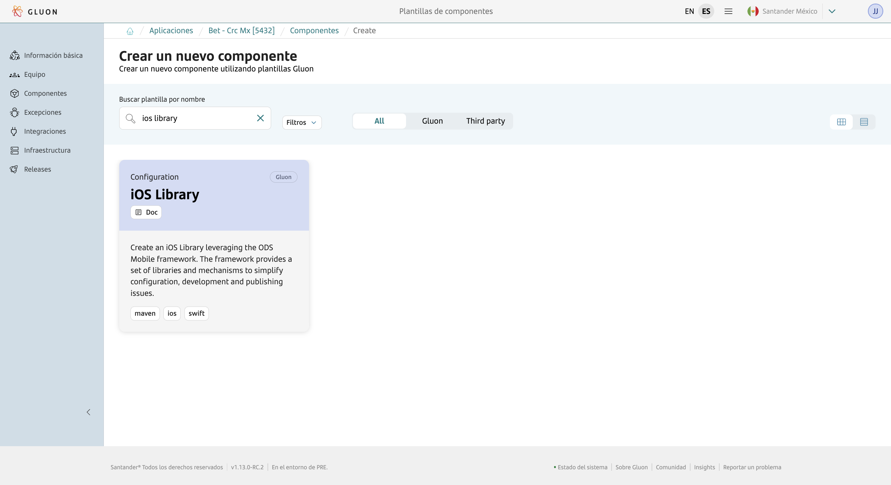
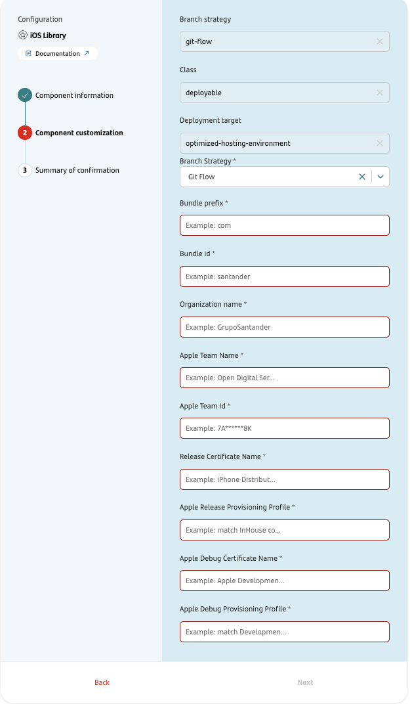
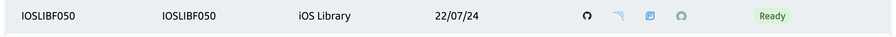
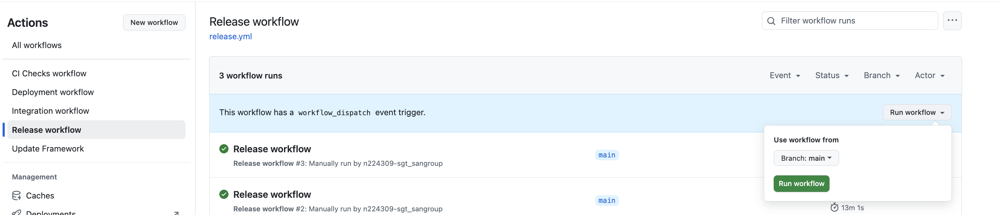

???+ warning "DEPRECATED"

    This iOS Library component template for ODS Framework is deprecated due to continuous updates from the ODS team that have rendered this template obsolete.

    For current iOS development, please use the **iOS Application component** which provides up-to-date templates and workflows. For more information, visit [iOS Application Documentation](./app.md).

## Introduction

This documentation provides a **complete step-by-step guide** for creating, building, analyzing, and publishing iOS libraries using the **ODS framework** within the GLUON platform.

**What you'll build:**

- 📚 **iOS Library**: Your main library with reusable functionality.
- 📱 **SampleApp**: A companion test application that demonstrates and validates your library.

**What you'll learn:**

- ✅ How to create an iOS library component through the GLUON portal.
- ✅ How to configure and build both library and SampleApp using CI/CD pipelines.
- ✅ How to analyze code quality and security for both components.
- ✅ How to publish your library to artifact repositories (i.e. Nexus).
- ✅ How to distribute the SampleApp to testing platforms.

**Automated distribution:**

- 📚 **Library**: Gets stored in your organization's artifact repository for other developers to use.
- 📱 **SampleApp**: Gets automatically uploaded to:
    - **Mobile Distribution Platform** (TestFairy) for internal testing and validation.
    - **Testing Platform** (SauceLabs) for QA teams and automated testing to perform library certification.

**Scope of this guide:**

- ✅ **CI/CD processes**: Building and publishing through automated pipelines.
- ❌ **Development practices**: iOS coding techniques and implementation details.

**Final outcome:** Both your library and SampleApp will be automatically built, tested, and distributed to their respective platforms, ready for use and validation.

## How to create the iOS library component

### Gluon Portal

To create an iOS library component, first ensure your application is [**onboarded in the GLUON Portal**](../../../../../application/application-management/index.md).
Once onboarded, you can create the component by following the [**Component Management**](../../../../../application/component-management/create-component.md) guide and selecting **iOS library** as your component type.



???+ tip "Naming Convention"

    Follow the [Repository Naming Convention](../../../../../application/component-management/create-component.md#repository-naming-convention) guidelines when naming your component.

The next step starts the wizard that requests the following information:



| Parameter Name                     | Description                                          |
| ---------------------------------- | ---------------------------------------------------- |
| Branch Strategy                    | Repository branching model (currently Git Flow only) |
| Bundle prefix                      | iOS bundle identifier prefix (reverse domain format) |
| Bundle id                          | Organization identifier for the bundle               |
| Organization name                  | Your organization's display name                     |
| Apple Team Name                    | Team name registered in Apple Developer Program      |
| Apple Team id                      | Unique identifier from Apple Developer Program       |
| Release Certificate Name           | Production signing certificate name                  |
| Apple Release Provisioning Profile | Production provisioning profile for App Store distribution |
| Apple Debug Certificate Name       | Development signing certificate name                 |
| Apple Debug Provisioning Profile   | Development provisioning profile for testing         |

After successfully creating the component, you will see the link to the following resources automatically generated under your application:

- ✅ **Git Repository**: Source code repository with your component name.
- ✅ **SonarQube Project**: Code quality analysis project.
- ✅ **Fortify Project**: Security analysis project.

 

The permissions assigned to previous resources are:

| Item              | Role Permission       |
| ----------------- | ----------------------|
| GitHub Repository | Developer (RW) /Technical Lead (Maintain) [All roles explained](https://docs.github.com/es/organizations/managing-user-access-to-your-organizations-repositories/managing-repository-roles/repository-roles-for-an-organization){:target="\_blank"} |
| Sonar Project     | All Users (Read)      |
| Fortify Project   | All Users (Read)      |

### iOS Library Template

#### Branches

{! include-markdown "../../../../snippets/setup/branch-setup-for-front.md" !}

#### Structure

The generated iOS Library structure is similar to the following:

```bash
📂.github
 ┣ 📂workflows
 | ┣ 📜ci-checks.yml
 | ┣ 📜deploy.yml
 | ┣ 📜integration.yml
 | ┗ 📜release.yml
 ┗ 📜CODEOWNERS
📂.gluon
 ┗ 📂ci
   ┣ 📜deployment-target
   ┗ 📜properties.env
📂Application
 ┣ 📂Sources
 ┣ 📂Subfeatures
 ┗ 📂Tests
📂Libraries
 ┗ 📂YourNewLibrary
   ┣ 📂Sources
   ┗ 📂Tests
📂Tuist
📂fastlane
📜Project.swift
📜README.md
📜build.sh
```

## Local Running

### Prerequisites for Local Development

??? abstract "Cloning your repository"

    ### Cloning your repository

    Once we have the MAC computer properly configured, the first step is to clone the project locally.

    To do so, visit [**How to clone the project**](../../../../../application/component-management/create-component.md#cloning-a-repository).

## Component Configuration

### Branches

{! include-markdown "../../../../snippets/configuration/front-configuration.md" start="<!--Start Gitflow Branches-->" end="<!--End Gitflow Branches-->" !}

### Configuration Files

- **.gluon/ci/properties.env**: Properties with the CI/CD configuration

#### Properties

=== "Default"

    ```properties
    MAVEN_ARTIFACT_ID=mexrostioslibf050
    MAVEN_GROUP_ID=com.santander

    IOS_PROJ=GSPackage.xcodeproj
    IOS_WORKSPACE=GSPackage.xcworkspace
    IOS_SCHEME_DEV=MexRostIoslibf050SampleApp_MultiEnv
    IOS_SCHEME_TESTS=GSPackage_TestsSuite
    IOS_CONFIGURATION_DEV=Debug
    IOS_TARGET=MexRostIoslibf050SampleApp_MultiEnv
    IOS_OUTPUT_DIR=Products
    IOS_SIMULATOR_TESTS=iPhone 14
    XCODE="16.2"

    CERTIFICATE_NAME_DISTRIBUTION='Apple Distribution: Banco Santander SA (6YVLU6LV9S)'
    TEAM_ID_DISTRIBUTION=6YVLU6LV9S

    TARGETS_LIST=RDBanking_MultiEnv
    BUILD_IDS_DISTRIBUTION_EXTENSION_LIST=com.santander.gluon.sampleapp
    PROVISIONING_IOS_DISTRIBUTION_TITLE_EXTENSION_LIST='Store - Gluon Sample App'
    PROVISIONING_IOS_EXTENSION_LIST=sgt_gluon_iosapp_provisioning

    FORTIFY_PROJECT_NAME=mex-rost-ioslibf050
    FORTIFY_SONATYPE_COMPONENT=mex-rost-ioslibf050

    # Uncomment the right App distribution upload url according to your location and project needs.
    # APP_DISTRIBUTION_UPLOAD_URL=https://santander-eu.testfairy.com/api/upload
    # APP_DISTRIBUTION_UPLOAD_URL=https://santander-na.testfairy.com/api/upload
    # APP_DISTRIBUTION_UPLOAD_URL=https://santander-sa.testfairy.com/api/upload

    # Set the proper value for your project in APP_DISTRIBUTION_TESTERS_GROUPS
    # APP_DISTRIBUTION_TESTERS_GROUPS=testers

    ```

Where developer teams must configure the **APP_DISTRIBUTION_UPLOAD_URL** parameter to specify the correct instance of the Internal Distribution Platform where the SampleApp will be uploaded. Alternatively, they can customize the distribution behaviour
using these additional parameters:

  - APP_DISTRIBUTION_TESTER_GROUPS: To assign  uploaded builds to predefined testing groups
  - APP_DISTRIBUTION_FOLDER_NAME: To organize uploads in specific folder structure.
  - APP_DISTRIBUTION_NOTIFY: To send notifications to beta testers about new builds

### Organization environment variables

The Organizations should declare the following environment variables:

- **MOB_TESTING_UPLOAD_URL**: The required url to upload mobile application to SauceLabs for automatic testing. It is required only if the organization has this solution. If the variable does not exist, the step is skipped. Example: <https://api.eu-central-1.saucelabs.com/v1/storage/upload>

### Secrets

The following secrets are required for the execution of the workflows:

- **APP_DISTRIBUTION_TOKEN**: The required token to upload the mobile application to TestFairy for internal testing.
- **MOB_TESTING_TOKEN**: The required token to upload the mobile application to the SauceLabs for automatic testing.
- **MOB_TESTING_USERNAME**: The required user name to upload the mobile application to the SauceLabs for automatic testing.
- **MATCH_GIT_TOKEN**: The required token to download mobile provisioning profile stored in github for automatic sign app/library with fastlane. See [certificates and provisioning profiles](#repository-with-certificates-and-provisioning-profiles)
- **MATCH_PASSWORD**: The password for mobile provisioning profile stored in github for automatic sign app/library with fastlane. See [certificates and provisioning profiles](#repository-with-certificates-and-provisioning-profiles)

## Build and Publish your library

### Prerequisites

iOS application compilation and distribution requires proper understanding of [ios certificates and provisioning profiles](../../../../../architecture/reference-architecture/front-mobile/ios-certificates.md) configuration and usage.

## What is a provisioning profile and how does match work?

A **provisioning profile** is a digital certificate that links your iOS app to specific devices and signing certificates, enabling the app to run on physical devices and be distributed through the App Store.

To facilitate the [complex management certificates and provisioning profiles in iOS projects](../../../../../architecture/reference-architecture/front-mobile/ios-certificates.md/#problem-to-maintain-development-and-ad-hoc-distribution-profiles)
we use [match](https://docs.fastlane.tools/actions/match/), a Fastlane tool that centralizes the management of these profiles and certificates by storing them encrypted in a private Git repository, ensuring that all team members use the same resources
and avoiding conflicts or losses.

## Repository with certificates and provisioning profiles

Your iOS library component requires a **private** repository on GitHub that stores all certificates and provisioning profiles for your entity. This repository must be dedicated exclusively to certificates and provisioning profiles.

 Remember that the generated app is a SampleApp to test the library, not a productive app for the store. Therefore, **DISTRIBUTION certificates and provisioning profiles SHOULD NEVER been stored in this repository**.

The repository must be correctly referenced in your project's  **fastlane/Matchfile** . Example:

```text
git_url("https://github.com/santander-group-{my-entity-org}/{entity-private-provisioning-profile-repo}")
git_branch("{match-branch}")
storage_mode("git")
readonly(true)
```

## Manual generation of the provisioning profile (First time)

The first time you set up the project, you must manually generate the provisioning profiles using an Apple Developer account with appropriate permissions. This account must belong to the Apple team configured in your project's **fastlane/Appfile**
with the values you specified during component creation.

To initialize certificates and provisioning profiles, run the following match command in your project folder:

```sh
fastlane match init
```

This command will:

1. Prompt you for your Apple Developer credentials
2. Create the necessary certificates and profiles in the Apple Developer portal
3. Store them encrypted in your private repository

???+ warning "Important Security Notice"

    Ensure your private repository contains only valid certificates and profiles for your entity. Remove any unnecessary Debug profiles to prevent conflicts and maintain signing process security. Remember **only DEBUG certificates/provisioning profiles are allowed** per [CISO requirements](https://gluon.gs.corp/community/docs/latest/architecture/reference-architecture/front-mobile/ios-certificates.md/#security-concerns-related-to-the-use-of-match).

For comprehensive information on using Match and managing provisioning profiles, refer to the [official Fastlane Match documentation](https://docs.fastlane.tools/actions/match/).

### Pull requests

The Pull Request event executes the `ci-checks.yml` to ensure the code meets all required verifications before reaching the integration branch. This workflow executes the following steps:

- Build and unit testing
- Source Code Quality Analysis (SCQA)
- Static Application Security Testing (SAST)
- Software Composition Analysis (SCA)

A final step has been added to generate a summary with results and links to previous steps, and send data to Insights.

### Push to branches

A push event to any of the branches `main`, `master`, `development`, `develop`, or `release-v**` executes the `integration.yml` workflow.

The code is integrated and the temporary artifacts are created for testing and uploaded to the artifact repository. The iOS library is created, but also the SampleApp that will be used to test the library.

### Release

The execution of the `release.yml`workflow integrates the code and creates the production artifacts. This workflow only runs in `main` and `release-v**` branches.

The workflow performs all steps to assure final code meets required verifications and productions artifacts are created:

- Build and unit Testing
- Source Code Quality Analysis (SCQA)
- Static Application Security Testing (SAST)
- Software Composition Analysis (SCA)
- Create the production artifacts
- Store the artifacts in the artifact store (Nexus, Artifactory, etc)
- Create a GitHub release
- Deploy the artifacts to the development environment

The workflow can be executed manually. Inside "Actions" tab, click on "Release workflow" on the left pane and click on the "Run workflow" button on the right side of the screen. A popover message will be displayed where to select the source branch to
be published.



### Deploy

Deploy a generated artifact in the selected environment. For SampleApp the deployment is done to TestFairy and SauceLabs to allow the distribution of the app and test its internal library.

The workflow can be executed manually. Inside "Actions" tab, click on "Deployment workflow" on the left pane and click on the "Run workflow" button on the right side of the screen. A popover message will be displayed where to select the source branch,
the environment and the version to deploy.


