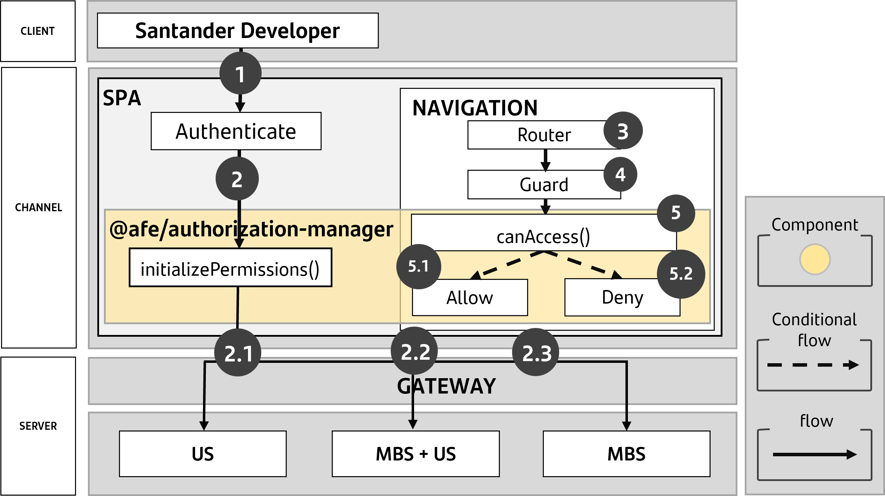

# Authorization Manager

**@afe/authorization-manager** is a library used to perform the **management** of **permissions** of users to perform actions in the applications developed in the bank's environment.

It has the ability to connect to various data sources to search for such permissions, such as MBS, US and also makes it possible to use mocked data.

For examples of configuring and using Authorization Manager connectors, see the documentation based on the version of the designer.

### Macro Solution Diagram



> **Macro Process**
>
> **1.** The developer authenticates the user using a valid authenticator method.
>
> **2.** The developer makes a call to the **initializePermissions()** method, which retrieves the user's permissions in the application through the US, MBS, or US+MBS systems.
>
> **3.** The application navigates to a specific route using Angular's Router.
>
> **4.** The developer uses Angular's guard functionality.
>
> **5.** The developer checks the authenticated user's permissions with the **canAccess()** method to authorize or deny access to the route.

## Compatibility

Using the table below and based on the version of Angular in your project, follow the **steps described in the documentation** for **installation** and **configuration** from the version of the designer.

| Angular Version | Library version |
| ------------------------------------| ------------------------------------------------------- |
| v16| [v5](./v5/index.md) |
| v10 v12| [v4](./v4/index.md) |

## Installation

```bash
npm install @afe/authorization-manager@^5 --save
```

```bash
npm install @afe/authorization-manager@^18 --save
```
